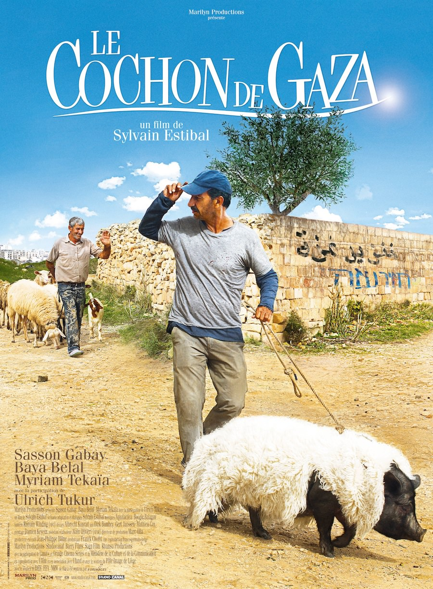
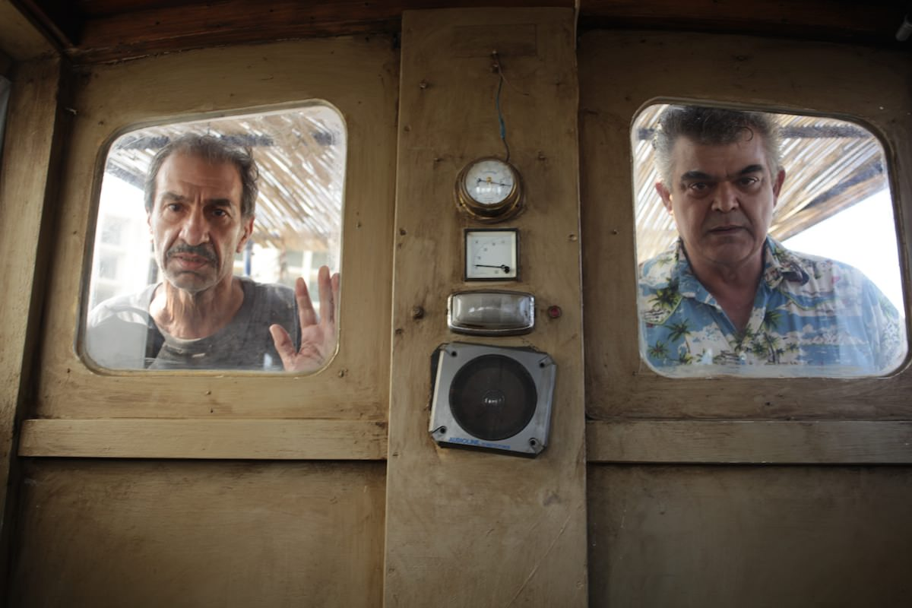
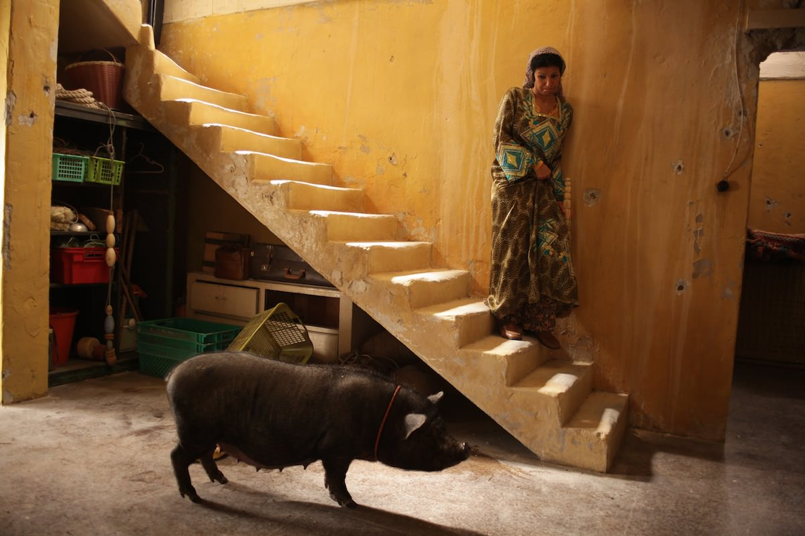

+++
type = "post"
titre = "<em>Le Cochon de Gaza</em>, Sylvain Estibal"
title = "Le Cochon de Gaza, Sylvain Estibal"
url = "/cochon-gaza-estibal"
date = "2012-11-27T08:49:56"
Lastmod = "2015-03-04T17:51:37"
cover = "cochon-gaza-sylvain-estibal.jpg"
categorie = [ "À voir" ]
tag = [ "Comédie", "Famille", "Guerre", "Humour", "Religion", "Société", "Violence" ]
createur = [ "Sylvain Estibal" ]
acteur = [ "Baya Belal", "Khalifa Natour", "Sasson Gabai", "Ulrich Tukur" ]
annee = [ "2011" ]
weight = 2011
pays = [ "France" ]

+++

Difficile de faire un film sur les problèmes actuels en Palestine, encore plus sur ceux de la bande de Gaza, ce tout petit territoire très densément peuplé et qui pose tant de problèmes depuis plusieurs années. C’est pourtant ce pari risqué que tente Sylvain Estibal et ce journaliste qui signe son premier film avec <em>Le Cochon de Gaza</em> a fait très fort. En choisissant une histoire invraisemblable de cochon perdu en milieu hostile, il opte pour l’humour et fait mouche, même s’il ne peut éviter un regard politique qui fonctionne moins bien. Un film à voir, drôle et profond à la fois.

Jafaar n’a vraiment pas de chance. Ce pêcheur palestinien vivait de sa pêche au large de la bande de Gaza, mais les Israéliens l’empêchent, comme les autres pêcheurs, d’aller au-delà de 4 km des côtes. À cette distance, il ne récupère dans son filet guère plus que des chaussures usagées et des poissons si petits qu’ils ne suffiraient même pas à le nourrir avec sa femme. Chaque jour, il ne ramène au marché que trois ou quatre poissons si ridicules que personne ne s’arrête ne serait-ce que pour les regarder. Un jour, son filet est plus rempli que d’habitude. Il s’attend à avoir récupéré de nombreux déchets et chaussures, mais il tombe nez à nez avec… un cochon. Un beau porc noir arrivé par hasard en pleine mer, sans doute à cause d’une grosse tempête survenue la veille. Qu’importe, ce cochon qui aurait fait le bonheur de n’importe quel pécheur ailleurs est ici une calamité qui s’abat sur le pauvre Jafaar. Musulman, il considère que cet animal est impur et ne doit avoir aucun contact avec un cochon, encore moins le manger. Qu’en faire, alors que tout le monde dans la bande de Gaza rejette cet animal, Juifs comme Musulmans ?

Avant d’évoquer les enjeux de la bande de Gaza et de la Palestine, <em>Le Cochon de Gaza</em> est d’abord l’histoire un peu folle d’un homme malchanceux. Le sort — ou serait-ce Allah ? — semble s’acharner contre ce pêcheur. Alors que sa maison est déjà occupée en permanence par l’armée israélienne qui en a fait un poste de surveillance sur une route stratégique, il ne pêche plus rien et vit misérablement avec sa femme, dans leur maison qui a enregistré les coups de la guerre avec plusieurs trous dans le mur. Le cochon est comme la goutte d’eau qui fait déborder le vase et Jafaar ne sait pas qu’en faire : la religion musulmane lui interdit tout contact et en posséder un suffirait à lui attirer les foudres de l’imam. Son couple vacille, mais Sylvain Estibal ne fait pas de son histoire un drame, plutôt une comédie. <em>Le Cochon de Gaza</em> enchaîne les péripéties acadabrantes et souvent très drôles : Jafaar essaie d’abord de vendre son cochon, il tente ensuite de le tuer et trouve ensuite un moyen original de l’exploiter, en prélevant son sperme. Cette scène où il tente d’exciter l’animal en plaquant sur la coque de son bateau des images de cochons femelles — parmi lesquelles Piggy la cochonne —  est vraiment hilarante. Avant toute chose, ce film est une comédie et une plutôt bonne qui plus est : on rit de bon cœur, même si l’histoire de Jafaar et de son cochon n’est pas toujours drôle. L’émotion n’est jamais loin et Sylvain Estibal a su parfaitement la gérer, elle surgit sans crier gare avec toujours avec naturel, surtout dans les scènes avec sa femme.

Même si ce n’est pas le sujet principal du film, <em>Le Cochon de Gaza</em> n’échappe pas au sujet qui fâche, à savoir le conflit israélo-palestinien. Dans sa seconde partie, le long-métrage de Sylbain Estibal entre plus clairement sur ce terrain en se muant en une sorte de fable sur la possibilité d’une réconciliation, ce qui n’en est pas la meilleure partie. La farce est plus présente au départ — c’est alors le meilleur de l’ensemble —, mais même ici, la question politique n’est pas esquivée, même si c’est sur un ton humoristique. La guerre est présente partout, notamment dans la maison de Jafaar et de son épouse : quand il se lève le matin, il ouvre ainsi le rideau qui donne… sur un trou dans le mur. On devine qu’il y avait une fenêtre à cet emplacement, mais ce décalage entre une habitude que tout le monde pourrait suivre et cette réalité éclatante est saisissant. Plus loin, on s’amusera aussi du traitement du cochon qui, pour une fois, réunit les deux camps. <em>Le Cochon de Gaza</em> prend un malin plaisir à faire chausser des protections à la pauvre bête pour pas qu’elle ne foule le sol sacré de ses pieds impurs (sic), tandis qu’un élevage de cochons est mené sur un plancher au-dessus du sol pour éviter une contamination. C’est bien sûr totalement ridicule, et Sylvain Estibal parvient plutôt bien à dénoncer ces manifestations de l’outrance des religions, que ce soit du côté musulman ou du côté juif. Le cinéaste s’en sort bien avec ces questions sensibles, sans valoriser un camp plutôt que l’autre, même si on se demande si le martyr de Jafaar était bien nécessaire. Cet éventuel faux pas un petit peu plus lourd et qui fait moins rire n’efface pas la réussite du film dans son ensemble, toutefois.

Pour son premier long-métrage derrière les caméras, Sylvain Estibal fait assurément un excellent travail. Ses plans sont toujours finement travaillés, avec une très belle photographie, notamment une lumière très agréable. <em>Le Cochon de Gaza</em> rappelle parfois ces contes à l’ancienne, comme s’il ne pouvait s’agir que d’une fable dans un territoire et à une époque indéterminés. La réussite du film tient aussi à son scénario et à ses dialogues bien écrits, souvent drôles, parfois émouvants. Le cinéaste peut aussi compter sur le talent de Sasson Gabai, vraiment épatant dans le rôle de Jafaar avec un jeu en permanence entre la peur, la malice et la détermination. À ses côtés, ils sont tous bien choisis et très efficaces, avec une mention spéciale pour le porc, parfait dans son rôle.

Belle surprise que <em>Le Cochon de Gaza</em> : le sujet était sensible et il était facile d’en dévier pour faire un film militant médiocre. Sylvain Estibal a eu la sagesse d’éviter cet écueil et sa première réalisation est une comédie très drôle, tout en offrant la touche d’émotion et le regard critique sur la situation qu’il fallait. À découvrir…

<h3>Vous voulez m’aider ?</h3>
<ul>
<li><a href="http://www.amazon.fr/gp/product/B005OQ86JW/ref=as_li_ss_tl?ie=UTF8&#038;tag=leblogdenic07-21&#038;linkCode=as2&#038;camp=1642&#038;creative=19458&#038;creativeASIN=B005OQ86JW">Acheter le film en DVD sur Amazon</a></li>
<li><a href="https://itunes.apple.com/fr/movie/le-cochon-de-gaza/id494672718">Acheter ou louer le film sur l’iTunes Store</a></li>
</ul>

