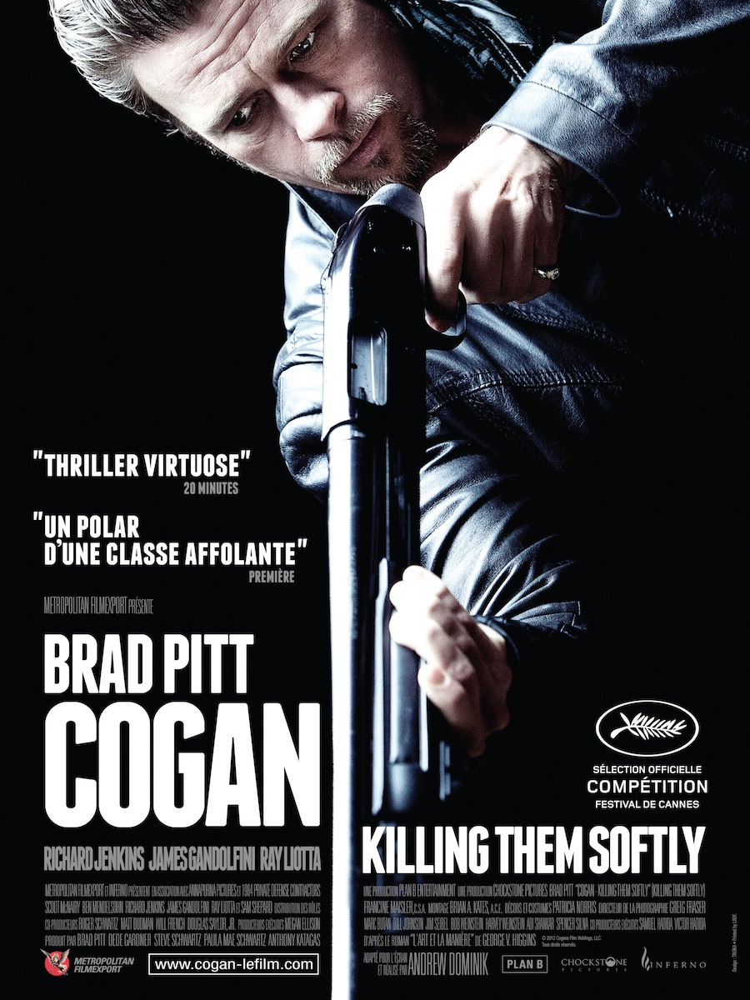
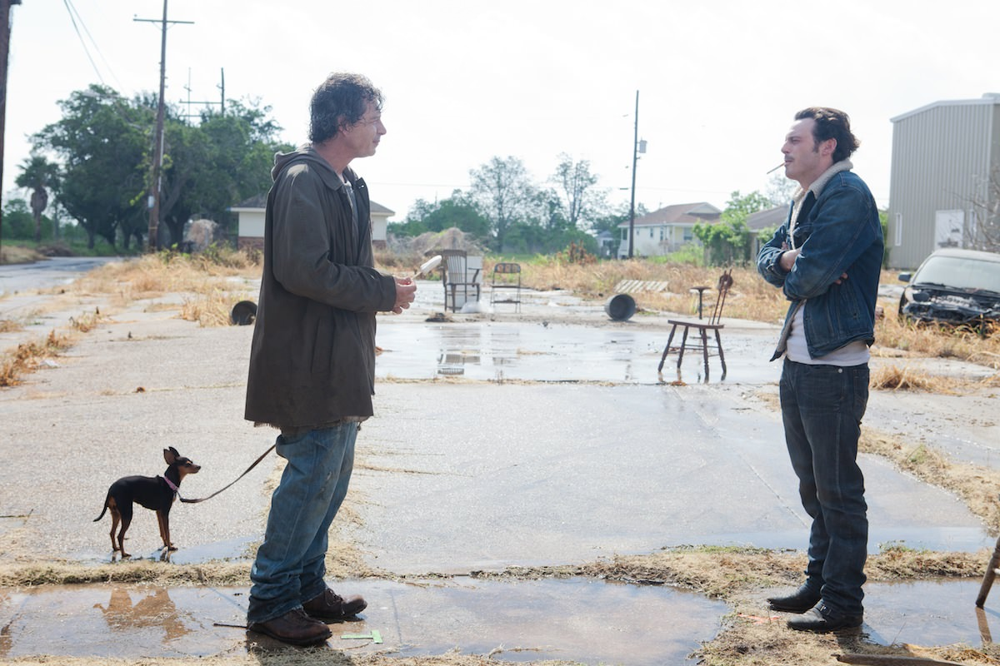
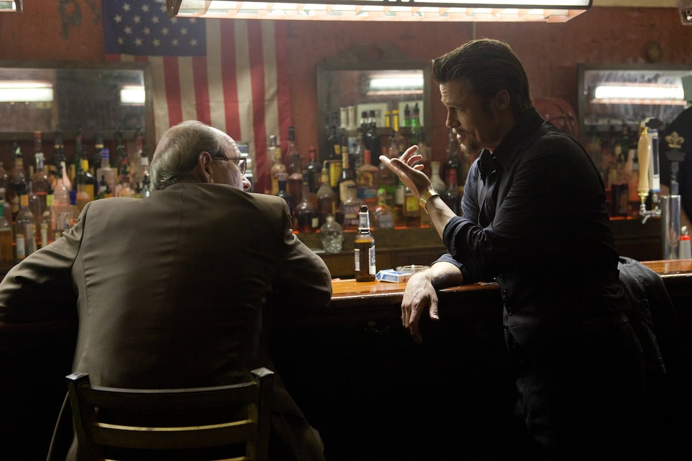

+++
titre = "<em>Cogan : Killing Them Softly</em>, Andrew Dominik"
title = "Cogan : Killing Them Softly, Andrew Dominik"
url = "/cogan-killing-them-softly-dominik"
date = "2012-12-11T23:38:30"
Lastmod = "2015-01-25T18:33:10"
cover = "cogan-killing-them-sofftly-brad-pitt.jpg"
categorie = [ "À voir" ]
tag = [ "Crise", "Film de gangsters", "Mafia", "Société", "Thriller", "Violence" ]
createur = [ "Andrew Dominik" ]
acteur = [ "Ben Mendelsohn", "Brad Pitt", "James Gandolfini", "Ray Liotta", "Richard Jenkins", "Scott McNairy" ]
annee = [ "2012" ]
weight = 2012
pays = [ "États-Unis" ]
original = "Killing Them Softly"

+++

Andrew Dominik avait impressionné avec <a href="http://voiretmanger.fr/2012/06/30/assassinat-jesse-james-lache-robert-ford-dominik/" title="L'Assassinat de Jesse James par le lâche Robert Ford, Andrew Dominik - À voir et à manger"><em>L’Assassinat de Jesse James par le lâche Robert Ford</em></a>, un lent western revisité fascinant. Cinq ans après, il revient dans un tout autre genre, puisque <em>Cogan : Killing Them Softly</em> est un thriller et un film très sombre. Andrew Dominik prend cette histoire de mafia et de vengeance comme prétexte pour parler des États-Unis et de la situation du pays depuis la crise des subprimes. Un regard froid et noir qui provoque un choc, pour un film esthétiquement très soigné.

Dans le petit univers de la mafia, personne ne braque les lieux un peu glauques où l’on joue illégalement au poker. Tout le monde se connaît, ce serait trop facile de trouver le coupable. Et puis si un tripot est attaqué, c’est tout le business qui est remis en cause, ces lieux sont fermés et plus personne ne gagne d’argent… Un jour pourtant, le responsable de l’un de ces lieux décide de braquer son propre tripot pour empocher l’argent en douce. Il s’en sort et avoue son crime quelques années après, sans conséquence. Ce précédent donne des idées à un autre membre de la mafia toutefois : si son casino illégal était à nouveau braqué, ce responsable serait le coupable évident. Fort de cette idée, il embauche deux petites frappes pour braquer le tripot. L’opération se passe sans encombre, mais la mafia ne se laisse pas faire aussi facilement et elle embauche Jackie Cogan pour trouver et tuer les coupables. L’étau se resserre rapidement autour des deux braqueurs…

Le scénario n’est pas ce qui compte le plus dans <em>Cogan : Killing Them Softly</em>. Comme dans son précédent film d’ailleurs, l’histoire elle-même n’est pas ce qui intéresse le plus Andrew Dominik, du moins pas en apparence. Non, ce qui l’intéresse, c’est d’abord une situation et une ambiance. À la manière du cinéma de Quentin Tarantino — entre autres —, le cinéaste prend d’abord du plaisir à filmer ces gangsters un peu ridicules, avec quelques dialogues assez grotesques. C’est le personnage de Russell, un camé totalement déjanté, qui procure le plus de scènes drôles, parce que ridicules, mais le décalage entre les ambitions des personnages et la réalité se retrouve partout, et notamment dans l’accoutrement des gangsters pendant le braquage. Avec leurs gants de vaisselle et leurs collants en guise de masque, ils sont totalement ridicules, mais <em>Cogan : Killing Them Softly</em> ne tombe jamais dans la comédie, ni dans la parodie. Le film d’Andrew Dominik est d’ailleurs plutôt sérieux et l’interdiction aux moins de 12 ans n’est pas anodine : le film est violent, parfois même très violent. Le réalisateur ne cache pas la violence, il a plutôt tendance à l’exacerber et à bien montrer les chairs meurtries, voire les morceaux qui volent après un tir à bout portant. Ce n’est pas de la violence gratuite toutefois, elle a un sens bien précis dans ce long-métrage qui entend aussi parler de la société américaine actuelle.

« <em>Les États-Unis ne sont pas un pays, c’est un business !</em> » Cette phrase prononcée par le héros du film à la fin résume bien ce qu’entend dénoncer Andrew Dominik. Dès l’ouverture, <em>Cogan : Killing Them Softly</em> fait entendre une voix familière : celle de Barack Obama. Le long-métrage multiplie les extraits de discours politiques, ceux du président américain actuel, mais aussi ceux du précédent homme à la tête du pays et on pourra ainsi entendre George W. Bush à plusieurs reprises. Le procédé n’est pas très fin, mais il est efficace pour dénoncer l’immobilisme de la classe politique qui propose, en gros, les mêmes solutions aux mêmes problèmes. En tâche de fond, c’est la crise des subprimes qui a mis à mal le pays et que Jackie Cogan évoque avec cette sentence. Le tueur à gages embauché par un riche avocat au nom de la mafia pour faire le ménage ne dénonce pas vraiment cet état de fait, il condamne en revanche les discours jugés hypocrites sur l’unité de la nation. Aux États-Unis, c’est le chacun pour soi et l’argent qui prime et il en fait la démonstration avec <em>Cogan : Killing Them Softly</em>. Le film est d’une noirceur sans fond, alors que ses personnages principaux sont eux-mêmes cyniques en profitant de la situation à leur avantage. Dans le lot, c’est évidemment Jackie qui se distingue en restant toujours parfaitement maître de la situation et en acceptant de tuer, mais à condition que ce soit en douceur — d’où le titre — et sans émotion. <em>Cogan : Killing Them Softly</em> est à l’image de son personnage principal, un peu misanthrope et le dernier film d’Andrew Dominik jette un regard pour le moins noir non pas tant sur les Américains, même si c’est d’eux qu’il s’agit concrètement, mais plutôt sur l’homme en général.

Styliste, Andrew Dominik a toujours su proposer de splendides images dans ses films. Si <em>L’Assassinat de Jesse James par le lâche Robert Ford</em> exploitait les vastes paysages des plaines américaines, <em>Cogan : Killing Them Softly</em> impressionne à nouveau par sa maîtrise technique, mais dans un tout autre genre. Le film n’est pas noir que par son sujet, il l’est aussi à l’écran, avec une image souvent très sombre et des plans de nuits où seul un phare se distingue. Le réalisateur soigne chacun de ses plans et ses cadrages sont souvent très bien pensés, à l’image de celui dans le bar entre le tueur et l’avocat de la mafia, où l’on voit l’image de Barack Obama à la télé, dans un coin. L’inclusion des discours des présidents est une réussite, qu’elle s’intègre directement dans l’intrigue par la présence d’un poste de télé ou d’un autoradio, ou qu’elle s’impose en plus du reste. Il faut d’ailleurs souligner l’énorme travail réalisé sur le son : si Andrew Dominik ne peut pas compter sur les splendides compositions de Nick Cave et de Warren Ellis, il soigne tout particulièrement l’ambiance sonore et <em>Cogan : Killing Them Softly</em> regorge de détails sonores et joue en permanence sur ce qu’entendent les personnages. Un très beau travail qui ne cherche pas le réalisme, tout comme la réalisation qui oscille entre plans réalistes et d’autres, plus baroques. La première mise à mort est à cet égard fascinante : entièrement présentée sous la forme d’un long ralenti, elle est superbe, même si sa violence est alors extrême.

<em>Cogan : Killing Them Softly</em> est un film sombre et très violent. Si ce n’est pas votre tasse de thé, inutile de tenter le diable, vous n’aimerez pas le dernier long-métrage d’Andrew Dominik. Le film n’est jamais gratuit toutefois et son message, bien qu’assez basique, est très bien rendu avec ces discours présidentiels qui résonnent avec l’histoire de gangsters assez classique. Un tel film ne saurait fonctionner sans d’excellents acteurs pour le soutenir et Andrew Dominik a eu la chance de pouvoir travailler à nouveau avec l’excellent Brad Pitt, qui impressionne ici encore. Inutile aussi de voir <em>Cogan : Killing Them Softly</em> pour sa star, vous seriez incontestablement très déçu(e)…

<h3>Vous voulez m&rsquo;aider ?</h3>
<ul>
<li><a href="http://www.amazon.fr/gp/product/B00B2PN94Q/ref=as_li_ss_tl?ie=UTF8&#038;tag=leblogdenic07-21&#038;linkCode=as2&#038;camp=1642&#038;creative=19458&#038;creativeASIN=B00B2PN94Q">Acheter le film en Blu-Ray sur Amazon</a></li>
<li><a href="http://www.amazon.fr/gp/product/B00B2PN8B0/ref=as_li_ss_tl?ie=UTF8&#038;tag=leblogdenic07-21&#038;linkCode=as2&#038;camp=1642&#038;creative=19458&#038;creativeASIN=B00B2PN8B0">Acheter le film en DVD sur Amazon</a></li>
</ul>

