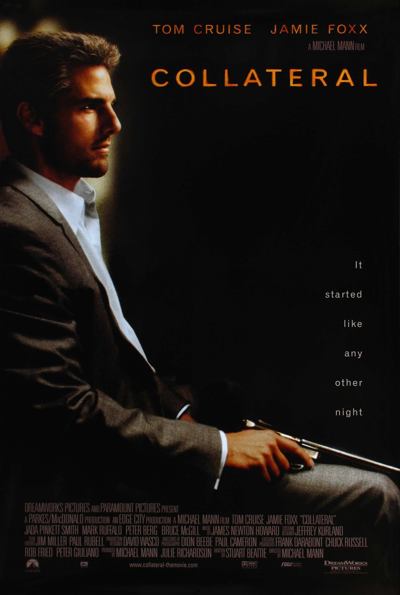
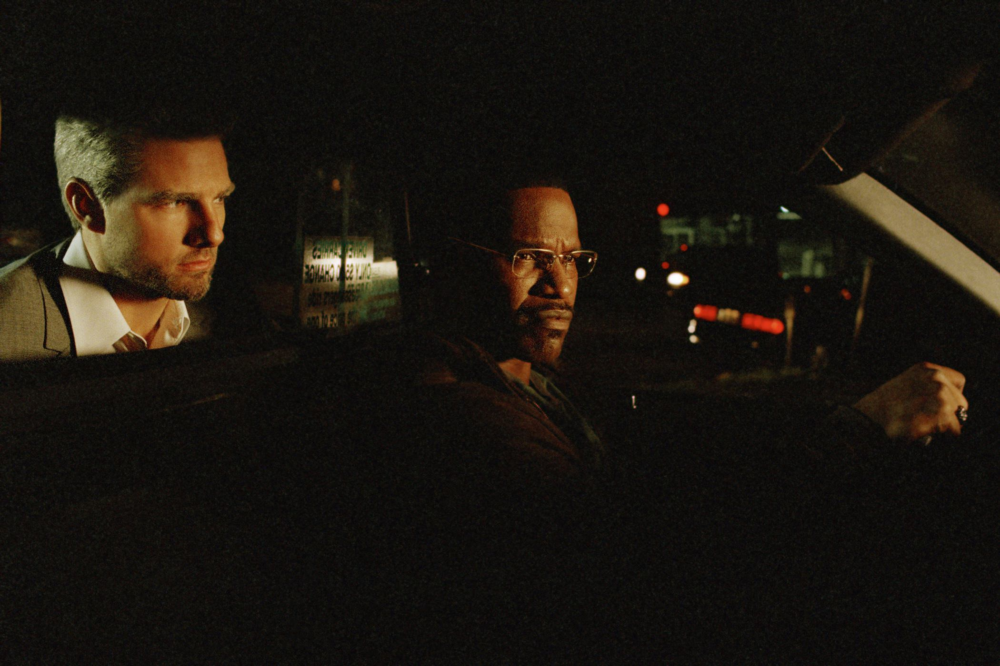

+++
type = "post"
titre = "<em>Collatéral</em>, Michael Mann"
title = "Collatéral, Michael Mann"
url = "/collateral-mann"
date = "2015-01-11T09:54:51"
Lastmod = "2015-01-11T00:59:03"
cover = "collateral-michael-mann.jpg"
categorie = [ "À voir" ]
tag = [ "Drogue", "Enquête", "Mort", "Police", "Taxi", "Thriller" ]
createur = [ "Michael Mann" ]
acteur = [ "Bruce McGill", "Jada Pinkett Smith", "Jamie Foxx", "Tom Cruise" ]
annee = [ "2004" ]
weight = 2004
pays = [ "États-Unis" ]
original = "Collateral"

+++

Le slogan sur l&rsquo;affiche originale résume bien le film « <em>La nuit avait commencé comme n&rsquo;importe quelle autre</em> », mais évidemment, elle ne va pas se finir comme n&rsquo;importe quelle nuit. Pour sa huitième réalisation, Michael Mann opte pour un scénario extrêmement simple, limpide même : <em>Collatéral</em> raconte la nuit d&rsquo;un taxi de Los Angeles qui doit accompagner sous la contrainte un tueur engagé pour éliminer tous ceux qui permettent un procès dans une affaire de cartel de drogue. Le contexte général n&rsquo;importe même pas vraiment et le film se résume essentiellement à des plans nocturnes en voiture ou en survol de la ville, pendant deux heures. Résumé ainsi, le film n&rsquo;est pas vendeur, mais il serait dommage de s&rsquo;arrêter à une appréhension : <em>Collatéral</em> est un thriller magnifique à regarder et plein d&rsquo;un suspense que la lenteur ne vient pas entamer. Un excellent film, porté par deux acteurs exceptionnels.

<em>Collatéral</em> commence alors que le jour n&rsquo;a pas encore disparu, mais que le soleil a bien baissé et le film s&rsquo;arrête avec le lever du soleil. Michael Mann respecte cette unité de temps et résume une seule nuit en deux heures. Il respecte aussi une unité de lieu — toute l&rsquo;action se déroule à Los Angeles – et même une unité d&rsquo;action avec son intrigue qui reste simple. Son film pourrait être une pièce de <a href="http://fr.wikipedia.org/wiki/Règles_du_théâtre_classique">théâtre classique</a> : on suit essentiellement deux personnages, dans un taxi, pendant une nuit. Il y a d&rsquo;abord Vincent, un tueur à gage payé par Felix, patron d&rsquo;un cartel de drogue local, pour éliminer tous les témoins qui peuvent lui porter préjudice lors d&rsquo;un procès à venir et ainsi rendre ce procès impossible. Et puis il y a Max, simple chauffeur de taxi qui a eu le malheur d&rsquo;être au mauvais endroit, au mauvais moment et qui se retrouve à conduire Vincent d&rsquo;une victime à l&rsquo;autre. Le tueur a cinq cibles et il agit méthodiquement pour les éliminer les unes après les autres. En six ans de métier, il n&rsquo;a jamais raté une seule cible et c&rsquo;est quelqu&rsquo;un de méticuleux et de froid, mais d&rsquo;une efficacité redoutable. Malheureusement pour lui, cette nuit-là, tout ne se passe pas comme prévu et dès la première victime, les choses déraillent. Celui qu&rsquo;il tue est projeté à travers la fenêtre et tombe directement sur le taxi. Max devait être associé à son insu à ces crimes, mais Vincent improvise et menace son chauffeur d&rsquo;une arme pour le reste de la nuit. <em>Collatéral</em> se contente de cette intrigue principale, dont on ne connaît d&rsquo;ailleurs pas tous les aboutissants tout de suite. Dans un premier temps, on ignore tout des agissements de Vincent, même si on se doute qu&rsquo;il y a quelque chose de louche. On apprend progressivement ce qui se passe, mais ce n&rsquo;est jamais l&rsquo;essentiel : Michael Mann ne s&rsquo;intéresse pas vraiment à cette histoire de drogue ou aux personnages secondaires qui gravitent autour du taxi. Tout ce qui compte, c&rsquo;est le véhicule, les deux hommes et Los Angeles.

Avec aussi peu d&rsquo;éléments, on pourrait craindre de s&rsquo;ennuyer, mais il n&rsquo;en est rien. <em>Collatéral</em> est un film qui sait prendre son temps, mais c&rsquo;est pour mieux susciter de l&rsquo;attente et du suspense quand il le faut. De fait, certaines séquences sont vraiment intenses, notamment vers la fin, quand une chasse à l&rsquo;homme commence. Il faut reconnaître toutefois que la majorité de l&rsquo;action se résume à des plans de Los Angeles, alors que Max conduit Vincent dans son taxi. S&rsquo;ennuie-t-on pour autant ? Non, en grande partie grâce au duo d&rsquo;acteurs vraiment exceptionnel. Dans ce film, Tom Cruise est parfait pour incarner ce tueur à gage calme et méticuleux : il est souvent impassible et son calme implacable est certainement ce qui fait qu&rsquo;il est aussi impressionnant par ailleurs. Face à lui, ou plutôt devant lui au volant, Jamie Foxx compose un Max parfaitement crédible. Peu sûr de lui, habitué à une routine qui l&rsquo;apaise, ce chauffeur de taxi se révèle au cours de la nuit. D&rsquo;abord apeuré — et il y a de quoi ! —, il gagne en assurance face aux évènements qu&rsquo;il ne peut pas contrôler et finit même, pourrait-on dire, par apprécier cette nuit. Non pas qu&rsquo;il devienne un tueur à gages lui-même, mais sa rencontre avec Vincent le transforme et ce n&rsquo;est pas pour le déplaire. On le voit, c&rsquo;est un personnage complexe, beaucoup plus que le tueur, et il fallait un acteur capable de le rendre avec réalisme : mission réussie pour Jamie Foxx, excellent de bout en bout. L&rsquo;autre star de <em>Collatéral</em>, c&rsquo;est la ville de Los Angeles : Michael Mann a choisi cette métropole qui représente peut-être le mieux la ville américaine typique et sans saveur, alors que le projet de base se déroulait plutôt à New York. On comprend ce choix quand on voit les multiples plans larges nocturnes : le cinéaste a su capter l&rsquo;essence de Los Angeles, une ville qui s&rsquo;étend à l&rsquo;infini, sans organisation claire, mais avec de multiples gratte-ciels qui éclairent la nuit. L&rsquo;éclairage, c&rsquo;est d&rsquo;ailleurs un élément essentiel du long-métrage, à tel point que le réalisateur a utilisé, pour la première fois au cinéma, des caméras numériques. Le film était incapable de restituer autant de lumière dans les plans de ville, alors que le numérique si, au prix d&rsquo;un grain important. Un choix surprenant, mais qui offre à <em>Collatéral</em> une ambiance particulière et quelques plans vraiment sublimes.

Michael Mann n&rsquo;opte pas pour des caméras numériques dans <em>Collatéral</em> uniquement pour le plaisir de la nouveauté. Les plans nocturnes de Los Angeles sont indéniablement splendides et ils offrent au film une ambiance que l&rsquo;on a l&rsquo;habitude de voir au cinéma, mais qui était nouvelle à sa sortie. Porté par deux acteurs au meilleur de leur forme, ce film est très simple et c&rsquo;est aussi précisément pour cela qu&rsquo;il est réussi. Le cinéaste ne s&rsquo;embarrasse pas d&rsquo;une intrigue complexe qui n&rsquo;est, au fond, pas très importante. Michael Mann peut ainsi mieux se concentrer sur ses personnages et ses paysages : <em>Collatéral</em> n&rsquo;a pas pris une ride !

<h3>Vous voulez <a href="/soutien/">m&rsquo;aider</a> ?</h3>
<ul>
<li><a href="http://www.amazon.fr/gp/product/B003EN2SKU/ref=as_li_ss_tl?ie=UTF8&amp;tag=leblogdenic07-21&amp;linkCode=as2&amp;camp=1642&amp;creative=19458&amp;creativeASIN=B003EN2SKU">Acheter le film en Blu-ray sur Amazon</a></li>
<li><a href="http://www.amazon.fr/gp/product/B0041KW89G/ref=as_li_ss_tl?ie=UTF8&amp;tag=leblogdenic07-21&amp;linkCode=as2&amp;camp=1642&amp;creative=19458&amp;creativeASIN=B0041KW89G">Acheter le film en DVD sur Amazon</a></li>
<li><a href="https://itunes.apple.com/fr/movie/collateral/id371070090">Acheter ou louer le film sur l&rsquo;iTunes Store</a></li>
<li><a href="http://www.netflix.com/WiMovie/60036246?trkid=13462100">Regarder le film sur Netflix</a></li>
</ul>

