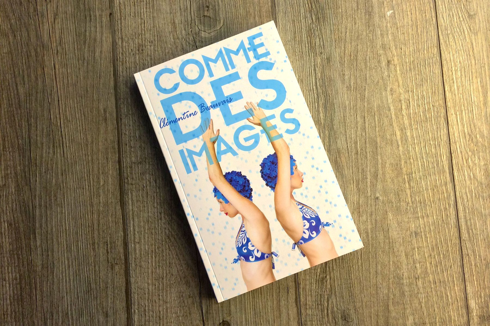
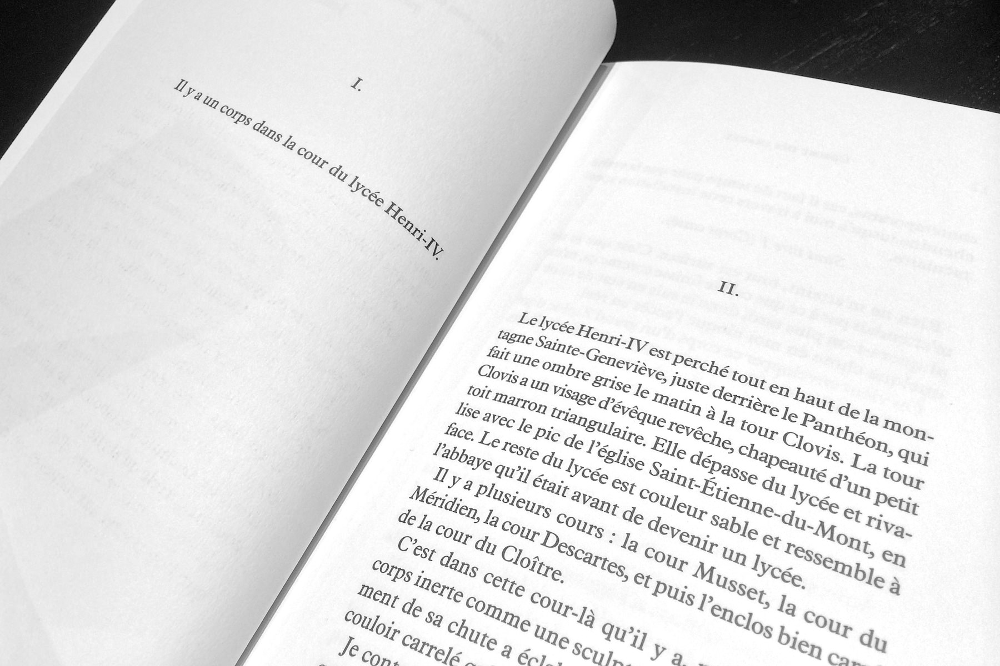
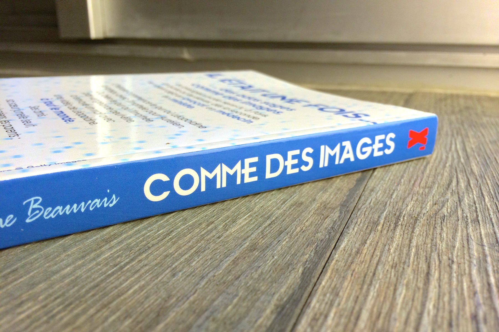

+++
titre = "<em>Comme des images</em>, Clémentine Beauvais"
title = "Comme des images, Clémentine Beauvais"
url = "/comme-des-images-beauvais"
date = "2014-02-26T23:34:21"
Lastmod = "2014-03-01T18:33:32"
cover = "comme-des-images-beauvai.jpg"
categorie = [ "À lire" ]
tag = [ "Adolescence", "Éducation", "Humour noir", "Réseaux sociaux", "Roman", "Société", "Thriller" ]
createur = [ "Clémentine Beauvais" ]
annee = [ "2014" ]
weight = 2014
pays = [ "France" ]

+++

« <em>Il y a un corps dans la cour du lycée Henri IV</em> » : d’emblée, ce roman sait imposer son mystère. Même si Clémentine Beauvais n’a même pas trente ans, <em>Comme des images</em> n’est pas son premier livre publié et la jeune romancière fait déjà preuve d’une étonnante maîtrise pour capter l’attention de ses lecteurs et ne pas la lâcher avant la dernière ligne. En apparence, ce nouveau roman est une œuvre calibrée pour les adolescentes avec une histoire de jeunes filles en seconde qui sortent avec des garçons et qui ont des problèmes de filles en seconde. Il y a un peu de cela dans <em>Comme des images</em>, c’est vrai, mais cette plongée dans un lycée élitiste est aussi terrifiante qu’elle est passionnante. À découvrir…

Passée la surprise du corps découvert dans le cloître du lycée Henri IV, <em>Comme des images</em> reprend chronologiquement avec les principaux personnages du récit. Sous la plume de Clémentine Beauvais, la narratrice qui n’a pas de nom<a href="#fn-11286-1" rel="footnote">1</a> nous raconte une histoire qui serait tout à fait banale si elle ne se terminait pas avec un mort. La vengeance d’un adolescent qui n’a pas digéré une rupture et qui se venge en diffusant une vidéo intime sur internet et en envoyant le lien à tout le lycée, personnel enseignant compris. Dans n’importe quel contexte, cet acte malveillant aurait des conséquences, mais c’est bien pire dans cet univers où les élèves apprennent dès le collège qu’il faut travailler dur pour passer son bac, faire des études et espérer avoir une place dans la société. Sans dévoiler d’élément clé de l’intrigue, on peut quand même dire que le roman offre une plongée d’une noirceur inattendue dans cet univers impitoyable. <em>Comme des images</em> est un roman qui adopte un style très adolescent et qui vise des jeunes de cet âge là, mais quelques scènes sont d’une violence vraiment surprenante, surtout quand on n’a jamais entendu parler du lycée Henri IV. Vers la fin du roman, une scène en cours d’anglais en particulier frappe par la violence psychologique qu’un professeur exerce sur des jeunes qui ont à peine 16 ans…

<blockquote class="pull-quote">
Souvenez-vous de ce que je vous ai dit au début de l’année ! a sifflé Monsieur Daguerre. Ceci est une année charnière. C’est votre vie qui est en jeu ! This is war, for Heaven&rsquo;s sake ! À partir de maintenant, vous dormez, vous mangez, vous respirez avec comme simple but d’accrocher un TB à votre diplôme du bac ! Vous vous préparez à la prépa. Je n’aurai de cesse que vous soyez normaux &#038; supérieurs &#038; dûment agrémentés – à la rigueur, polytechniciens ou taupes.  <cite class="author"> — Clémentine Beauvais, Comme des images, Chapitre XX</cite>

</blockquote>

Pour avoir passé trois ans de ma vie dans les murs de ce lycée, ce témoignage m’a touché tout particulièrement. Henri IV a une solide réputation d’enfer sur terre, mais c’est surtout vrai du lycée qui ne forme pas des lycéens, mais les futurs étudiants en grandes écoles. Le bac n’est pas un objectif, mais une formalité et on ne considère ici la réussite qu’à la mention Très Bien. Clémentine Beauvais a été une lycéenne de Henri IV et même si <em>Comme des images</em> n’a absolument rien d’autobiographique, on sent bien qu’elle s’est inspirée de ses propres expériences pour enrichir son roman. C’est sans doute ce qui est le plus intéressant, au-delà de l’anecdote et au-delà des tracas, sentimentaux ou non, de jeunes filles en seconde. Cette plongée au cœur du lycée est fascinante, mais j’ai beaucoup apprécié également les touches d’humour — souvent noir, à l’image de la fin que l’on ne racontera pas — qui émaillent un récit moins simpliste qu’il ne pourrait en avoir l’air. En témoigne une tension homosexuelle qui fait surface régulièrement tout au long de <em>Comme des images</em>, sans aboutir à un vrai enjeu dans le roman. Même si on n’est pas soi-même une adolescente de 16 ans, on peut en outre s’intéresser aux problèmes liés aux réseaux sociaux qui permettent de diffuser absolument tout et qui enlèvent tout droit à l’oubli. Sans en faire un récit didactique, Clémentine Beauvais aborde ces questions avec beaucoup de justesse.

<em>Comme des images</em> n’a rien du roman pour adolescentes un peu fade que l’on pourrait craindre. Clémentine Beauvais adopte un style qui pourrait être celui d’une jeune de 16 ans, elle évoque des problèmes qui pourraient être ceux de cette adolescente, mais son livre est plus intéressant que cela. Avec son humour noir, elle décrit avec beaucoup de dérision un univers de compétition où l’on demande à des adolescents de se comporter en adultes responsables et sans pitié. Même si le roman n’est pas un documentaire précis, la description n’en reste pas moins saisissante et <em>Comme des images</em> mérite d’être lu, ne serait-ce que pour cette raison.

<h3>Vous voulez m’aider ?<a href="#footnote_0_11286" id="identifier_0_11286" class="footnote-link footnote-identifier-link" title="&Agrave; propos de la publicit&eacute;&hellip;">1</a></h3>
<ul>
<li><a href="http://www.amazon.fr/gp/product/2848656603/ref=as_li_ss_tl?ie=UTF8&#038;tag=leblogdenic07-21&#038;linkCode=as2&#038;camp=1642&#038;creative=19458&#038;creativeASIN=2848656603">Acheter le livre sur Amazon</a></li>
<li><a href="http://open.spotify.com/user/nicolinux/playlist/5T6uQ3MWlKI6KB7RnzcpaC">Écouter la liste de lecture composée par Clémentine Beauvais pour le roman sur Spotify</a></li>
</ul>

<ol>
<li id="fn-11286-1">
Ce qui, pour être parfaitement franc, ne m’a jamais frappé pendant la lecture. Je suppose que c’est une preuve que le roman est suffisamment bon pour empêcher que l’on se pose la question…&#160;<a href="#fnref-11286-1" rev="footnote">&#8617;</a>
</li>
</ol>

<ol class="footnotes"><li id="footnote_0_11286" class="footnote"><a href="http://voiretmanger.fr/soutien/">À propos de la publicité…</a> [<a href="#identifier_0_11286" class="footnote-link footnote-back-link">&#8617;</a>]</li></ol>
