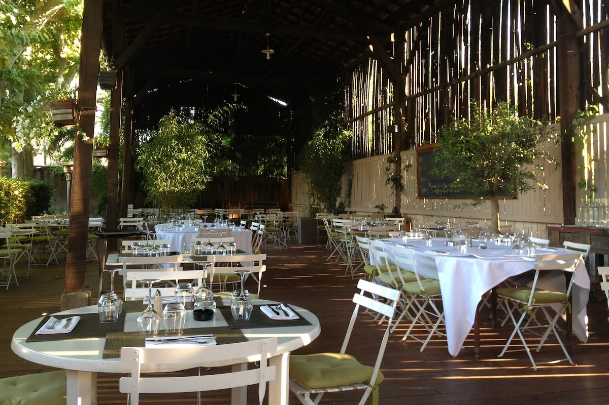
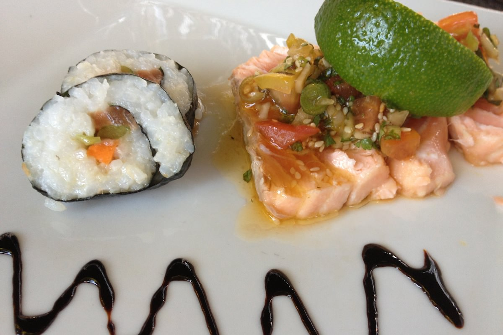
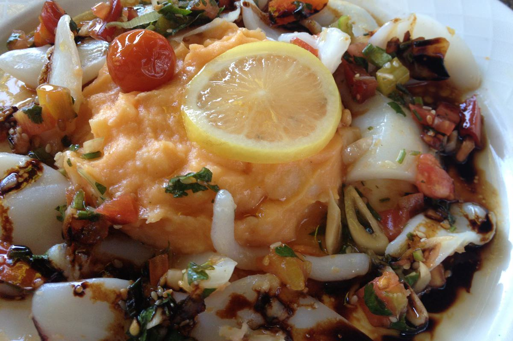

+++
type = "post"
titre = "Le Comptoir de Saint-Cyr à Saint-Cyr-au-Mont-d&rsquo;Or"
title = "Le Comptoir de Saint-Cyr à Saint-Cyr-au-Mont-d'Or"
url = "/comptoir-saint-cyr-mont-or"
date = "2012-07-24T00:02:12"
Lastmod = "2012-07-25T11:49:48"
cover = "le-comptoir-saint-cyr.jpg"
categorie = [ "À manger" ]
tag = [ "Bucolique", "Cuisine française", "Mélange", "Toques Blanches" ]

+++

Situé à Saint-Cyr-au-Mont-d&rsquo;or, au nord de Lyon, <a href="http://www.lyonresto.com/restaurant-Saint-Cyr-au-Mont-d-Or/restaurant-Le-Comptoir-de-Saint-Cyr--St-Cyr--Saint-Cyr-au-Mont-d-Or/restaurant-Le-Comptoir-de-Saint-Cyr--St-Cyr--Saint-Cyr-au-Mont-d-Or-7407.html"><strong>Le Comptoir de Saint-Cyr</strong></a> est un restaurant qui promet un cadre champêtre et une cuisine française traditionnelle relevée d&rsquo;une touche de modernité. L&rsquo;idéal pour une soirée tranquille quand l&rsquo;air devient trop étouffant à Lyon en somme, pour une adresse qui ne fait certes pas d&rsquo;étincelles, mais qui s&rsquo;avère assez efficace.

<strong>Le Comptoir de Saint-Cyr</strong> met en avant sa terrasse intérieure ou sa salle étonnamment rétro, et il aurait tort de ne pas le faire. Nous avons été toutefois surpris de découvrir que le restaurant est situé au bord d&rsquo;une route assez passante qui nuit quelque peu au côté bucolique de l&rsquo;ensemble. La cour intérieure rattrape toutefois cette première impression négative : très vaste, elle est composée d&rsquo;un côté d&rsquo;une petite terrasse comme de nombreux restaurants de ville peuvent en proposer, et de l&rsquo;autre une vaste zone couverte d&rsquo;un toit en bois et entourée par des arbres et des planches disjointes. Ce soir-là, le soleil se couchait sur cette sorte de salle extérieure et l&rsquo;effet était ravissant. Le nombre de tables l&rsquo;était un peu moins en revanche : <strong>Le Comptoir de Saint-Cyr</strong> peut accueillir jusqu&rsquo;à 200 personnes l&rsquo;extérieur, ce qui est très bien pour les (très) grands groupes, un peu moins pour l&rsquo;intimité. Il y avait un peu de monde pour un soir de semaine, mais il faut reconnaître que le lieu ne résonne pas et que l&rsquo;on peut discuter sans élever la voix. Le brouhaha couvre en outre les bruits de la route qui sait ainsi se faire discrète.

Au menu de cette adresse qui appartient au célèbre réseau lyonnais des Toques blanches, une cuisine simple, mais raffinée. La carte n&rsquo;est pas composée de centaines de plats et on repère très vite l&rsquo;unique menu qui se compose du classique entrée/plat/dessert pour une trentaine d&rsquo;euros. <strong>Le Comptoir de Saint-Cyr</strong> propose une cuisine qui sait jouer des multiples origines : ce menu va d&rsquo;Espagne — un gaspacho en entrée, du porc Pata Negra en plat — au Japon — des makis pour une autre entrée —, en passant par les États-Unis avec du bœuf &laquo;&nbsp;<em>black Angus</em>&nbsp;&raquo; dans l&rsquo;un des plats. L&rsquo;ensemble est en tout cas alléchant, surtout pour un menu qui sait rester dans des prix raisonnables. Les plats à la carte sont toutefois moins rentables, avec une suggestion chaque jour qui dépasse à elle seule la vingtaine d&rsquo;euros. Nous sommes restés à l&rsquo;unique menu et même avec un apéritif, la note totale ne dépassait pas les 35 € par convives.

Dans l&rsquo;assiette, <strong>Le Comptoir de Saint-Cyr</strong> privilégie les saveurs à la présentation. Les assiettes sont assez quelconques, surtout pour le plat qui annonçait une seiche à la plancha accompagnée d&rsquo;une purée de deux pommes de terre et qui se contentait de morceaux de poisson vaguement disposés autour d&rsquo;un tas de purée. Fort heureusement, le goût était au rendez-vous : en entrée, le gaspacho était particulièrement bien relevé et l&rsquo;espuma d&rsquo;olives placée au-dessus de la soupe froide était délicieux. L&rsquo;autre entrée, du saumon cru avec des makis, n&rsquo;était pas mauvaise, mais les quantités ne permettaient pas d&rsquo;en profiter pleinement. Les plats étaient aussi très bons, la seiche bien tendre et bien cuisinée, même s&rsquo;il vaut mieux apprécier l&rsquo;assaisonnement asiatique très marqué avec une bonne de coriandre et de l&rsquo;huile de sésame, deux ingrédients particulièrement forts. Le dessert — un fondant façon brownie — était en revanche trop classique et trop simple, malgré la petite originalité apportée par la boule de glace à la barbe à papa.

Nonobstant la route un peu trop présente en début de repas, mais qui s&rsquo;estompe vite par la suite, c&rsquo;est surtout le cadre que l&rsquo;on retiendra au <strong>Comptoir de Saint-Cyr</strong>. À quelques minutes des portes de Lyon, un tel restaurant offre le calme reposant que l&rsquo;on peine à trouver dans la plupart des adresses lyonnaises. La cuisine n&rsquo;est pas en reste et la qualité des plats est bonne… nous sommes toutefois restés un peu sur notre faim. On trouve plus original ou plus savoureux dans les environs, mais il faut reconnaître que cette adresse reste à des tarifs très raisonnables, en accord avec ses prestations. Si vous cherchez un restaurant bucolique sans faire des heures de route, <strong>Le Comptoir de Saint-Cyr</strong> est indéniablement un bon choix.

<em>Bon anniversaire Juliette !</em>

