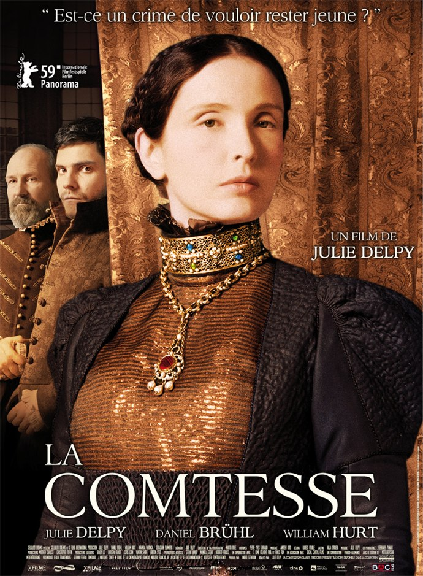
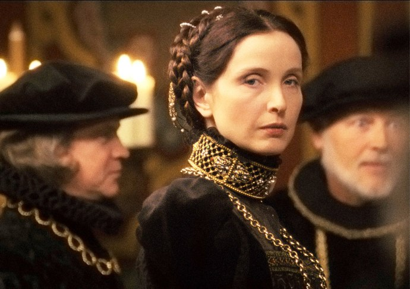
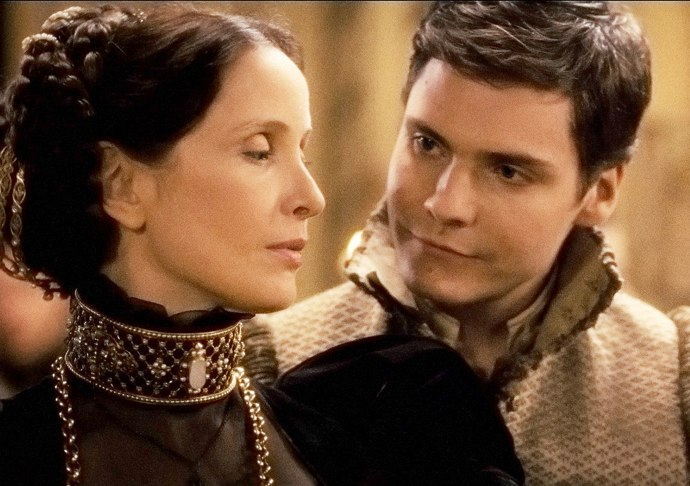

+++
type = "post"
titre = "La comtesse, Julie Delpy"
title = "La comtesse, Julie Delpy"
url = "/comtesse-delpy"
date = "2010-05-09T21:18:52"
Lastmod = "2012-07-13T08:50:52"
cover = "delpy-countess.jpg"
categorie = [ "À voir" ]
tag = [ "Histoire", "Pouvoir", "Société", "Vite oublié" ]
createur = [ "Julie Delpy" ]
annee = [ "2010" ]
weight = 2010
pays = [ "France" ]

+++

La comtesse <a href="http://fr.wikipedia.org/wiki/Élisabeth_Báthory">Élisabeth Bàthory</a> fait partie du club très privé des femmes de pouvoir dans une histoire par ailleurs très machiste. Mais elle a une double casquette puisqu&rsquo;on la range également dans les rangs des serial-killer. Cette charmante comtesse hongroise considérait en effet que le sang de jeunes vierges pouvait la rajeunir et on a évoqué pas moins de 300 mortes lors de son procès. Julie Delpy s&rsquo;empare de ce sujet pour en faire une figure avant-gardiste du féminisme. Intéressant sur le papier, mais pas toujours convaincant à l&rsquo;écran.

<em>La Comtesse</em> prend astucieusement le point de vue de Istvan Thurzo, jeune bourgeois qui tombe fou amoureux de cette femme plus âgée que lui de 20 ans. Le film ouvre après la mort d&rsquo;Élisabeth. Istvan visite la tombe de son amante et se dit que l&rsquo;histoire est celle des vainqueurs et qu&rsquo;elle n&rsquo;est pas tendre avec les vaincus. Ce point de départ est bien vu pour un film qui entend traiter d&rsquo;une femme vaincue, morte alors qu&rsquo;on l&rsquo;avait emmurée dans son propre château. Le récit entreprend alors de résumer toute l&rsquo;enfance d&rsquo;Élisabeth, de manière très convenue, par petits flashs sur des éléments jugés importants pour comprendre sa vie, comme l&rsquo;enterrement, alors qu&rsquo;elle était toute jeune, d&rsquo;un petit oiseau encore vivant et la découverte de la mort et du pourrissement de la chair. Mais toute l&rsquo;histoire de la comtesse jusqu&rsquo;à la mort de son mari qui fait d&rsquo;elle la femme la plus puissante de la Hongrie n&rsquo;intéresse pas vraiment la réalisatrice. Le film commence ainsi vraiment avec la rencontre entre Élisabeth et Istvan.

La rencontre entre les deux tourtereaux ressemble fort à celle qui ouvre <em>La Princesse de Clèves</em> : un regard et la messe est dite, ces deux êtres s&rsquo;aimeront pour toujours. Rien ne les arrête, ni la différence d&rsquo;âge, ni le rang social et ils s&rsquo;afficheront en public, s&rsquo;embrassant goulument à la première occasion. C&rsquo;est sans compter sur le poids de la société représenté ici par le père d&rsquo;Istvan qui essaie aussi d&rsquo;obtenir la main d&rsquo;Élisabeth. C&rsquo;est le départ contraint d&rsquo;Istvan loin de sa belle qui rend la veuve folle : voyant des rides apparaître sur son beau visage, elle ne peut accepter la vieillesse et la mort et pense que le sang de vierges rajeunit ses traits et la maintient belle à jamais. Commencent alors les meurtres en série, la traque d&rsquo;abord de jeunes paysannes du cru, puis de nobles. Étant donné son rang, on l&rsquo;a laisse longtemps tranquille, mais le terrible Thurzo père cherche à se venger tandis que le roi, fortement endetté auprès de la famille Bàthory, voit d&rsquo;un bon œil la possibilité d&rsquo;effacer ses dettes en éliminant la créancière. La vie de la comtesse se termine ainsi par un terrible procès et la condamnation, pour Élisabeth, à être emmurée vivante.

Julie Delpy est au centre de son dernier film. À la fois réalisatrice, scénariste et actrice du premier rôle, elle contrôle de bout en bout <em>La comtesse</em> et cela se voit. Élisabeth est ainsi constamment à l&rsquo;écran et c&rsquo;est le seul personnage vraiment travaillé. Les autres sont bien présents, mais ils passent sans avoir le droit à une vraie personnalité. C&rsquo;est flagrant pour le narrateur, le jeune et beau Istvan qui est à l&rsquo;écran, jeune et beau, mais n&rsquo;a aucun rôle réel si ce n&rsquo;est de marquer sa présence. Juliette Delpy ne semble s&rsquo;intéresser qu&rsquo;à son propre personnage, ce que l&rsquo;on peut évidemment comprendre, mais qui est quand même assez frustrant, tant on peine parfois à comprendre cette comtesse. Sur le plan plus historique, on comprend mal pourquoi une femme, fût-elle puissante, aurait pu tuer 300 jeunes filles sans que cela se voie. Trois cents, c&rsquo;est énorme à une époque où les villages étaient certainement de petite taille, d&rsquo;autant que la guerre contre les Turcs faisait sans aucun doute des victimes civiles. Le réalisme est, de manière plus générale, un problème pour moi. Le film a été réalisé avec peu de moyens et à cet égard, la reconstitution historique n&rsquo;est pas mauvaise, les costumes et décors sont plutôt convaincants. Par contre, pourquoi diable tous ces Hongrois du XVIe siècle parleraient anglais ? Je suis très sensible à la VO, et j&rsquo;ai du mal avec les films historiques qui ne respectent pas les langages d&rsquo;époque. C&rsquo;est encore plus gênant quand on sait qu&rsquo;une partie des dialogues est volontairement en français, langue de cour par excellence à l&rsquo;époque. Quitte à ne pas respecter les langues réelles, autant ne pas s&rsquo;arrêter en cours de route…

Ce qui intéresse surtout Julie Delpy, au-delà des meurtres qui sont finalement réduits sur la fin, c&rsquo;est de présenter une femme de pouvoir dans une société machiste. Le roi lui fait savoir qu&rsquo;elle n&rsquo;est pas à sa place après la mort de son mari : si ça ne tenait qu&rsquo;à lui, elle se marierait à n&rsquo;importe quel noble du coin et laisserait ce dernier gérer ses affaires. Mais elle répond sèchement que dans le couple, c&rsquo;est toujours elle qui s&rsquo;occupait des affaires matérielles quand monsieur passait son temps à guerroyer contre les Turcs. Non seulement elle règne, mais en plus elle le fait bien et sa puissance agace et attire les jalousie. Sa condamnation est finalement la revanche de la gent masculine contre ce qu&rsquo;ils considèrent comme un accident de l&rsquo;histoire. Cet aspect est effectivement intéressant, mais pas toujours bien rendu : à force de se concentrer sur la Comtesse et son château, on oublie les aspects politiques. Je trouve que <em>La comtesse</em> a un peu tendance à faire de cette Comtesse une figure féministe d&rsquo;avant-garde, ce qui me paraît quand même un peu court. En tout cas, on aimerait en apprendre plus, plutôt que de voir les états d&rsquo;âme d&rsquo;une femme torturée par l&rsquo;amour.

Le bilan n&rsquo;est pas très positif pour cette <em>Comtesse</em>. L&rsquo;histoire est intéressante, mais son traitement beaucoup moins. On aurait préféré que l&rsquo;accent soit mis sur l&rsquo;aspect politique de l&rsquo;histoire, plus que sur une histoire d&rsquo;amour inventée de toute pièce et qui n&rsquo;apporte finalement pas grand chose. Elle sert en fait à justifier les actes d&rsquo;Élisabeth, mais était-ce bien nécessaire ? La folie est un sujet passionnant qui n&rsquo;a pas besoin de justification.

Les avis sont partagés dans la blogosphère, à l&rsquo;image de <a href="http://www.toujoursraison.com/2010/04/la-comtesse.html">Rob Gordon</a> qui pointe du doigt les faiblesses de Julie Delpy actrice. Jouer le personnage principal de son propre film est sans doute une fausse bonne idée… Même faible intérêt pour <a href="http://www.plan-c.fr/article-la-comtesse-la-femme-sans-age-50092716.html">Plan-c</a>, <a href="http://www.anglesdevue.com/2010/04/25/la-comtesse-de-julie-delpy/">Angle[s] de vue</a> regrette une mise en scène trop classique ou encore <a href="http://www.critikat.com/La-Comtesse.html">Critikat</a>. Quelques avis plus positifs néanmoins, à commencer par celui de <a href="http://www.tadahblog.com/article-la-comtesse-sang-amour-49000005.html">Tadah</a>, ou celui de <a href="http://myscreens.fr/2010/cinema/la-comtesse-la-critique-2/">MyScreens</a> ou encore de la <a href="http://nivrae.fr/2010/04/28/critique-cinema-la-comtesse/">ciné-geekette</a>.

<h3>Vous voulez m&rsquo;aider ?<a href="#footnote_0_3303" id="identifier_0_3303" class="footnote-link footnote-identifier-link" title="&Agrave; propos de la publicit&eacute;&hellip;">1</a></h3>
<ul>
<li><a href="http://www.amazon.fr/gp/product/B005P3NR8E/ref=as_li_ss_tl?ie=UTF8&tag=leblogdenic07-21&linkCode=as2&camp=1642&creative=19458&creativeASIN=B005P3NR8E">Acheter le film en Blu-Ray sur Amazon</a></li>
<li><a href="http://www.amazon.fr/gp/product/B0043EOFV4/ref=as_li_ss_tl?ie=UTF8&tag=leblogdenic07-21&linkCode=as2&camp=1642&creative=19458&creativeASIN=B0043EOFV4">Acheter le film en DVD sur Amazon</a></li>
<li><a href="http://itunes.apple.com/fr/movie/la-comtesse/id405154108">Acheter ou louer le film sur l&rsquo;iTunes Store</a></li>
</ul>

<ol class="footnotes"><li id="footnote_0_3303" class="footnote"><a href="http://voiretmanger.fr/soutien/">À propos de la publicité…</a> [<a href="#identifier_0_3303" class="footnote-link footnote-back-link">&#8617;</a>]</li></ol>
