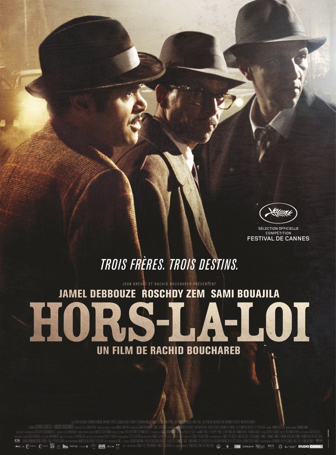

+++
type = "post"
titre = "Concours : 10 places pour Hors-la-loi à gagner !"
title = "Concours : 10 places pour Hors-la-loi à gagner !"
url = "/concours-10-places-hors-la-loi"
date = "2010-09-13T11:50:07"
Lastmod = "2010-09-22T23:08:09"
cover = "bouchareb-hors-la-loi.jpg"
categorie = [ "En bref" ]
tag = [ "Cinéma", "Places de ciné" ]

+++

<a href="http://www.studiocanal.com/pid134-accueil-b2c-france.html">Studio Canal</a> et <a href="http://www.cinetrafic.fr/">CineTrafic</a> m&rsquo;ont proposé de vous offrir 10 places pour voir gratuitement au cinéma <em><a href="http://www.cinetrafic.fr/film/25934/hors-la-loi">Hors-la-loi</a></em> qui sortira le <strong>22 septembre 2010</strong> ! <em>Hors-la-loi</em> est le dernier film de Rachid Bouchareb, réalisateur qui s&rsquo;est fait largement connaître en 2005 avec <em>Indigènes</em>. Le film rassemble un sacré trio d&rsquo;acteurs avec James Debbouze, Roschdy Zem et Sami Bouajila. Le film, très engagé, évoque <a href="http://www.cinetrafic.fr/liste-film/2114/1/la-guerre-d-algerie">la Guerre d&rsquo;Algérie</a> et s&rsquo;annonce comme une grande épopée historique.

<blockquote>

Synopsis : Chassés de leur terre algérienne, trois frères et leur mère sont séparés. Messaoud s’engage en Indochine. A Paris, Abdelkader prend la tête du mouvement pour l’Indépendance de l’Algérie et Saïd fait fortune dans les bouges et les clubs de boxe de Pigalle. Leur destin, scellé autour de l’amour d’une mère, se mêlera inexorablement à celui d’une nation en lutte pour sa liberté&#8230;

</blockquote>

<strong>Sortie en salles le 22 septembre 2010</strong>

Pour gagner une place, vous devez habiter en France métropolitaine et répondre à cette question toute simple :<strong> quelle est la nationalité de Rachid Bouchareb, le réalisateur ?</strong>

Concours terminé !

Le concours est ouvert jusqu&rsquo;au 22 septembre au soir. Les gagnants seront tirés au sort parmi les bonnes réponses et les billets leur seront envoyés ensuite directement par Studio Canal. Bonne chance !

