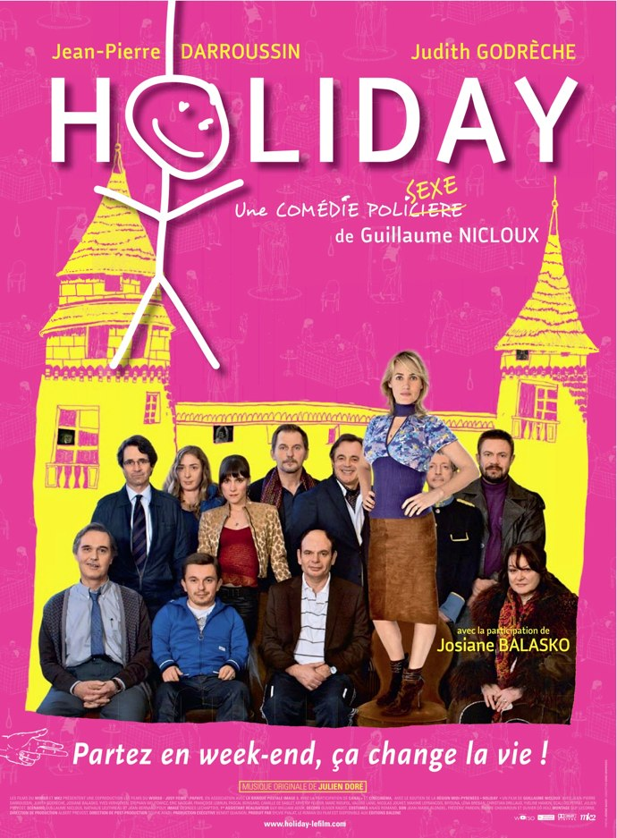

+++
titre = "Concours Holiday : des places et des affiches à gagner !"
title = "Concours Holiday : des places et des affiches à gagner !"
url = "/concours-holiday-places-affiches"
date = "2010-11-23T22:56:27"
Lastmod = "2010-12-10T23:36:07"
cover = "darroussin-balasko-holiday.jpg"
categorie = [ "En bref" ]
tag = [ "Affiches", "Places de ciné" ]

+++

<em>Holiday</em> est le dernier film de Guillaume Nicloux. L&rsquo;affiche précise qu&rsquo;il s&rsquo;agit d&rsquo;une comédie policière un peu coquine… L&rsquo;intrigue se construit autour de la disparition de la femme de Michel après un week-end censé reconstruire son couple, disparition qui le conduit à être accusé de meurtre de sa femme. Film choral apparemment déjanté, <em>Holiday</em> semble manier un humour noir féroce.

<a href="http://www.allocine.fr/film/fichefilm_gen_cfilm=176013.html">

</a>

[pullquote author=&nbsp;&raquo;Allocine&nbsp;&raquo;]

<strong>Synopsis</strong> : Un soir, Michel Trémois échoue dans la pharmacie d’une gare de province et se remémore le fil des événements qui, en deux jours, ont fait basculer sa vie : parti en week-end avec sa femme Nadine pour reconstruire leur couple et sauver leur sexualité, rien ne s’est finalement passé comme prévu… Après une nuit folle et tumultueuse agrémentée de rencontres singulières, le réveil de Michel est brutal et douloureux. Non seulement il se retrouve accusé de meurtre, mais sa femme est introuvable…

[/pullquote]

<object classid="clsid:d27cdb6e-ae6d-11cf-96b8-444553540000" width="100%" height="100%" codebase="http://download.macromedia.com/pub/shockwave/cabs/flash/swflash.cab#version=6,0,40,0"><param name="allowFullScreen" value="true" /><param name="allowScriptAccess" value="always" /><param name="src" value="http://www.allocine.fr/blogvision/19173976" /><param name="allowfullscreen" value="true" /><embed type="application/x-shockwave-flash" width="100%" height="100%" src="http://www.allocine.fr/blogvision/19173976" allowscriptaccess="always" allowfullscreen="true"></embed></object>

<em>Sortie le 8 décembre</em>

À l&rsquo;occasion de la sortie de <em>Holiday</em>, je vous propose en collaboration avec l&rsquo;agence Le K de gagner 5 lots de deux places pour voir le film en salle, ou 5 affiches du film. En prime, un gagnant tiré au sort remportera un CD de la bande originale composée par Julien Doré ! Pour jouer et peut-être gagner des places ou une affiche, <strong>répondez à cette question : quel est le distributeur du film ? Répondez en publiant un commentaire à cet article, sans oublier de préciser si vous souhaitez plutôt des places ou plutôt une affiche.</strong>

Le concours n&rsquo;est ouvert qu&rsquo;à la France métropolitaine et à la Corse. Le concours est ouvert <strong>jusqu&rsquo;au lundi 6 décembre au soir</strong>. Un tirage au sort déterminera les 10 gagnants, puis un second tirage au sort sur les gagnants permettra de désigner le commentaire qui gagnera aussi la bande originale. Bonne chance !

