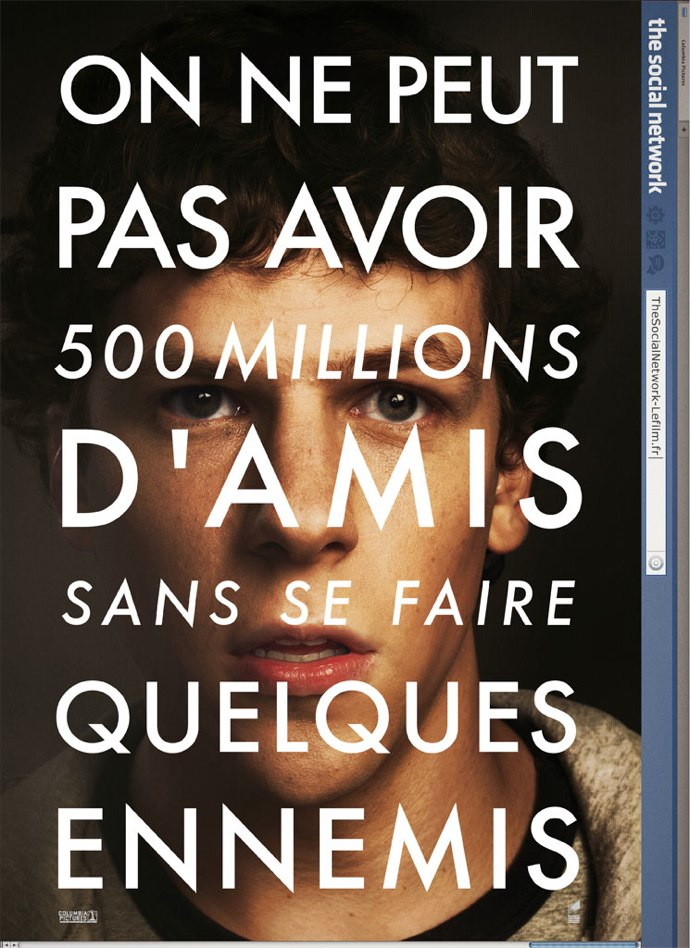

+++
type = "post"
titre = "Concours : 2 places à gagner pour l’avant-première de The Social Network"
title = "Concours : 2 places à gagner pour l’avant-première de The Social Network"
url = "/concours-places-avant-premiere-social-network"
date = "2010-09-20T00:01:08"
Lastmod = "2014-10-03T10:20:28"
cover = "the-social-network-eisenberg.jpg"
categorie = [ "Archives du blog" ]
tag = [ "Avant-première", "Places de ciné" ]

+++

<em>The Social Network</em>, voilà un film qui crée le buzz sur Internet depuis plusieurs mois. Le dernier film de <a href="http://voiretmanger.fr/createur/david-fincher/">David Fincher</a> (<em>Seven</em>, <em>Fight Club</em>…) évoque en effet un sujet bien connu des Internautes puisqu&rsquo;il ne s&rsquo;agit rien de moins que de la naissance de Facebook. Ce film s&rsquo;intéresse plus particulièrement à la vie de Mark Zuckerberg, cet étudiant américain de Harvard qui a eu l&rsquo;idée d&rsquo;un réseau social avant les autres et qui est devenu multimilliardaire aujourd&rsquo;hui. Un sujet passionnant, qui peut donner un excellent film.

<a href="http://www.allocine.fr/film/fichefilm_gen_cfilm=147912.html">

</a>

<blockquote>
Synopsis : Film retraçant l&rsquo;épopée du site Facebook, de sa création sur le campus de Harvard en 2004 à l&rsquo;incontournable réseau communautaire et social qu&rsquo;il est devenu aujourd&rsquo;hui. (<a href="http://www.allocine.fr/film/fichefilm_gen_cfilm=147912.html">Allocine</a>)

Sortie le 13 octobre 2010
</blockquote>

Allociné a invité son club de blogueurs à voir <em>The Social Network</em> en avant-première, le 30 septembre à 19 h 30 dans un cinéma parisien. Malheureusement, un empêchement professionnel m&rsquo;empêche de participer à l&rsquo;événement. Néanmoins, comme je suis sympa avec mes lecteurs, j&rsquo;ai négocié pour conserver malgré tout deux places et les offrir à deux d&rsquo;entre vous !

<object classid="clsid:d27cdb6e-ae6d-11cf-96b8-444553540000" width="100%" height="100%" codebase="http://download.macromedia.com/pub/shockwave/cabs/flash/swflash.cab#version=6,0,40,0"><param name="allowFullScreen" value="true" /><param name="allowScriptAccess" value="always" /><param name="src" value="http://www.allocine.fr/blogvision/19128127" /><param name="allowfullscreen" value="true" /><embed type="application/x-shockwave-flash" width="100%" height="100%" src="http://www.allocine.fr/blogvision/19128127" allowscriptaccess="always" allowfullscreen="true"></embed></object>

Le principe est simple, vous devez envoyer un mail à cette adresse en remplaçant le AT par un @ bien sûr, et en répondant aussi à cette question : <strong>à quel âge Mark Zuckerberg a-t-il lancé Facebook</strong> ? (merci de ne pas modifier le sujet du mail, pour que je m&rsquo;y retrouve, mais vous avez le droit de me passer un petit coucou si vous le souhaitez…) <strong>LE CONCOURS EST TERMINÉ</strong>

Le concours est ouvert toute la semaine, jusqu&rsquo;au vendredi 24 septembre au soir. <strong>Pour participer, vous devez pouvoir vous rendre dans un cinéma parisien le jeudi 30 septembre à 19 h 30</strong> (le lieu exact sera connu quelques jours avant la projection seulement). Les deux places seront nominatives et ne pourront être échangées ou remplacées.

