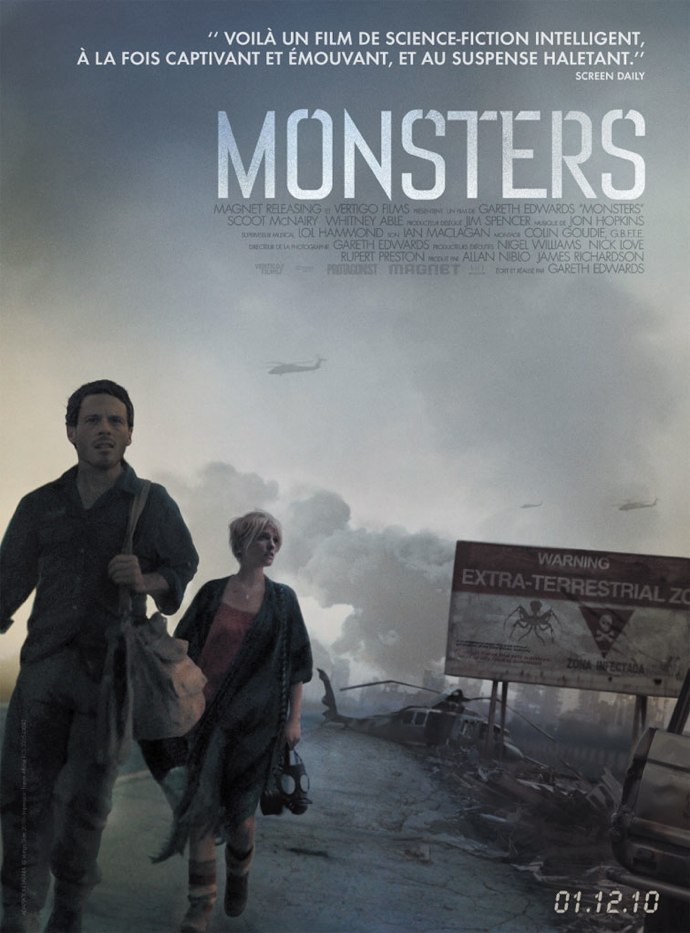

+++
type = "post"
titre = "Concours : 2 places pour Monsters en avant-première à gagner !"
title = "Concours : 2 places pour Monsters en avant-première à gagner !"
url = "/concours-places-monsters-avant-premiere"
date = "2010-11-19T00:28:51"
Lastmod = "2010-11-22T00:00:31"
cover = "monsters-edwards.jpg"
categorie = [ "En bref" ]
tag = [ "Places de ciné" ]

+++

Je n&rsquo;ai pas encore eu l&rsquo;occasion de voir <em>Monsters</em>, mais ce film a reçu une excellente presse dans la blogosphère (<a href="http://www.plan-c.fr/article-critique-monsters-de-gareth-edwards-57889341.html">ici</a> ou <a href="http://www.filmosphere.com/2010/09/critique-etrange-festival-monsters-2010/">là</a>, par exemple). Ce film de Gareth Edwards est un film de science-fiction minimaliste tendance fauché, un peu comme <em><a href="/2009/09/20/district-9-neill-blomkamp/">District 9</a></em> avant lui. J&rsquo;ai personnellement hâte de voir ce film qui sortira dans les bonnes salles françaises le premier décembre 2010.

<a href="http://www.allocine.fr/film/fichefilm_gen_cfilm=183325.html">

</a>

<blockquote>

Synopsis : Une sonde de la NASA s’écrase dans la jungle mexicaine, libérant sur terre des particules d’une forme de vie extra-terrestre. Six ans plus tard, le Mexique et le Costa-Rica sont devenus des zones de guerre désertées par les populations locales, mises en quarantaine et peuplées de créatures monstrueuses. Un photographe est chargé d’escorter une jeune femme à travers cette zone dévastée. Seuls sur la route, ils vont tenter de rejoindre la frontière américaine&#8230; (Allociné)

Sortie le 1er décembre 2010
</blockquote>

<strong>Allociné m&rsquo;a proposé d&rsquo;offrir à deux de mes lecteurs une place pour l&rsquo;avant-première qui aura lieu à Paris le jeudi 25 au soir</strong> ! Pour obtenir une de ces deux places, vous devez pouvoir vous rendre dans un cinéma parisien le 25 novembre (heure et endroit seront précisés ultérieurement) et <strong>vous devez rédiger un commentaire qui explique pourquoi vous avez envie de regarder <em>Monsters</em></strong>.

Le concours est ouvert <strong>jusqu&rsquo;au dimanche 21 au soir</strong>. Un tirage au sort déterminera les deux gagnants. Une seule participation par foyer est autorisée et je me réserve le droit de supprimer tous les commentaires que je jugerai comme étant du spam (et &laquo;&nbsp;J&rsquo;aime trop les monstres !&nbsp;&raquo; <em>est</em> du spam selon moi)… essayez d&rsquo;être un peu plus original…

