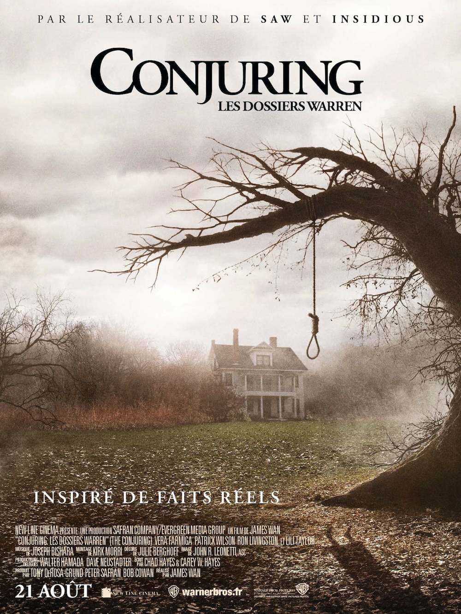
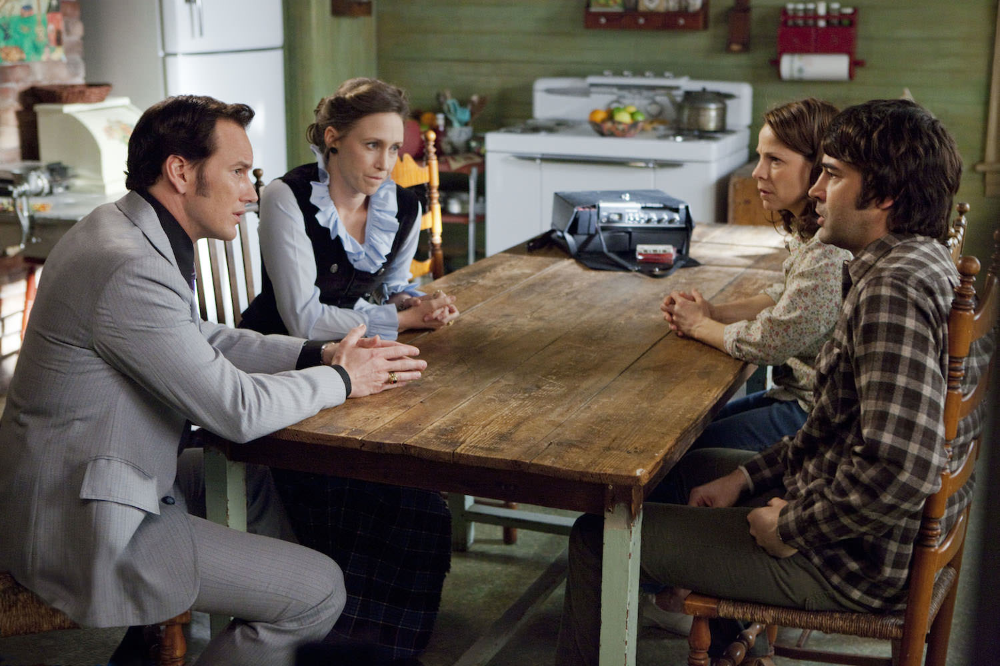
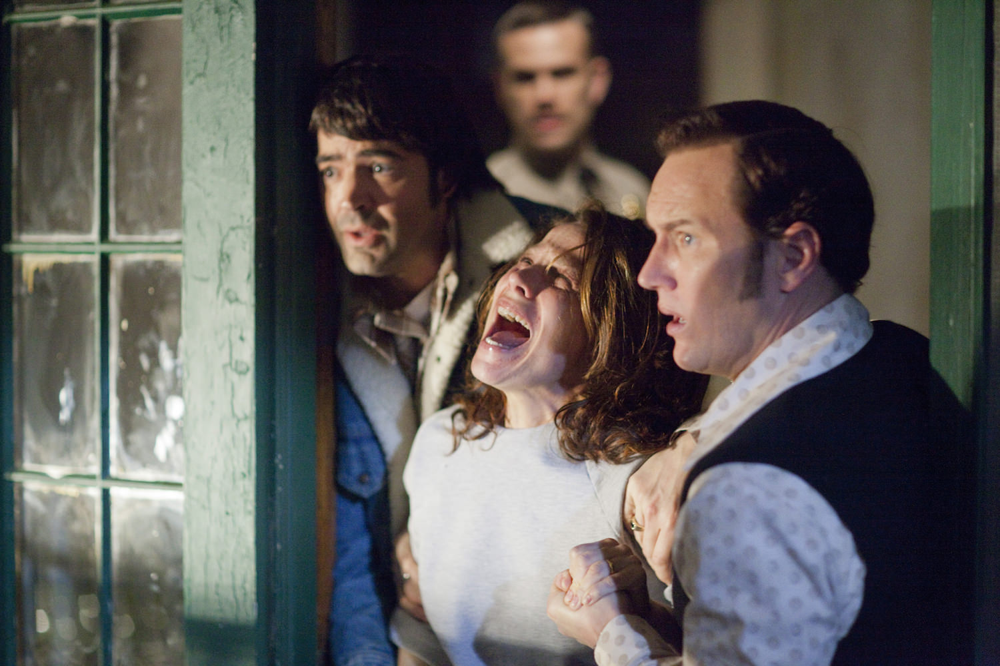

+++
type = "post"
titre = "<em>Conjuring : Les dossiers Warren</em>, James Wan"
title = "Conjuring : Les dossiers Warren, James Wan"
url = "/conjuring-les-dossiers-warren-wan"
date = "2013-08-24T12:01:47"
Lastmod = "2014-03-16T19:23:28"
cover = "conjuring-dossiers-warren-lily-taylor.jpg"
categorie = [ "À voir" ]
tag = [ "Exorcisme", "Famille", "Fantastique", "Histoire vraie", "Horreur", "Religion", "Sorties du mois", "Vite oublié" ]
createur = [ "James Wan" ]
acteur = [ "Lili Taylor", "Patrick Wilson", "Ron Livingston", "Vera Farmiga" ]
annee = [ "2013" ]
weight = 2013
pays = [ "États-Unis" ]
original = "The Conjuring"

+++

« <em>Inspiré de faits réels</em> » : la mention bien visible sur l’affiche attire l’attention de tous les amateurs du genre… James Wan, réalisateur du fameux <em>Saw</em>, poursuit sa carrière avec un nouveau film d’horreur, mais celui-ci est adapté d’une histoire vraie. <em>Conjuring : Les dossiers Warren</em> évoque le travail de deux inspecteurs du surnaturel qui ont vraiment existé et qui ont rencontré une maison supposément hantée dans les années 1970. La couche supplémentaire de l’histoire vraie reste néanmoins assez discrète et James Wan y trouve d’abord une excuse pour réaliser un long-métrage d’horreur à l’ancienne, avec toutes les techniques classiques du genre. Une sorte de best of en somme, pour un résultat qui n’est en rien original, mais qui fait preuve d’une efficacité redoutable. De quoi sauter sur son siège pendant la séance…

Les habitués du genre ne seront pas dépaysés : <em>Conjuring : Les dossiers Warren</em> respecte tous les clichés de l’horreur qu’il respecte à la lettre. Le film commence avec l’installation d’une charmante famille — deux parents et cinq filles — dans une grande maison forcément isolée au milieu des bois. L’action se déroule dans les années 1970, une époque propice au genre, et dès le départ, on sent que cette maison n’est pas aussi charmante que prévu. Pourtant, les personnages de James Wan sont ravis d’y emménager et tout se passe bien les premières heures et même les premiers jours. Pour les plus attentifs, le cinéaste glisse plusieurs indices qui annoncent le pire : ce vieil arbre inquiétant au fond du jardin où la petite fille de la famille trouve une boîte à musique, ou encore les horloges qui s’arrêtent toutes à 3h07. <em>Conjuring : Les dossiers Warren</em> prend malgré tout son temps pour poser son climat inquiétant, avant de faire éclater l’horreur au grand jour, ou plutôt au cœur de la nuit. C’est d’abord la dernière qui semble somnambule et qui va cogner sa tête toutes les nuits contre un vieux meuble. C’est une autre fille qui est tirée par les pieds la nuit et qui accuse sa sœur à ses côtés. Ce sont des portes qui grincent et qui claquent, et puis des voix… en bon spécialiste du genre, James Wan sait comment entretenir son suspense et ajouter par petites touches ses effets, jusqu’au bouquet final. De fait, il faut reconnaître que le film est très efficace et impressionnant, même si on en a déjà vu quelques-uns dans le genre. Difficile de ne pas être pris par surprise par une porte qui se referme brutalement sur la mère terrorisée dans la cave, c’est un classique, mais qui fonctionne encore parfaitement. 

Efficace, <em>Conjuring : Les dossiers Warren</em> manque quand même d’originalité pour passionner l’habitué. Certes, James Wan s’inspire de témoignages de personnes ayant vécu l’histoire, mais l’ensemble évoque plutôt le best of du film de genre un peu fainéant. Fallait-il vraiment rassembler absolument tous les passages obligés de l’horreur, des apparitions dans le miroir aux portes qui claquent, en passant par la possession et l’exorcisme ou encore par l’implication des forces naturelles ? Ce long-métrage donne parfois l’étrange sentiment de chercher à remplir le maximum de cases sur la liste du bon film d’horreur, si bien que son scénario fait un peu forcé, comme si on l’avait bâti avec l’unique intention d’y placer le maximum de clichés. <em>Conjuring : Les dossiers Warren</em> devrait plaire à tous ceux qui n’ont jamais vu un seul film d’horreur, les autres préféreront plutôt se tourner vers les classiques du genre, à commencer par <em>L’Exorciste</em> ou, dans le genre maison dans les bois et le genre barré, par <a href="http://voiretmanger.fr/evil-dead-raimi/" title="Evil Dead, Sam Raimi"><em>Evil Dead</em></a>. Même s’il échoue à passionner, il faut encore une fois reconnaître l’excellent travail de James Wan et de ses équipes, avec une <a href="http://www.amazon.fr/gp/product/B00CM9JO6I/ref=as_li_ss_tl?ie=UTF8&tag=leblogdenic07-21&linkCode=as2&camp=1642&creative=19458&creativeASIN=B00CM9JO6I">bande originale</a> oppressante à souhait, des effets visuels parfaitement orchestrés et des acteurs à la hauteur. Le couple d’enquêteurs interprété par Patrick Wilson et Vera Farmiga est réussi, mais on retient surtout la prestation de Lili Taylor, parfaite en mère possédée par le démon. La mise en scène exploite au maximum les possibilités de la maison et James Wan s’amuse à tourner sa caméra dans tous les sens quand il le faut : un travail soigné qui participe de l’efficacité du long-métrage. 

<em>Conjuring : Les dossiers Warren</em> ressemble un petit peu à une maison hantée de foire foraine. James Wan s’y connaît en horreur et le cinéaste australien réalise un film extrêmement efficace, mais que l’on a déjà vu des dizaines de fois. Jouant sur la surenchère, il multiplie les clichés du genre et forme ainsi une collection ultime plus qu&rsquo;un long-métrage original. Idéal pour découvrir l’horreur, ce film est impressionnant et parvient à surprendre même les spectateurs aguerris, mais il ne passionne jamais vraiment. <em>Conjuring : Les dossiers Warren</em> est parfait pour une séance frayeur, un film à voir et puis à oublier rapidement…

<h3>Vous voulez m&rsquo;aider ?</h3>
<ul>
<li><a href="http://www.amazon.fr/gp/product/B00ENK36RC/ref=as_li_ss_tl?ie=UTF8&tag=leblogdenic07-21&linkCode=as2&camp=1642&creative=19458&creativeASIN=B00ENK36RC">Acheter le film en Blu-Ray sur Amazon</a></li>
<li><a href="http://www.amazon.fr/gp/product/B00ENK35CS/ref=as_li_ss_tl?ie=UTF8&tag=leblogdenic07-21&linkCode=as2&camp=1642&creative=19458&creativeASIN=B00ENK35CS">Acheter le film en DVD sur Amazon</a></li>
<li><a href="https://itunes.apple.com/fr/movie/conjuring-les-dossiers-warren/id719774556">Acheter ou louer le film sur l&rsquo;iTunes Store</a></li>
</ul>

