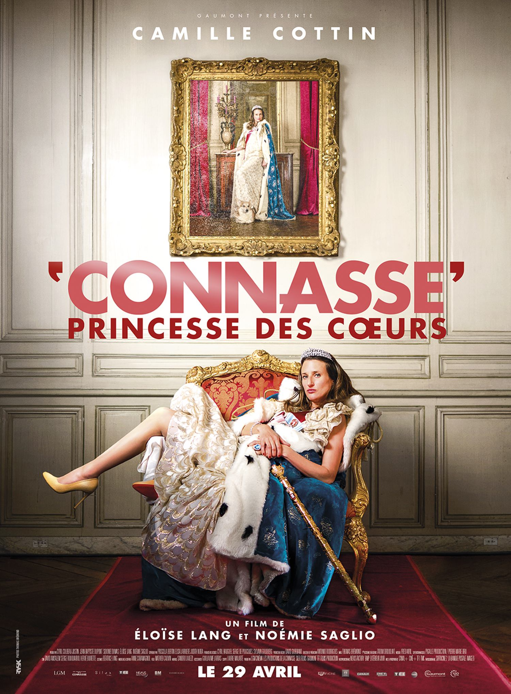
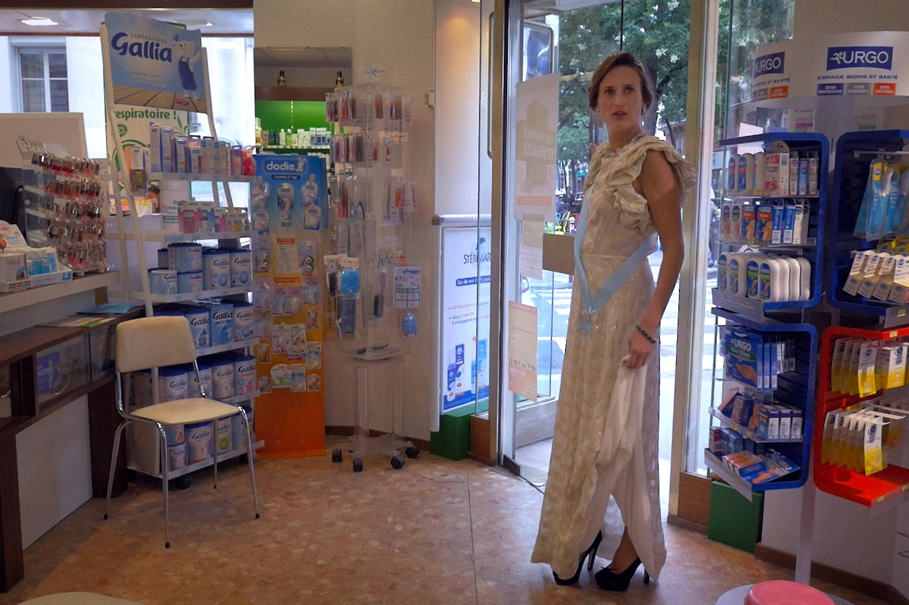

+++
type = "post"
titre = "<em>Connasse, princesse des cœurs</em>,  Eloïse Lang et Noémie Saglio"
title = "Connasse, princesse des cœurs,  Eloïse Lang et Noémie Saglio"
url = "/connasse-princesse-coeurs-lang-saglio"
date = "2015-05-02T15:41:44"
Lastmod = "2015-05-02T15:44:19"
cover = "conasse-princesse-coeurs-camille-cotin.jpg"
categorie = [ "À voir" ]
tag = [ "Argent", "Caméra cachée", "Comédie", "Société", "Sorties du mois", "Télévision" ]
createur = [ "Éloïse Lang", "Noémie Saglio" ]
acteur = [ "Camille Cottin" ]
annee = [ "2015" ]
weight = 2015
pays = [ "France" ]

+++

À l&rsquo;origine, « Connasse » est une série de petits sketchs, comme <a href="https://www.youtube.com/watch?v=qDCFTXXBGb0&amp;spfreload=10">celui-ci</a>, réalisés en caméra cachée et diffusés sur Canal+. Au centre, une jeune femme insupportable, qui se sent largement supérieure à la moyenne et qui n&rsquo;a aucun filtre pour l&rsquo;empêcher de le clamer haut et fort. Un personnage détestable, mais si naïf qu&rsquo;on ne peut pas le détester tout à fait : ces petites séquences sont souvent très drôles, même si elles ont aussi le chic pour mettre mal à l&rsquo;aise. <em>Connasse, princesse des cœurs</em> reprend le même concept, mais cette fois sur un format beaucoup plus ambitieux : un long-métrage. Noémie Saglio et Élodie Lang, les deux créatrices du concept qui réalisent aussi ce film, sont-elles tombées sur la tête ? On ne voyait pas bien comment une idée aussi limitée pouvait tenir la distance, mais le résultat est une bonne surprise. Tourné intégralement en caméra cachée et avec une seule actrice — une première apparemment —, <em>Connasse, princesse des cœurs</em> est aussi drôle que les vidéos courtes et ce film, sans prétention artistique, est très plaisant.

Si vous n&rsquo;avez jamais vu le format court, vous risquez d&rsquo;être surpris face à la connasse interprétée par Camille Cottin. Long-métrage oblige, <em>Connasse, Princesse des coeurs</em> s&rsquo;offre le luxe d&rsquo;une contextualisation avec quelques moments clés de la jeunesse du personnage, où l&rsquo;on voit bien que cette jeune femme est odieuse depuis sa naissance. D&rsquo;emblée, le système mis en place par les deux réalisatrices frappe par sa légitimité : les réactions des personnes qui entourent l&rsquo;actrice ne pourraient pas être aussi bien rendues s&rsquo;il s&rsquo;agissait de suivre un script. Éloïse Lang et Noémie Saglio ont pris un grand soin pour masquer le dispositif, tournant avec des équipes réduites et surtout des caméras dissimulées un petit peu partout, et cela fonctionne. Les gens croisés sont parfois choqués, au moins interloqués, ils ne comprennent pas cette fille hautaine et condescendante. Mais le plus impressionnant, c&rsquo;est qu&rsquo;ils acceptent, souvent sans discuter, de se mener par le bout du nez par cette femme odieuse. Ce chauffeur de taxi qui monte au cinquième étage sans ascenseur pour chercher une valise, ces touristes qui se font trimballer dans une 2CV un petit peu n&rsquo;importe où dans Paris… quand on découvre leurs réactions à la fin, pendant le générique, on réalise qu&rsquo;il ne s&rsquo;agissait pas d&rsquo;acteurs, mais bien de personnes réelles. L&rsquo;effet est totalement réussi, en grande partie parce que leurs réactions sont totalement imprévisibles. Ils ne pensent pas être filmés, c&rsquo;est ce qui explique la réussite des meilleures scènes de <em>Connasse, Princesse des coeurs</em>.

Le succès de la série diffusée sur Canal+ a forcé Éloïse Lang et Noémie Saglio à aller un petit peu plus loin. Dans les scènes diffusées pendant le générique, on voit au moins un cas où Camille Cottin, l&rsquo;actrice qui joue la connasse, est reconnue par quelqu&rsquo;un, en l&rsquo;occurrence un policier devant le Palais de l&rsquo;Élysée. L&rsquo;effet de surprise offert par la caméra cachée est alors totalement détruit et pour le maintenir, les deux réalisatrices ont imaginé une histoire pour sortir leur personnage de France. Lassée de sa vie médiocre à Paris, elle se met en tête de devenir une princesse anglaise en épousant le prince Harry. Une idée qui permet à <em>Connasse, Princesse des coeurs</em> de traverser la Manche et de multiplier les situations où la caméra cachée pouvait fonctionner à plein, puisque personne ne connaissait le personnage. L&rsquo;intrigue imaginée n&rsquo;a, au fond, pas grande importance, si ce n&rsquo;est qu&rsquo;elle évite le côté film à sketches. Toutes les séquences ne sont pas aussi réussies, mais le long-métrage est cohérent et malgré la pauvreté technique de la mise en scène — difficile de faire de jolis travellings quand on a deux caméras dans un sac à main —, il faut reconnaître que la réalisation est de qualité. On n&rsquo;a pas affaire à du grand cinéma, mais à un très bon téléfilm. Et de toute façon, la star du projet reste Camille Cottin et ce personnage qu&rsquo;elle incarne à merveille. On imagine pourtant la difficulté de la tâche : chaque scène ne pouvait être filmée qu&rsquo;une seule fois et l&rsquo;actrice devait apprendre des bouts de dialogue et surtout les intercaler au bon moment en fonction des réactions. Quand la femme de chambre de l&rsquo;hôtel où elle se trouve entre et découvre le mur tapissé de photos du prince Harry, Éloïse Lang et Noémie Saglio avaient prévu de la colère, mais elles ont obtenu l&rsquo;aide de cette jeune femme. La scène, inattendue, est finalement plus touchante que drôle, mais elle est s&rsquo;accorde parfaitement avec le reste.

C&rsquo;était un projet un petit peu fou et certaines scènes ont valu des problèmes à l&rsquo;actrice et une partie de l&rsquo;équipe technique — ils ne sont pas allés au poste de police pour faire semblant après avoir interrompu une cérémonie officielle de la garde royale —, mais le résultat est au rendez-vous. En passant du format du sketch court au long-métrage, Éloïse Lang et Noémie Saglio ont pris un gros risque, mais <em>Connasse, Princesse des coeurs</em> tient bien la distance. Le film reste fort heureusement court et les séquences vraiment réussies sont suffisamment nombreuses pour que l&rsquo;on passe un bon moment. Ce n&rsquo;est pas du grand cinéma, c&rsquo;est vrai, mais un bon divertissement !

