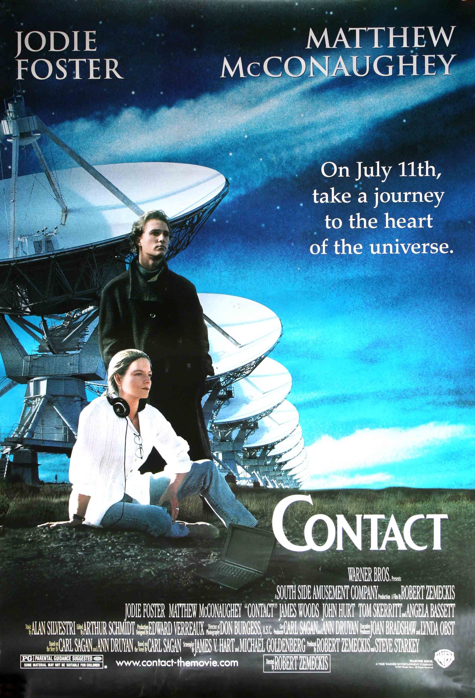
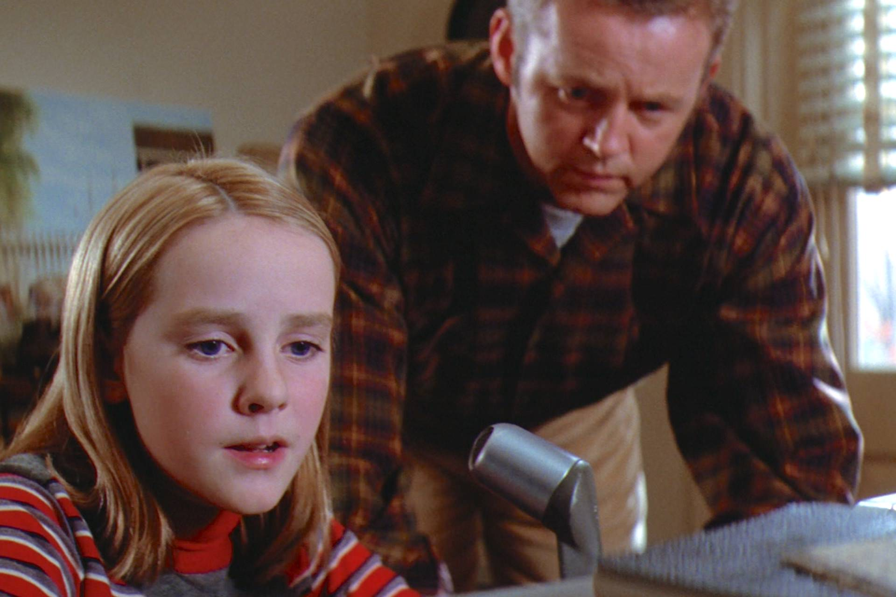
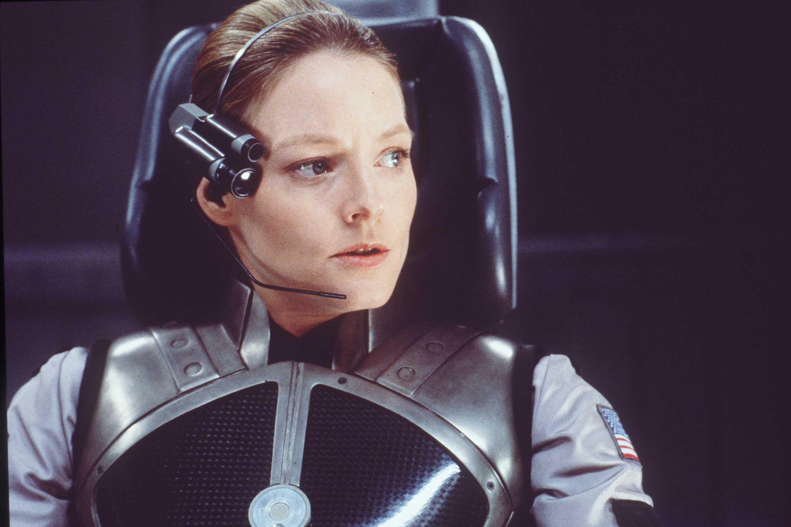

+++
titre = "<em>Contact</em>, Robert Zemeckis"
title = "Contact, Robert Zemeckis"
url = "/contact-zemeckis"
date = "2015-01-05T08:58:12"
Lastmod = "2015-01-05T10:38:57"
cover = "contact-jodie-foster-zemeckis.jpg"
categorie = [ "À voir" ]
tag = [ "Adaptation littéraire", "Drame", "Espace", "Extra-terrestre", "Religion", "Science", "Science-Fiction" ]
createur = [ "Robert Zemeckis" ]
acteur = [ "James Woods", "Jodie Foster", "John Hurt", "Matthew McConaughey", "Tom Skerritt" ]
annee = [ "1997" ]
weight = 1997
pays = [ "États-Unis" ]

+++

La vie extra-terrestre est un sujet qui a occupé tant de films qu&rsquo;il est souvent difficile d&rsquo;être original. Pourtant, <em>Contact</em> a réussi à trouver un angle intéressant en évitant le <em>space-opera</em> au profit d&rsquo;un drame qui se déroule essentiellement sur terre. De fait, on ne voit jamais d&rsquo;êtres venus de l&rsquo;espace chez Robert Zemeckis et ce n&rsquo;est pas, au fond, ce qui motive son long-métrage. Adapté d&rsquo;un roman de Carl Sagan, <em>Contact</em> est d&rsquo;abord le récit d&rsquo;une prise de contact, comme son nom l&rsquo;indique, si bien que l&rsquo;on aurait presque du mal à le ranger dans la catégorie de la science-fiction. Le film l&rsquo;adopte <em>in fine</em>, mais toujours avec une idée originale en tête : plutôt que d&rsquo;accepter la question de l&rsquo;existence de vie extra-terrestre, le scénario laisse une belle part au doute, tout en ménageant une place pour l&rsquo;affrontement entre science et religion. Robert Zemeckis signe là un long-métrage passionnant, qui se (re)voit avec plaisir !

Depuis qu&rsquo;elle est toute petite, Eleanor Arroway a une obsession : contacter des personnes le plus loin possible grâce à sa radio, puis, son doctorat en poche, grâce à des systèmes de surveillance qui lui permettent d&rsquo;écouter l&rsquo;espace. Travaillant au sein du SETI, la scientifique espère découvrir la preuve d&rsquo;une existence extra-terrestre en captant un message construit qui serait la preuve que la Terre n&rsquo;est pas la seule planète à avoir hébergé une vie intelligente. Mais son opinion n&rsquo;est pas forcément populaire dans la communauté scientifique : <em>Contact</em> commence ainsi avec un échec. Alors qu&rsquo;elle s&rsquo;est installée à Porto-Rico pour mener ses recherches, un rival plus proche du pouvoir américain qu&rsquo;elle coupe son financement et veut mettre un terme à toute recherche autour des extra-terrestres. Sûre d&rsquo;elle, le docteur Arroway obtient un financement pour lancer de nouvelles recherches, cette fois au Nouveau-Mexique. Pendant quatre ans, elle n&rsquo;obtient rien, jusqu&rsquo;au jour où elle capte un signal qui provient d&rsquo;une planète située à quelques années-lumières. C&rsquo;est la preuve qu&rsquo;elle cherchait toute sa vie et à partir de ce moment là, le long-métrage de Robert Zemeckis change de registre. Jusqu&rsquo;alors très axé sur la recherche scientifique et sur la lutte en interne entre ceux qui croient à la possibilité d&rsquo;une vie extra-terrestre et les sceptiques qui pensent que c&rsquo;est de l&rsquo;argent gâché, <em>Contact</em> bascule dans une quête pour déchiffrer le signal, puis construire la sorte de machine dont les plans étaient transmis par cette intelligence distance. Le film entre ainsi plus fermement dans la science-fiction, tout en accentuant toujours plus sur l&rsquo;aspect scientifique de ce genre, plutôt que sur la fiction. Les arguments avancés sont tous crédibles, avec quelques idées vraiment bien vues, comme celle d&rsquo;exploiter le fait que les Nazis ont diffusé les Jeux Olympiques de 1936 dans le monde entier en utilisant des ondes puissantes. Carl Sagan émet l&rsquo;hypothèse, dans son roman, que les ondes ont pu se propager très loin dans l&rsquo;espace, être captées par une planète à 25 années-lumières et être renvoyées dans l&rsquo;autre sens. Même si cette hypothèse est <a href="http://www.realclearscience.com/blog/2013/09/will-hitler-be-the-first-person-that-aliens-see.html">probablement fausse</a>, elle reste crédible et c&rsquo;est ainsi que Robert Zemeckis a construit son film. À cet égard, il n&rsquo;est pas sans rappeler la démarche d&rsquo;<a href="http://voiretmanger.fr/interstellar-nolan/" title="Interstellar, Christopher Nolan"><em>Interstellar</em></a>, même si les sujets de chaque film diffèrent largement.

Dès les premières images, le cinéaste indique clairement que l&rsquo;on n&rsquo;a pas affaire à de la science-fiction traditionnelle. <em>Contact</em> prend son temps et ne cherche pas le suspense à tout prix, même vers la fin, quand la capsule est conçue d&rsquo;après les plans envoyés avec le message spatial. Robert Zemeckis privilégie au contraire une avancée paisible pendant plus de 2h30 et il se passe ainsi un très long moment avant même que le message soit reçu. Dans l&rsquo;intervalle, le film multiplie les flashbacks pour expliquer la relation d&rsquo;Eleanor Arroway avec son père, ce qui permet aussi de comprendre son attachement aux messages radios et à l&rsquo;espace. Évitant la lourdeur habituellement commune avec ces retours en arrière, <em>Contact</em> fait au contraire preuve d&rsquo;une grande élégance et ces scènes sont même assez émouvantes, tout en étant utiles. Grâce à elles, on comprend un trait essentiel du personnage principal du film : la jeune scientifique croit dur comme fer à la science, et rejette en bloc la foi religieuse. Un aspect qui devient de plus en plus central au fur et à mesure que le film avance, et que la question se pose avec toujours plus de forces : la science et les avancées scientifiques sont-elles incompatibles avec la religion ? Pour incarner ce débat, le personnage de Palmer Joss affronte régulièrement le docteur Arroway. Ce théologien est un sceptique affirmé quand il s&rsquo;agit d&rsquo;évaluer les progrès modernes et la recherche scientifique et il remet souvent en doute les travaux menés par Eleanor. Cet affrontement entre religion et science, un classique de la philosophie, revient en tout cas constamment dans le film et c&rsquo;est probablement ce qui a motivé Robert Zemeckis, bien avant l&rsquo;aspect futuriste ou la conquête spatiale. Avec une réponse moins grossière qu&rsquo;on ne pourrait le croire. Quand son personnage principal a obtenu la preuve de l&rsquo;existence d&rsquo;extra-terrestres, elle revient sur terre sans la moindre preuve tangible à apporter, personne ne la croit et c&rsquo;est elle, sceptique invétérée, qui porte un message de foi. Une ironie du sort qui évite aussi à <em>Contact</em> de tomber dans la science-fiction pure : jusqu&rsquo;au bout, le doute reste permis quant à l&rsquo;existence d&rsquo;une vie ailleurs que sur Terre<a href="#fn-12776-1" rel="footnote">1</a>. C&rsquo;est un positionnement plutôt malin pour le film, qui conserve son angle plus original que s&rsquo;il s&rsquo;était contenté d&rsquo;affirmer la réalité des extra-terrestres.

Sur le papier, <em>Contact</em> ressemble à n&rsquo;importe quel autre film de science-fiction à base d&rsquo;extra-terrestres. Les humains captent un signal de l&rsquo;espace, ils découvrent l&rsquo;existence d&rsquo;une vie intelligente hors de leur planète et là, selon les cas, ils doivent les affronter dans une guerre sans merci, ou une rencontre enrichissante a lieu. Pourtant, même si le point de départ est similaire, le résultat n&rsquo;a rien à voir, car Robert Zemeckis reste sur une ligne plutôt originale. Plutôt que de s&rsquo;attacher à la fiction, il préfère la science et une question quasiment philosophique qui parcourt tout son long-métrage. Porté par deux acteurs excellents — Matthew McConaughey et surtout Jodie Foster —, <em>Contact</em> conserve toute son originalité et sa force.

<em>Merci Julien pour le cadeau</em>

<h3>Vous voulez <a href="http://voiretmanger.fr/soutien/">m&rsquo;aider</a> ?</h3>
<ul>
<li><a href="http://www.amazon.fr/gp/product/B0029TQW84/ref=as_li_ss_tl?ie=UTF8&amp;tag=leblogdenic07-21&amp;linkCode=as2&amp;camp=1642&amp;creative=19458&amp;creativeASIN=B0029TQW84">Acheter le film en Blu-ray sur Amazon</a></li>
<li><a href="http://www.amazon.fr/gp/product/B00004VYN8/ref=as_li_ss_tl?ie=UTF8&amp;tag=leblogdenic07-21&amp;linkCode=as2&amp;camp=1642&amp;creative=19458&amp;creativeASIN=B00004VYN8">Acheter le film en DVD sur Amazon</a></li>
<li><a href="https://itunes.apple.com/fr/movie/contact-1997/id385803517">Acheter ou louer le film sur l&rsquo;iTunes Store</a></li>
</ul>

<ol>
<li id="fn-12776-1">
Même si le film donne malgré tout un indice fort en faveur de l&rsquo;une des solutions en indiquant que l&rsquo;enregistrement vidéo vide ramené par la scientifique dure en fait 18 heures…&#160;<a href="#fnref-12776-1" rev="footnote">&#8617;</a>
</li>
</ol>

