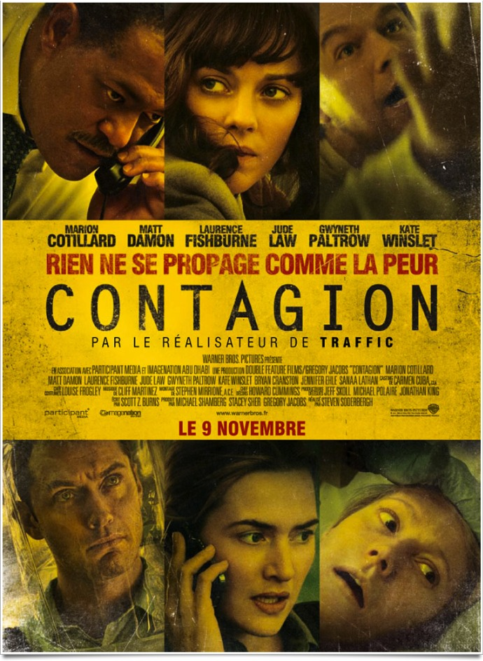
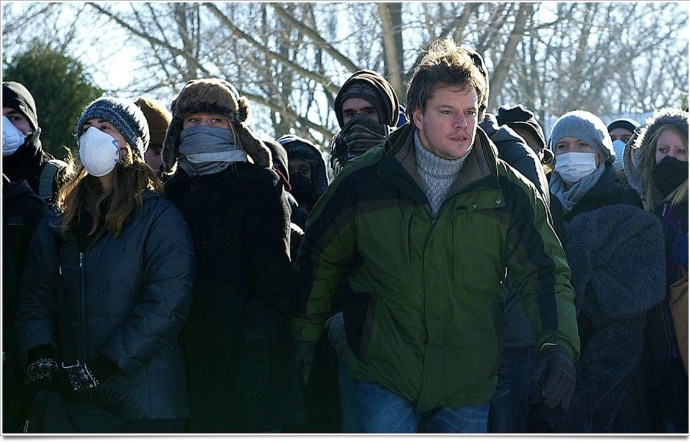
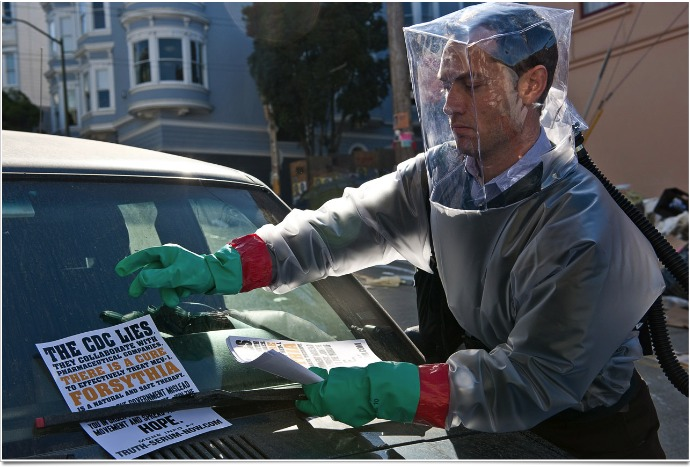

+++
type = "post"
titre = "<em>Contagion</em>, Steven Soderbergh"
title = "Contagion, Steven Soderbergh"
url = "/contagion-soderbergh"
date = "2011-11-13T15:22:07"
Lastmod = "2015-01-18T17:54:52"
cover = "soderbergh-contagion.jpg"
categorie = [ "À voir" ]
tag = [ "Blockbuster", "Catastrophe", "Docufiction", "Maladie", "Mort", "Société" ]
createur = [ "Steven Soderbergh" ]
acteur = [ "Jude Law", "Laurence Fishburne", "Marion Cotillard", "Matt Damon" ]
annee = [ "2011" ]
weight = 2011
pays = [ "Émirats Arabes Unis", "États-Unis" ]

+++

Le dernier film de Steven Soderbergh est un film de genre : <em>Contagion</em> appartient au genre des films catastrophes, rubrique virus. Soit un virus d&rsquo;origine animale qui se transmet à l&rsquo;homme à une rapidité jamais vue. En quelques jours à peine, on obtient une pandémie mondiale. L&rsquo;enrayer devient alors un enjeu planétaire que transmet ce film très classique, certes, mais aussi extrêmement efficace.

Comme l&rsquo;affiche l&rsquo;indique bien, <em>Contagion</em> est un film choral. Il n&rsquo;y a pas vraiment de personnage principal, même si celui de Mitch, époux de la première victime du virus, sert de fil conducteur. Outre cet américain, on suit un responsable du centre de prévention des maladies aux États-Unis, mais aussi une responsable de l&rsquo;OMS à Genève, des militaires américains, des Chinois, un blogueur… Ce point de vue multiple est très classique dans les films catastrophes planétaires et ce dispositif prouve ici encore son efficacité : la pandémie est ainsi vécue selon des points de vue différents, ce qui permet au spectateur d&rsquo;en avoir une vision globale, contrairement à celle de chaque personnage impliqué dans l&rsquo;action. L&rsquo;enjeu de <em>Contagion</em> est évident : trouver un virus au plus vite, alors que les morts se comptent par millions…

<em>Contagion</em> contient tous les attributs classiques d&rsquo;un bon blockbuster catastrophe. Quand le film s&rsquo;ouvre, c&rsquo;est sur une personne malade. Une Américaine qui semble atteinte par une forte grippe qu&rsquo;aucun médicament ne guérit. Elle meurt rapidement après une chute dans sa cuisine et on ne sait pas encore pourquoi. Très vite, le film présente d&rsquo;autres morts similaires et le spectateur comprend sans peine qu&rsquo;une épidémie générale gagne la planète. Les officiels entrent alors sur la piste et cherchent à comprendre le problème et surtout à le régler au plus vite. Comme tout blockbuster qui se respecte, <em>Contagion</em> s&rsquo;attache alors plus particulièrement au cas américain. Il y a bien quelques plans à l&rsquo;OMS en Suisse, quelques autres en Chine, mais l&rsquo;essentiel de l&rsquo;action se déroule aux États-Unis et la majorité des personnages sont américains. Ce n&rsquo;est d&rsquo;ailleurs pas plus mal : la prise en otage en Chine est sans doute la partie la plus faible dans l&rsquo;ensemble. Du début à la fin, plutôt positive, Steven Soderbergh respecte son genre à la lettre. Les habitués du genre ne seront pas dépaysés, ceux qui n&rsquo;aiment pas trop ne devraient pas plus apprécier <em>Contagion</em>…

Steven Soderbergh n&rsquo;a pas cherché à tout prix à faire dans le spectaculaire avec <em>Contagion</em>, au contraire même. Son dernier film a des allures de documentaires, à tel point qu&rsquo;il surprendrait presque son spectateur par un ton très neutre. Il y a bien sûr des ficelles scénaristiques un peu grosses comme l&rsquo;enlèvement en Chine ou encore des personnages secondaires qui prennent beaucoup trop d&rsquo;importance, mais <em>Contagion</em> reste dans l&rsquo;ensemble un film assez réaliste. Le cinéaste a eu l&rsquo;intelligence tout d&rsquo;abord d&rsquo;intégrer son film au contexte actuel en faisant de son virus une variante du H1N1. À un moment, un journaliste demande lors d&rsquo;une conférence de presse si les autorités n&rsquo;en font pas trop, comme pour ce virus. Cette entrée du réel dans le film peut paraître insignifiante, mais elle renforce encore le réalisme de <em>Contagion</em>. C&rsquo;est certainement le point fort principal du film de Steven Soderbergh : son film instaure un climat de paranoïa dans la salle, au point que l&rsquo;on évite inconsciemment de toucher les poignées de porte en sortant. <em>Contagion</em> réussit à trouver le bon équilibre entre film d&rsquo;action hollywoodien et réalisme du documentaire : le ton est globalement juste, ce qui rend le film extrêmement efficace. Le personnage du blogueur qui n&rsquo;hésite pas à mentir à ses millions de visiteurs en jouant sur la théorie du complot pour mieux les réunir est également très bien vu, tandis que le film évite de jouer sur le spectaculaire à outrance. Steven Soderbergh présente des paysages post-apocalyptiques qui rappellent ceux de <em><a href="http://voiretmanger.fr/2009/12/05/la-route-hillcoat/">La Route</a></em> et non pas ceux de <em><a href="http://voiretmanger.fr/2009/11/14/2012-emmerich/">2012</a></em>…

Steven Soderbergh est un cinéaste complexe, capable de passer d&rsquo;épouser des genres très différents d&rsquo;un film à l&rsquo;autre. Après une comédie assez légère sur fond de critique du capitalisme à outrance dans <em><a href="http://voiretmanger.fr/2009/10/11/the-informant-soderbergh/">The Informant</a></em>, il choisit cette fois un tout autre genre avec ce film catastrophe. S&rsquo;il en respecte tous les codes, Steven Soderbergh impose aussi sa patte avec une photographie plutôt froide et une réalisation qui imite parfois les reportages des journaux télévisés, ou ceux des dépêches de la presse. <em>Contagion</em> est rythmé et plutôt court (1h46) : le film passe ainsi très vite et ne laisse pas de place à l&rsquo;ennui. De manière là encore convenue, mais efficace, <em>Contagion</em> est découpée par jour à partir du déclenchement de la pandémie et le spectateur est vraiment plongé au cœur de l&rsquo;action et peut ainsi ressentir l&rsquo;urgence de la situation. La bande originale n&rsquo;est pas étrangère à ce succès : composée par Cliff Martinez, elle évoque sans trop de surprises celle de <em><a href="http://voiretmanger.fr/2011/10/04/drive-winding-refn/">Drive</a></em> et elle s&rsquo;avère particulièrement réussie. <em>Contagion</em> offre également un véritable défilé de stars : Matt Damon, fidèle du cinéaste, est très bon en mari qui peine à comprendre ce qui lui arrive et les autres sont très bien aussi, à commencer par Laurence Fishburne, égal à lui-même, ou Jude Law en blogueur survolté.

Classique, mais efficace : <em>Contagion</em> n&rsquo;est certainement pas le film de l&rsquo;année, mais c&rsquo;est peut-être le meilleur film catastrophe de l&rsquo;année. Steven Soderbergh a la présence d&rsquo;esprit de ne pas en faire trop, mais d&rsquo;insuffler dans son dernier long-métrage juste ce qu&rsquo;il faut de réalisme pour rendre ses spectateurs un brin paranos. À cet égard, son film est une réussite.

<h3>Vous voulez m&rsquo;aider ?</h3>
<ul>
<li><a href="http://www.amazon.fr/gp/product/B006OMVAN4/ref=as_li_ss_tl?ie=UTF8&#038;tag=leblogdenic07-21&#038;linkCode=as2&#038;camp=1642&#038;creative=19458&#038;creativeASIN=B006OMVAN4">Acheter le film en Blu-Ray et DVD sur Amazon</a></li>
<li><a href="http://www.amazon.fr/gp/product/B006OMVAKW/ref=as_li_ss_tl?ie=UTF8&#038;tag=leblogdenic07-21&#038;linkCode=as2&#038;camp=1642&#038;creative=19458&#038;creativeASIN=B006OMVAKW">Acheter le film en DVD sur Amazon</a></li>
<li><a href="https://itunes.apple.com/fr/movie/contagion/id505581216">Acheter ou louer le film sur l&rsquo;iTunes Store</a></li>
</ul>

