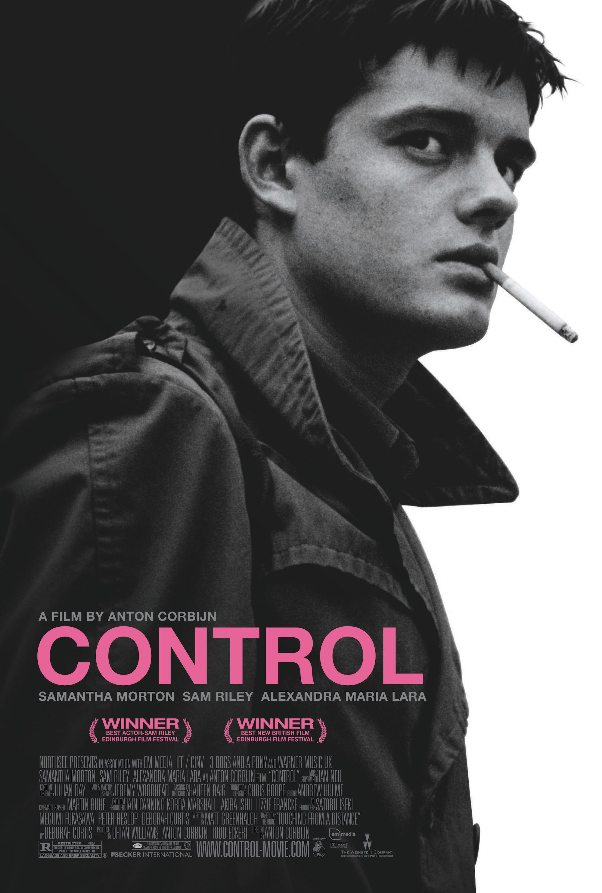
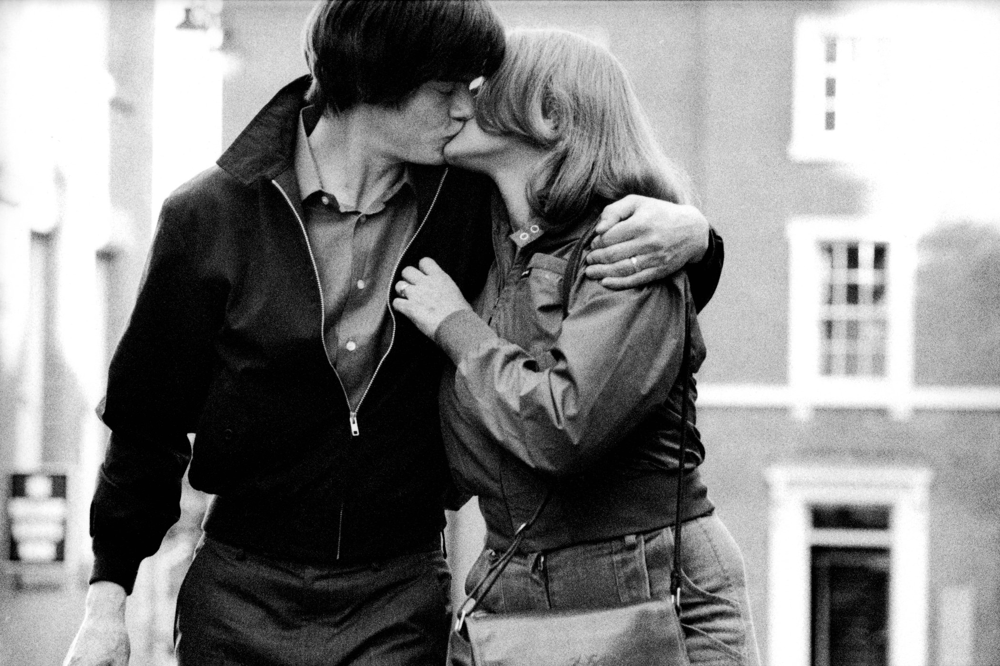
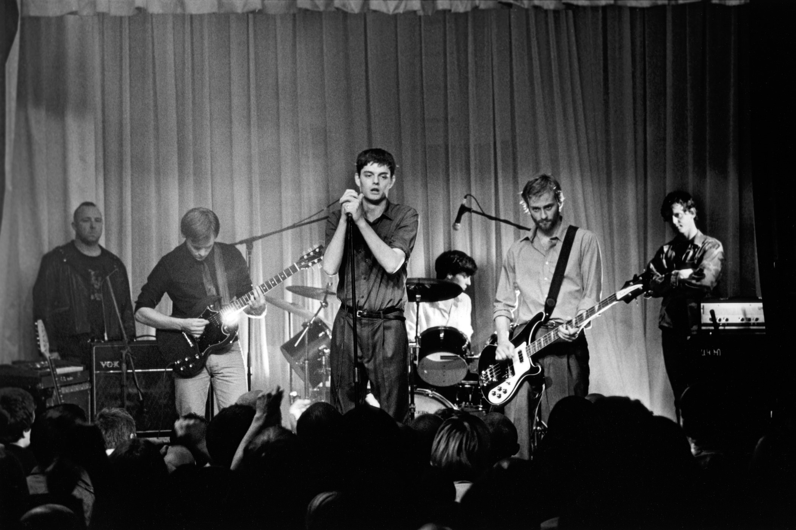
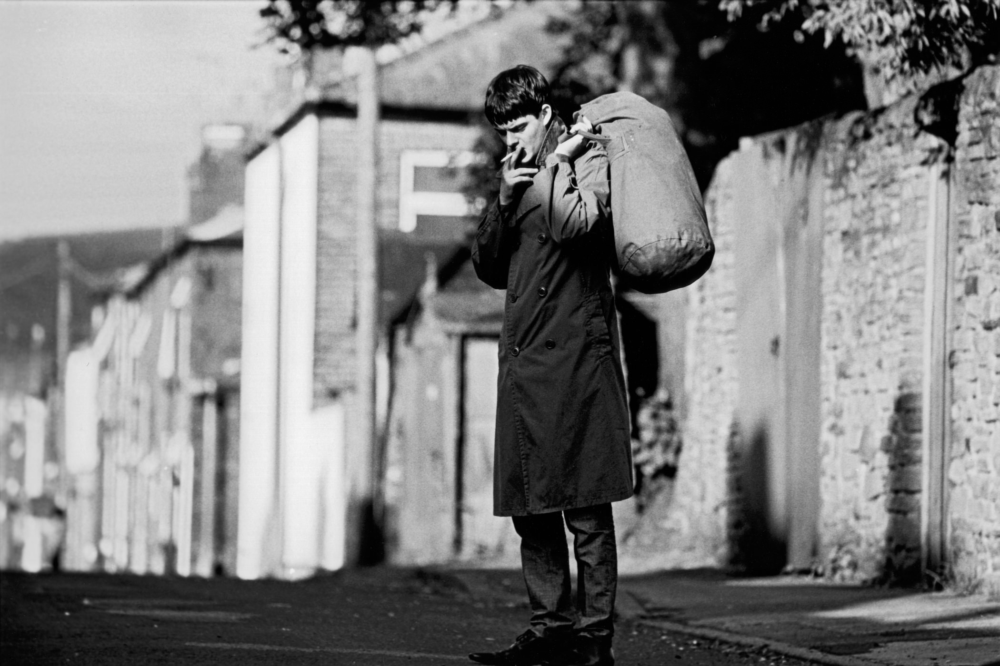

+++
titre = "<em>Control</em>, Anton Corbijn"
title = "Control, Anton Corbijn"
url = "/control-corbijn"
date = "2014-11-16T17:07:07"
Lastmod = "2014-11-18T08:56:40"
cover = "control-sam-riley.jpg"
categorie = [ "À voir" ]
tag = [ "Adaptation littéraire", "Biopic", "Dépression", "Drame", "Famille", "Histoire vraie", "Mort" ]
createur = [ "Anton Corbijn" ]
acteur = [ "Alexandra Maria Lara", "Craig Parkinson", "Sam Riley", "Samantha Morton", "Toby Kebbell" ]
annee = [ "2007" ]
weight = 2007
pays = [ "États-Unis", "Grande-Bretagne" ]

+++

« <em>Certaines musiques n&rsquo;ont pas à l&rsquo;être</em> » : c&rsquo;est ainsi que répond, dans <em>Control</em>, Ian Curtis à une journaliste qui lui demande si la musique de Joy Division est belle. Cette réponse résume bien ce groupe éphémère qui n&rsquo;a vécu que le temps de deux albums, avant son arrêt prématuré avec la mort de son chanteur et leader, en mai 1980. Deux albums seulement et pourtant, quels albums et quels héritages ! Sans même parler d&rsquo;héritage direct — New Order s&rsquo;est formé sur les cendres de Joy Division —, cette musique glaçante, effectivement dénuée de toute joie de vivre, mais en même temps si parfaite a inspiré des générations entières de groupes et elle continue encore aujourd&rsquo;hui d&rsquo;être une inspiration de base pour beaucoup d&rsquo;artistes. Pourtant, ce n&rsquo;est pas tout à fait ce qui intéresse Anton Corbijn pour son premier long-métrage. Lui qui a commencé par photographier des groupes de rock a justement croisé la route de Joy Division ; autant dire qu&rsquo;il connaît bien le groupe et la musique de la fin des années 1970 résonne dans <em>Control</em>. Pour autant, le film est une adaptation de <em>Touching from a Distance</em>, l&rsquo;autobiographie de Deborah Curtis, la femme d&rsquo;Ian Curtis. Plus que la musique, c&rsquo;est donc l&rsquo;homme qui intéresse Anton Corbijn et c&rsquo;est une réussite : cette plongée dans le quotidien d&rsquo;un dépressif suicidaire n&rsquo;est pas des plus gaie, mais <em>Control</em> est une œuvre puissante, à ne rater sous aucun prétexte !

<em>Control</em> n&rsquo;est pas un biopic traditionnel, mais il emprunte au genre quelques idées, à commencer par un respect de la chronologie. Ainsi, on suit la vie d&rsquo;Ian Curtis de la fin de son adolescence jusqu&rsquo;à sa mort, le 15 mai 1980 ; cette dernière ne fait pas l&rsquo;objet d&rsquo;un suspense de la part du scénario, elle est probablement connue de la part du spectateur dès le départ, mais Anton Corbijn ne vient pas troubler l&rsquo;ordre chronologique pour autant. Deux ans auparavant, Gus Van Sant avait sorti un film assez proche sur le papier, mais très différent sur la forme : <em>Last Days</em> raconte aussi les derniers jours d&rsquo;une star du rock suicidaire, mais cette fois la fin de Kurt Cobain de Nirvana. Là où Gus Van Sant troublait complètement la chronologie pour donner le sentiment d&rsquo;une confusion totale sur les derniers jours de son sujet, le réalisateur de <em>Control</em> s&rsquo;en tient à un exposé des faits plus simples et on commence ainsi avec un Ian Curtis encore très jeune, sur les bancs du lycée. Ce qui n&rsquo;empêche pas Anton Corbijn de s&rsquo;autoriser quelques libertés pour autant, notamment sur l&rsquo;élasticité du temps. Ainsi, toute l&rsquo;adolescence est traitée extrêmement rapidement et le film expédie tous les évènements marquants en quelques minutes : les bêtises de l&rsquo;adolescence — les thés chez les mamies du coin pour piquer les médicaments et se droguer —, mais aussi et surtout les premières amours. Expédiées aussi, les premières rencontres et les premières aventures avec celle qui deviendra sa femme, Deborah, alias Debbie. Le mariage est évoqué en coup de vent, on les voit s&rsquo;installer dans une petite maison un peu minable de la banlieue de Manchester, il a un travail dans l&rsquo;équivalent local de l&rsquo;ANPE et le premier enfant est en route.

En quelques minutes, Anton Corbijn évacue toutes ces futilités, pour mieux se concentrer sur ce qui l&rsquo;intéresse vraiment. Car s&rsquo;il accepte de raconter la vie d&rsquo;Ian Curtis, on sent bien qu&rsquo;il ne veut pas faire un biopic traditionnel, où il faudrait accorder autant de place à chaque évènement et ainsi obtenir quelque chose d&rsquo;équilibré. Non, <em>Control</em> est déséquilibré et c&rsquo;est très bien ainsi : c&rsquo;est précisément ce qui fait sa réussite. Et même si on indiquait en préambule que la musique de Joy Division n&rsquo;est pas le sujet principal du film, elle n&rsquo;en reste pas moins un sujet essentiel, central même pourrait-on dire. Le film montre très bien comment le chanteur aurait très bien pu passer à côté. Même s&rsquo;il semble adorer la musique depuis sa jeunesse — de David Bowie au Sex Pistols, en passant par Roxy Music à Lou Reed —, il ne chante pas, ne compose pas vraiment de texte, même s&rsquo;il a un penchant assez marqué pour la poésie de Wordsworth. S&rsquo;il se met à chanter pour le groupe qui ne s&rsquo;appelle pas encore Joy Division et qui n&rsquo;est encore qu&rsquo;une bande potes qui fait un peu de musique en amateurs, c&rsquo;est qu&rsquo;ils ont besoin de chanteurs et qu&rsquo;il passait par là au moment où ils en cherchent un. Très vite, il s&rsquo;aperçoit qu&rsquo;il ne chante pas seulement pour les dépanner : il est bon, et il est surtout extrêmement investi. Il écrit les paroles torturées que l&rsquo;on connaît et sur scène, il est comme transformé. À ce sujet, il faut saluer l&rsquo;extraordinaire travail de mimétisme réalisé par Sam Riley qui incarne Ian Curtis avec une précision extraordinaire. Après avoir vu le film, regardez n&rsquo;importe quelle vidéo d&rsquo;archive (« <a href="https://www.youtube.com/watch?v=zsHoOIHDutE&amp;spfreload=10"><em>She&rsquo;s Lost Control</em></a> » à la BBC en 1979 par exemple) et vous verrez que c&rsquo;est bluffant : on pourrait vraiment croire qu&rsquo;Anton Corbijn a intégré à son film des images d&rsquo;archives ! Le travail a été titanesque et <em>Control</em> mérite d&rsquo;être vu rien que pour ça. Même si ce n&rsquo;est pas un documentaire, on apprend deux ou trois choses sur Joy Division<a href="#fn-12403-1" rel="footnote">1</a> et c&rsquo;est toujours agréable. Le seul regret qu&rsquo;un fan pourrait avoir, ce serait de ne pas en apprendre plus sur le groupe. On sait qu&rsquo;il existait avant que Ian Curtis ne se joigne, mais on ne sait rien de lui avant ; on sait qu&rsquo;il a persisté après, sous une forme très différente au fond, même si New Order a gardé quelques points communs avec Joy Division. On sent bien que c&rsquo;est ce chanteur qu&rsquo;ils ont trouvé presque par hasard qui a imposé son humeur aux deux albums uniques du groupe, mais on aimerait en savoir un petit peu plus.

Anton Corbijn est toutefois cohérent avec son ambition originale en n&rsquo;en disant pas plus sur le groupe : <em>Control</em> reste avant tout centré sur Ian Curtis, mais aussi sur sa femme, Debbie. Adapté de l&rsquo;autobiographie de cette dernière, le film laisse une belle place à cette femme épousée sans doute beaucoup trop tôt et qui a été laissée complètement à côté au profit d&rsquo;une carrière et d&rsquo;une autre femme. Le scénario montre bien comment Ian Curtis se laisse emporter par cet amour de jeunesse et épouse une jeune fille sans trop y réfléchir, probablement sans la maturité nécessaire. Quand il meurt en 1980, il n&rsquo;avait que 23 ans et il est resté jusqu&rsquo;au bout un adolescent au fond, parfaitement à l&rsquo;aise encore quand il dort chez ses parents, faute de pouvoir rentrer chez lui. Sa femme est beaucoup plus mature, ce qui n&rsquo;allège pas la souffrance pour autant : dès le départ, Ian est un garçon « différent », il souffre dès son adolescence — et probablement dès son enfance — de quelques difficultés à se concentrer et d&rsquo;absences par moment. Mais il est sans doute heureux les premiers temps de leur mariage et à cet égard, le groupe et les concerts, loin de sa femme, changent tout. Le couple Curtis s&rsquo;éloigne et elle en souffre inévitablement, d&rsquo;autant que Debbie tombe rapidement enceinte, sans doute trop rapidement là encore. <em>Control</em> a bien choisi son titre : le long-métrage raconte l&rsquo;histoire d&rsquo;un homme qui perd le contrôle de sa vie. Ian Curtis se fait déborder par sa vie, par une femme qu&rsquo;il aime, mais qu&rsquo;il est trop immature pour satisfaire et pour assumer ; plus tard par un enfant qu&rsquo;il est à nouveau beaucoup trop jeune et immature pour accepter. Et puis il est débordé par ce groupe qu&rsquo;il n&rsquo;a jamais vraiment demandé, au fond : au départ, il dépannait des amis, mais lui-même a bien vu qu&rsquo;il avait besoin d&rsquo;écrire et de chanter, sans pouvoir assurer derrière. Chaque concert épuise ce jeune homme de manière visible et Anton Corbijn rend bien cet épuisement physique, qui se double de la menace permanente : Ian Curtis souffrait de crises d&rsquo;épilepsie qu&rsquo;on ne savait alors pas soigner autrement qu&rsquo;avec des dizaines de médicaments dont les effets secondaires étaient encore pires que le mal original. Comment assumer face à cette famille qui exige tant de lui ? Face à ce groupe qui en exige encore plus ? Alors que Joy Division devait connaître la gloire avec une tournée américaine, on peut comprendre la détresse de cet homme qui avait le sentiment d&rsquo;avoir perdu tout contrôle sur sa propre vie.

<em>Control</em> se termine sur un nuage de fumée, alors que résonne la musique de Joy Division. Porté par un écrin magnifique — Anton Corbijn a soigné sa première apparition sur le grand écran avec un noir et blanc superbe et une mise en scène soignée, ainsi qu&rsquo;un traitement sonore extrêmement réussi<a href="#fn-12403-2" rel="footnote">2</a> —, ce biopic sur Ian Curtis est en partie l&rsquo;occasion de revenir sur l&rsquo;histoire du groupe Joy Division, mais c&rsquo;est d&rsquo;abord l&rsquo;histoire d&rsquo;un mal-être profond. Certes, Anton Corbijn raconte une époque et une musique, il montre comment un grand groupe fondateur a enregistré quelques morceaux. Certes, <em>Control</em> montre aussi la vie privée d&rsquo;une star morte trop jeune, d&rsquo;une légende comme on dit, on voit sa femme et sa maîtresse… certes. Mais l&rsquo;essentiel n&rsquo;est pas là : comme son titre l&rsquo;indiquait déjà, ce long-métrage évoque d&rsquo;abord l&rsquo;histoire d&rsquo;un homme qui perd contrôle et ne parvient pas à sortir de sa situation autrement que par le suicide. <em>Control</em> n&rsquo;est pas joyeux et ce n&rsquo;est pas un beau film, tout comme la musique de <em>Joy Division</em> n&rsquo;a pas à l&rsquo;être, mais c&rsquo;est assurément un film à voir.

<h3>Vous voulez <a href="http://voiretmanger.fr/soutien/">m&rsquo;aider</a> ?</h3>
<ul>
<li><a href="http://www.amazon.fr/gp/product/B005FGMBP6/ref=as_li_ss_tl?ie=UTF8&amp;tag=leblogdenic07-21&amp;linkCode=as2&amp;camp=1642&amp;creative=19458&amp;creativeASIN=B005FGMBP6">Acheter le film en Blu-ray sur Amazon</a></li>
<li><a href="http://www.amazon.fr/gp/product/B005C5A6KC/ref=as_li_ss_tl?ie=UTF8&amp;tag=leblogdenic07-21&amp;linkCode=as2&amp;camp=1642&amp;creative=19458&amp;creativeASIN=B005C5A6KC">Acheter le film en DVD sur Amazon</a></li>
<li><a href="https://itunes.apple.com/fr/movie/control-vost/id602958020">Acheter ou louer le film sur l&rsquo;iTunes Store</a></li>
</ul>

<ol>
<li id="fn-12403-1">
Le petit « pschiit » qui revient en permanence dans « <em>She&rsquo;s Lost Control</em> » par exemple ? C&rsquo;est le batteur qui l&rsquo;a fait en live, avec un diffuseur sous pression… Les plus grands connaisseurs du groupe n&rsquo;apprendront probablement rien, mais les autres seront intéressés de voir un petit peu l&rsquo;arrière du décor, que ce soit sur les enregistrements ou sur les concerts. L&rsquo;intensité de ces derniers, en particulier d&rsquo;Ian Curtis, est vraiment fascinante.&#160;<a href="#fnref-12403-1" rev="footnote">&#8617;</a>
</li>
<li id="fn-12403-2">
Le son dans <em>Control</em> nécessiterait peut-être un article à part, mais on se contentera de saluer la merveilleuse <a href="http://www.amazon.fr/gp/product/B000VPCXFY/ref=as_li_ss_tl?ie=UTF8&amp;tag=leblogdenic07-21&amp;linkCode=as2&amp;camp=1642&amp;creative=19458&amp;creativeASIN=B000VPCXFY">bande-originale</a> rassemblée pour les besoins du film. Et remarquer, à nouveau, le travail réalisé sur les enregistrements du groupe créé pour le film, en particulier la voix de Sam Riley qui incarne Ian Curtis.&#160;<a href="#fnref-12403-2" rev="footnote">&#8617;</a>
</li>
</ol>

