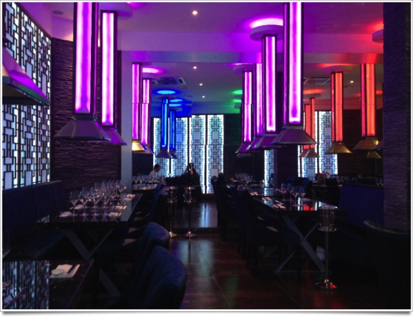
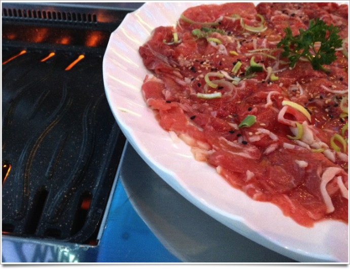
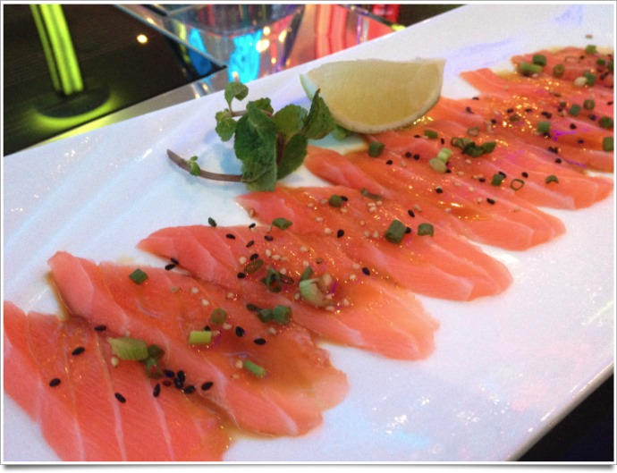

+++
type = "post"
titre = "Coréen Barbecue, Lyon"
title = "Coréen Barbecue, Lyon"
url = "/coreen-barbecue-lyon"
date = "2011-11-15T07:11:26"
Lastmod = "2012-05-09T12:29:59"
cover = "coreen-barbecue.jpg"
categorie = [ "À manger" ]
tag = [ "À manger", "Cuisine coréenne", "Rapide" ]

+++

Ouvert depuis deux semaines seulement, le <strong><a href="http://www.coreenbarbecue.com">Coréen Barbecue</a></strong> est situé à deux pas de la rue de la République, au cœur du Lyon commerçant. Un bon emplacement exploité à merveille par une devanture pour le moins flashy. Surfant sur l&rsquo;image que la Corée du Sud peut véhiculer, ce restaurant a choisi des couleurs fluo qui ne se ratent pas. Puisqu&rsquo;il s&rsquo;agit d&rsquo;un restaurant barbecue, chaque table est équipée d&rsquo;un foyer surmonté d&rsquo;une hotte. Ces hottes sont illuminées par des LED de différentes couleurs dans toute la salle. Ambiance pop, mais classe : les verres à pied et les fauteuils épais contrastent agréablement avec cette décoration plus légère. La salle est plutôt grande et si nous étions quasiment seuls ce soir là, l&rsquo;ambiance est certainement beaucoup plus bruyante les soirs de week-end.

Le concept du <strong>Coréen Barbecue</strong> est aussi simple que celui de <strong><a href="/2011/10/09/entrecote-lyon/">L&rsquo;entrecôte</a></strong>, et si l&rsquo;on oublie les frites, ce sont finalement deux restaurants assez proches. Dans l&rsquo;un comme dans l&rsquo;autre, on ne mange qu&rsquo;un seul plat : du bœuf. Dans ce restaurant coréen, on ne choisit pas la cuisson puisque ce sont les clients qui cuisent la viande. On choisit toutefois entre deux types de viandes de but différentes dont l&rsquo;une, légèrement plus coûteuse, est de meilleure qualité. Nous n&rsquo;avons pas eu le choix le soir où nous y sommes allés, il n&rsquo;y avait que la meilleure version… Une fois le type de viande choisi, on ouvre pour vous le barbecue incrusté dans la table, on allume ce barbecue électrique et on vous apporte la viande. Celle-ci est présentée sous la forme de tranches assez fines, mais suffisamment épaisses pour manger de la viande saignante si vous le souhaitez. Le bœuf est assaisonné, mais contrairement aux entrecôtes de <strong>L&rsquo;Entrecôte</strong>, la sauce est légère au <strong>Coréen Barbecue</strong>.

La viande est vraiment le clou du spectacle au <strong>Coréen Barbecue</strong> et elle est délicieuse. Très tendre, pas trop maigre et suffisamment épaisse pour ne pas faire du carpaccio. La cuisson effectuée par vos soins permet de moduler selon les goûts de chacun : je la préfère saignante, mais F l&rsquo;aime bien cuite, pas de problème. Le côté ludique est aussi agréable et on mange le grand plat de viande en un clin d&rsquo;œil… Pour accompagner le bœuf, il n&rsquo;y a donc pas de frites. Plusieurs formules sont proposées autour du bœuf avec une entrée et trois accompagnements à choisir en fonction des menus. Les entrées sont variées, on trouve les classiques (beignet de crevettes, quelques makis), mais aussi plusieurs tartares et même des macis au foie gras dans le menu le plus cher. Le saumon cru que j&rsquo;ai pris était classique, mais très bien réalisé, une bonne manière d&rsquo;attaquer le repas. Les accompagnements ne font pas dans l&rsquo;originalité non plus, on trouvera l&rsquo;éternelle soupe miso, du riz blanc, mais aussi le kimchi, spécialité coréenne à base de choux épicé. Le <strong>Coréen Barbecue</strong> propose également une carte des desserts assez resserrée et traditionnelle que nous n&rsquo;avons pas tentée.

Le <strong>Coréen Barbecue</strong> est une excellente adresse pour manger coréen à Lyon. Les prix restent modestes pour la prestation, entre 20 et 30 € par personne en fonction du menu, même s&rsquo;ils sont plus élevés que pour un restaurant japonais classique. Le côté barbecue que vous faites vous-même est très sympa, même si le choix de ne proposer que du bœuf peut constituer une limite : la viande est vraiment bonne, mais on aimerait d&rsquo;autres choix, comme du poisson, pour varier les plaisirs. <strong>Coréen Barbecue</strong> est en tout cas une très bonne adresse, à recommander !

