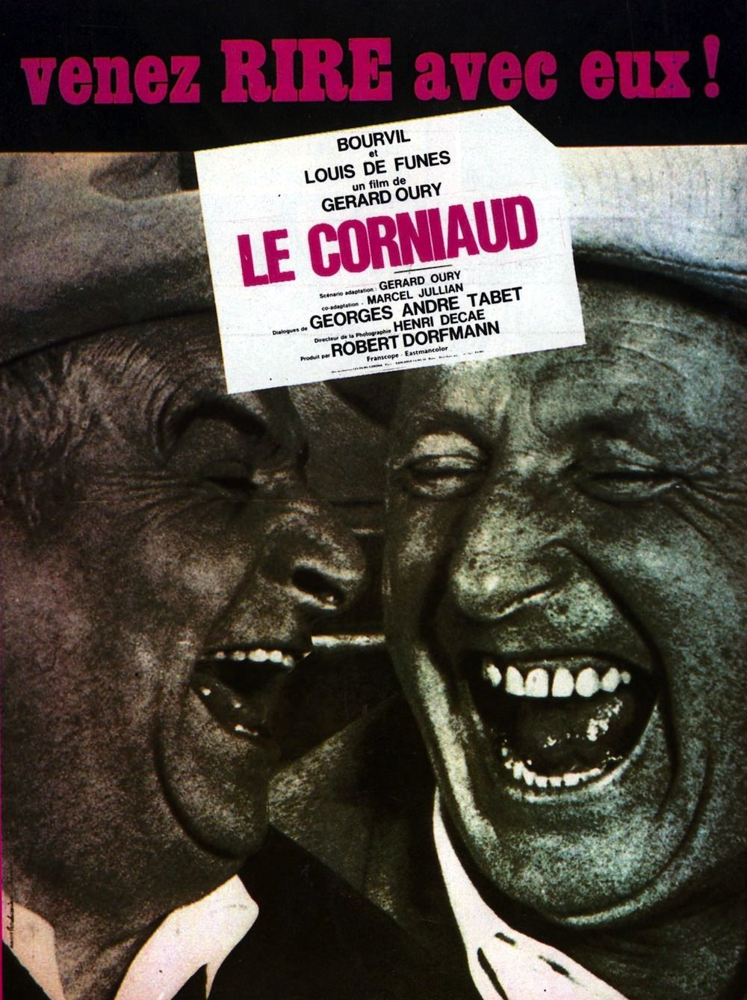
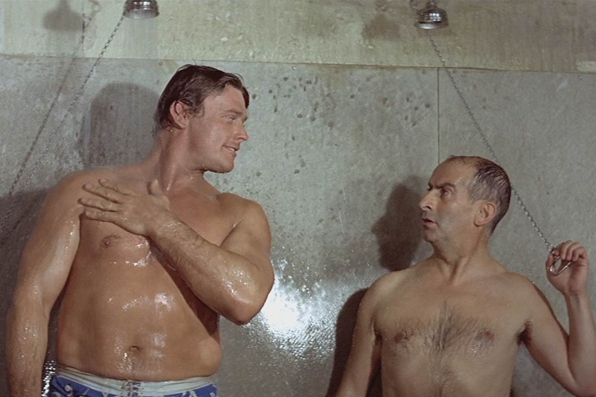

+++
type = "post"
titre = "<em>Le Corniaud</em>, Gérard Oury"
title = "Le Corniaud, Gérard Oury"
url = "/corniaud-oury"
date = "2013-04-08T10:46:18"
Lastmod = "2014-11-02T18:19:30"
cover = "le-corniaud-louis-de-funes-bourvil.jpg"
categorie = [ "À voir" ]
tag = [ "Comédie", "Culte", "Humour", "Mafia", "Road-movie" ]
createur = [ "Gérard Oury" ]
acteur = [ "Bourvil", "Louis de Funès" ]
annee = [ "1965" ]
weight = 1965
pays = [ "France" ]

+++

Quand <em>Le Corniaud</em> sort dans les salles françaises, Bourvil et Louis de Funès sont tous deux des acteurs connus et reconnus, mais pas encore Gérard Oury. Le cinéaste qui a signé quelques-unes des plus grandes comédies françaises n’a jamais travaillé avec les deux stars, mais ce road-movie comique est l’occasion de mettre au point un duo humoristique qui fonctionne parfaitement. <em>Le Corniaud</em> écrase la concurrence en 1965 et la comédie fonctionne plutôt bien, avec ce film qui a assez bien vieilli, même s&rsquo;il n&rsquo;a pas encore atteint le niveau de ses successeurs.

<blockquote class="pull-quote">
Ah ben maintenant, elle va marcher beaucoup moins bien, forcément.<cite class="author"> — Bourvil, Le Corniaud</cite>

</blockquote>

La scène la <a href="http://www.youtube.com/watch?v=1q00jiJrDqY">plus connue</a> ouvre <em>Le Corniaud</em>. Antoine Maréchal part en vacances dans sa 2CV, mais sa voiture est frappée par celle de Saroyan alors qu’il venait de partir. L’accident apparemment bénin détruit totalement le véhicule et pris par le remord, Saroyan lui propose en échange d’aller en Italie chercher une autre voiture pour lui. Le commerçant un peu naïf accepte, sans savoir qu’il a affaire à un trafiquant de drogue qui veut l’utiliser pour passer la frontière avec non seulement de la drogue, mais aussi de l’or caché dans les pare-chocs de la Cadillac qu’il doit ramener, et même des diamants dissimulés sous la batterie du véhicule. Gérard Oury construit son film sur cette idée un peu étrange et sur l’opposition de deux personnages. Interprété par Bourvil, Antoine est un gars sympa, mais naïf, que tous les personnages utilisent comme et quand ça les arrange. Face à lui, Louis de Funès reprend son éternel comique fait de mauvaise foi et d’obséquiosité pour composer un Saroyan aussi désagréable et manipulateur qu’Antoine pouvait être sympa. Ce duo que tout oppose n’est pas très original et on le retrouvera dès l’année suivante dans <em>La Grande Vadrouille</em>, mais force est de constater qu’il fonctionne très bien. Bourvil joue merveilleusement bien le provincial naïf, le français moyen de l’époque aux plaisirs simples, tandis que Louis De Funès excelle comme toujours dans son éternel rôle de composition. Certes, c’est toujours la même chose, mais <em>Le Corniaud</em> ne tombe pas dans les travers caricaturaux de certains de ses films et Gérard Oury trouve un équilibre intéressant entre les deux personnages.

Véritable road-movie comique, <em>Le Corniaud</em> nous entraîne de Naples à Bordeaux, en passant par Rome, Pise, Menton ou encore Carcassonne. Tout au long du périple, comme le genre le veut, Gérard Oury mène la vie dure à ses deux personnages, enfin surtout à Saroyan qui suit tant bien que mal sa voiture à distance. On comprend vite que le principal ressort comique du film tient à l’ignorance d’Antoine quant au chargement de sa voiture. Dès le départ de Naples, il abime le pare-chocs avant et confie la Cadillac à un garagiste peu scrupuleux qui découvre l’or et remplace intégralement la pièce par une autre, prélevée dans la rue. Le spectateur a une longueur d’avance sur Antoine, puisqu’il sait exactement ce qui est caché et à quel endroit du véhicule, mais aussi sur Saroyan puisqu’il ne voit pas que toutes ses richesses sont retirées les unes après les autres de la voiture. C’est un procédé comique classique, mais qui fait mouche et <em>Le Corniaud</em> s’avère très drôle, même s’il faut noter une très nette baisse de régime à la fin du film, quand Antoine finit par comprendre qu’on l’a utilisé. Qu’importe, les courses-poursuites qui n’en sont pas entre la Cadillac et la voiture de Saroyan ont déjà fait rire, tandis que les amateurs des pitreries de Louis de Funès en auront pour leur compte, à l’image de cette hilarante scène de douche. Le scénario écrit par Gérard Oury permet à l’aventure d’avancer rapidement et on ne s’ennuie pas, tandis que les moyens étonnamment importants pour une comédie de l’époque garantissent au long-métrage une excellente qualité technique. Nonobstant des scènes de nuit tournées de façon visible en plein jour, l’image est colorée et l’absence de plans de voiture tournés en studio contribue à cette impression de réalisme.

Devenu culte, comme tant de films avec Louis de Funès et Bourvil, <em>Le Corniaud</em> reste encore aujourd’hui une comédie très efficace et drôle. Gérard Oury n’a pas encore trouvé comment exploiter au maximum ses deux acteurs comiques, mais cette première collaboration s’avère fructueuse et ce n’est pas pour rien que <em>Le Corniaud</em> devient le plus grand succès au cinéma en 1965 et qu’il reste régulièrement diffusé à la télé. Un classique, à voir et à revoir sans modération.

<h3>Vous voulez <a href="http://voiretmanger.fr/soutien/">m&rsquo;aider</a> ?</h3>
<ul>
<li><a href="http://www.amazon.fr/gp/product/B002CXG7LO/ref=as_li_ss_tl?ie=UTF8&amp;tag=leblogdenic07-21&amp;linkCode=as2&amp;camp=1642&amp;creative=19458&amp;creativeASIN=B002CXG7LO">Acheter le film en Blu-ray sur Amazon</a></li>
<li><a href="http://www.amazon.fr/gp/product/B0000CARHK/ref=as_li_ss_tl?ie=UTF8&amp;tag=leblogdenic07-21&amp;linkCode=as2&amp;camp=1642&amp;creative=19458&amp;creativeASIN=B0000CARHK">Acheter le film en DVD sur Amazon</a></li>
<li><a href="https://itunes.apple.com/fr/movie/le-corniaud/id592918042">Acheter ou louer le film sur l&rsquo;iTunes Store</a></li>
</ul>

