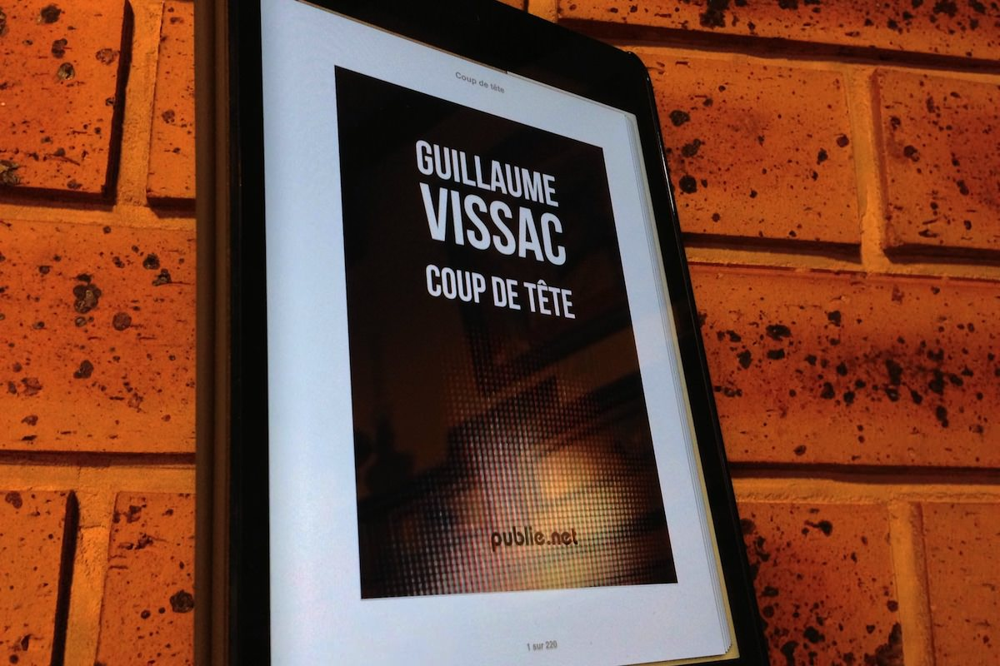
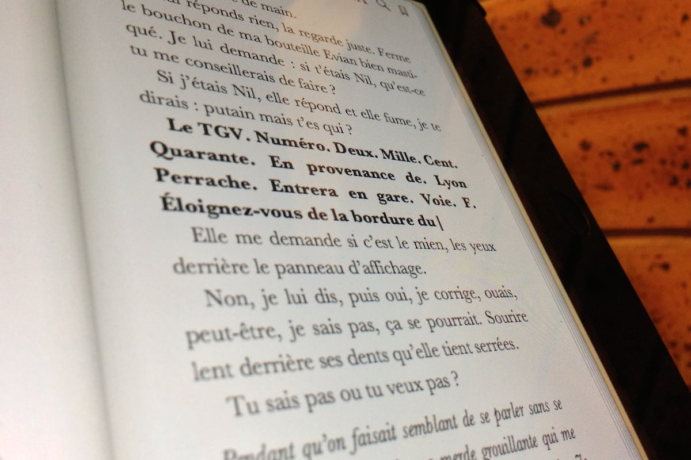
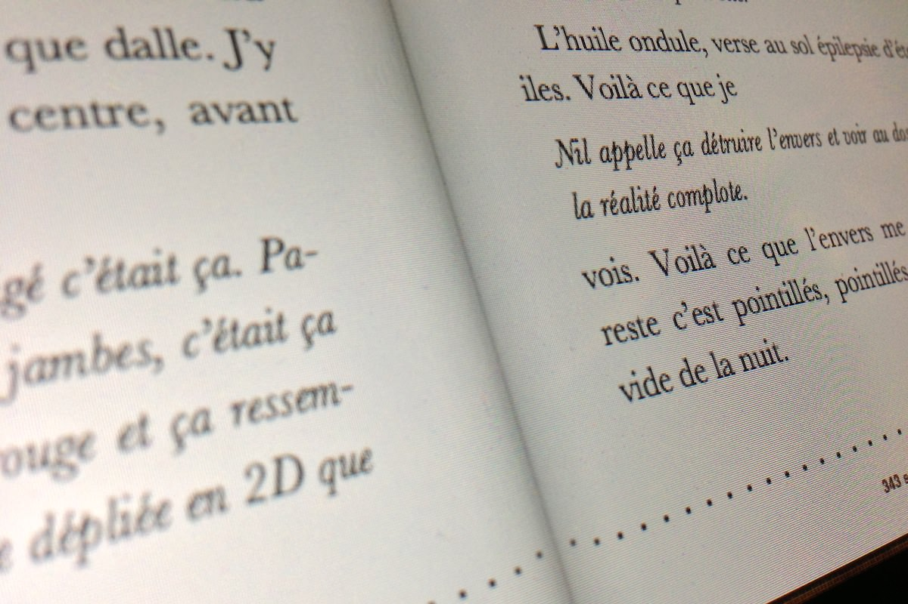

+++
titre = "Coup de tête, Guillaume Vissac"
title = "Coup de tête, Guillaume Vissac"
url = "/coup-de-tete-vissac"
date = "2013-03-18T18:22:27"
Lastmod = "2013-03-18T22:31:45"
cover = "guillaume-vissac-coup-tete.jpg"
categorie = [ "À lire" ]
tag = [ "Adolescence", "Drame", "Road-movie", "Roman", "Société", "Violence" ]
createur = [ "Guillaume Vissac" ]
annee = [ "2013" ]
weight = 2013
pays = [ "France" ]

+++

<blockquote class="pull-quote">
Pas évident d’éventrer le film plastique par-dessus le paquet de mini-madeleines uniquement avec le pouce. Arjeen Manguel me regarde faire sans rien dire. Tant mieux. Je sens sa clope sur ma nuque qui s’accroche. Puis mes doigts glissent par-dessus, mes doigts tremblent. Même coincée entre mon coude et ma cuisse, je pense, cette saloperie veut pas| 
Puis le plastique crève et mes doigts s’enfoncent crades dans l’une des madeleines. Tant mieux, tant pis, je sais pas, je m’en fous. J’ai de la chair jaune autour du pouce, ma langue salive, ma gorge se serre.<cite class="author"> — Guillaume Vissac, Coup de tête, J+?</cite>

</blockquote>

De madeleine, il en est question dans <em>Coup de tête</em>, mais ce n’est pas celle de Proust, trempée dans le thé autour d’une table et d’un service que l’on imagine luxueux. Les mini-madeleines de Guillaume Vissac sont achetées dans le distributeur d’une gare par son narrateur, un adolescent dans la rue depuis plusieurs jours. Ce roman, c’est l’histoire du narrateur qui, sur un coup de tête, quitte l’appartement familial et part déambuler un peu au hasard. Au fil du récit, il s’enfonce toujours plus dans la crasse et le mal-être, toujours plus loin des hommes. Inexorablement, il s’éloigne dans ce roman d’une vie &laquo;&nbsp;normale&nbsp;&raquo;, de la civilisation en quelque sorte. Une plongée en enfer que Guillaume Vissac explore avec une maturité qui surprend quand on sait que l’auteur n’a même pas 30 ans. <em>Coup de tête</em> n’est pas une lecture facile, encore moins agréable, mais c’est un roman coup de poing prenant et très réussi dans le genre. 

Le prologue restera longtemps mystérieux. <em>Coup de tête</em> commence à une piscine où le narrateur et tous les personnages du roman sont rassemblés. On ne comprend pas tout, mais qu’importe : Guillaume Vissac reprend au point de départ de son récit, quand son narrateur décide de partir dans la rue et de vivre comme un SDF, d’en devenir un en fait. Ses motivations ne sont pas vraiment connues, même si elles tournent autour d’un évènement qui a eu lieu deux ans auparavant. Un accident lié à un acte criminel : le narrateur met le feu à une &laquo;&nbsp;BM&nbsp;&raquo;, une voiture arrosée d’essence par un ami et allumée par celui qui dit je. Le feu ne l’épargne pas et emporte sa main droite, celle qui tient le briquet : <em>Coup de tête</em> est ainsi d’abord le récit d’un homme qui cherche à retrouver sa main droite et qui cherche à la retrouver. « <em>On me tend la main droite. Je lui tends la main gauche.</em> » Dans tout le roman, cette absence nous est rappelée en permanence, un leitmotiv fondateur, à l’origine de la fuite et du coup de tête du titre, même si Guillaume Vissac ne le dit jamais ainsi. Ce narrateur aimerait tant retrouver son membre manquant, mais son départ semble motiver par un désir difficile à définir. Est-ce l’envie de se mettre en danger et de rompre avec une vie trop facile ? Est-ce une forme de suicide ? Ou alors de l’inconscience ? <em>Coup de tête</em> ne le dit jamais et le roman impose dans son ensemble de se laisser porter, d’accepter de ne pas tout maîtriser et de voir venir. Il est souvent déstabilisant, surtout quand la fin approche, mais c’est totalement volontaire bien sûr. L’auteur prône l’économie de moyens et en dit beaucoup avec peu de mots, obligeant à une lecture attentive. S’il est un point sur lequel <em>Coup de tête</em> est généreux, c’est sur la description de la descente aux enfers de son narrateur. Guillaume Vissac décrit avec une précision qui peut par moment mettre mal à l’aise le quotidien d’un jeune SDF, ou plutôt sa survie au jour le jour. La séquence de la madeleine, dans une gare, est assez éprouvante, tant on sait par le détail les effets du manque de sommeil et surtout de la faim sur le narrateur. Chaque bouchée est immédiatement rejetée par son corps devenu si faible, si rapidement, et ce n’est encore que le début. Par la suite, il tombe à la limite de la folie, suit un « <em>type aux cheveux bleus</em> » qui n’est pas un être fantastique sorti d’un film de Miyazaki, mais qui garde son mystère quant à ses relations avec lui. 

<em>Coup de tête</em> décrit en fait extrêmement bien la perte de soi et surtout la perte de la société. Au fur et à mesure que le narrateur passe du temps dans la rue, il s’enfonce dans un univers où l’homme n’est plus un être sociable, mais un animal qui ne cherche qu’à survivre et qui peut devenir très violent. La majeure partie du roman de Guillaume Vissac est découpée en chapitres numérotés à partir du jour J, jusqu’au « <em>J+40</em> » qui précède une conclusion remplie uniquement de pointillés. Une manière de figurer le vide qui a envahi le narrateur, dans ce récit qui ose jouer des typographies et des effets de style. Le romancier a cherché à recréer une langue adolescente avec un style très marqué par l’oralité et des dialogues qui sont au contraire mêlés au reste et qui ont perdu toutes leurs marques. En plus du récit à la première personne mené par ce narrateur dont on ne sait finalement rien, même pas son nom, <em>Coup de tête</em> est composé d’un dialogue virtuel entre le narrateur et « Ajay », un personnage qui n’est jamais identifié, ou entre lui et « Nil », un autre SDF qui joue un rôle important dans le récit. Pour mieux créer une ambiance, Guillaume Vissac peut aussi faire appel à l’ambiance sonore, comme cette partie à la gare où l’on entend par des paragraphes en gras les annonces de la SNCF. L’effet de style le plus marqué toutefois, c’est l’omniprésente des « | » qui ponctuent et souvent interrompent les phrases. Comme des murs infranchissables, ces barres interrompent le récit, coupent les phrases en plein milieu, voire bloquent un mot. Elles constituent un symbole fort, une marque de fabrique dans cette écriture qui manque souvent de fluidité — volontairement bien sûr. <em>Coup de tête</em> alterne entre le récit et les dialogues avec Ajay, le premier a parfois un rapport avec le second, mais ce n’est pas systématique et il arrive que l’on suive les deux éléments en parallèle. Là encore, Guillaume Vissac nous force à une lecture attentive, mais une lecture qui sait aussi se laisser porter et qui accepte une part de flottement. 

Pour un premier roman, Guillaume Vissac n’a pas choisi la facilité avec ce récit parfois à la limite de l’insoutenable. <em>Coup de tête</em> raconte l’histoire d’un SDF et de ses difficultés, celle d’un adolescent qui s’enfonce de plus en plus dans son propre monde loin de celui des hommes, celle aussi d’un homme qui a perdu sa main droite et qui ne sait comment vivre sans. Un roman complexe par son style haché et protéiforme qui oblige à une lecture attentive, mais un premier roman extrêmement prometteur et parfaitement maîtrisé. Guillaume Vissac est indéniablement un jeune écrivain à ne pas perdre de vue…

<h3>Vous voulez m&rsquo;aider ?<a href="#footnote_0_8853" id="identifier_0_8853" class="footnote-link footnote-identifier-link" title="&Agrave; propos de la publicit&eacute;&hellip;">1</a></h3>
<ul>
<li><a href="http://www.amazon.fr/gp/product/B00BTFLSSS/ref=as_li_ss_tl?ie=UTF8&#038;tag=leblogdenic07-21&#038;linkCode=as2&#038;camp=1642&#038;creative=19458&#038;creativeASIN=B00BTFLSSS">Acheter le livre au format Kindle sur Amazon</a></li>
<li><a href="http://www.amazon.fr/gp/product/B00BTFLSSS/ref=as_li_ss_tl?ie=UTF8&#038;tag=leblogdenic07-21&#038;linkCode=as2&#038;camp=1642&#038;creative=19458&#038;creativeASIN=B00BTFLSSS">Acheter le livre sur l&rsquo;isBookstore</a></li>
<li><a href="http://www.publie.net/fr/ebook/9782814596467/coup-de-tete">Acheter le livre sur le site de l&rsquo;éditeur (ePub)</a></li>
</ul>

<ol class="footnotes"><li id="footnote_0_8853" class="footnote"><a href="http://voiretmanger.fr/soutien/">À propos de la publicité…</a> [<a href="#identifier_0_8853" class="footnote-link footnote-back-link">&#8617;</a>]</li></ol>
