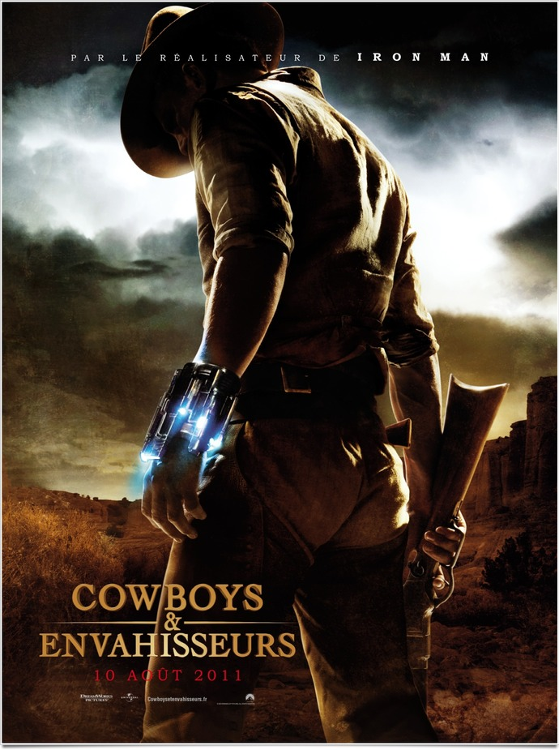
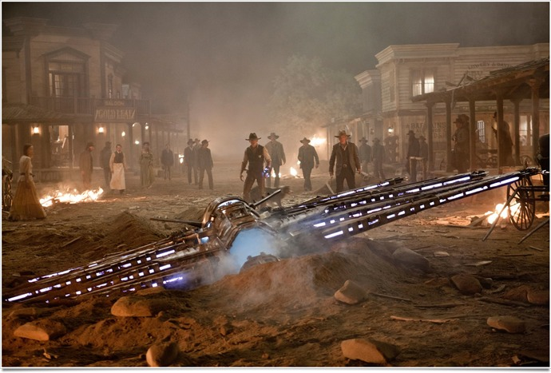

+++
type = "post"
titre = "<em>Cowboys & envahisseurs</em>, Jon Favreau"
title = "Cowboys & envahisseurs, Jon Favreau"
url = "/cowboys-envahisseurs-favreau"
date = "2011-08-24T00:27:00"
Lastmod = "2015-03-22T00:21:25"
cover = "cowboys-envahisseurs-craig.jpg"
categorie = [ "À voir" ]
tag = [ "Action", "Comics", "Mélange", "Science-Fiction", "Vite oublié", "Western" ]
createur = [ "Jon Favreau" ]
acteur = [ "Daniel Craig", "Harrison Ford" ]
annee = [ "2011" ]
weight = 2011
pays = [ "États-Unis" ]

+++

Réunir dans un même film un western et la science-fiction. L&rsquo;idée tient du pari absurde, ou du rêve de gosse, c&rsquo;est selon. Comme son titre l&rsquo;indique bien, <em>Cowboys &amp; envahisseurs</em> rassemble deux genres que tout sépare normalement. Partant de l&rsquo;idée pas si absurde que les extraterrestres n&rsquo;ont pas attendu le XXe siècle pour venir nous visiter, le film de Jon Favreau constitue ni un excellent western, ni un très bon film de science-fiction, mais un divertissement plaisant et vite oublié. Parfait en attendant la rentrée…

<em>Cowboys &amp; envahisseurs</em> ouvre dans les plaines du Far West, à la fin du XIXe siècle. Un espace ouvert et aride, plein de vachers prompt à dégainer leur colt. Un homme ouvre les yeux, il est blessé et ne sait manifestement pas comment il a atterrit là où il se trouve. Comme on le comprend vite, il ne se souvient de rien, pas même de son nom, mais il n&rsquo;est pas du genre à se laisser faire par une bande de voyous et il s&rsquo;avère un combattant hors pair. Il finit par arriver dans la ville voisine où il est rapidement identifié comme un dangereux criminel à arrêter. Son arrestation arrive d&rsquo;ailleurs rapidement, mais alors qu&rsquo;il doit être emmené dans une autre ville pour être jugé, des soucoupes volantes attaquent le petit bourg et emportent une partie des habitants. Les envahisseurs obligent tous les habitants de ces vastes plaines, malfrats et propriétaires terriens, blancs et indiens, à s&rsquo;allier pour se battre. Le combat sera rude, d&rsquo;autant que l&rsquo;enjeu est à la hauteur : les extraterrestres sont venus… chercher de l&rsquo;or.

Dès les premières images de <em>Cowboys &amp; envahisseurs</em>, le mélange des genres est sensible. Le film commence comme un western, avec des plans larges sur le désert du Far West et des plans serrés sur le visage buriné du cowboy. Ce cowboy a néanmoins à son poignet un bracelet étrange qui semble d&rsquo;emblée anachronique. Plus tard, tout un troupeau de vaches est mystérieusement carbonisé : on ne sait pas encore pourquoi, mais la présence de l&rsquo;envahisseur se fait toujours plus présente au sein du western. La séquence de la première attaque extraterrestre est elle aussi un savant entre-deux : la scène commence comme une scène de western, avec le shérif qui tente d&rsquo;arrêter deux hors-la-loi et le père, riche propriétaire terrien, qui entend faire sa propre loi. Alors que le duel semble inéluctable, l&rsquo;attaque prend tout le monde par surprise et annule brusquement tous les codes du western. <em>Cowboys &amp; envahisseurs</em> tend alors plus vers la science-fiction, même si le western reste en permanence présent. Les Indiens entrent en action à un moment du film, tandis que les extraterrestres rassemblent toutes les caractéristiques des créatures vues dans d&rsquo;autres films : on pense à <em>Alien</em> bien sûr, mais aussi à <em>Predators</em>, entre autres. Le film de Jon Favreau apparaît comme un western proche de la caricature (tout y est, les chapeaux, les armes, les plans rapprochés sur les visages, la prostituée, le hors-la-loi, le prêtre…) et comme un film de science-fiction extrêmement classique où l&rsquo;homme affronte de sales bestioles nocives venues de l&rsquo;autre bout de l&rsquo;univers.

Sur le papier, le mélange des deux genres est une idée gonflée qui paraît très séduisante. <em>Cowboys &amp; envahisseurs</em> mérite notre intérêt, à défaut peut-être de notre admiration, pour avoir su mener à bien cette idée originale, même si l&rsquo;idée n&rsquo;est pas si originale étant donné qu&rsquo;elle provient d&rsquo;un comics. On sera plus facilement prompt à pardonner les défauts du film de Jon Favreau, mais il faut bien avouer que l&rsquo;idée s&rsquo;avère meilleure sur le papier que sur la bobine. <em>Cowboys &amp; envahisseurs</em> n&rsquo;exploite pas autant que l&rsquo;on aurait aimé la confrontation des genres et le film donne parfois le sentiment de juxtaposer western et science-fiction, sans vraiment en faire quelque chose. Le film est d&rsquo;ailleurs inégal : le western teinté d&rsquo;un certain mystère qui compose le début du film s&rsquo;avère la partie la plus réussie. On ne sait pas bien encore de quoi il retourne au juste, mais les disparitions mystérieuses, les flash de lumière non identifiés… constituent une ambiance étrange et bien vue. Le début de la quête est également un bon moment dans le film, elle a un côté post-apocalytpique qui atteint son apogée avec le bateau renversé. La fin du film s&rsquo;avère malheureusement beaucoup plus faible : le scénario enchaîne les idées moyennes (le coup de la femme elle aussi extraterrestre et venue sauver les hommes n&rsquo;est pas très crédible) et le film tourne surtout à l&rsquo;affrontement total qui manque cruellement d&rsquo;originalité. Certes, la chevauchée des indiens et des blancs attaqués par les vaisseaux aliens est une relecture efficace d&rsquo;un cliché du western, mais l&rsquo;ensemble paraît vu et revu. <em>Cowboys &amp; envahisseurs</em> n&rsquo;est jamais déplaisant, il se regarde avec plaisir et reste assez fun, mais le film aurait pu être beaucoup plus original et fort… Il n&rsquo;est à la place qu&rsquo;un blockbuster estival aussi efficace que vite oublié.

Jon Favreau n&rsquo;est pas un esthéticien, mais son travail est ici est efficace. Le cinéaste se permet de jouer sur les filtres, abusant même parfois d&rsquo;eux pour quelques flashbacks qui s&rsquo;avèrent un peu trop pesants. La reconstitution de l&rsquo;univers du western dans <em>Cowboys &amp; envahisseurs</em> ressemble assez dans l&rsquo;esprit à celle de la série <em><a href="/2010/05/10/deadwood-hbo/">Deadwood</a></em>. C&rsquo;est ainsi une vision réaliste, loin des clichés bien propres de certains films du genre. Le film est peut-être moins à l&rsquo;aise côté science-fiction, même si les effets spéciaux sont réussis. Les extraterrestres ne sont pas très originaux, mais les amateurs de bestioles gluantes pleines de parties visqueuses sorties de divers orifices seront aux anges. Les acteurs en chair et en os ne sont pas en reste : Daniel Craig est excellent en Lucky Luke bad boy tandis que Harrison Ford est assez surprenant en propriétaire terrien.

Film construit d&rsquo;abord sur une excellente idée sur le papier, <em>Cowboys &amp; envahisseurs</em> s&rsquo;avère finalement moins jouissif qu&rsquo;espéré. Le film reste un blockbuster plutôt fun, parfait pour bien finir l&rsquo;été, mais c&rsquo;est aussi un blockbuster oublié sitôt le pas de la porte passé. Dommage, Jon Favreau aurait pu en tirer plus… Peut-être que l&rsquo;on ne peut pas réaliser d&rsquo;excellent film en mélangeant deux genres aussi différents ? Cette conclusion serait bien déprimante…

<h3>Vous voulez m&rsquo;aider ?</h3>
<ul>
<li><a href="http://www.amazon.fr/gp/product/B005HUBDKO/ref=as_li_ss_tl?ie=UTF8&tag=leblogdenic07-21&linkCode=as2&camp=1642&creative=19458&creativeASIN=B005HUBDKO">Acheter le film en Blu-Ray sur Amazon</a></li>
<li><a href="http://www.amazon.fr/gp/product/B005HUBCOQ/ref=as_li_ss_tl?ie=UTF8&tag=leblogdenic07-21&linkCode=as2&camp=1642&creative=19458&creativeASIN=B005HUBCOQ">Acheter le film en DVD sur Amazon</a></li>
</ul>

