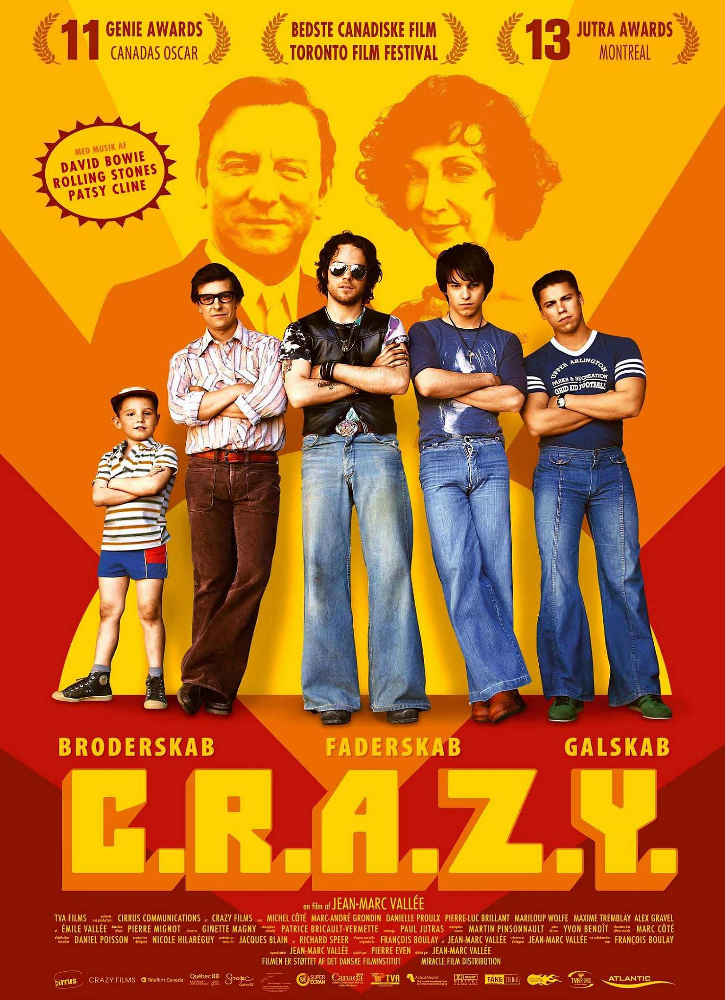
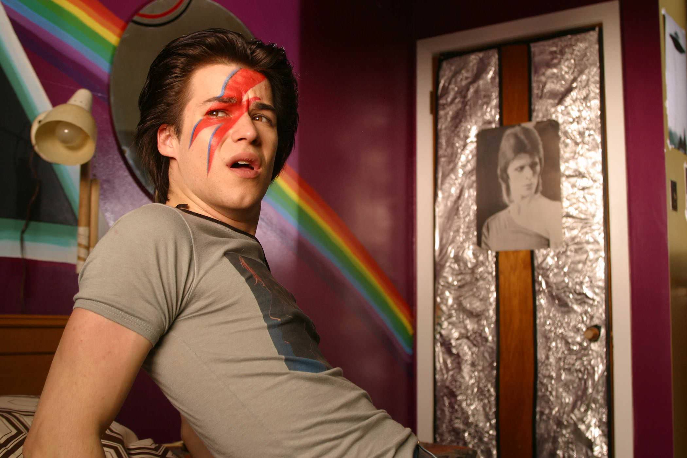
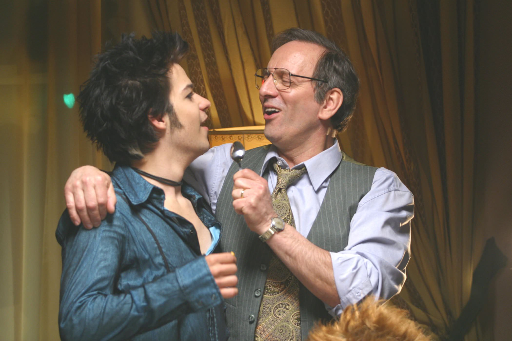

+++
type = "post"
titre = "<em>C.R.A.Z.Y.</em>, Jean-Marc Vallée"
title = "C.R.A.Z.Y., Jean-Marc Vallée"
url = "/crazy-vallee"
date = "2014-12-08T07:55:37"
Lastmod = "2014-12-08T08:02:06"
cover = "c.r.a.z.y.-jean-marc-vallee.jpg"
categorie = [ "À voir" ]
tag = [ "Adolescence", "Amour", "Coming-out", "Drame", "Enfance", "Famille", "Homosexualité", "Humour", "Religion", "Sexe" ]
createur = [ "Jean-Marc Vallée" ]
acteur = [ "Alex Gravel", "Danielle Proulx", "Émile Vallée", "Marc-André Grondin", "Maxime Tremblay", "Michel Côté", "Pierre-Luc Brillant" ]
annee = [ "2005" ]
weight = 2005
pays = [ "Canada" ]

+++

En 2005, Jean-Marc Vallée a déjà réalisé quelques films, mais qui n&rsquo;ont pas vraiment eu l&rsquo;occasion de sortir des frontières canadiennes. Avec ce projet qui a nécessite dix ans de travail, il connaît la consécration au Canada et dans le monde entier. Il faut dire que <em>C.R.A.Z.Y.</em> mérite toute l&rsquo;attention qu&rsquo;il a obtenu : en racontant l&rsquo;histoire de Zac, quatrième d&rsquo;une famille de cinq garçons dans les années 1970 et 1980, le réalisateur n&rsquo;a pas réussi seulement à toucher la fibre nostalgique de ceux qui ont connu cette époque. Au travers de la difficile acceptation de son homosexualité, l&rsquo;histoire de Zachary touche au-delà du contexte. <em>C.R.A.Z.Y.</em> est tantôt drôle, tantôt émouvant, toujours parfaitement juste. Une belle réussite, à (re)voir !

Jean-Marc Vallée ne donne pas la clé pour déchiffrer le titre de son film avant la toute fin<a href="#fn-12542-1" rel="footnote">1</a>, mais on n&rsquo;a pas besoin d&rsquo;aide pour comprendre que la famille Beaulieu est un peu folle. Les Beaulieu appartiennent à la classe moyenne et ils sont aussi très croyants, du moins c&rsquo;est le cas de la mère de famille. Son mari n&rsquo;ayant rien contre les affaires de la vie, sa femme est souvent enceinte et <em>C.R.A.Z.Y.</em> commence d&rsquo;ailleurs avec une quatrième grossesse. Après trois garçons, le couple attendait probablement une fille, mais c&rsquo;est un garçon qui s&rsquo;ajoute à la famille. Dès le départ, Zachary (dit Zac) commence sur un mauvais pied : après l&rsquo;accouchement, il faut longtemps pour qu&rsquo;il commence à respirer et quand ses frères arrivent, ils le font tomber par accident. Est-ce pour cela qu&rsquo;il est « différent » ? Toujours est-il que, petit garçon, il ne fait rien comme ses frères et préférerait une poussette plutôt qu&rsquo;un jeu de hockey qui plait surtout à son père. Le scénario montre l&rsquo;enfance assez difficile de ce garçon refermé qui a du mal à s&rsquo;imposer vis-à-vis de ses grands frères aux personnalités marquées. Quand un cinquième enfant arrive chez les Beaulieu, un garçon encore, Zac est le seul à pouvoir le calmer et il s&rsquo;en occupe comme sa mère. D&rsquo;ailleurs, un jour, son père le prend par surprise en train de jouer avec son petit frère, dans les habits de sa mère. <em>C.R.A.Z.Y.</em> enchaîne ainsi les étapes traditionnelles du garçon qui finit par préférer les autres garçons, mais même si le film semble un peu caricatural une fois résumé ainsi, il n&rsquo;en est rien dans les faits. En effet, Jean-Marc Vallée développe une situation plus compliquée, puisque Zac lui-même refuse son homosexualité pendant la majorité de son enfance, puis de son adolescence. Élevé dans une ambiance religieuse, il prie autant qu&rsquo;il peut pour aimer les filles plutôt que les garçons et il sort même pendant très longtemps avec une voisine.

Au fond, <em>C.R.A.Z.Y.</em> est le récit d&rsquo;un coming-out, mais pas tant pour les autres, que pour son personnage principal. Zachary est gay, mais il ne l&rsquo;accepte pas lui-même et refuse longtemps sa sexualité. Jean-Marc Vallée montre bien comment son milieu familial a joué sur ce rejet de ce qu&rsquo;il est : son père, en particulier, est ouvertement homophobe et ne semble rien détester de plus que l&rsquo;homosexualité. Il n&rsquo;hésite pas à engueuler son fils quand il a des comportements qu&rsquo;il juge déviants et, comme souvent, il prend les choses de manière très personnelle. Lui, Gervais Beaulieu, ne pourrait pas avoir mis au monde un gay, c&rsquo;est impensable. Dans la construction de son identité, son fils est logiquement perturbé par ce père bloqué sur ces questions, mais il peut compter sur une mère qui lui pardonne toujours tout et qui semble mieux le comprendre. Encore une fois, on pourrait dire qu&rsquo;il s&rsquo;agit d&rsquo;une caricature, mais <em>C.R.A.Z.Y.</em> est si bien écrit que le film ne donne jamais le sentiment d&rsquo;être caricatural, au contraire. Il faut dire qu&rsquo;il peut compter sur des acteurs vraiment excellents, et en premier lieu sur Marc-André Gondrin. Le jeune acteur est épatant pour incarner Zac avec beaucoup de subtilités et une belle finesse de jeu. Son père, incarné par Michel Côté, est lui aussi très réussi, entre fermeté et tendresse malgré tout pour son fils. Grâce à eux, le film est toujours touchant, même dans les moments les plus durs. Au-delà des histoires personnelles, Jean-Marc Vallée restaure aussi toute une époque et son long-métrage est un bel hommage aux années 1970. L&rsquo;affiche met en avant la musique de Pink Floyd et de David Bowie, que Zac écoute souvent en boucle, mais ce n&rsquo;est pas gratuit. La bande-originale est vraiment excellente (mais malheureusement jamais vendue sous la forme d&rsquo;un album) et elle est parfaitement utilisée pendant tout le film. C&rsquo;est un vrai bonheur et la musique justifie probablement à elle seule de regarder <em>C.R.A.Z.Y.</em> !

<em>C.R.A.Z.Y.</em> trouve le ton juste et c&rsquo;est ce qui explique la réussite du film. Son sujet n&rsquo;est pas très original, son traitement non plus, mais qu&rsquo;importe : Jean-Marc Vallée parvient à dessiner des personnages crédibles et on en vient à oublier cette famille particulière et son contexte. Porté par des acteurs convaincants et une bande-son qui mérite à elle seule le détour, le long-métrage est une vraie réussite ! Même si le sujet ne vous intéresse pas <em>a priori</em>, ne passez pas à côté de <em>C.R.A.Z.Y.</em>, vous le regretteriez…

<h3>Vous voulez <a href="/soutien/">m&rsquo;aider</a> ?</h3>
<ul>
<li><a href="http://www.amazon.fr/gp/product/B001AZ5IW4/ref=as_li_ss_tl?ie=UTF8&amp;tag=leblogdenic07-21&amp;linkCode=as2&amp;camp=1642&amp;creative=19458&amp;creativeASIN=B001AZ5IW4">Acheter le film en Blu-ray sur Amazon</a></li>
<li><a href="http://www.amazon.fr/gp/product/B000ICMFWG/ref=as_li_ss_tl?ie=UTF8&amp;tag=leblogdenic07-21&amp;linkCode=as2&amp;camp=1642&amp;creative=19458&amp;creativeASIN=B000ICMFWG">Acheter le film en DVD sur Amazon</a></li>
<li><a href="http://www.netflix.com/WiMovie/70051094">Regarder le film sur Netflix</a></li>
</ul>

<ol>
<li id="fn-12542-1">
Le titre est en fait composé de l&rsquo;initiale des prénoms des cinq garçons.&#160;<a href="#fnref-12542-1" rev="footnote">&#8617;</a>
</li>
</ol>

