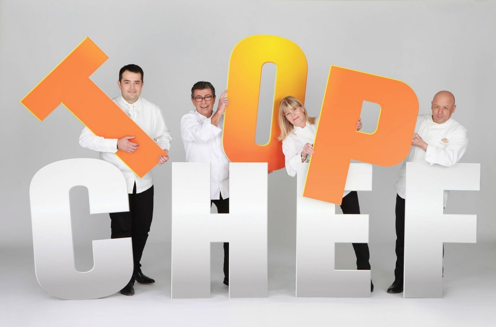
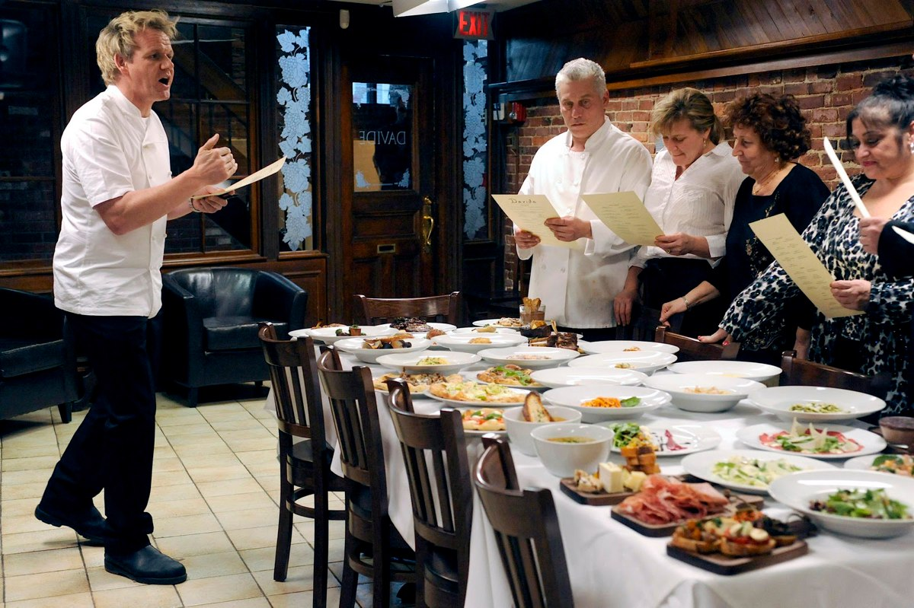
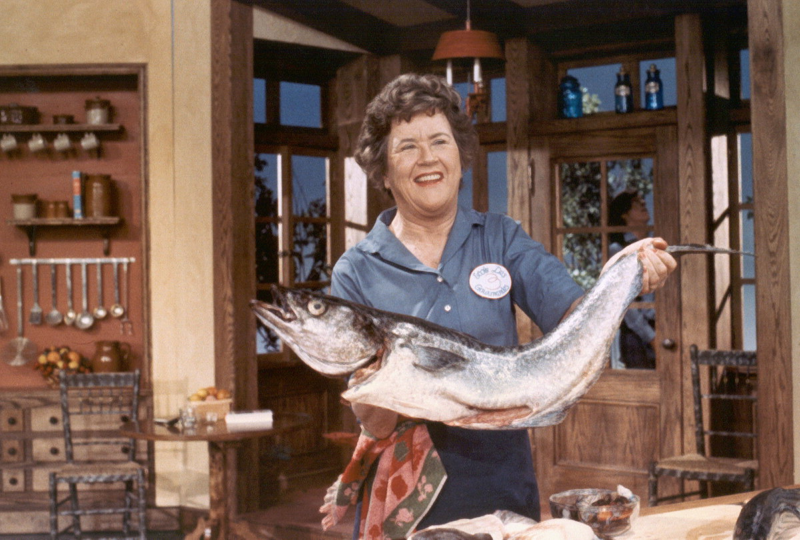

+++
titre = "La cuisine à la télévision"
title = "La cuisine à la télévision"
url = "/cuisine-television"
date = "2012-03-28T09:03:50"
Lastmod = "2013-09-08T00:29:15"
cover = "cuisine-television.jpg"
categorie = [ "À voir" ]
tag = [ "Concours", "Cuisine", "Émission", "Télévision" ]
pays = [ "France" ]

+++

La cuisine à la télévision s&rsquo;est longtemps résumée à cela :

<iframe class="aligncenter" width="512" height="384"	frameborder="0" marginheight ="0" marginwidth="0" scrolling ="no" src="0" ></iframe>

Depuis plusieurs années, des émissions de cuisine d&rsquo;un nouveau genre ont fait leur apparition sur le petit écran. Inspirées par la télé-réalité apparue sur les télévisions françaises avec les années 2000, elles célèbrent souvent un meilleur cuisinier désigné par un jury, mais on la retrouve également dans d&rsquo;autres émissions, consacrées aux professionnels ou aux amateurs. À chaque fois, les chaînes tentent de rendre la cuisine plus sexy et surtout de lui donner un côté spectaculaire grâce à une forte dose de suspense.

Comme souvent, M6 a joué les précurseurs en France en lançant dès 2004 une émission culinaire modernisée avec <strong>Oui chef !</strong> dirigée par le tout jeune Cyril Lignac. Depuis les émissions se sont multipliées, sur cette chaîne comme ailleurs : <strong>Un diner presque parfait</strong> invite les téléspectateurs chez des gens &laquo;&nbsp;normaux&nbsp;&raquo; depuis 2008, tandis que <strong>Top Chef</strong> et <strong>MasterChef</strong> désignent un meilleur cuisiner parmi des dizaines de prétendants depuis 2010. D&rsquo;autres émissions ont fait leur apparition, comme <strong>Cauchemar en cuisine</strong> qui met les téléspectateurs face à un restaurant en difficulté depuis l&rsquo;année dernière. Aujourd&rsquo;hui, la cuisine est très présente à la télévision et connaît un succès assez impressionnant. Même si les formules à l&rsquo;ancienne subsistent par certains programmes — <strong>Les escapades de Petitrenaud</strong> en est un très bon exemple —, ce sont bien les émissions nouvelle génération inspirées des méthodes de la téléréalité qui fonctionnent le mieux aujourd&rsquo;hui.

<em>Des jurys composés de chefs étoilés… (© Pierre Olivier / M6)</em>

Des gens comme vous et moi affrontent un jury prestigieux, ou d&rsquo;autres gens comme vous et moi. Le principe de base reste le même qu&rsquo;il s&rsquo;agisse d&rsquo;un concours mené par des chefs cuisiner ou d&rsquo;une épreuve qui voit s&rsquo;affronter des non professionnels. TF1 avec <strong>MasterChef</strong> a fait le choix des amateurs : n&rsquo;importe qui peut participer à ce concours et se lancer dans une carrière de cuisinier en cas de victoire. À la clé, six mois de formation, un livre de cuisine et surtout 100 000 € pour ouvrir son propre restaurant : tous les amateurs de cuisine ne pourraient pas rêver mieux. M6 de son côté a choisi de récompenser des professionnels : <strong>Top Chef</strong> est un concours dédié aux cuisiniers de métier et il récompense le meilleur des participants avec, de manière assez surprenante, la même somme que précédemment.

Les deux émissions sont très proches dans leur forme, mais cette différence de &laquo;&nbsp;clients&nbsp;&raquo; change beaucoup de choses. <strong>Top Chef</strong> ressemble fort à un concours traditionnel, comme le monde de la cuisine en connaît depuis toujours. Les candidats connaissent déjà le métier, ils ont tous un très bon niveau dès le départ et il s&rsquo;agit de les départager dans une série d&rsquo;épreuves toutes plus folles les unes que les autres. Les concepteurs de l&rsquo;émission s&rsquo;en donnent à cœur joie chaque année avec des épreuves surprenantes (créer un dessert à base de poisson) et ambitieuses (la fameuse épreuve de la guerre des restaurants) et le jury se contente le plus souvent de noter à l&rsquo;aveugle les plats préparés. <strong>MasterChef</strong> est composée exclusivement d&rsquo;amateurs, c&rsquo;est même le seul critère pour s&rsquo;inscrire au casting. L&rsquo;émission est ainsi moins technique, du moins au départ, mais elle est aussi plus pédagogique. Les épreuves sont également un peu moins ambitieuses, mais elles sont peut-être plus simples à suivre et mieux expliquées. <strong>Top Chef</strong> offre souvent plus de spectacle, quand <strong>MasterChef</strong> se rapproche plus des spectateurs avec des candidats moins techniques et qui commettent des erreurs simples à comprendre, même pour un néophyte.

<em>Deuxième saison de MasterChef, à New York</em>

Dans les deux cas, la télé-réalité est passée par là et cela se sent. Heureusement pour les allergiques du genre, la dose est réduite. <strong>Top Chef</strong> est celle qui utilise le moins la vie de ses candidats : le lieu principal d&rsquo;enregistrement n&rsquo;est pas un lieu de vie et les cuisiniers arrivent chaque jour sans que l&rsquo;on sache ce qui se passe à l&rsquo;extérieur. Ils ont ainsi un contact avec le monde extérieur, peuvent voire leurs familles ou même réviser des recettes, mais tout cela n&rsquo;est pas dans l&rsquo;émission qui se déroule uniquement une fois les portes du studio franchies. M6 propose toutefois un montage qui met en scène chaque candidat pour en faire un personnage de <strong>Top Chef</strong>. Les personnalités sont très marquées, de même que les performances techniques avec un grand écart dans la dernière saison qui a accueilli un chef étoilé et un amateur pour la première fois. Chaque participant est résumé à quelques traits de caractère, avec des profils qui frisent souvent la caricature <em>in fine</em> : dans la saison 2012, Norbert est ainsi rendu assez épuisant par une présence beaucoup plus visible et surtout audible à l&rsquo;écran et un personnage vraiment excité.

<strong>MasterChef</strong> réunit ses participants dans un même lieu fermé pendant toute la durée de la saison. Une vie commune dans ce qui ressemble à un loft, avec constitution de chambrées et tous les repas en commun. Fort heureusement, TF1 n&rsquo;a pas trop axé son émission sur cet aspect-là, réservé essentiellement à la courte (et moins passionnante) émission <strong>MasterChef se met à table</strong> qui suit le programme principal. Là encore, les participants sont transformés en personnage par le montage et les traditionnelles confessions face caméra. Les trois membres du jury — deux chefs et un critique culinaire dans la saison 2011 — sont beaucoup plus présents que dans <strong>Top Chef</strong> et c&rsquo;est plutôt agréable. Ils sont avec les candidats pendant l&rsquo;épreuve et les conseillent, mais ils jugent aussi toutes les épreuves individuelles. <strong>MasterChef</strong> gagne ainsi en pédagogie : le spectateur suit ce qui se passe et peut apprendre, d&rsquo;autant que l&rsquo;émission est ponctuée de petits cours de cuisine pendant lesquels un des deux chefs explique aux candidats et aux spectateurs une de leur recette.

<em>Les quatorze candidats de Top Chef 2012 (© M6)</em>

Plus encore que la télé-réalité, les deux chaînes de télévision essaient de rendre leurs émissions captivantes par une dramatisation à outrance de l&rsquo;action. Un concours de cuisine n&rsquo;est pas forcément très passionnant : quand une épreuve dure 2h30, il faut nécessairement la raccourcir et la résumer pour la rendre plus intéressante. <strong>MasterChef</strong> et encore plus <strong>Top Chef</strong> exploitent cette nécessité technique pour en faire un instrument de dramatisation : qui va remporter l&rsquo;épreuve ? Untel va-t-il réussir à faire un plat réussi alors qu&rsquo;il n&rsquo;a jamais cuisiné le produit concerné ? Comment tel candidat va-t-il gérer un matériel défectueux, une blessure ou tout autre obstacle ? Autant de questions censées intéresser les spectateurs et surtout les faire attendre la durée de la publicité. Dans les faits, la dramatisation est un peu trop souvent exagérée et tend à la caricature, avec utilisation intensive de musiques de film et voix off nécessairement inquiète par la situation. Pire, le montage a souvent tendance à nous faire croire quelque chose de différent de la réalité : c&rsquo;est flagrant dans <strong>Top Chef</strong> où le résultat semble évident jusqu&rsquo;au moment où il s&rsquo;avère en fait totalement différent. Frustrant…

À côté de ces grandes messes du prime qui surviennent deux fois par an, à la fin de l&rsquo;été pour <strong>MasterChef</strong> et à la fin de l&rsquo;hiver pour <strong>Top Chef</strong>, la télévision intègre la cuisine à ses programmes de manière plus régulière. Dans ce domaine, c&rsquo;est surtout M6 qui impose sa présence avec une émission quotidienne qui dure depuis quatre ans. <strong>Un diner presque parfait</strong> est un concept simple : cinq candidats sont sélectionnés dans une ville et ils s&rsquo;invitent mutuellement pendant cinq jours. À l&rsquo;issue de chaque soirée, le candidat du jour est noté et le meilleur gagne 1000 € à la fin de la semaine. Chaque soir, il faut préparer un repas, mais aussi animer la soirée et tout est noté, y compris l&rsquo;accueil et la décoration. Une émission qui passe en début de soirée, avant les journaux, et qui est calibrée pour les fameuses ménagères ciblées par toutes les télévisions. La cuisine est un peu reléguée au second plan, au profit de l&rsquo;histoire des cinq personnes anonymes qui se prêtent au jeu et qui deviennent eux aussi des personnages affublés de quelques traits de caractère distinctifs.

<em>Cauchemar en cuisine, en version originale</em>

<strong>Un diner presque parfait</strong> met en scène des anonymes ; à l&rsquo;autre bout de la chaîne <strong>Cauchemar en cuisine</strong> concerne les cuisiniers professionnels. Un chef, en l&rsquo;occurrence Philippe Etchebest, se rend dans des restaurants en difficulté et tente de les remettre sur la bonne voie par tous les moyens. Restructuration du restaurant et de sa carte, nouvelle décoration, mais aussi et surtout motivation des troupes et formation des gens du métier le cas échéant. Comme toujours, le spectateur est associé par le biais d&rsquo;une dramatisation à outrance : chaque cas semble toujours impossible à résoudre, mais le chef y parvient bien sûr à chaque fois. Tous les participants, que ce soit le chef lui-même ou les professionnels qu&rsquo;il rencontre, sont également caractérisés par quelques traits : le principe est bien connu et il fonctionne assez bien, même si la cuisine et la restauration restent un peu trop souvent au second plan.

Toutes les émissions évoquées ici sans exception ne sont pas des créations originales. Les chaînes se sont en fait contentées d&rsquo;adapter des émissions à succès venues essentiellement de Grande-Bretagne (<strong>MasterChef</strong>, <strong>Un diner presque parfait</strong> ou encore <strong>Cauchemar en cuisine</strong>), mais aussi des États-Unis (<strong>Top Chef</strong>). Le manque d&rsquo;originalité de la France est, en la matière, assez étonnant : le pays est censé être à la pointe de la gastronomie, mais les chaînes n&rsquo;ont fait que suivre le mouvement. Les émissions sont parfois adaptées au contexte francophone, mais elles restent malgré tout vraiment très proches des versions originales. <strong>Cauchemar en cuisine</strong> est une version largement adoucie de <strong>Ramsay&rsquo;s Kitchen Nightmares</strong> dans laquelle le chef n&rsquo;hésite pas à insulter les restaurateurs qu&rsquo;il va voir, à taper de grosses crises de colère et à tenter de redresser le restaurant avec de la poigne. L&rsquo;émission française est présentée par un ancien rugbyman avec la carrure qui l&rsquo;accompagne, mais il est plus calme et n&rsquo;hésite pas à faire preuve de psychologie (niveau comptoir, certes) pour arriver à ses fins. L&rsquo;ambiance est incontestablement différente, mais <strong>Cauchemar en cuisine</strong> reste une copie vraiment très proche du modèle.

<em>Julia Child</em>

<a href="http://fr.wikipedia.org/wiki/Julia_Child">Julia Child</a> est l&rsquo;ancêtre américaine de Maïté. Suivant son mari à Paris après la guerre, elle s&rsquo;initie à l&rsquo;occasion à la cuisine française traditionnelle encore largement méconnue aux États-Unis. Son livre, <em>Mastering the Art of French Cooking</em>, présente le résultat de son travail et devient vite un best-seller, tandis qu&rsquo;elle commence à présenter ses recettes à la télévision dès 1963. Vingt ans avant les premières émissions de Maïté sur le petit écran français, une cuisinière proposait déjà ses recettes aux ménagères américaines.

L&rsquo;écart s&rsquo;est réduit, mais il n&rsquo;a pas disparu : les chaînes françaises se contentent toujours de reprendre les concepts anglo-saxons qui ont marché. C&rsquo;est évidemment le cas pour les autres émissions, mais c&rsquo;est peut-être encore plus criant pour la cuisine, domaine dans lequel la France est censée briller. Faute d&rsquo;émissions originales, les déclinaisons francophones s&rsquo;avèrent assez efficaces pour qui aime la cuisine et veut se détendre, même si les effets de dramatisation s&rsquo;avèrent souvent fatigants.

<em>Crédit image couverture : <a href="http://www.flickr.com/photos/96612794@N00/62354271/">© kkilometer</a></em>

