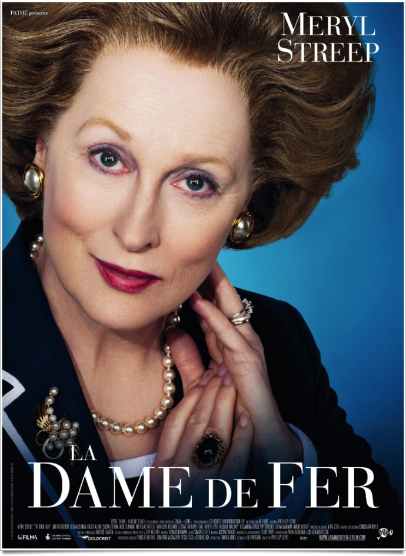
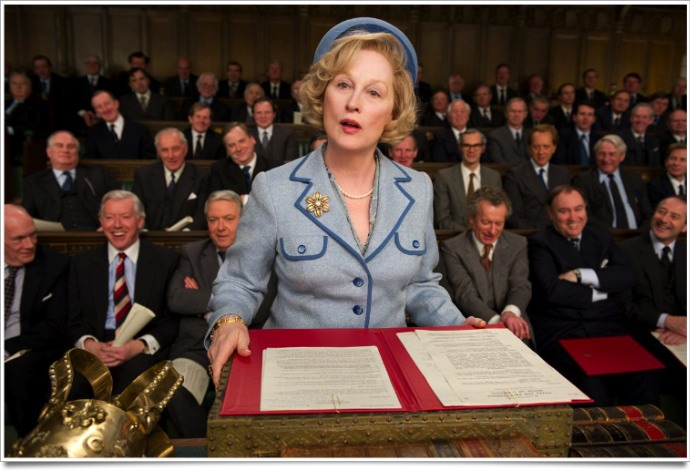
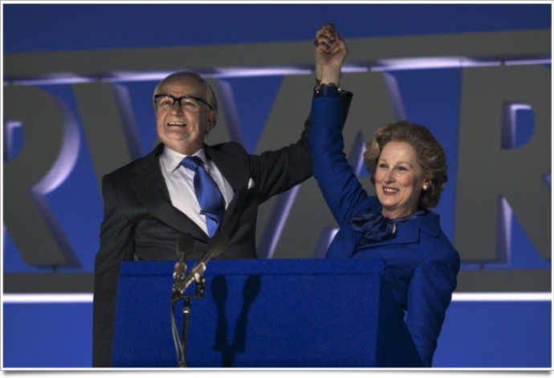

+++
type = "post"
titre = "<em>La Dame de fer</em>, Phyllida Lloyd"
title = "La Dame de fer, Phyllida Lloyd"
url = "/dame-fer-lloyd"
date = "2012-01-23T23:51:55"
Lastmod = "2014-09-27T23:35:12"
cover = "la-dame-de-fer-phyllida-lloyd.jpg"
categorie = [ "À voir" ]
tag = [ "Biopic", "Famille", "Histoire", "Politique", "Société" ]
createur = [ "Phyllida Lloyd" ]
acteur = [ "Meryl Streep" ]
annee = [ "2012" ]
weight = 2012
pays = [ "France" ]

+++

Margaret Thatcher a marqué le XXe siècle, pour le meilleur comme pour le pire. Pendant onze ans, elle a régné d&rsquo;une main de maître sur la Grande-Bretagne et <em>La Dame de Fer</em> est le premier film à s&rsquo;emparer d&rsquo;un tel sujet. L&rsquo;ancienne Premier ministre est toujours de ce monde, mais elle n&rsquo;est plus que l&rsquo;ombre d&rsquo;elle-même et le film de Phyllida Loyd vient en dresser un portrait plutôt convaincant. Inutile d&rsquo;espérer un cours sur la politique ultralibérale de Thatcher, la réalisatrice de <em>Mamma Mia!</em> s&rsquo;intéresse à la femme plus qu&rsquo;à la femme politique et c&rsquo;est peut-être la meilleure idée du film.

Margaret Thatcher a fini sa vie en baronne aisée, mais elle l&rsquo;a commencé comme fille de modeste épicier. Rien ne prédestinait cette jeune fille des milieux populaires à la longue et brillante carrière politique que fut la sienne, si ce n&rsquo;est peut-être un père engagé au niveau local. Ses discours galvanisent sa fille qui rêve déjà de lui succéder. Margaret obtient une place à Oxford et sortie avec un diplôme en poche, elle cherche immédiatement à entrer dans ce monde politique qui la fascine tant. Très vite, elle comprend que son sexe sera considéré comme une faiblesse dans un milieu exclusivement masculin et très machiste. Les rires fusent, tant sur son sexe que son origine sociale d&rsquo;ailleurs et il lui faut tout son caractère d&rsquo;acier pour tenir tête à ces hommes qu&rsquo;elle fréquentera toute sa vie. <em>La Dame fe fer</em> ne s&rsquo;étend pas sur les premières années de la carrière politique de Margaret Thatcher pour mieux se concentrer sur ses années au pouvoir. De 1979 à 1990, elle a appliqué une politique toujours inspirée par les discours de son père. Une politique dure et très critiquée à une époque où la Grande-Bretagne subissait de plein fouet les conséquences des crises économiques de la fin des années 1970. Pourtant, malgré les critiques toujours plus violentes, sa main de fer n&rsquo;a pas tremblé…

Phyllida Lloyd n&rsquo;a nullement l&rsquo;intention de proposer un film historique et le spectateur mal informé n&rsquo;apprendra rien de plus. Il pourra même se sentir un peu perdu dans le défilé des évènements marquants du règne de la Dame de fer. Quelques faits parmi les plus importants sont ainsi évoqués, comme la guerre des Malouines en 1982 qui a été peut-être la seule période où Margaret Thatcher a été vraiment populaire. Les grèves, les attaques terroristes de l&rsquo;IRA et les conflits violents entre les syndicats et les forces de l&rsquo;ordre forment une toile de fond qui n&rsquo;est jamais vraiment explicitée. <em>La Dame de fer</em> n&rsquo;est pas plus un film politique et les tenants et aboutissants de la politique thatchérienne restent globalement sous silence. Quelques scènes la symbolisent bien, notamment un conseil des ministres pendant lequel le Premier ministre s&rsquo;en prend violemment à son gouvernement qui espère négocier et relâcher la pression, mais c&rsquo;est à peu près tout. Friedman ou Hayek ne sont jamais cités et la destruction des syndicats est à peine évoquée : là n&rsquo;est clairement pas le sujet de <em>La Dame de fer</em>.

Le deuxième film de la cinéaste a l&rsquo;excellente idée de ne pas respecter la chronologie historique. <em>La Dame de fer</em> se déroule ces dernières années et il met en scène une Margaret Thatcher qui a considérablement vieilli au point de ne même plus se reconnaître dans le miroir. Elle perd un peu la tête et dialogue constamment avec son mari mort d&rsquo;un cancer plusieurs années auparavant. Dans une maison devenue bien trop grande pour elle, cette femme qui n&rsquo;est plus en phase avec son époque tourne en rond alors que les souvenirs l&rsquo;assaillent de toute part. De ce point de départ, Phyllida Lloyd remonte dans le temps par une série de flashbacks qui sont autant de flashs et de retours soudains du passé pour Margaret Thatcher. Une photo ramène une scène, une musique lui rappelle une danse avec son mari, une statuette fait surgir du passé la guerre des Malouines, un DVD avec des films de vacances ramène à la surface ses deux enfants. Certains souvenirs sont agréables, mais <em>La Dame de fer</em> est marqué par les regrets et le remord de cette vieille femme. Des regrets qui ne sont jamais politiques : Margaret Thatcher a toujours été convaincue du bien-fondé de ses idées qu&rsquo;elle n&rsquo;a d&rsquo;ailleurs jamais abandonnées. Ils sont personnels : sa carrière a exigé d&rsquo;elle l&rsquo;abandon de sa famille, d&rsquo;un mari et de deux enfants qu&rsquo;elle aimait tant. Comme elle le dit elle-même dans une scène belle et terrible à la fois, elle a épousé la politique et elle délaisse sa famille. <em>La Dame de fer</em> parvient, bien mieux que le récent <em><a href="http://voiretmanger.fr/2011/11/23/the-lady-besson/">The Lady</a></em>, à rendre les doutes et les regrets de son personnage principal. Contre toute attente, le film de Phyllida Lloyd est un portrait très émouvant et sincère d&rsquo;une femme, et non de la femme politique détestée qu&rsquo;elle a aussi été.

<em>La Dame de fer</em> s&rsquo;annonçait comme un biopic très conventionnel sur Margaret Thatcher, mais Phyllida Lloyd en a évité les principaux pièges. Le refus de la chronologie, le point de vue du personnage devenu âgé et qui est assailli par les souvenirs, l&rsquo;oubli de la plupart des événements historiques au profit des regrets mélancoliques… autant d&rsquo;éléments qui font passer le film du côté de la bonne surprise. Cette réussite est d&rsquo;abord celle du scénario qui a su éviter les dangers du genre, mais aussi les questions politiques, nécessairement polémiques. En cela, <em>La Dame de fer</em> réhabilite en quelque sorte l&rsquo;humain derrière le personnage politique au bilan souvent critiqué. Cela ne devrait pas plaire à tout le monde, mais c&rsquo;est peut-être le meilleur angle sur un sujet. Le film doit forcément beaucoup à son interprète principale : Meryl Streep compose une Margaret Thatcher convaincante, surtout dans la fin de sa vie d&rsquo;ailleurs. Le visage est connu, la voix est connue, mais le travail de l&rsquo;actrice paye et on finit par ne plus voir que le Premier ministre britannique. Les images d&rsquo;archive utilisées régulièrement étaient alors inutiles et c&rsquo;est un peu dommage que Phyllida Lloyd se soit laissée aller à cette facilité.

<em>La Dame de fer</em> n&rsquo;est pas le meilleur film de cette rentrée cinématographique, c&rsquo;est incontestable. Reste que ce biopic sur Margaret Thatcher proposé par la réalisatrice de <em>Mamma Mia!</em> avait de quoi faire peur et Phyllida Lloyd s&rsquo;en sort plutôt bien. La bonne idée est incontestablement d&rsquo;avoir volontairement écarté la femme politique pour se concentrer sur la femme tout court : c&rsquo;est un point de vue partiel, certes, mais c&rsquo;est aussi la clé d&rsquo;un film réussi.

<h3>Vous voulez m&rsquo;aider ?<a href="#footnote_0_5544" id="identifier_0_5544" class="footnote-link footnote-identifier-link" title="&Agrave; propos de la publicit&eacute;&hellip;">1</a></h3>
<ul>
<li><a href="http://www.amazon.fr/gp/product/B007EBBTXK/ref=as_li_ss_tl?ie=UTF8&#038;tag=leblogdenic07-21&#038;linkCode=as2&#038;camp=1642&#038;creative=19458&#038;creativeASIN=B007EBBTXK">Acheter le film en Blu-Ray sur Amazon</a></li>
<li><a href="http://www.amazon.fr/gp/product/B007EBBTY4/ref=as_li_ss_tl?ie=UTF8&#038;tag=leblogdenic07-21&#038;linkCode=as2&#038;camp=1642&#038;creative=19458&#038;creativeASIN=B007EBBTY4">Acheter le film en DVD sur Amazon</a></li>
<li><a href="http://itunes.apple.com/fr/movie/la-dame-de-fer/id525999075">Acheter ou louer le film sur l&rsquo;iTunes Store</a></li>
</ul>

<ol class="footnotes"><li id="footnote_0_5544" class="footnote"><a href="http://voiretmanger.fr/soutien/">À propos de la publicité…</a> [<a href="#identifier_0_5544" class="footnote-link footnote-back-link">&#8617;</a>]</li></ol>
