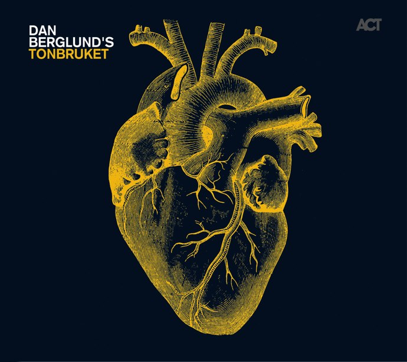
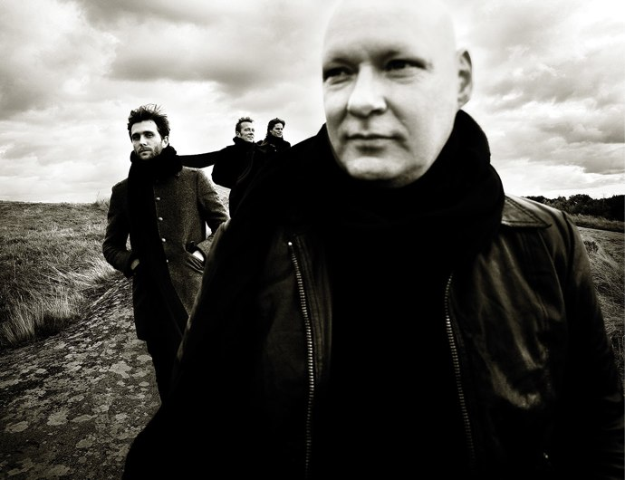

+++
titre = "Dan Berglund, Dan Berglund&rsquo;s Tonbruket"
title = "Dan Berglund, Dan Berglund's Tonbruket"
url = "/dan-berglund-tonbruket"
date = "2010-06-12T23:05:51"
Lastmod = "2010-06-12T23:13:28"
cover = "dan-berglunds-tonbruket.jpg"
categorie = [ "Musique" ]
tag = [ "Jazz", "Mélange", "Post-Rock" ]
createur = [ "Dan Berglund" ]
annee = [ "2010" ]
weight = 2010

+++

EST — Esbjörn Svensson Trio — est certainement l&rsquo;un des meilleurs trio de jazz que je connaisse. Je connais tous leurs albums par cœur et l&rsquo;unique concert que j&rsquo;ai pu voir du trio suédois m&rsquo;a enchanté. Je n&rsquo;hésiterai pas, même, à le classer immédiatement dans le trio de tête des meilleurs souvenirs de concerts qu&rsquo;il me reste. Autant dire que l&rsquo;annonce de la mort prématurée d&rsquo;Esbjörn Svensson, pianiste et leader du trio, durant l&rsquo;été 2008 m&rsquo;a surpris comme tout le monde. Ce sont des banalités qui viennent alors à l&rsquo;esprit, sur l&rsquo;injustice de la mort, sur le vide qu&rsquo;elle laisse derrière elle… Autant de banalités qui se traduisent néanmoins concrètement : jamais plus on ne pourra entendre sur scène les si belles et puissantes mélodies d&rsquo;EST, jamais plus on n’aura droit à un nouvel album, nouvelle occasion de découvrir un univers magique.

Quand j&rsquo;ai appris que Dan Berglund, bassiste du trio, sortait un nouvel album et se remettait donc à la musique, je n&rsquo;ai même pas hésité plus d&rsquo;un battement de cœur. Depuis, <em>Tonbruket</em> a beaucoup tourné dans ma platine virtuelle et si EST est bel et bien mort, Dan Berglund propose ici un album au moins aussi riche que ceux du trio. Brillant.

La première chose qui frappe en abordant cet album, c&rsquo;est bien sûr sa pochette. Un cœur, certes, mais pas un cœur idéalisé rose tout mignon, mais un vrai et moche cœur, avec ses ventricules et ses artères tranchées. Un cœur à l&rsquo;arrêt, peut-être pour évoquer celui d&rsquo;Esbjörn, mais aussi le symbole de la vie, comme un nouveau départ. Cette pochette intrigue en tout cas, elle a aussi un côté un peu effrayant, bien loin du calme habituel des pochettes d&rsquo;ACT. C&rsquo;est aussi l&rsquo;impression qu&rsquo;offre la musique les premières écoutes. On reconnaît bien la musique, le jazz, mais on est loin du cliché piano-bar. Ici, la musique se fait aussi grave, menaçante et les douces mélodies s&rsquo;entrechoquent parfois à des rythmiques presque martiales (&laquo;&nbsp;<em>Gi Hop</em>&laquo;&nbsp;, comme son nom l&rsquo;indique d&rsquo;ailleurs).

Difficile, à dire vrai, de situer <em>Tonbruket</em> dans la grille des genres. Faut-il seulement, d&rsquo;ailleurs, le situer, le ranger dans une catégorie ? Par commodité, il est dans la liste &laquo;&nbsp;Jazz&nbsp;&raquo; dans mon lecteur, mais cela ne veut pas dire grand-chose. Cet album poursuit en fait le travail de déconstruction du jazz traditionnel commencé par EST. D&rsquo;album en album, le trio avançait vers des terres musicales inconnues, vers des sonorités jamais entendues dans le jazz, voire jamais entendues tout court. Je me rappelle avoir été vraiment frappé, en concert, de constater qu&rsquo;ils n&rsquo;utilisaient que les armes traditionnelles du trio de jazz (piano, contrebasse et batterie) pour proposer une musique radicalement différente. Dan Berglund faisait un travail remarquable sur sa contrebasse, sortant des sons que l&rsquo;on aurait jurés provenir d&rsquo;une guitare, si l&rsquo;on n&rsquo;avait pas le majestueux instrument devant les yeux. Ce travail avait atteint un paroxysme avec le dernier album d&rsquo;EST, <em>Leucocyte</em>, album complexe, album noir, album magique aussi, où le genre &laquo;&nbsp;jazz&nbsp;&raquo; semble aussi inadapté que tous les genres connus.

Avec <em>Tonbruket</em>, Dan Berglund semble poursuivre cette quête vers l&rsquo;inconnu. La formation a changé, ils sont désormais quatre et c&rsquo;est ainsi un quatrième instrument qui vient s&rsquo;adjoindre au trio traditionnel. Johan Lindström et sa guitare ajoutent indéniablement une autre dimension à la musique, par petites touches discrètes toujours qui contribuent à une ambiance jamais entendue encore. On tend parfois vers le rock, ou plutôt vers le post-rock sans doute (&laquo;&nbsp;<em>Monstruous Collossus</em>&laquo;&nbsp;), mais le jazz n&rsquo;est jamais loin non plus (&laquo;&nbsp;<em>Wolverine Hoods</em>&laquo;&nbsp;). &laquo;&nbsp;<em>Song for e</em>&laquo;&nbsp;, hommage quasiment explicite au pianiste mort, est sans doute le titre le plus proche de l&rsquo;univers d&rsquo;EST, peut-être aussi le plus apaisé de l&rsquo;album, comme un dernier hommage avant la suite. La suite, c&rsquo;est une sorte d&rsquo;hybride tout à fait réussi, avec des influences de toute part, du rock progressif au jazz. Je ne sais pas si la formation offrira d&rsquo;autres albums, mais je sais que, le cas échéant, je sauterai dessus comme j&rsquo;ai sauté sur cet album.

Les mots, les miens en tout cas, sont trop limités pour parler de manière satisfaisante de Dan Berglund&rsquo;s <em>Tonbruket</em>. Je préfère donc m&rsquo;arrêter là, non sans vous recommander encore une fois l&rsquo;écoute de cet album magnifique. Plongez dans l&rsquo;inconnu musical, laissez-vous porter par les notes et les émotions nouvelles, je suis prêt à parier que vous ne le regretterez pas. Et si vous n&rsquo;avais jamais écouté EST, c&rsquo;est un tort qu&rsquo;il faut immédiatement réparer ! Je recommande de parcourir la discographie dans l&rsquo;ordre chronologique : si <em>Leucocyte</em> est un excellent album, peut-être même mon préféré, c&rsquo;est aussi sans doute le plus inaccessible.

Je ne terminerai pas cette chronique sans remercier <a href="http://www.playlistsociety.fr/2010/05/dan-berglung-tonbruket-8510.html">Benjamin</a> qui est, encore une fois, responsable de cette excellente découverte. Je serais bien en peine de compter le nombre d&rsquo;albums et d&rsquo;artistes ou groupes que j&rsquo;ai découvert grâce à lui, à tel point que j&rsquo;en viens à acheter sans réfléchir tous les disques qu&rsquo;il apprécie. Une valeur sûre.

<em>Toutes les photos sont issues du <a href="http://www.tonbruket.com/photos.html">site officiel</a> du groupe</em>

