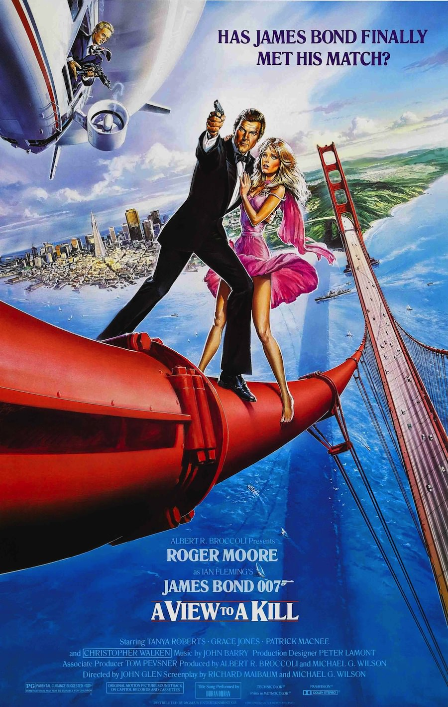
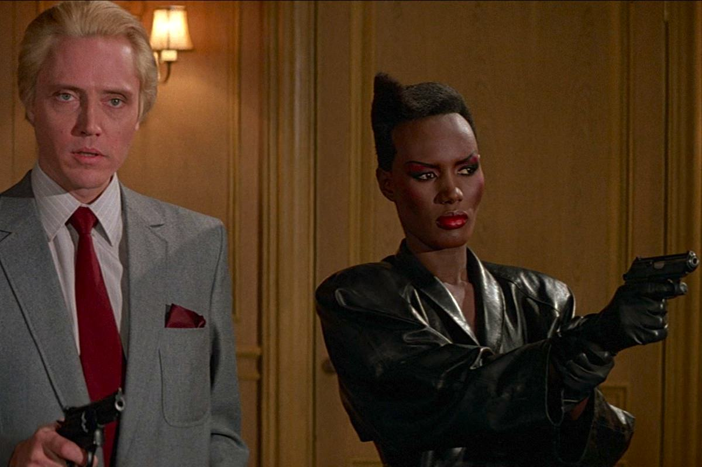

+++
type = "post"
titre = "<em>Dangereusement vôtre</em>, John Glen"
title = "Dangereusement vôtre, John Glen"
url = "/dangereusement-votre-glen"
date = "2013-03-24T09:45:32"
Lastmod = "2013-05-11T10:01:27"
cover = "dangereusement-votre-roger-moore-john-glen.jpg"
categorie = [ "À voir" ]
tag = [ "Action", "Blockbuster", "Espionnage", "James Bond", "Vite oublié" ]
createur = [ "John Glen" ]
acteur = [ "Christopher Walken", "Grace Jones", "Roger Moore", "Tanya Roberts" ]
annee = [ "1985" ]
weight = 1985
saga = [ "James Bond" ]
pays = [ "États-Unis" ]
original = "A View to Kill"

+++

Quand <em>Dangereusement vôtre</em> sort dans les salles de cinéma, il a près de 58 ans. L&rsquo;acteur vieillissant n&rsquo;a plus le physique de ses débuts, ni la forme nécessaire pour interpréter théoriquement l&rsquo;agent secret 007, mais il signe pour la septième fois. Les producteurs décident de ne surtout pas changer une formule qui a fait ses preuves auprès du box-office et ils conservent non seulement la star désormais associée à James Bond pour le grand public, mais aussi l&rsquo;équipe technique. Pour réaliser ce quatorzième volet de la saga, c&rsquo;est donc à nouveau John Glen qui est embauché. La formule patine sérieusement depuis quelques films et ce n&rsquo;est pas <a href="http://voiretmanger.fr/2013/03/17/octopussy-glen/" title="Octopussy, John Glen - À voir et à manger"><em>Octopussy</em></a> qui vient changer cette tendance, même si le succès est encore au rendez-vous. <em>Dangereusement vôtre</em> n&rsquo;est pas un mauvais épisode pour autant : à défaut d&rsquo;être original, il est riche et bien mené et offre, en quelque sorte, un bel hommage au James Bond de Roger Moore. 

La séquence d&rsquo;ouverture donne le ton : le temps d&rsquo;une course-poursuite en ski, <em>Dangeureusement vôtre</em> rappelle de nombreux épisodes de la saga, mais tout particulièrement <a href="http://voiretmanger.fr/2013/01/27/au-service-secret-de-sa-majeste-hunt/" title="Au service secret de sa Majesté, Peter Hunt - À voir et à manger"><em>Au service secret de sa Majesté</em></a> qui contenait quelques belles séquences alpines. Cette fois, James Bond doit échapper à l&rsquo;armée soviétique en pleine URSS, quelque part en Sibérie. La séquence est bien menée et même si l&rsquo;acteur qui interprète l&rsquo;agent secret trahit quelques années de trop, l&rsquo;ensemble est plaisant, à l&rsquo;exception d&rsquo;une courte séquence saugrenue avec un snowboard. Le personnage principal récupère au cours de ce pré-générique une petite puce et c&rsquo;est elle qui sera au cœur de l&rsquo;intrigue qui suit. John Glen embraye ensuite sur les passages obligés de la saga : à Londres, on retrouve James Bond au siège du MI6 avec la secrétaire Moneypenny — interprétée pour la quatorzième et dernière fois par Loïs Maxwell —, mais aussi M à la tête du service (Robert Brown à nouveau) et Q qui s&rsquo;occupe ici des explications techniques (Desmond Llewelyn, évidemment). <em>Dangereusement vôtre</em> prend des allures habituelles avant de s&rsquo;envoler pour Paris, le cadre plutôt original de sa première partie. Comme souvent, le long-métrage nous embarque dans une tournée des clichés avec une séquence… sur la Tour Eiffel bien entendu. Par la suite, le film pose son action aux États-Unis, tout près de la Silicon Valley, pour une longue partie américaine qui n&rsquo;est pas sans rappeler <a href="http://voiretmanger.fr/2013/01/06/goldfinger-hamilton/" title="Goldfinger, Guy Hamilton - À voir et à manger"><em>Goldfinger</em></a>. Il y a pire comme référence et cet épisode essaie de renouveler un matériau déjà connu avec l&rsquo;histoire de Max Zorin, ce psychopathe qui cherche à noyer la Silicon Valley pour imposer ses propres puces en constituant un monopole. 

Sur le papier, <em>Dangereusement vôtre</em> était assez prometteur et John Glen compose quelques séquences réussies. On apprécie plutôt le jeu bien rodé entre James Bond et le noble anglais qui joue le rôle de son serviteur à Chantilly, tandis que la fin du film offre quelques cascades impressionnantes avec, en particulier, un combat sur le Golden Gate Bridge qui reste, encore aujourd&rsquo;hui, assez époustouflant. Roger Moore a été souvent doublé, mais cela n&rsquo;est pas trop gênant et le spectacle est au rendez-vous pour ce blockbuster qui tend plus à l&rsquo;action brute qu&rsquo;à l&rsquo;accoutumée. Même s&rsquo;il signe la fin d&rsquo;une époque, ce <em>Dangereusement vôtre</em> est aussi en rupture par rapport à ses prédécesseurs sur plusieurs points. Alors que la séquence d&rsquo;ouverture était très &laquo;&nbsp;bondienne&nbsp;&raquo;, la suite tend beaucoup plus vers les blockbusters américains de l&rsquo;époque et elle oublie certains passages obligés de la saga. Il faudra ainsi faire sans course-poursuite, alors que l&rsquo;agent secret ne conduit quasiment jamais et on ne retrouve pas tout le décorum habituel des <em>James Bond</em>, alors qu&rsquo;<em>Octopussy</em> les enchaînait tous mécaniquement. Cela n&rsquo;aurait pas été forcément plus mal, si ce n&rsquo;est que John Glen ne maîtrise pas bien le reste. Ainsi, la séquence dans la mine surprend par sa violence, mais elle manque de crédibilité, avec ce revirement de situation de l&rsquo;un des principaux méchants qui est très ridicule. Les méchants de <em>Dangereusement vôtre</em> pourtant, n&rsquo;étaient pas mauvais non plus : Christopher Walken compose un Max Zorin psychopathe à souhait et il est l&rsquo;un des méchants les plus réussis de la saga. À ses côtés, les producteurs ont repris l&rsquo;idée de la brute épaisse façon Jaws, mais avec un personnage apparemment à contre-emploi, puisque May Day est une femme noire. Interprétée par une Grace Jones surprenante, c&rsquo;est aussi une réussite dans le long-métrage, du moins tant qu&rsquo;elle reste du côté des méchants. Ces deux personnages sont réussis, on n&rsquo;en dira pas autant de Stacey, l&rsquo;une des pire James Bond girl de la saga. Tanya Robert interprète très bien la blonde un peu cruche, sauf que le côté parodique qui ressort n&rsquo;est pas du tout souhaité… 

<em>Dangereusement vôtre</em> est un épisode paradoxal. John Glen y concentre tout ce qui fait un <em>James Bond</em> classique, tout en apportant quelques innovations pour un résultat décevant sur les deux plans. Fin d&rsquo;une époque un peu lourde à cause de son héros vieilli et de son manque de renouvellement, le film peine aussi à convaincre quand il essaie d&rsquo;être plus spectaculaire et violent. Toujours est-il qu&rsquo;en ce milieu des années 1980, le constat s&rsquo;impose : il faut, à nouveau, renouveler en profondeur la saga. 

<strong>James Bond reviendra dans… <a href="http://voiretmanger.fr/2013/03/31/tuer-pas-jouer-glen/" title="Tuer n’est pas jouer, John Glen"><em>Tuer n&rsquo;est pas jouer</em></a></strong>

<h3>Vous voulez m’aider ?<a href="#footnote_0_8699" id="identifier_0_8699" class="footnote-link footnote-identifier-link" title="&Agrave; propos de la publicit&eacute;&hellip;">1</a></h3>
<ul>
<li><a href="http://www.amazon.fr/gp/product/B00AOALWOO/ref=as_li_ss_tl?ie=UTF8&#038;tag=leblogdenic07-21&#038;linkCode=as2&#038;camp=1642&#038;creative=19458&#038;creativeASIN=B00AOALWOO">Acheter le film en Blu-Ray sur Amazon</a></li>
<li><a href="http://www.amazon.fr/gp/product/B000NJM5UQ/ref=as_li_ss_tl?ie=UTF8&#038;tag=leblogdenic07-21&#038;linkCode=as2&#038;camp=1642&#038;creative=19458&#038;creativeASIN=B000NJM5UQ">Acheter le film en DVD sur Amazon</a></li>
<li><a href="https://itunes.apple.com/fr/movie/dangereusement-votre-view/id562159466">Acheter ou louer le film sur L’iTunes Store</a></li>
</ul>
<ul>
<li><a href="http://www.amazon.fr/gp/product/B008U6R9B4/ref=as_li_ss_tl?ie=UTF8&amp;tag=leblogdenic07-21&amp;linkCode=as2&amp;camp=1642&amp;creative=19458&amp;creativeASIN=B008U6R9B4">Acheter la trilogie complète en Blu-Ray sur Amazon</a></li>
<li><a href="http://www.amazon.fr/gp/product/B008U6R93C/ref=as_li_ss_tl?ie=UTF8&amp;tag=leblogdenic07-21&amp;linkCode=as2&amp;camp=1642&amp;creative=19458&amp;creativeASIN=B008U6R93C">Acheter la trilogie complète en DVD sur Amazon</a></li>
</ul>

<ol class="footnotes"><li id="footnote_0_8699" class="footnote"><a href="http://voiretmanger.fr/soutien/">À propos de la publicité…</a> [<a href="#identifier_0_8699" class="footnote-link footnote-back-link">&#8617;</a>]</li></ol>
