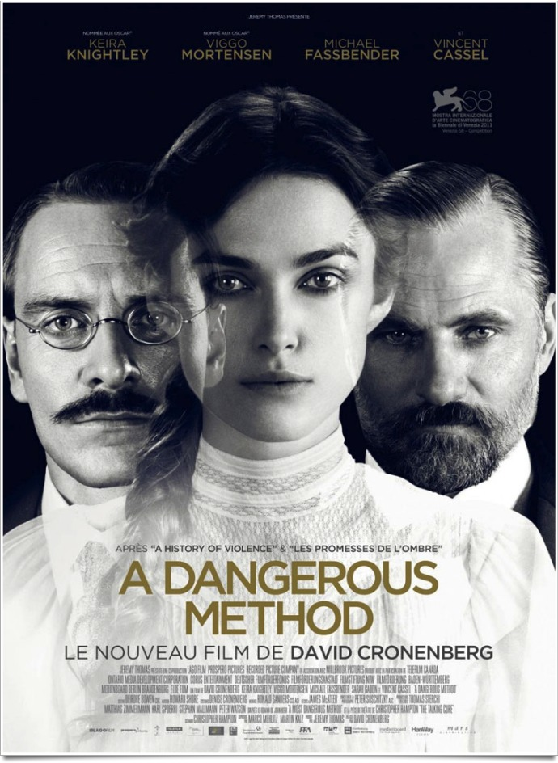
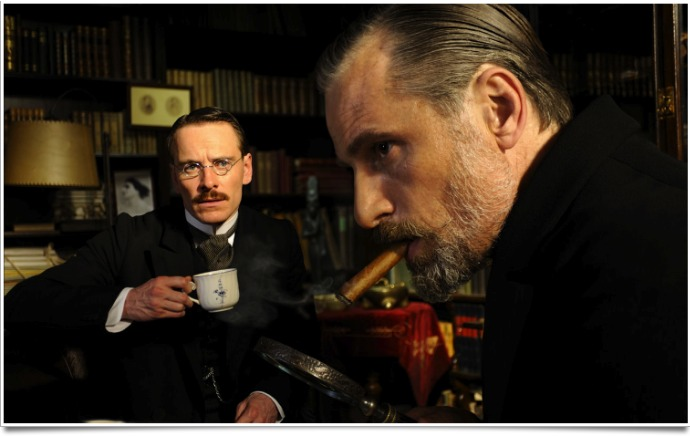
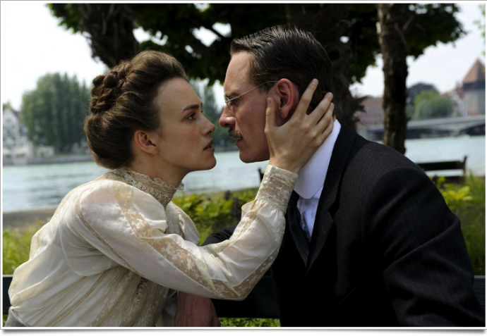

+++
type = "post"
titre = "<em>A Dangerous Method</em>, David Cronenberg"
title = "A Dangerous Method, David Cronenberg"
url = "/dangerous-method-cronenberg"
date = "2011-12-28T23:34:53"
Lastmod = "2015-01-28T19:37:57"
cover = "a-dangerous-method-knightley.jpg"
categorie = [ "À voir" ]
tag = [ "Biopic", "Folie", "Histoire", "Histoire vraie", "Médecine", "Psychologie", "Vite oublié" ]
createur = [ "David Cronenberg" ]
acteur = [ "Keira Knightley", "Michael Fassbender", "Viggo Mortensen", "Vincent Cassel" ]
annee = [ "2011" ]
weight = 2011
pays = [ "Suisse" ]

+++

Après <em>Les Promesses de l&rsquo;ombre</em> et surtout son excellent <em><a href="http://voiretmanger.fr/history-violence-cronenberg/">A History of Violence</a></em>, David Cronenberg propose un biopic sur l&rsquo;un des pionniers de la psychanalyse. En racontant l&rsquo;histoire de Carl Jung, de sa relation avec une patiente et surtout de ses échanges avec Sigmund Freund, <em>A Dangerous Method</em> s&rsquo;avère très intéressant, certes, mais aussi bien trop académique et scolaire. Décevant…

Au début du XXe siècle, la psychanalyse n&rsquo;a même pas encore son nom définitif, mais elle commence à se faire connaître et à se pratiquer. Le docteur Carl Jung la met ainsi en pratique pour les toutes premières fois dans un asile psychiatrique suisse. Sabina Spielrein, une patiente suisse, lui donne d&rsquo;ailleurs l&rsquo;opportunité de tester cette nouvelle médecine de la parole pour la première fois. La méthode est, on s&rsquo;en doute, dangereuse : la jeune femme est hystérique et on la sent proche à tout instant de l&rsquo;acte de folie contre son médecin ou elle-même. Les progrès sont toutefois au rendez-vous et la jeune femme est si bien soignée qu&rsquo;elle finit même par assister son docteur avant, quelques années plus tard, de devenir à son tour psychiatre. Carl Jung est une personne très droite qui suit une morale rigoureuse et une déontologie qui lui interdit tout rapprochement avec ses patients, mais il a du mal à réfréner ses pulsions envers Sabina qui devient vite son amante. La réussite de son traitement rapproche en parallèle le docteur Jung de Freud, alors éminent psychanalyste viennois. Les deux hommes vont beaucoup échanger, mais les désaccords surgissent vite sur fond de conflit de pouvoir…

<em>A Dangerous Method</em> est incontestablement un film passionnant pour qui s&rsquo;intéresse de près ou de loin à la psychanalyse. Bonne introduction à cette branche de la médecine, le film de David Cronenberg expose bien les points de vue de Freud et de Jung. L&rsquo;inventeur de la psychanalyse est d&rsquo;abord fasciné par ce jeune docteur qui a suivi avec succès ses préceptes et en sauvant une patiente. Un premier résultat qui fait de la publicité positive pour la discipline qu&rsquo;il a inventé et qui est alors très disputée. Alors que Freud voit en Jung son successeur, ce dernier conteste plusieurs points de la théorie freudienne et devient de plus en plus un concurrent pour le premier. Carl Jung n&rsquo;accepte pas l&rsquo;idée de tout baser sur la sexualité et il refuse également la position strictement scientifique de son aîné alors qu&rsquo;il souhaiterait étudier d&rsquo;autres champs plus obscurs, comme la télépathie. L&rsquo;opposition des deux hommes est bien rendue et <em>A Dangerous Method</em> distingue parfaitement les deux positions et rend parfaitement intelligible l&rsquo;inévitable séparation entre eux. Le scénario présente Freud comme un homme qui apprécie son pouvoir et n&rsquo;entend pas le partager et qui n&rsquo;hésite pas à écraser tous ses concurrents si nécessaire. S&rsquo;il n&rsquo;hésite pas à analyser les rêves de Jung, il ne raconte jamais ses propres rêves, de peur d&rsquo;inverser les rôles.

Le dernier film de David Cronenberg ne manque pas d&rsquo;intérêt, indéniablement, mais <em>A Dangerous Method</em> peine à convaincre. Le traitement façon biopic de la vie de Carl Jung n&rsquo;est pas très intéressant et son histoire d&rsquo;amour ne convainc jamais vraiment. De manière assez surprenante, le film pêche sur le plan psychologique avec des personnages qui sont loin d&rsquo;être assez fouillés pour intéresser. Le débat qui anime Jung et Freud est d&rsquo;abord intellectuel, certes, mais il n&rsquo;est pas si bien traité que cela. <em>A Dangerous Method</em> s&rsquo;avère en fait assez frustrant : il donne quelques informations, mais on aimerait en savoir plus sur le plus intéressant, à savoir Sigmund Freud et l&rsquo;invention de la psychanalyse. L&rsquo;idée d&rsquo;adopter le point de vue de Jung n&rsquo;était pas mauvaise et le film de Cronenberg ouvre des pistes très intéressantes. Freud est ainsi présenté quasiment comme un politicien qui lutte pour conserver son pouvoir : il n&rsquo;a de cesse de rappeler à son confrère qu&rsquo;ils doivent rester prudents pour ne pas donner à leurs ennemis des arguments supplémentaires. Sa seule obsession ne semble pas tant d&rsquo;aider des hommes et femmes en difficulté, mais plutôt de maintenir sa place : voilà un sujet passionnant qui aurait mérité d&rsquo;être creusé. Au lieu de cela, <em>A Dangerous Method</em> déroule des échanges d&rsquo;idées qui semblent parfaitement taillés pour un cours de philosophie. Chaque intervenant expose son idée et fait ainsi avancer un débat qui paraît beaucoup trop scolaire et peine dès lors à susciter l&rsquo;enthousiasme.

Le scénario d&rsquo;<em>A Dangerous Method</em> n&rsquo;est sûrement pas étranger à ce côté scolaire, mais le cinéaste semble aussi bien peu inspiré par son sujet. Si l&rsquo;on peut retrouver certains thèmes chers à David Cronenberg, la folie en tête bien sûr, ce film évoque plutôt une commande qu&rsquo;un projet personnel. Il faut reconnaître toutefois qu&rsquo;il réussit à condenser une grande masse d&rsquo;informations en un film plutôt bref (1h40) et dense, mais qui reste toujours plaisant à suivre. Pour un cours sur la naissance de la psychanalyse, c&rsquo;est un cours passionnant, ce qui n&rsquo;est finalement pas si mal. Pour incarner cette histoire, <em>A Dangerous Method</em> repose sur les épaules de trois comédiens. On avait déjà croisé Viggo Mortensen chez David Cronenberg, il interprète ici un Freud plutôt convaincant. Michael Fassbender, l&rsquo;acteur de l&rsquo;année décidément, compose quant à lui un Carl Jung mesuré, loin de la performance offerte dans le récent <em><a href="http://voiretmanger.fr/shame-mcqueen/">Shame</a></em>. La palme revient toutefois à Keira Knightley qui offre une impressionnante prestation en incarnant à merveille l&rsquo;hystérie de son personnage.

Avec <em>A Dangerous Method</em>, David Cronenberg signe un peu son <em><a href="http://voiretmanger.fr/harvey-milk-gus-van-sant/">Harvey Milk</a></em>. Adoptant également le style du biopic, le cinéaste canadien déçoit après deux très bons films, comme Gus Van Sant avait pu le faire. Le résultat n&rsquo;est pas mauvais, <em>A Dangerous Method</em> se regarde d&rsquo;ailleurs sans déplaisir, mais il est loin, très loin, d&rsquo;être aussi passionnant qu&rsquo;escompté. David Cronenberg reste dans le domaine du biopic aussi vite regardé qu&rsquo;oublié, et c&rsquo;est bien dommage…

<h3>Vous voulez <a href="http://voiretmanger.fr/soutien/">m&rsquo;aider</a> ?</h3>
<ul>
<li><a href="http://www.amazon.fr/gp/product/B0073IUAE8/ref=as_li_ss_tl?ie=UTF8&amp;tag=leblogdenic07-21&amp;linkCode=as2&amp;camp=1642&amp;creative=19458&amp;creativeASIN=B0073IUAE8">Acheter le film en Blu-ray sur Amazon</a></li>
<li><a href="http://www.amazon.fr/gp/product/B0073IUARU/ref=as_li_ss_tl?ie=UTF8&amp;tag=leblogdenic07-21&amp;linkCode=as2&amp;camp=1642&amp;creative=19458&amp;creativeASIN=B0073IUARU">Acheter le film en DVD sur Amazon</a></li>
<li><a href="https://itunes.apple.com/fr/movie/a-dangerous-method/id518563845">Acheter ou louer le film sur l&rsquo;iTunes Store</a></li>
</ul>

