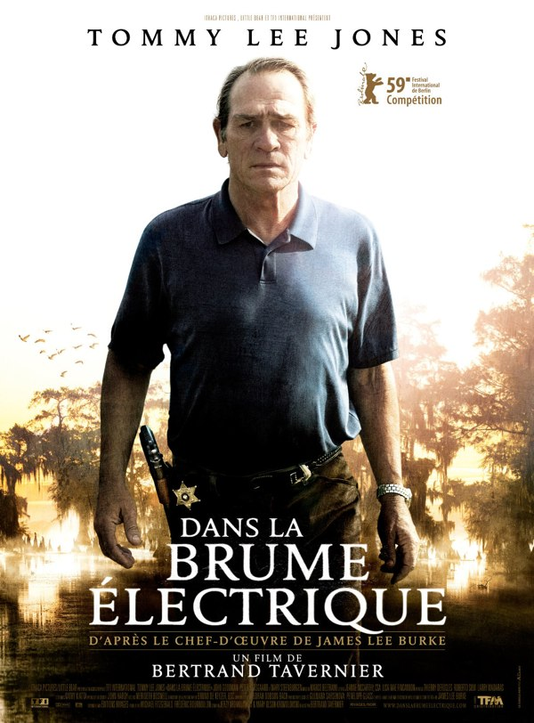
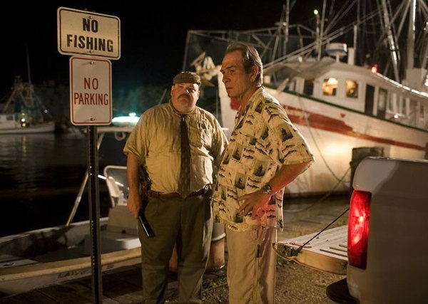

+++
type = "post"
titre = "<em>Dans la brume électrique</em>, Bertrand Tavernier"
title = "Dans la brume électrique, Bertrand Tavernier"
url = "/dans-la-brume-electrique-tavernier"
date = "2009-04-15T22:14:18"
Lastmod = "2014-03-27T08:20:57"
cover = "in-the-electric-mist-tavernier-lee-jones.jpg"
categorie = [ "À voir" ]
tag = [ "Fantastique", "Histoire" ]
createur = [ "Bertrand Tavernier" ]
acteur = [ "John Goodman", "Mary Steenburgen", "Peter Sarsgaard", "Tommy Lee Jones" ]
annee = [ "2009" ]
weight = 2009
pays = [ "États-Unis", "France" ]
original = "In the Electric Mist"

+++

<em>Dans la brume électrique</em> est le dernier film où Tommy Lee Jones joue le rôle principal. Toutes ses dernières contributions s&rsquo;étant révélées excellentes, ce film me donnait bien envie, mais le nom de Bertrand Tavernier sur l&rsquo;affiche me faisait hésiter. Je sais à quel point les Français peuvent donner le pire d&rsquo;eux-mêmes en singeant le cinéma américain. Avec ce nouveau film cependant, le réalisateur démontre, pour mon plus grand bonheur, que je me trompais. Dans la brume électrique est un excellent film, à ne rater sous aucun prétexte

<em>Dans la brume électrique</em> commence&#8230; dans la brume. Celle du bayou en l&rsquo;occurrence, ces marais si typiques de la Louisiane et qui passent si bien sur la pellicule. Le décor est immédiatement planté, on sent d&rsquo;emblée l&rsquo;ambiance moite, la chaleur et les moustiques. Puis vient une voix off qui ne quittera plus ensuite le film, et qui nous raconte que l&rsquo;on plaçait des pierres sur les tombes pour éviter que les morts se déplacent, mais qu&rsquo;il arrivait que l&rsquo;on en rencontre dans les marais. Immédiatement, comme pour souligner ce message, la caméra présente le corps inerte d&rsquo;une jeune femme que des policiers emmènent. Puis le héros du film, Robicheaux magnifiquement interprété (comme d&rsquo;habitude dirais-je) par Tommy Lee Jones, apparaît, et fait un signe de croix.

En quelques secondes à peine, Bertrand Tavernier plante le décor, le personnage principal, et l&rsquo;intrigue. Ou, pour être plus excuse, ce qui servira d&rsquo;excuse au film. Certes, <em>Dans la brume électrique</em> est vaguement un thriller, vaguement policier. Le film en conserve l&rsquo;ambiance, les thématiques et cette mort justifie une intrigue basée essentiellement sur la recherche du coupable. Néanmoins, on sait très vite qui est le coupable, le film le désigne dès son apparition à l&rsquo;écran, et l&rsquo;affaire est réglée. En tout cas, Robicheaux ne doute pas une seconde de la culpabilité de la personne concernée, et son objectif est plutôt de trouver un biais pour l&rsquo;accuser, que de déterminer s&rsquo;il est coupable.

Ce qui intéresse le héros, et le réalisateur, c&rsquo;est plutôt une intrigue parallèle impliquant la mort d&rsquo;un Noir quarante ans avant l&rsquo;action. Le passé prend une place essentielle dans ce film qui semble même entièrement tourné vers lui. Ainsi, un commandant de la guerre de Sécession apparaît de manière régulière dans le film, sans que cela gêne outre mesure notre héros (même si les seuls à voir ces apparitions sont des alcooliques ou anciens alcooliques). Autre preuve du désintérêt du film pour son aspect purement thriller, le policier interroge d&rsquo;abord des gens qui n&rsquo;ont rien à voir avec l&rsquo;intrigue, comme ce joueur de blues interprété par un très bon Buddy Guy<a href="#footnote_0_1476" id="identifier_0_1476" class="footnote-link footnote-identifier-link" title="Au passage, je recommande ses disques, ils sont vraiment tr&egrave;s bien&hellip;">1</a>. Mais ces personnages ont quand même quelque chose à dire qui à, <em>in fine</em>, à voir avec l&rsquo;intrigue, sans doute de manière plus indirecte. Ils évoquent le passé, ils évoquent les morts, comme si la solution ne se trouvait pas ici-bas.

Néanmoins, il ne faudrait pas penser que <em>Dans la brume électrique</em> est totalement déconnecté de la réalité. Celle-ci est bien présente, essentiellement par le biais de Katrina. En effet, Bertrand Tavernier a eu la bonne idée d&rsquo;actualiser l&rsquo;histoire de base, inspirée du roman à peu près éponyme de James Lee Burke, pour la faire se dérouler après l&rsquo;ouragan Katrina. Le paysage en porte encore les marques, et le film tend vers une dénonciation des détournements des aides de l&rsquo;État par la mafia locale, même si le film évite (ouf) tout discours socialisant et critique, comme le cinéma français sait parfois en faire.

À propos de cinéma français, il est difficile de classer un tel film. Si <em>Dans la brume électrique</em> est définitivement un film américain, par le lieu, par les acteurs, par l&rsquo;intrigue aussi (des shérifs comme ça, il n&rsquo;y a qu&rsquo;aux États-Unis que cela peut exister). Mais pour un film américain, il est pour le moins atypique, à tel point qu&rsquo;une version différente a été proposée en Europe et aux États-Unis où le film est sorti directement sur DVD. Manifestement, les producteurs ont pensé que les Américains n&rsquo;apprécieraient pas un film un peu étrange, et je trouve que c&rsquo;est bien dommage. Il est vrai, néanmoins, que la patte du réalisateur se sent et qu&rsquo;il est plutôt à contre-courant des habitudes hollywoodiennes. Par exemple, il fait tout un film dans la Louisiane sans passer sa caméra dans le quartier français de la Nouvelle-Orléans, ce qui relève de l&rsquo;exploit.

Je pourrais encore parler longtemps du film, tant il est riche et passionnant. Néanmoins, je préfère me contenter de vous recommander à nouveau <em>Dans la brume électrique</em>, et de citer mes critiques préférées qui sont toutes unanimes sur le film, tant <strong><a href="http://www.critikat.com/Dans-la-brume-electrique.html">Critikat</a></strong>, que <em><a href="http://www.telerama.fr/cinema/films/dans-la-brume-electrique,377911,critique.php">Télérama</a></em> ou que les <em><a href="http://www.lesinrocks.com/cine/cinema-article/article/dans-la-brume-electrique/">Inrockuptibles</a></em>. C&rsquo;est même pas drôle, il n&rsquo;y a pas de débats acharnés, mais en même temps, quand un film est bon&#8230;

<h3>Vous voulez m&rsquo;aider ?<a href="#footnote_1_1476" id="identifier_1_1476" class="footnote-link footnote-identifier-link" title="&Agrave; propos de la publicit&eacute;&hellip;">2</a></h3>
<ul>
<li><a href="http://www.amazon.fr/gp/product/B003L5CTEQ/ref=as_li_ss_tl?ie=UTF8&#038;tag=leblogdenic07-21&#038;linkCode=as2&#038;camp=1642&#038;creative=19458&#038;creativeASIN=B003L5CTEQ">Acheter le film en Blu-Ray sur Amazon</a></li>
<li><a href="http://www.amazon.fr/gp/product/B002UTJIG6/ref=as_li_ss_tl?ie=UTF8&#038;tag=leblogdenic07-21&#038;linkCode=as2&#038;camp=1642&#038;creative=19458&#038;creativeASIN=B002UTJIG6">Acheter le film en DVD sur Amazon</a></li>
<li><a href="http://itunes.apple.com/fr/movie/dans-la-brume-electrique/id467362655">Acheter le film sur l&rsquo;iTunes Store</a></li>
</ul>

<ol class="footnotes"><li id="footnote_0_1476" class="footnote">Au passage, je recommande ses disques, ils sont vraiment très bien&#8230; [<a href="#identifier_0_1476" class="footnote-link footnote-back-link">&#8617;</a>]</li><li id="footnote_1_1476" class="footnote"><a href="http://voiretmanger.fr/soutien/">À propos de la publicité…</a> [<a href="#identifier_1_1476" class="footnote-link footnote-back-link">&#8617;</a>]</li></ol>
