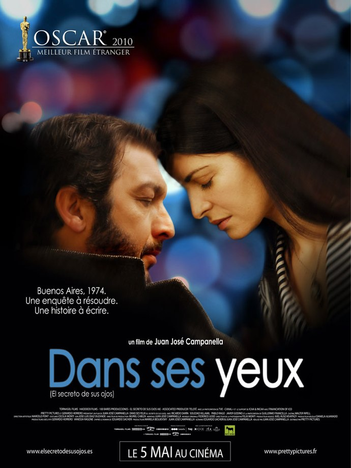
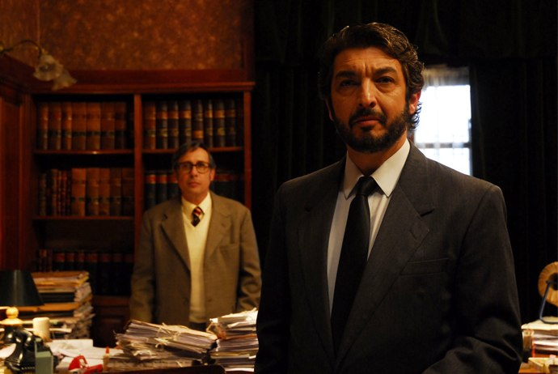

+++
type = "post"
titre = "Dans ses yeux, Juan José Campanella"
title = "Dans ses yeux, Juan José Campanella"
url = "/dans-ses-yeux-campanella"
date = "2010-05-08T23:46:54"
Lastmod = "2012-12-29T10:05:42"
cover = "el-secreto-de-sus-ojos.jpg"
categorie = [ "À voir" ]
tag = [ "Amour", "Drame", "Humour", "Vite oublié" ]
createur = [ "Juan José Campanella" ]
acteur = [ "Pablo Rago", "Ricardo Darin", "Soledad Villamil" ]
annee = [ "2010" ]
weight = 2010
pays = [ "Argentine" ]

+++

<em>Dans ses yeux</em>, le film qui &laquo;&nbsp;nous&nbsp;&raquo; a volé l&rsquo;Oscar du meilleur film étranger, le vainqueur argentin face au Prophète de Jaques Audiard, entre autres. Ce film réalisé par Juan José Campanella mêle amour impossible et une enquête criminelle jamais résolue, un mélange qui s&rsquo;avère classique, efficace, mais quand même vite oublié.

Le récit commence par la fin, alors que Benjamin Esposito cherche, ironie, le début de son futur roman. Plusieurs pistes sont évoquées, un début façon départs en gare très triste, un autre violent avec une scène de viol, un troisième &laquo;&nbsp;Gavaldesque&nbsp;&raquo; à souhait, le dernier petit déjeuner d&rsquo;un couple. Notre romancier et néanmoins héros s&rsquo;agace et raye rageusement tout ce qu&rsquo;il écrit. On comprend alors peu à peu que cet homme est un juriste à la retraite qui cherche à écrire sur sa vie et notamment l&rsquo;affaire de sa vie professionnelle. Un meurtre qui s&rsquo;est déroulé à Buenos Aires en 1974 et qui est resté sans résolution. On sent que cette affaire le tracasse depuis longtemps déjà, et il retourne voir son ancienne collègue pour tenter de résoudre l&rsquo;affaire et découvrir la fin de l&rsquo;histoire, pour ainsi dire.

<em>Dans ses yeux</em> ajoute à cette structure classique du policier à la retraite qui tente de résoudre une affaire mystérieuse de sa carrière l&rsquo;histoire d&rsquo;un amour fou et impossible entre Benjamin et sa supérieure hiérarchique, une jeune et très mignonne femme qui a fait des études &laquo;&nbsp;à Harvard&nbsp;&raquo;. Benjamin en tombe immédiatement amoureux alors qu&rsquo;elle est déjà promise à un riche autochtone quelconque. Leur amour est impossible dans une société encore marquée par des structures sociales manifestement rigides et des contraintes fortes. Alors que leurs chemins se sont séparés au cours de cette affaire non résolue, les deux se retrouvent bien des années après. Benjamin veut son avis sur son roman, mais il veut surtout la revoir, car il l&rsquo;aime toujours avec autant de force.

<em>Dans ses yeux</em> ne surprend jamais vraiment ses spectateurs. Si l&rsquo;intrigue policière laisse planer quelques doutes, non pas tant sur l&rsquo;identité du meurtrier, vite et facilement révélée, que sur qu&rsquo;il est advenu de ce dernier, l&rsquo;intrigue amoureuse elle est comme sur des rails. Sans révéler la fin, on peut dire qu&rsquo;elle ne surprendra sans doute personne et que ça n&rsquo;est pas son objectif. Il s&rsquo;agit d&rsquo;une variation de plus sur le thème du coup de foudre, de l&rsquo;amour inconcevable sans une fuite et un abandon complets. Heureusement, <em>Dans ses yeux</em> donne au spectateur plus d&rsquo;éléments qu&rsquo;au héros aveuglé par son amour et qui ne voit pas qu&rsquo;il ne faudrait pas grand-chose pour être aimé en retour. Le film est meilleur quand il montre la justice argentine et surtout ses errements. Les conflits entre les différents bureaux de la justice et entre les juges sont très bien décrits. Les deux camps sont en opposition constante et semblent utiliser le plus gros de leur énergie à tenter de nuire à l&rsquo;autre, quitte à faire sortir de prison un meurtrier psychopathe juste pour narguer un concurrent. Juan José Campanella suit ainsi une thématique politique que je n&rsquo;attendais pas, avec d&rsquo;ailleurs un pied de nez à la justice étatique jugée déficiente par rapport à une justice humaine impitoyable.

Au-delà de l&rsquo;histoire, <em>Dans ses yeux</em> intéresse par la galerie de personnages qu&rsquo;il présente. Benjamin est un charmeur qui rappelle étrangement un Édouard Baer plus âgé. Son collègue est un poivrot et inspecteur génial assez tordant, surtout quand il répond au téléphone en inventant des réceptions délirantes qui lui permettent de prétexter un faux numéro. La paire fournit quelques scènes de bras cassés assez drôles. L&rsquo;ensemble a un charme indéniable, avec une image aux couleurs chaudes. <em>Dans ses yeux</em> est ainsi un film sympathique, efficace il faut le reconnaître, mais pas vraiment passionnant. Un jour après, il ne me reste déjà plus tellement de souvenirs à son propos, ce qui est quand même plutôt mauvais signe. J&rsquo;ai sans doute raté ce qui faisait de ce film un film exceptionnel, surtout face au <em><a href="http://voiretmanger.fr/2009/08/28/un-prophete-audiard/">Prophète</a></em> ou au <em><a href="http://voiretmanger.fr/2009/10/23/le-ruban-blanc-haneke/">Ruban blanc</a></em>, tous deux également nominés aux Oscars dans cette même catégorie.

<em>Dans ses yeux</em> n&rsquo;est pas un mauvais film, non, certainement pas. C&rsquo;est même un film plaisant, avec ce qu&rsquo;il faut de suspense pour maintenir l&rsquo;intérêt de l&rsquo;intrigue et une histoire d&rsquo;amour qui entretient finalement presque plus de suspense que la partie policière. La réalisation accompagne bien le film qui dispose d&rsquo;un scénario assez complexe (multiples changements dans le temps) en gardant en permanence sa lisibilité, tandis que le réalisateur se permet même quelques extravagances de mise en scène, notamment dans certains cadrages un peu atypiques. Ceci dit, le film de Juan José Campanella entre sans mal dans la catégorie des <a href="http://voiretmanger.fr/tag/vite-oublie">vite oubliés</a>&#8230;

La blogosphère a bien mieux apprécié que moi Dans ses yeux&#8230; <a href="http://www.surlarouteducinema.com/archive/2010/05/08/dans-ses-yeux-de.html">Pascale</a> a ainsi adoré, <a href="http://www.filmosphere.com/2010/04/critique-dans-ses-yeux-el-secreto-de-sus-ojos-2009/">Nicolas</a> évoque une réussite, <a href="http://www.toujoursraison.com/2010/04/dans-ses-yeux.html">Rob Gordon</a> commande à tous de le voir en salles… J&rsquo;étais peut-être très efficace, ou alors je suis à nouveau d&rsquo;accord avec <a href="http://www.critikat.com/Dans-ses-yeux.html">Critikat</a> qui évoque de son côté &laquo;&nbsp;un classicisme barbant&nbsp;&raquo; (je n&rsquo;irai pas jusque-là).

<h3>Vous voulez m&rsquo;aider ?<a href="#footnote_0_3293" id="identifier_0_3293" class="footnote-link footnote-identifier-link" title="&Agrave; propos de la publicit&eacute;&hellip;">1</a></h3>
<ul>
<li><a href="http://www.amazon.fr/gp/product/B003RC5HU6/ref=as_li_ss_tl?ie=UTF8&amp;tag=leblogdenic07-21&amp;linkCode=as2&amp;camp=1642&amp;creative=19458&amp;creativeASIN=B003RC5HU6">Acheter le film en Blu-Ray sur Amazon</a></li>
<li><a href="http://www.amazon.fr/gp/product/B003RC5HUG/ref=as_li_ss_tl?ie=UTF8&amp;tag=leblogdenic07-21&amp;linkCode=as2&amp;camp=1642&amp;creative=19458&amp;creativeASIN=B003RC5HUG">Acheter le film en DVD sur Amazon</a></li>
<li><a href="http://itunes.apple.com/fr/movie/dans-ses-yeux-vost/id390962686">Acheter ou louer le film sur l&rsquo;iTunes Store</a></li>
</ul>

<ol class="footnotes"><li id="footnote_0_3293" class="footnote"><a href="http://voiretmanger.fr/soutien/">À propos de la publicité…</a> [<a href="#identifier_0_3293" class="footnote-link footnote-back-link">&#8617;</a>]</li></ol>
