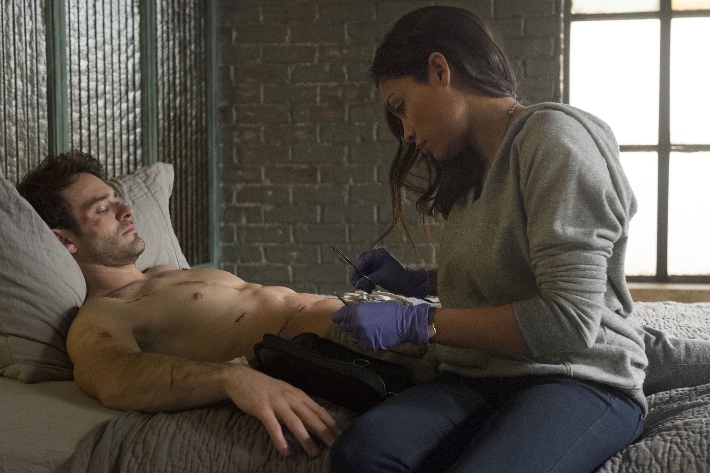

+++
type = "post"
titre = "<em>Daredevil</em>, Drew Goddard (Netflix)"
title = "Daredevil, Drew Goddard (Netflix)"
url = "/daredevil-goddard-netflix"
date = "2015-04-28T20:26:14"
Lastmod = "2015-04-28T23:10:50"
cover = "daredevil-goddard-deknight-netflix.jpg"
position = "top"
categorie = [ "À voir" ]
tag = [ "Adaptation bande-dessinée", "Comics", "Handicap", "Mafia", "Série", "Superhéros", "Ville" ]
createur = [ "Drew Goddard", "Netflix" ]
acteur = [ "Charlie Cox", "Deborah Ann Woll", "Elden Henson", "Rosario Dawson", "Toby Leonard Moore", "Vincent D'Onofrio" ]
annee = [ "2015" ]
weight = 2015
pays = [ "États-Unis" ]

+++

L&rsquo;univers de Marvel est décidément partout. Après avoir envahi les salles de cinéma, en particulier avec la saga <a href="http://voiretmanger.fr/saga/avengers/"><em>Avengers</em></a>, les superhéros imaginés par l&rsquo;éditeur vont bientôt être sur tous les petits écrans. Et c&rsquo;est Netflix qui a obtenu le gros lot, avec déjà cinq séries programmées et un cycle qui commence dès cette année avec <em>Daredevil</em>. Ce personnage, un petit peu sacrifié au cinéma avec une première adaptation qui n&rsquo;est pas restée dans les annales, est à mi-chemin entre les héros qui ont des pouvoirs surnaturels et ceux qui sont simplement riches ou astucieux. Avocat aveugle le jour, il devient un redoutable justicier masqué la nuit : ce n&rsquo;est pas le superhéros le plus original, mais la première saison de cette série créée par Drew Goddard choisit astucieusement la création du personnage. C&rsquo;est sans conteste l&rsquo;un des angles les plus intéressants pour les superhéros et <em>Daredevil</em> séduit pour cette raison. Malgré quelques défauts, cette première saison reste très plaisante à regarder !

Vous vous attendiez à découvre un Daredevil dans son costume près du corps rouge et noir ? Raté, la série présentée par Netflix ne s&rsquo;intéresse, dans cette première saison du moins, qu&rsquo;au personnage en construction et non au superhéros achevé. Les treize premiers épisodes évoquent ainsi la naissance du héros, ses balbutiements de sauveur et aussi ses origines. <em>Daredevil</em> commence alors que Matt Murdock devient vraiment avocat et s&rsquo;associe avec son meilleur ami, Foggy. Ils ont de grandes ambitions, non pas pour devenir de riches avocats d&rsquo;affaires, mais plutôt pour aider la veuve et l&rsquo;orphelin. Leur première affaire implique ainsi Karen, jeune femme impliquée dans un meurtre qui la désigne évidemment comme victime, mais qui se proclame innocente. Cette première défense lance l&rsquo;intrigue autour de quelques personnages clés et surtout de Wilson Fisk, le grand méchant de cette saison. <em>Daredevil</em> sait faire patienter les spectateurs en ne le dévoilant pas immédiatement, tout comme elle ne montre pas tout de suite le superhéros en costume. Tout est affaire de temps et il faut reconnaître que la mise en place progressive, sur quelques épisodes pour le vilain, sur une saison entière pour le gentil, est bien menée. Utilisant avec parcimonie les flashbacks, la série imaginée par Drew Goddard montre bien comment ce garçon aveuglé suite à un accident quand il avait neuf ans est devenu un combattant aguerri et une variante modernisée du Robin des Bois, toujours prêt à défendre le faible contre le plus fort. Charlie Cox est très à l&rsquo;aise avec son personnage, même s&rsquo;il a parfois un petit de mal à jouer l&rsquo;aveuglement et même si on ne sait jamais comment il « voit » aussi bien ce qui l&rsquo;entoure<a href="#fn-13598-1" rel="footnote">1</a>, et il constitue un superhéros crédible, car torturé. Entre quête de justice et plaisir de se battre, le personnage est bien dessiné et c&rsquo;est l&rsquo;un des points forts de <em>Daredevil</em>.

Les producteurs ont parié sur une ambiance sombre pour leur vision de <em>Daredevil</em>, un choix très moderne et qui a déjà fait ses preuves chez Christopher Nolan. Mais on peut dire que le responsable de la photographie a mis le paquet sur cet aspect, avec treize épisodes qui ne sortent jamais vraiment de la nuit et de scènes toutes aussi sombres les unes que les autres. Pour une série qui évoque le quotidien d&rsquo;un aveugle, on peut comprendre la logique, même si on peut trouver que c&rsquo;est parfois un petit peu trop systématique. La vision de la ville et surtout du quartier de Hell&rsquo;s Kitchen où se déroule l&rsquo;essentiel de l&rsquo;action est elle aussi pleine de noirceur et cette fois c&rsquo;est plus convaincant. L&rsquo;ensemble est plutôt réaliste, même si le pouvoir de Wilson Fisk qui semble infini est un petit peu suspect. Il faut dire que le méchant est à la tête d&rsquo;une organisation mafieuse qui contrôle tout, jusqu&rsquo;à la police, aux médias et aux juges. Il semble tout-puissant et les scénaristes auraient peut-être mieux faits de le montrer sous un angle plus mesuré. D&rsquo;ailleurs, ce personnage et de nombreux autres personnages secondaires souffrent de quelques faiblesses du côté de l&rsquo;écriture. Ils sont souvent intéressants et parfois très bien interprétés — Vincent D&rsquo;Onofrio, que l&rsquo;on avait brillamment découvert dans <a href="http://voiretmanger.fr/full-metal-jacket-kubrick/" title="Full Metal Jacket, Stanley Kubrick"><em>Full Metal Jacket</em></a> est vraiment pas mal en brute épaisse qui sait faire preuve de tendresse terrifiante en même temps —, mais il leur manque parfois un petit peu d&rsquo;épaisseur. On ne comprend pas toujours leurs motivations et certaines situations restent obscures jusqu&rsquo;au bout. Pourquoi Wilson s&rsquo;entiche brutalement de cette femme que l&rsquo;on ne comprend jamais vraiment ? Pourquoi Claire disparaît soudainement sans laisser de traces ? Pourquoi Foggy et Karen ne vont jamais plus loin dans leurs relations ? Peut-être qu&rsquo;une saison ne suffisait pas, mais <em>Daredevil</em> pèche dans ces relations, trop rapidement évoquées en général, si bien que ses personnages manquent un petit peu de corps. Dans un tout autre registre, les scènes de combat sont un petit peu trop systématiques et ne sont pas aussi spectaculaires qu&rsquo;on l&rsquo;aurait aimé.

Des reproches, c&rsquo;est vrai, mais il ne faudrait pas être trop sévère non plus : <em>Daredevil</em> marque la première incursion de Netflix dans le domaine des superhéros et c&rsquo;est un premier essai réussi dans l&rsquo;ensemble. L&rsquo;histoire est suffisamment prenante pour que l&rsquo;on soit happé par ces 13 épisodes et que l&rsquo;on ait envie d&rsquo;aller jusqu&rsquo;au bout pour découvrir comment Matt Marudock est devenu Daredevil. À cet égard, le contrat est bien rempli, mais maintenant que l&rsquo;on sait, toute la question est de savoir que faire ensuite. <em>Daredevil</em> pourra-t-elle exister au-delà de la naissance du personnage ? On le découvrira avec la deuxième saison…

<h3>Vous voulez <a href="http://voiretmanger.fr/soutien/">m&rsquo;aider</a> ?</h3>
<ul>
<li><a href="http://www.netflix.com/WiMovie/80018294?trkid=50263268">Regarder le film sur Netflix</a></li>
</ul>

<ol>
<li id="fn-13598-1">
C&rsquo;était l&rsquo;un des rares points forts de <em>Daredevil</em>, le film, on comprenait très bien que le personnage avait une vision basée sur les ultrasons. La série ne donne aucune justification et se contente de montrer un personnage aveugle, mais capable de se battre et de se déplacer sans le moindre problème. C&rsquo;est un peu gros et l&rsquo;explication aurait pu être donnée sans nuire à la série d&rsquo;aucune manière.&#160;<a href="#fnref-13598-1" rev="footnote">&#8617;</a>
</li>
</ol>

