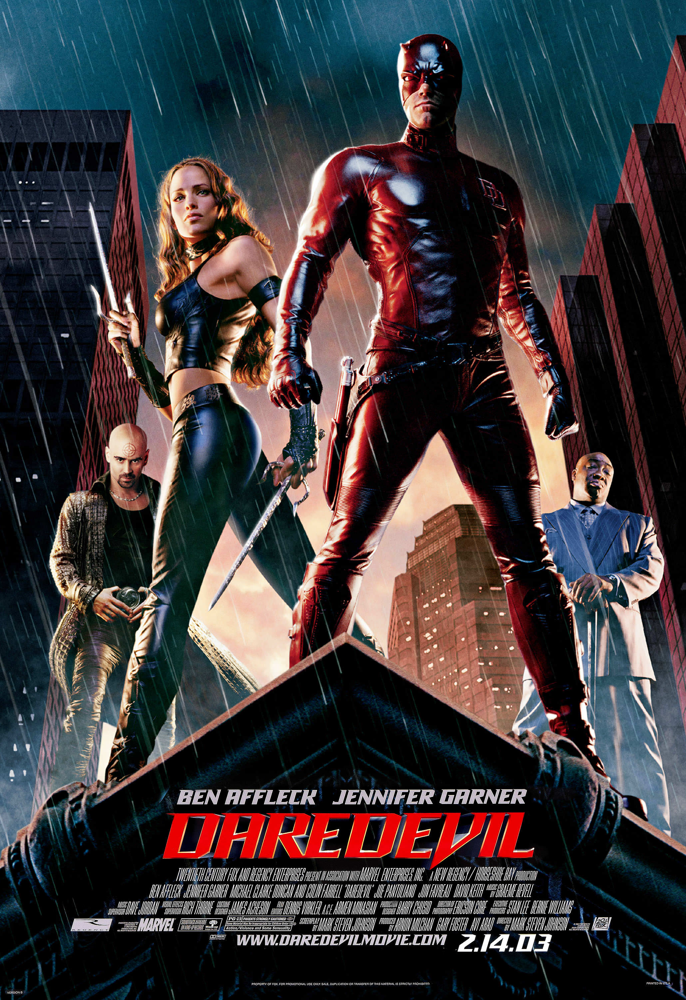
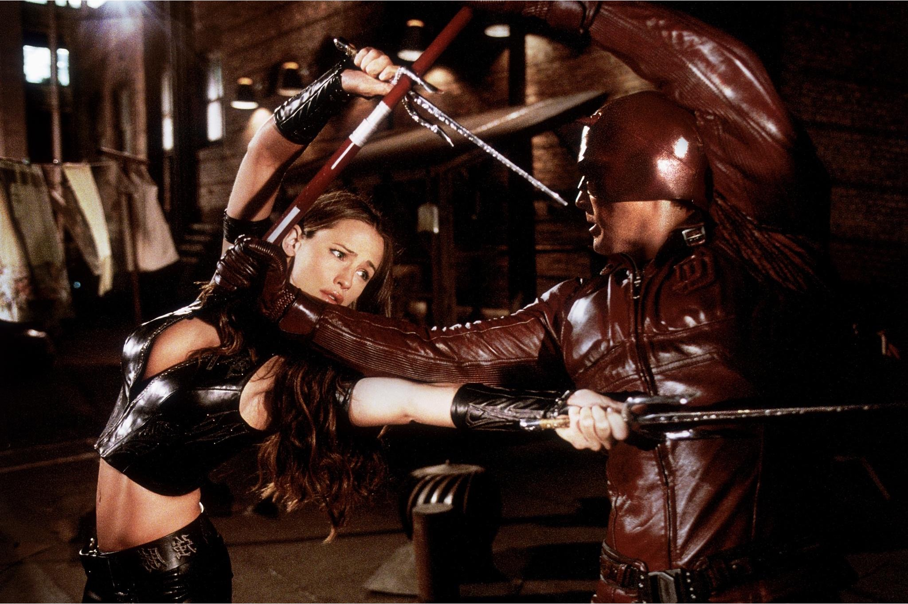
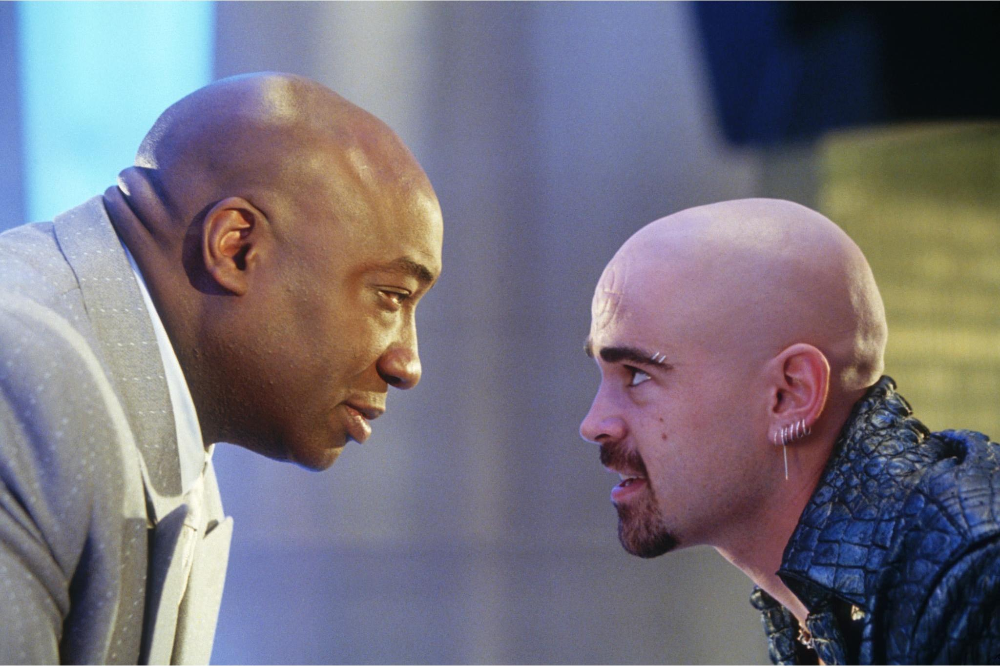

+++
type = "post"
titre = "<em>Daredevil</em>, Mark Steven Johnson"
title = "Daredevil, Mark Steven Johnson"
url = "/daredevil-johnson"
date = "2015-04-30T20:23:25"
Lastmod = "2015-04-30T20:25:38"
cover = "daredevil-ben-affleck.jpg"
categorie = [ "À voir" ]
tag = [ "Action", "Adaptation bande-dessinée", "Blockbuster", "Comics", "Mafia", "Superhéros", "Vite oublié" ]
createur = [ "Mark Steven Johnson" ]
acteur = [ "Ben Affleck", "Colin Farrell", "Jennifer Garner", "Joe Pantoliano", "Jon Favreau", "Michael Clarke Duncan" ]
annee = [ "2003" ]
weight = 2003
pays = [ "États-Unis" ]

+++

Douze ans avant sa <a href="http://voiretmanger.fr/daredevil-goddard-netflix/" title="Daredevil, Drew Goddard (Netflix)">renaissance à la télévision</a>, le personnage de Daredevil avait déjà fait l&rsquo;objet d&rsquo;un long-métrage. <em>Daredevil</em>, le film, n&rsquo;a pas laissé un très bon souvenir et il faut dire qu&rsquo;il n&rsquo;a pas beaucoup d&rsquo;arguments à faire valoir. Mark Steven Johnson a signé le scénario autant qu&rsquo;il l&rsquo;a réalisé et il est passé à côté d&rsquo;une très bonne parodie. Las, son film très premier degré tombe plutôt dans le ridicule, même s&rsquo;il faut reconnaître que son style, très proche des comics originaux, est réussi. Dans l&rsquo;ensemble, c&rsquo;est un divertissement plutôt raté, mais qui est convaincant sur un ou deux points.

Contrairement à la série télévisée portée par Netflix, le film de Mark Steven Johnson évoque le personnage de Daredevil, et non pas seulement sa naissance. Des flashbacks permettent naturellement de revenir sur la jeunesse de Matt Murdock et surtout son accident qui l&rsquo;a aveuglé alors qu&rsquo;il n&rsquo;avait que neuf ans, mais l&rsquo;essentiel du scénario concerne ses actions en tant que superhéros. <em>Daredevil</em> l&rsquo;oppose au caïd Wilson Fisk, le plus grand ennemi du personnage dans les bande-dessinées et dans les films, mais aussi à l&rsquo;un de ses hommes de main, surnommé le Tireur. En toile de fond, on croise aussi Foggy, son ami et avocat associé le jour et surtout Elektra, autre héroïne importante dans la mythologie Marvel. Bref, le scénario ne cherche pas l&rsquo;originalité à tout prix, mais il propose plutôt une adaptation à peu près fidèle, malgré quelques libertés notables prises avec les comics. L&rsquo;aveuglement du jeune Matt, par exemple, n&rsquo;est pas lié à son désir d&rsquo;aider un tiers, mais à la découverte du rôle de son père dans la mafia. Une volonté, sans doute, de renforcer la sympathie que l&rsquo;on doit ressentir pour le personnage, mais ce choix est significatif du plus gros problème de cette adaptation : elle est grossière.

Fallait-il que le grand méchant soit un énorme noir qui fume des cigares ? Michael Clarke Duncan en impose dans le rôle de Wilson Fisk et il est impressionnant, aucun doute à ce sujet, mais son interprétation est si grossière qu&rsquo;elle en devient comique. Le personnage du Tireur, interprété par un Colin Farrell en roue libre, est tout aussi caricatural, si bien que l&rsquo;on se croirait dans une parodie. Il n&rsquo;en est rien pourtant, <em>Daredevil</em> reste obstinément sérieux et on finit par s&rsquo;ennuyer un petit peu. C&rsquo;est dommage, car il y a aussi de bons éléments, à commencer par une photographie et une mise en scène très sombre et proche de la bande-dessinée. Certains plans sont des copies parfaites des cases du comics et on apprécie le traitement vraiment sombre de l&rsquo;histoire. Par ailleurs, même si la majorité des personnages n&rsquo;existent qu&rsquo;à travers des caricatures grossières, le héros est plutôt bien dessiné. Ben Affleck n&rsquo;est pas trop mauvais et surtout, on comprend parfaitement ses pouvoirs avec une représentation de son sonar très convaincante. D&rsquo;autant que Mark Steven Johnson exploite remarquablement bien ce filon, et pas seulement avec la scène mythique du baiser sur les toits et sous la pluie. Malheureusement, c&rsquo;est bien la seule chose qui est réussie, <em>Daredevil</em> pèche par ailleurs sur tous les points importants. Les effets numériques ont très mal vieilli, les décors ressemblent à du carton-pâte et la musique ne trompe personne sur son âge.

<em>Daredevil</em> n&rsquo;est peut-être pas aussi mauvais que certains veulent le dire, mais il n&rsquo;est en effet pas bon. La faute au traitement caricatural imposé à bon nombre de personnages, et surtout aux méchants, qui seraient drôles si le film n&rsquo;était pas aussi sérieux par ailleurs. Mark Steven Johnson s&rsquo;est contenté de copier des cases de bande-dessinée et c&rsquo;est souvent réussi, mais cela ne suffit pas à faire un bon film. Dommage, car son traitement des pouvoirs du superhéros aveuglé était réussi dans l&rsquo;ensemble.

<h3>Vous voulez <a href="http://voiretmanger.fr/soutien/">m&rsquo;aider</a> ?</h3>
<ul>
<li><a href="http://www.amazon.fr/gp/product/B003TP3VQI/ref=as_li_ss_tl?ie=UTF8&amp;tag=leblogdenic07-21&amp;linkCode=as2&amp;camp=1642&amp;creative=19458&amp;creativeASIN=B003TP3VQI">Acheter le film en Blu-ray sur Amazon</a></li>
<li><a href="http://www.amazon.fr/gp/product/B000BOEZNS/ref=as_li_ss_tl?ie=UTF8&amp;tag=leblogdenic07-21&amp;linkCode=as2&amp;camp=1642&amp;creative=19458&amp;creativeASIN=B000BOEZNS">Acheter le film en DVD sur Amazon</a></li>
<li><a href="https://itunes.apple.com/fr/movie/daredevil/id441600902">Acheter ou louer le film sur l&rsquo;iTunes Store</a></li>
</ul>

