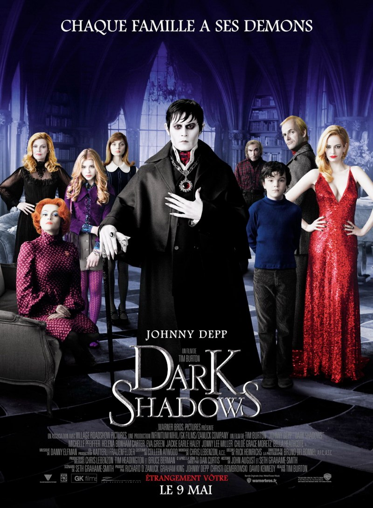
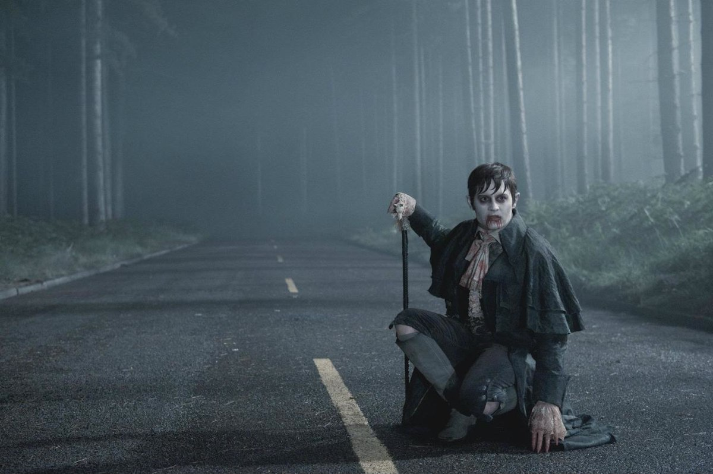
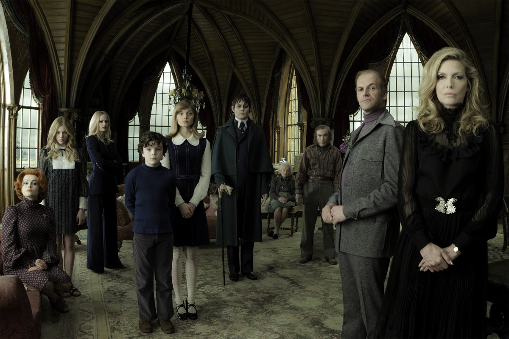

+++
titre = "<em>Dark Shadows</em>, Tim Burton"
title = "Dark Shadows, Tim Burton"
url = "/dark-shadows-burton"
date = "2012-05-09T23:42:05"
Lastmod = "2014-02-22T20:59:06"
cover = "dark-shadows-johnny-depp.jpg"
categorie = [ "À voir" ]
tag = [ "Blockbuster", "Famille", "Fantastique", "Humour", "Parodie", "Sexe", "Vampires", "Vite oublié" ]
createur = [ "Tim Burton" ]
acteur = [ "Chloë Grace Moretz", "Eva Green", "Helena Bonham Carter", "Johnny Depp", "Michelle Pfeiffer" ]
annee = [ "2012" ]
weight = 2012
pays = [ "États-Unis" ]

+++

Depuis le médiocre <a href="http://voiretmanger.fr/2010/03/25/alice-au-pays-des-merveilles-burton/"><em>Alice au Pays des Merveilles</em></a> sorti il y a deux ans, on n&rsquo;attendait plus grand-chose d&rsquo;un Tim Burton qui ne semblait plus capable que de caricaturer ses propres films. La bande-annonce de <em>Dark Shadows</em> n&rsquo;augurait rien de bon avec une sorte de <em><a href="http://voiretmanger.fr/2010/08/03/visiteurs-poire/">Visiteurs</a></em> dans un univers gothique de vampires. Le résultat est meilleur qu&rsquo;escompté, pour une simple raison : Tim Burton s&rsquo;est amusé à le réaliser et il a su le communiquer. <em>Dark Shadows</em> est divertissant, ce qui n&rsquo;est déjà pas si mal. Il n&rsquo;est pas beaucoup plus toutefois et peut s&rsquo;ajouter sans peine à la (longue) liste de ses films vite oubliés…

Barnabas Collins est un riche industriel de la côte Est des États-Unis. En ce milieu du XVIIIe siècle, son immense fortune repose sur la pêche, une activité très prospère qui a permis à sa famille de bâtir un immense manoir, mais aussi de donner son nom à la ville qui s&rsquo;étend non loin. Collinsport doit tout à la famille Collins et tout semble aller pour le mieux… jusqu&rsquo;au jour où Barnabas refuse de donner son cœur à Angélique Bouchard. Une erreur fatale qui met cette sorcière dans une colère noire : elle jette alors une malédiction sur la famille Collins tout entière, fait de Barnabas un vampire et l&rsquo;emprisonne à jamais dans un cercueil de métal. Deux siècles plus tard, les travaux de terrassement pour construire un MacDonald&rsquo;s sont l&rsquo;occasion de rouvrir le cercueil. Barnabas est bien vivant et il reprend contact avec un monde qu&rsquo;il ignore totalement. Et pour cause, en 200 ans, les États-Unis ont bien changé. Le vampire de 1752 débarque directement dans les années 1970 et le contact est explosif…

<em>Dark Shadows</em> commence assez mal, comme un clone de <em>Sweeney Todd</em>. On retrouve cette même ambiance portuaire poisseuse et mystérieuse à la fois et Tim Burton semble tourner à nouveau une scène qu&rsquo;il a déjà réalisée. Le cinéaste prend son temps pour installer son récit, un peu trop peut-être : le film met longtemps à commencer et il ne décolle vraiment que dans les années 1970. À partir de ce moment-là, le moteur principal du long-métrage se met en action : le décalage entre le vampire et la société contemporaine. La référence aux <em>Visiteurs</em> n&rsquo;est pas usurpée : Tim Burton, comme Jean-Marie Poiré, fait se rencontrer passé et présent dans une série d&rsquo;étapes qui sont parfois étonnamment similaires entre les deux films. On est frappé de voir Barnabas découvrir pour la première fois le bitume d&rsquo;une route et une voiture, plus tard c&rsquo;est avec une télévision qu&rsquo;il renouvelle sa surprise. À défaut d&rsquo;être originales, ces astuces de scénario offrent à <em>Dark Shadows</em> quelques moments comiques assez efficaces et les expressions archaïques du personnage principal font souvent mouche. L&rsquo;humour nait aussi de la parodie de films de genre et Tim Burton prend un malin plaisir à mimer toute une époque. On imagine que la série originale qui a inspiré ce long-métrage semble aujourd&rsquo;hui un peu kitsch et c&rsquo;est justement cette ambiance que le réalisateur a su retrouver, avec par exemple des fantômes un peu trop colorés.

Par certains aspects, <em>Dark Shadows</em> donne l&rsquo;impression que Tim Burton cherche à parodier et à moquer sa propre œuvre. Le second degré n&rsquo;est pas absent, même si cet aspect parodique n&rsquo;est pas toujours clairement assumé. Quoi qu&rsquo;il en soit, on sent que Tim Burton s&rsquo;est bien amusé à tourner ce film et l&rsquo;ambiance légère qui prédomine tranche avec le sérieux plombant d&rsquo;<em>Alice aux pays des merveilles</em>. <em>Dark Shadows</em> a au contraire tendance à aller loin, très loin même, dans le burlesque avec un final vraiment bizarre où les loups-garous rejoignent la clique déjà complète des monstres et autres morts-vivants du film. Cette légèreté sauve finalement <em>Dark Shadows</em> du désastre annoncé et ce manoir sombre et isolé rappelle les meilleurs moments du cinéaste, à commencer par <em>Edward aux mains d&rsquo;argent</em>. Légèreté, mais aussi liberté comme en témoigne la place du sexe dans le film : les vampires ont toujours été associés à une sexualité débridée représentée par l&rsquo;acte de la morsure, symbole de pénétration et de dépucelage. Tim Burton n&rsquo;a manifestement pas oublié cet aspect de la légende et il a fait de Bartabas un véritable obsédé qui ne peut s&rsquo;empêcher de coucher avec la sorcière qu&rsquo;il hait profondément au cours d&rsquo;une scène torride. Plus que l&rsquo;amour, notion qui semble ici illusoire comme en témoigne aussi la famille complètement explosée, c&rsquo;est le sexe qui semble central dans <em>Dark Shadows</em>. Une relecture osée du mythe du vampire qui est au passage à l&rsquo;origine de plusieurs moments comiques.

Tim Burton a peut-être pris conscience qu&rsquo;il tournait un peu en rond. Si <em>Dark Shadows</em> reste un film extrêmement bourbonien dans l&rsquo;esprit et la forme, il en fait trop pour ne pas être légèrement parodique. Attendons de voir ce que le cinéaste fera ensuite, cette quinzième réalisation restant dans la droite ligne de ses travaux antérieurs. On retrouve donc une ambiance gothique à base d&rsquo;images dénaturées et de brouillard, des personnages excentriques blafards et isolés ou encore des créatures plus ou moins monstrueuses. L&rsquo;amateur de Tim Burton sera là en terrain connu, le détracteur devrait trouver autant de raisons de ne pas aimer ce <em>Dark Shadows</em>. La légèreté de l&rsquo;ensemble est bienvenue, elle évite au film de se prendre trop au sérieux et offs ainsi un spectacle léger et divertissant, même s&rsquo;il est aussi mal rythmé avec une bien trop longue entrée en matière et une fin qui s&rsquo;étire aussi un peu. Pas grand-chose à redire sur le plan technique toutefois, la musique des années 1970 s&rsquo;intègre bien à celle de Danny Elfman, toujours présent, les effets spéciaux sont parfois très réussis — mention spéciale pour la mort de la sorcière — et Johnny Depp est étonnamment plutôt sobre. L&rsquo;acteur habitué des rôles principaux chez Tim Burton est ici non seulement acteur, mais aussi coproducteur et il a su pour une fois éviter le cabotinage façon <em>Pirates des Caraïbes</em>, ce qui sert son rôle. À ses côtés, Eva Green fait une sorcière convaincante — c&rsquo;est d&rsquo;ailleurs le meilleur personnage du film — tandis que Helena Bonham Carter est égale à elle-même, pas plus.

Avec <em>Dark Shadows</em>, Tim Burton réussit à nouveau à divertir et même à faire rire. Ce n&rsquo;est déjà pas si mal et on se met à espérer qu&rsquo;il oublie de se prendre trop au sérieux à l&rsquo;avenir. <em>Dark Shadows</em> est un bon divertissement et une comédie agréable, mais guère plus. Le film ne restera pas dans les annales, mais c&rsquo;est une bonne idée pour une séance en famille.

<h3>Vous voulez m&rsquo;aider ?<a href="#footnote_0_6416" id="identifier_0_6416" class="footnote-link footnote-identifier-link" title="&Agrave; propos de la publicit&eacute;&hellip;">1</a></h3>
<ul>
<li><a href="http://www.amazon.fr/gp/product/B008208VHE/ref=as_li_ss_tl?ie=UTF8&#038;tag=leblogdenic07-21&#038;linkCode=as2&#038;camp=1642&#038;creative=19458&#038;creativeASIN=B008208VHE">Acheter le film en Blu-Ray et DVD sur Amazon</a></li>
<li><a href="http://www.amazon.fr/gp/product/B008208VO2/ref=as_li_ss_tl?ie=UTF8&#038;tag=leblogdenic07-21&#038;linkCode=as2&#038;camp=1642&#038;creative=19458&#038;creativeASIN=B008208VO2">Acheter le film en DVD sur Amazon</a></li>
<li><a href="http://itunes.apple.com/fr/movie/dark-shadows/id548995617">Acheter ou louer le film sur l&rsquo;iTunes Store</a></li>
</ul>

<ol class="footnotes"><li id="footnote_0_6416" class="footnote"><a href="http://nicolinux.fr/soutien/">À propos de la publicité…</a> [<a href="#identifier_0_6416" class="footnote-link footnote-back-link">&#8617;</a>]</li></ol>
