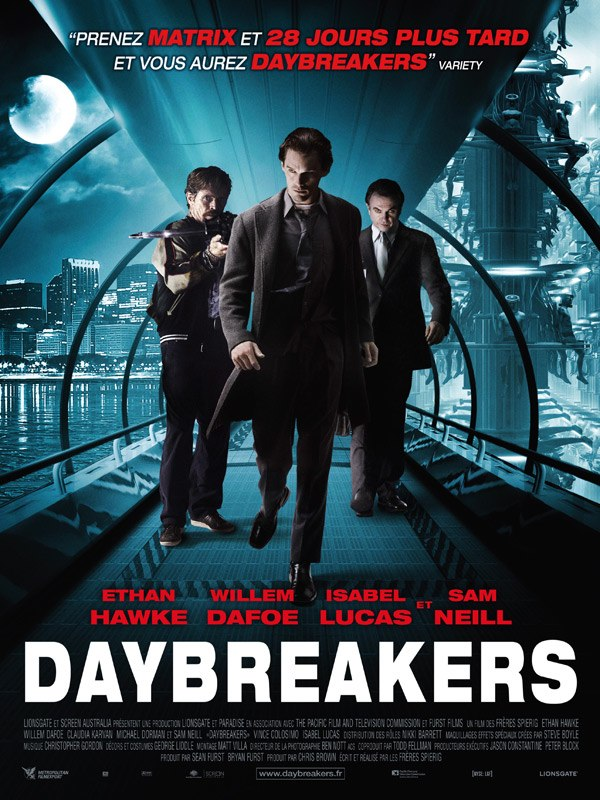
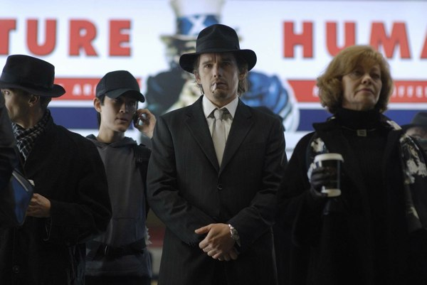
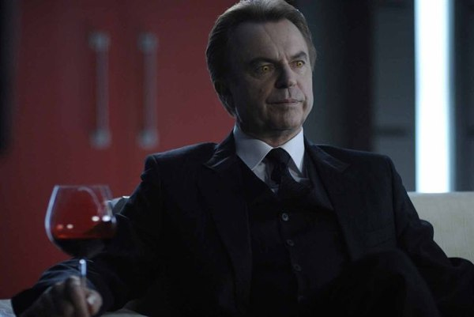

+++
titre = "Daybreakers, Michael et Peter Spierig"
title = "Daybreakers, Michael et Peter Spierig"
url = "/daybreakers-spierig"
date = "2010-03-05T23:41:31"
Lastmod = "2010-03-05T23:51:39"
cover = "daybreakers-michael-peter-spierig.jpg"
categorie = [ "À voir" ]
tag = [ "Gore", "Science-Fiction", "Vampires", "Vite oublié" ]
createur = [ "Michael et Peter Spierig" ]
annee = [ "2010" ]
weight = 2010
pays = [ "États-Unis" ]

+++

Après une semaine éprouvante, quoi de mieux qu&rsquo;un bon petit film pas fatiguant ? Fort de cette idée, je suis allé voir <em>Daybreakers</em> des frères Spierig. Las, ce film de vampires fauché ne m&rsquo;a même pas amusé, juste ennuyé… Dommage, l&rsquo;idée était bonne.

Nous sommes en 2019 et un virus a transformé quasiment tous les hommes sur terre en vampires. Les anciennes proies sont devenues de terribles chasseurs traquant sans relâche les derniers survivants de la race humaine pour récupérer leur sang. C&rsquo;est que les vampires ne sont pas faits pour dominer : ils ont besoin de réserves de sang humain importantes et donc d&rsquo;une population humaine plus importante que le nombre de vampires<a href="#footnote_0_2937" id="identifier_0_2937" class="footnote-link footnote-identifier-link" title="Apparemment, les vampires ici ne peuvent pas &ecirc;tre v&eacute;g&eacute;tariens, comme dans Twilight, et ne boire que du sang animal&hellip;">1</a>. Alors que le principal vendeur de sang humain des États-Unis cherche à créer un remplaçant chimique au sang humain, les tensions montent dans le monde entier en même temps que les réserves de sang diminuent. La privation de sang humain produit d&rsquo;étonnants résultats, les vampires se transforment alors en monstres mi-humains mi-chauve-souris avides de sang, quel qu&rsquo;il soit.

C&rsquo;est toute la société de vampires qui est alors menacée. <em>Daybreakers</em> la présente dans un premier temps de manière relativement convaincante. Quand le vampire est la norme, de nombreuses choses changent, et notamment l&rsquo;inversion des rôles entre les journées et les nuits. Les maisons sont bien isolées de la lumière du jour, tandis que des couloirs souterrains ont été aménagés dans toutes les villes et que les voitures sont dotées d&rsquo;un mode diurne pour permettre à ceux qui en ont besoin de vaquer à leurs occupations de jour. Les restaurants sont devenus inutiles, de même que les centres commerciaux, on boit à la place du café mêlé de sang le matin et du sang &laquo;&nbsp;on the rocks&nbsp;&raquo; en guise d&rsquo;apéritif. Néanmoins, 2019 n&rsquo;est pas très loin, et il est difficile de parler de science-fiction tant l&rsquo;univers montré par les frères Spierig est proche et familier du nôtre. On roule toujours à voitures, même si celles-ci font un petit bruit électrique, on fume toujours es cigarettes, on porte des vêtements toujours aussi sombres, on prend le métro, on dispose toujours de télés à écran plat… Le film reste très sage, même si on repère quelques éléments modernes, la domotique ou la généralisation de la télé-surveillance.

L&rsquo;inversion du rapport entre les humains et les vampires est intéressante, mais pas très originale en soi. On la retrouve par exemple dans <em>I Am a Legend</em> (la nouvelle, pas le film), ou bien dans la récente série <em>True Blood</em> (paraît-il, elle est toujours dans ma liste des séries à voir). Mais après tout, pourquoi pas, un film n&rsquo;a pas à proposer des histoires totalement nouvelles et puis les films privilégient souvent la contamination que ce qui arrive après. La dystopie que proposent Michael et Peter Spierig avait tout pour me plaire, mais elle ne fonctionne jamais vraiment. Tout sonne faux dans cet univers, on ne croit pas vraiment à ce monde bien trop similaire au nôtre, pas plus qu&rsquo;on ne croit en ces personnages caricaturaux. Le héros est un vampire non consentant qui refuse de boire du sang humain, mais sinon on se demande bien ce qu&rsquo;il fait dans l&rsquo;histoire, tant il paraît indifférent à ce qui l&rsquo;entoure. Le méchant est vraiment très méchant, et il ne pense qu&rsquo;à pomper le plus de sang possible pour le revendre à prix d&rsquo;or, sans jamais envisager la guérison. Il est si méchant qu&rsquo;il va jusqu&rsquo;à condamner sa propre fille, c&rsquo;est dire. Le héros croise la route de véritables justes des temps modernes, des humains qui cachent et protègent d&rsquo;autres humains impitoyablement traqués par des armées de vampires.

<em>Daybreakers</em> est un film fauché, réalisé avec trois francs six sous, et cela se voit du début à la fin. La réalisation est très légère, les effets spéciaux souvent grossiers et le nombre des décors doit tenir sur les doigts d&rsquo;une main (allez, peut-être deux). Les réalisateurs font ce qu&rsquo;ils peuvent pour pallier le faible budget, et apparemment ils ont eu des prix sur l&rsquo;hémoglobine de cinéma qui coule ici à flot. Les membres volent, les entrailles s&rsquo;étalent… l&rsquo;interdiction au moins de 12 ans n&rsquo;est pas de trop. Cette réalisation au rabais n&rsquo;aide pas à croire à l&rsquo;univers, certes, mais je crois que c&rsquo;est le scénario qui est le premier responsable. C&rsquo;est que le budget a été si restreint que les frères Spierig n&rsquo;ont pas jugé bon d&rsquo;avoir un scénario qui puisse rendre leur film ne serait-ce que vaguement intéressant. L&rsquo;action avance en roue libre, un coup le soleil explose le vampire instantanément, le coup suivant il brule à peine au second degré le vampire, tandis que la &laquo;&nbsp;dévampirisation&nbsp;&raquo; (© Rob Gordon) est vraiment ridiculement simple… J&rsquo;ai bien essayé de m&rsquo;accrocher aux branches, de pardonner les erreurs, mais du coup je ne suis jamais entré dans le récit. Une faute impardonnable pour un blockbuster digne de ce nom, le plaisir pur passant d&rsquo;abord par une adhésion complète du spectateur à l&rsquo;univers du film.

Le résultat est un film plutôt faible. J&rsquo;aimais l&rsquo;idée de départ et j&rsquo;attendais un film pas forcément très original, pas très bien réalisé, mais au moins fun. Ni les acteurs (pas exceptionnels il faut dire), ni les quelques bonnes idées scénaristiques (comme la course-poursuite où le véritable ennemi n’est plus les balles, mais les rayons du soleil) ne parviennent à compenser un scénario aussi malmené que la réalisation est pauvre et pleine du &laquo;&nbsp;charme&nbsp;&raquo; kitsch des séries à l&rsquo;ancienne. Il ne reste pas grand-chose à sauver de <em>Daybreakers</em>, et j&rsquo;ai vu le temps passer (heureusement, le film est court). Dommage pour un film censé me détendre…

<a href="http://www.filmosphere.com/2010/02/critique-daybreakers-2009/">Nicolas</a> de Filmosphère était assez enthousiaste, de même que la <a href="http://laternamagika.wordpress.com/2010/02/27/daybreakers-de-michael-et-peter-spierig/">Lanterne magique</a>. Je suis plus d&rsquo;accord avec <a href="http://www.toujoursraison.com/2010/03/daybreakers.html">Rob</a> ou avec <a href="http://www.leblogducinema.com/2010/02/21/critique-daybreakers/">Le blog du cinéma</a>. Quant à la critique plus traditionnelle, c&rsquo;est simple, elle a tout simplement ignoré le film. Difficile de lui en vouloir néanmoins.

<ol class="footnotes"><li id="footnote_0_2937" class="footnote">Apparemment, les vampires ici ne peuvent pas être végétariens, comme dans <em><a href="http://voiretmanger.fr/tag/twilight/">Twilight</a></em>, et ne boire que du sang animal… [<a href="#identifier_0_2937" class="footnote-link footnote-back-link">&#8617;</a>]</li></ol>
