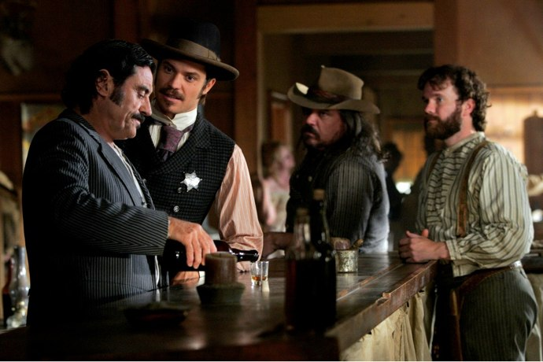
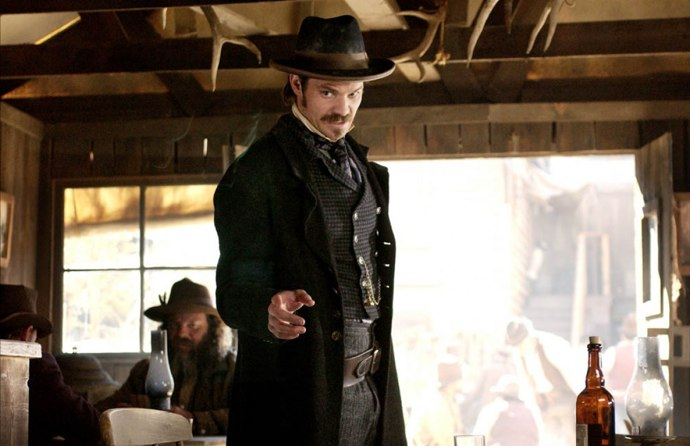
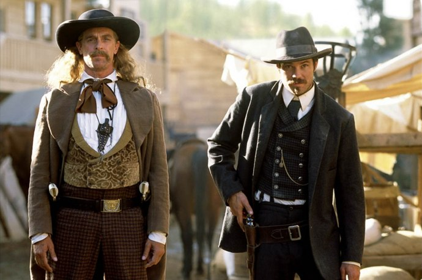
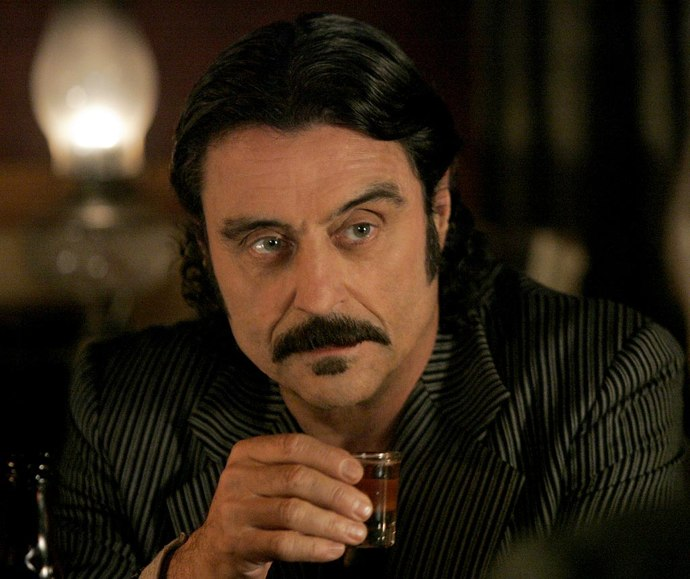

+++
type = "post"
titre = "<em>Deadwood</em>, David Milch (HBO)"
title = "Deadwood, David Milch (HBO)"
url = "/deadwood-hbo"
date = "2010-05-10T00:38:19"
Lastmod = "2014-11-29T18:07:11"
cover = "deadwood.jpg"
categorie = [ "À voir" ]
tag = [ "Politique", "Série", "Télévision", "Violence", "Western" ]
createur = [ "David Milch", "HBO" ]
acteur = [ "Ian McShane", "John Hawkes", "Molly Parker", "Timothy Olyphant" ]
annee = [ "2004" ]
weight = 2004
pays = [ "États-Unis" ]

+++

<em>Deadwood</em> est l&rsquo;une des séries de HBO, chaîne de télévision américaine célèbre pour ses séries originales et d&rsquo;une qualité rare, surtout par sa constance. <a href="/six-feet-under-ball-hbo/" title="Six Feet Under, Alan Ball (HBO)"><em>Six Feet Under</em></a> reste ainsi, pour moi, la meilleure série que j&rsquo;ai vu, tous genres confondus. Pour la première fois, on vivait avec des gens qui semblaient, au bout de six ans et autant de saisons, familiers, comme des vieux amis qui n&rsquo;ont même plus besoin de parler pour que l&rsquo;on comprenne ce qu&rsquo;il ressente. Un sentiment étrange, impossible au cinéma et que seule la littérature avait pu apporter jusque-là.

HBO est une valeur sûre et la chaîne le prouve à nouveau avec <em>Deadwood</em>. En quelques épisodes, cette série a redéfini rien de moins que le western, classique parmi les classiques du cinéma pourtant. Un western dépoussiéré des codes parfois pesants imposés par les versions &laquo;&nbsp;spaghetti&nbsp;&raquo; et un western certainement beaucoup plus proche de la réalité. La série s&rsquo;inspire d&rsquo;ailleurs de faits réels et décrit une communauté d&rsquo;opportunistes où toute autre loi que celle du plus fort peine à se faire entendre. <em>Deadwood</em> est une excellente série, que je recommande à tous les amateurs. Voici pourquoi…

Le récit de l&rsquo;ensemble de la série est bien trop dense et complexe pour être rapporté ici. Mine de rien, il s&rsquo;en passe des choses en trois saisons de douze épisodes de 50 minutes environ. Certains personnages clés meurent, d&rsquo;autres entrent en scène et bousculent un univers à l&rsquo;équilibre précaire. <em>Deadwood</em> suit grosso modo Bullock, ancien shérif qui décide de tout abandonner pour tenter sa chance dans le grand Ouest américain, terre de la conquête de l&rsquo;or bien sûr. Accompagnés de son fidèle ami Seth, ils viennent à <a href="http://fr.wikipedia.org/wiki/Deadwood_(Dakota_du_Sud)">Deadwood</a>, dans le <a href="http://maps.google.com/maps?q=deadwood&amp;ie=UTF8&amp;hq=&amp;hnear=Deadwood,+Comt%C3%A9+de+Lawrence,+Dakota+du+Sud&amp;ll=42.972502,-103.007812&amp;spn=12.665092,32.453613&amp;z=6">Dakota du Sud</a>,  pour ouvrir une quincaillerie. Très vite, Bullock retrouvera sa position antérieure pour devenir le shérif du petit bourg.

Les faits se déroulent en effet à la fin des années 1870, une époque où le territoire américain se construit et s&rsquo;organise politiquement. C&rsquo;est une étape essentielle dans la formation des États-Unis actuels et les villes hors la loi comme Deadwood sont sommées de rentrer dans le rang, de s&rsquo;institutionnaliser. Cet aspect politique est essentiel et se trouve au cœur de <em>Deadwood</em>. Le problème des élections, les tractations avec les territoires voisins, la peur de perdre les avantages d&rsquo;un cadre hors-la-loi et donc sans contraintes sont des questions qui reviennent sans cesse. On suit les hommes qui participent à cette institutionnalisation, qui en sont les acteurs principaux puisqu&rsquo;ils ont tout à perdre, ou au contraire à gagner, dans ce processus. C&rsquo;est un univers corrompu et très dangereux qui s&rsquo;offre à nos yeux : les armes sont indispensables, même si l&rsquo;affrontement violent n&rsquo;a pas toujours lieu. Il s&rsquo;agit en permanence de rappeler sa puissance dans un rapport de force permanent où chacun essaie de déterminer ce que le camp adverse peut faire. De ce fait, <em>Deadwood</em> est parcouru par la violence et on serait bien en peine de dire combien de cadavres parsèment les trois saisons. C&rsquo;est d&rsquo;autant plus difficile que les cadavres font rarement long feu, les cochons du cru se nourrissant manifestement d&rsquo;abord de chair humaine. Des salauds meurent, mais aussi des innocents, des victimes de dégâts collatéraux, voire simplement des personnes qui se sont trouvées au mauvais endroit, au mauvais moment. La mort fait partie du quotidien des hommes et femmes de la ville, comme le grand cimetière qui la borde en témoigne d&rsquo;ailleurs très bien.

La violence de cet univers est également très bien retranscrite par les dialogues, grossiers à souhait. C&rsquo;est bien simple, je n&rsquo;avais jamais entendu des dialogues avec une telle densité de jurons. Ils ne sont pas très variés néanmoins, l&rsquo;essentiel tournant autour du mot &laquo;&nbsp;<em>cocksucker</em>&nbsp;&raquo; (que l&rsquo;on traduirait sans doute par &laquo;&nbsp;enculé&nbsp;&raquo;), aussi utilisé à Deadwood que le &laquo;&nbsp;<em>fuck</em>&nbsp;&raquo; l&rsquo;est aujourd&rsquo;hui aux États-Unis. Ça jure dans tous les sens, ça blasphème à tout va&#8230; nul n&rsquo;est épargné, surtout pas un Dieu d&rsquo;ailleurs très absent de cet univers. Les dialogues sont certainement l&rsquo;un des points forts de cette série et c&rsquo;est souvent le cas des feuilletons télévisés marqués des lettres de HBO. S&rsquo;ils sont grossiers, ils sont aussi très intelligents, faisant avancer l&rsquo;intrigue de manière le plus souvent légère, par petites touches et en évitant les lourdes explications pompeuses qui décrédibiliseraient totalement l&rsquo;univers. Or justement, cet univers est une grande force et il ne fait aucun doute que les chercheurs d&rsquo;or de 1870 dans le Dakota du Sud n&rsquo;étaient pas des gentlemen s&rsquo;exprimant dans un anglais parfaitement châtié, mais des hommes un peu bruts de décoffrage prêts à en découdre.

Le style HBO se reconnaît aussi, outre par le générique toujours aussi splendide, par les personnages que <em>Deadwood</em> met en scène. Des personnages réalistes et passionnants, car pleins de faiblesses et croqués avec finesse. Et ces faiblesses sont toujours discrètement suggérées, souvent connues du seul spectateur : on voit ainsi les doutes d&rsquo;Al Swearegen, puissant patron du premier saloon de Deadwood, quand il les expose au scalp d&rsquo;un Indien qu&rsquo;il a tué longtemps auparavant, ou alors à l&rsquo;une de ses putes, ce qui revient au même sur le plan social. Quelques mots, un regard suffisent à signifier que cet homme ne joue les insensibles que pour mieux cacher sa très grande sensibilité. On peut penser ce que l&rsquo;on veut des séries, mais c&rsquo;est certainement le seul support qui puisse se permettre d&rsquo;approfondir à ce point la psychologie de personnages et de les rendre réalistes, ou du moins crédibles. Trop souvent au cinéma, on entend le scénario, on voit avancer l&rsquo;intrigue avec ses grosses ficelles. Toutes les séries n&rsquo;évitent pas ces travers, mais pas <em>Deadwood</em> qui réussit à créer un univers et des personnages vraiment crédibles et attachants, avec leurs imperfections. Les plus intéressants sont, comme toujours je crois, les plus méchants, les plus cyniques, ceux qui sont prêts à tout pour imposer leur vision et surtout leur business. C&rsquo;est un monde où seul l&rsquo;argent compte, ce qui est, à n&rsquo;en pas douter, on ne peut plus réaliste

<em>Deadwood</em> est une fiction, mais qui s&rsquo;inspire de faits réels et les personnages ayant réellement existé sont finalement très nombreux. On croise quelques légendes du Far West, comme Wild Bill Hickok ou Calamity Jane, mais le shérif Bullock ou Al Swaeregen ont bel et bien existé. Ce mélange entre réalisme historique — la reconstitution est impressionnante — et fiction est très intéressant et l&rsquo;on apprend des tas de choses sur la conquête de l&rsquo;Ouest simplement en regardant <em>Deadwood</em>. La série brasse d&rsquo;autres thématiques, comme le mélange des cultures (d&rsquo;où le fameux <em>melting pot</em>) et les cohabitations difficiles, notamment entre Chinois et Blancs, mais aussi entre les anciens esclaves noirs et les anciens esclavagistes. L&rsquo;histoire se répète, nous dit aussi cette série décidément très riche.

Le succès de <em>Deadwood</em> doit beaucoup, comme toujours avec les séries, aux performances de ses acteurs. S&rsquo;ils ne sont pas tous également bons, la qualité de jeu est indéniablement au rendez-vous. Il faut ici évoquer Ian McShane, acteur britannique qui campe un extraordinaire Al Swaeregen. Qu&rsquo;il jure comme un charretier ou qu&rsquo;il devienne mielleux et terriblement doux, il est toujours excellent et tient le rôle de bout en bout sans jamais faiblir. Cela tombe bien, c&rsquo;est un personnage central dans Deadwood et c&rsquo;est le véritable héros pour moi de toute la série. Elle serait certainement beaucoup plus faible sans Al, tout comme le camp tournerait beaucoup moins bien.

La série n&rsquo;a duré que trois saisons. Trois saisons seulement alors qu&rsquo;une quatrième était prévue et que la troisième s&rsquo;arrête manifestement à un tournant laissant entrevoir de nombreuses opportunités scénaristiques. <em>Deadwood</em> n&rsquo;a pas trouvé son public, comme on dit pudiquement, et elle coûtait très chère à produire en raison de la taille de ses décors et du nombre d&rsquo;acteurs impliqués. Une ville entière à filmer, c&rsquo;est effectivement un travail énorme et on peut comprendre la décision de HBO. C&rsquo;est néanmoins vraiment regrettable et je ne comprends pas que <em>Deadwood</em> soit passé à côté du succès. Je place cette série dans les toutes premières places de mon Panthéon des séries, juste derrière <em>Six Feet Under</em> et <a href="/weeds-kohan-showtime/" title="Weeds, Jenji Kohan (Showtime)"><em>Weeds</em></a> qui est <em>Desperate Housewives</em>, mais la drogue en plus qui en fait tout l&rsquo;intérêt.

On ne connaîtra donc jamais la fin de <em>Deadwood,</em> mais ce qu&rsquo;il reste de la série mérite amplement d&rsquo;être vu. Je recommande à tous les amateurs de séries américaines de regarder <em>Deadwood</em> : vous ne regretterez pas cette plongée dans le terrible et magnifique Far West !

<h3>Vous voulez m&rsquo;aider ?</h3>
<ul>
<li><a href="http://www.amazon.fr/gp/product/B000Y1CX50/ref=as_li_ss_tl?ie=UTF8&tag=leblogdenic07-21&linkCode=as2&camp=1642&creative=19458&creativeASIN=B000Y1CX50">Acheter l&rsquo;intégralité de la série en DVD sur Amazon</a></li>
<li><a href="http://www.amazon.fr/gp/product/B000JLQMFC/ref=as_li_ss_tl?ie=UTF8&tag=leblogdenic07-21&linkCode=as2&camp=1642&creative=19458&creativeASIN=B000JLQMFC">Acheter la saison 1 en DVD sur Amazon</a></li>
<li><a href="http://www.amazon.fr/gp/product/B000SAG9IE/ref=as_li_ss_tl?ie=UTF8&tag=leblogdenic07-21&linkCode=as2&camp=1642&creative=19458&creativeASIN=B000SAG9IE">Acheter la saison 2 en DVD sur Amazon</a></li>
<li><a href="http://www.amazon.fr/gp/product/B000PD3J6Y/ref=as_li_ss_tl?ie=UTF8&tag=leblogdenic07-21&linkCode=as2&camp=1642&creative=19458&creativeASIN=B000PD3J6Y">Acheter la saison 3 en DVD sur Amazon</a></li>
</ul>

