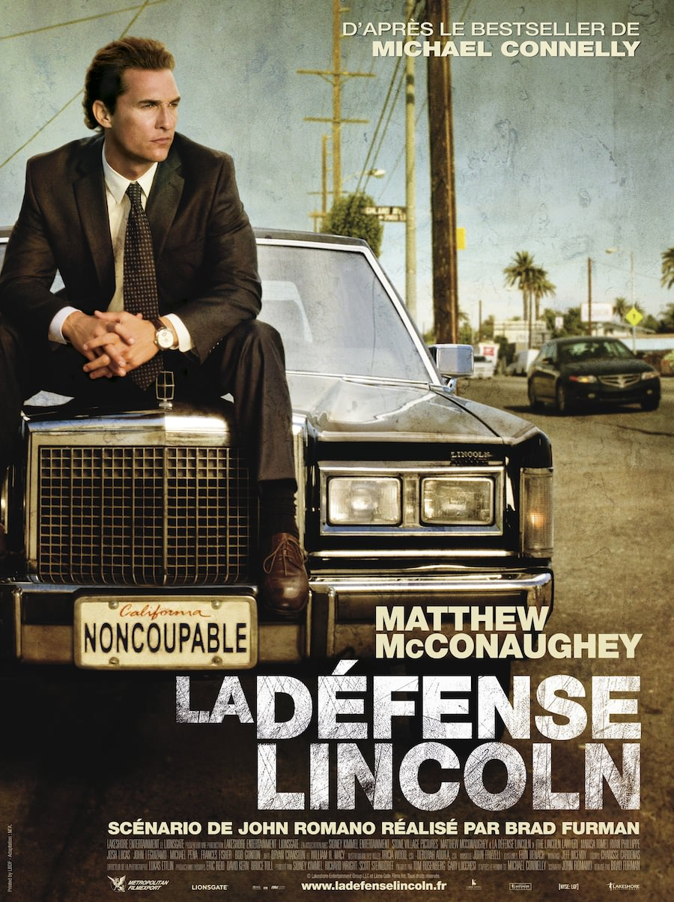
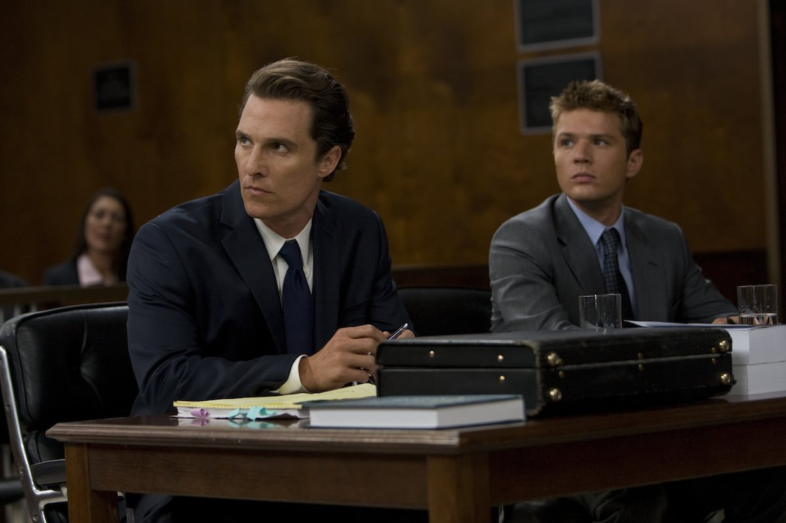

+++
titre = "La Défense Lincoln, Brad Furman"
title = "La Défense Lincoln, Brad Furman"
url = "/defense-lincoln-furman"
date = "2012-08-12T01:24:23"
Lastmod = "2012-08-12T11:03:41"
cover = "furman-la-defense-lincoln.jpg"
categorie = [ "À voir" ]
tag = [ "Procès", "Société", "Thriller", "Violence", "Vite oublié" ]
createur = [ "Brad Furman" ]
acteur = [ "Bryan Cranston", "Marisa Tomei", "Matthew McConaughey", "Ryan Phillippe" ]
annee = [ "2011" ]
weight = 2011
pays = [ "États-Unis" ]

+++

Peut-on défendre un criminel sans arrière-pensée ? C&rsquo;est en quelque sorte la question posée par <em>La Défense Lincoln</em>, premier long-métrage de Brad Furman et adaptation d&rsquo;un roman à succès écrit par Michael Connelly. Dans ce film de procès, un avocat spécialisé dans la défense de coupables et habitué aux mensonges et manipulations de jury est confronté à un autre manipulateur. S&rsquo;ouvre alors un duel très efficace, à défaut d&rsquo;être particulièrement original.

Michael Haller est avocat à Los Angeles. Spécialisé dans la défense de petits criminels, il s&rsquo;est forgé une réputation de manipulateur hors pair, capable d&rsquo;inverser la tendance même sur les cas les plus désespérés. Ses clients sont tous peu fortunés toutefois et il ne roule pas sur l&rsquo;or, mais dans une vieille Lincoln qui lui sert aussi de bureau. Un jour, il tombe sur le dossier qui devrait le rendre riche, celui de Louis, fils d&rsquo;une richissime famille. Il se retrouve impliqué dans une sordide affaire impliquant une prostituée et contre toute attente, il fait appel à Michael pour le défendre. Ce dernier accepte sans hésiter, l&rsquo;affaire lui semble entendue et il peut ainsi gagner une belle somme. Brad Furman nous fait vite comprendre que cela ne sera pas aussi simple et <em>La Défense Lincoln</em> s&rsquo;oriente alors vers le thriller, sans toutefois quitter le genre du film de procès. Persuadé dans un premier temps que son client est innocent, Michael Haller s&rsquo;aperçoit vite que le récit de Louis ne fonctionne pas et qu&rsquo;il est coupable. D&rsquo;habitude cela ne lui pose aucun problème, mais cette fois-ci, il ne peut pas défendre cet homme. Problème, Louis est dangereux et puissant et tout l&rsquo;enjeu du film consiste justement pour lui à trouver un moyen de faire condamner son client, sans que ce dernier ne s&rsquo;en aperçoive et s&rsquo;en prenne à lui. Michael commence alors à élaborer une stratégie complexe qui tient le film jusqu&rsquo;à ses dernières secondes, pour former un duel à mort dans lequel l&rsquo;issue reste très longtemps incertaine.

Inconnu jusqu&rsquo;à ce premier film, Brad Furman compose soigneusement <em>La Défense Lincoln</em>, sans faire des étincelles, mais de manière tout à fait honorable. Le scénario est assez complexe, il exige de son spectateur une concentration de tous les instants pour ne pas se perdre dans les noms et les sous-intrigues. Le cinéaste est parvenu toutefois à ne jamais perdre ses spectateurs attentifs et à les mener le long de son intrigue et de ses multiples rebondissements. À plusieurs reprises, on croit savoir ce qui va se passer, mais <em>La Défense Lincoln</em> réussit à nous surprendre en allant plus loin encore. Le suspense est indéniable, même si on sait globalement dès le départ qui gagne à la fin, mais Brad Furman parvient même à nous en faire douter. Au total, le film n&rsquo;est indéniablement pas ce qui se fait de plus original, mais il s&rsquo;avère vraiment efficace et bien mené et il est ainsi parfait pour une séance divertissante, à condition de rester concentré pendant ses quasiment deux heures. Il faut souligner le rôle des acteurs dans cette réussite, avec un très bon duo Matthew McConaughey, excellent en avocat prêt à tout, et Ryan Phillippe, parfait en beau-gosse inquiétant.

<em>La Défense Lincoln</em> ne révolutionne pas le genre, mais Brad Furman propose un film de qualité et un scénario qui sait ménager quelques zones d&rsquo;ombres et ainsi maintenir le suspense. Son rythme assez lent est compensé par une intrigue pleine de rebondissements et l&rsquo;ensemble se regarde avec plaisir. Ce n&rsquo;est pas le film de la décennie, incontestablement, mais <em>La Défense Lincoln</em> est tout à fait à conseiller si vous aimez le genre…

<h3>Vous voulez m&rsquo;aider ?<a href="#footnote_0_7290" id="identifier_0_7290" class="footnote-link footnote-identifier-link" title="&Agrave; propos de la publicit&eacute;&hellip;">1</a></h3>
<ul>
<li><a href="http://www.amazon.fr/gp/product/B005CCJRZK/ref=as_li_ss_tl?ie=UTF8&amp;tag=leblogdenic07-21&amp;linkCode=as2&amp;camp=1642&amp;creative=19458&amp;creativeASIN=B005CCJRZK">Acheter le film en Blu-Ray sur Amazon</a></li>
<li><a href="http://www.amazon.fr/gp/product/B005CCJREQ/ref=as_li_ss_tl?ie=UTF8&amp;tag=leblogdenic07-21&amp;linkCode=as2&amp;camp=1642&amp;creative=19458&amp;creativeASIN=B005CCJREQ">Acheter le film en DVD sur Amazon</a></li>
<li><a href="http://itunes.apple.com/fr/movie/la-defense-lincoln/id465242458">Acheter ou louer le film sur l&rsquo;iTunes Store</a></li>
</ul>

<ol class="footnotes"><li id="footnote_0_7290" class="footnote"><a href="http://voiretmanger.fr/soutien/">À propos de la publicité…</a> [<a href="#identifier_0_7290" class="footnote-link footnote-back-link">&#8617;</a>]</li></ol>
