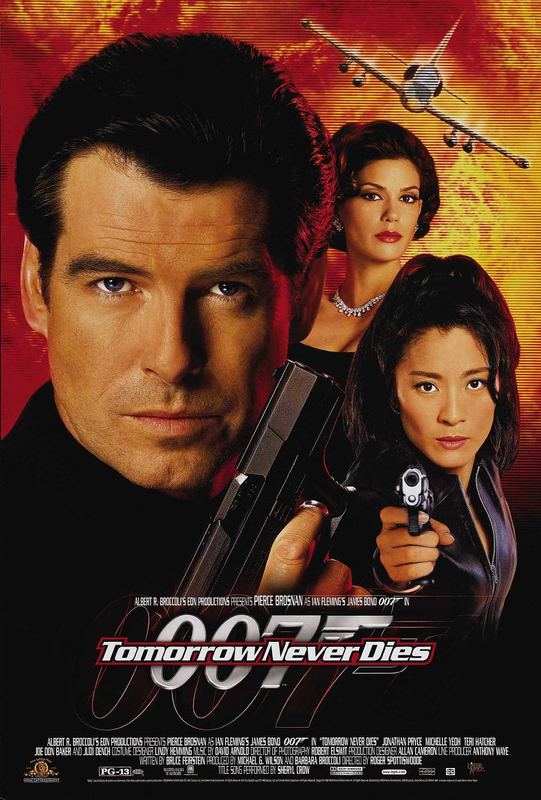
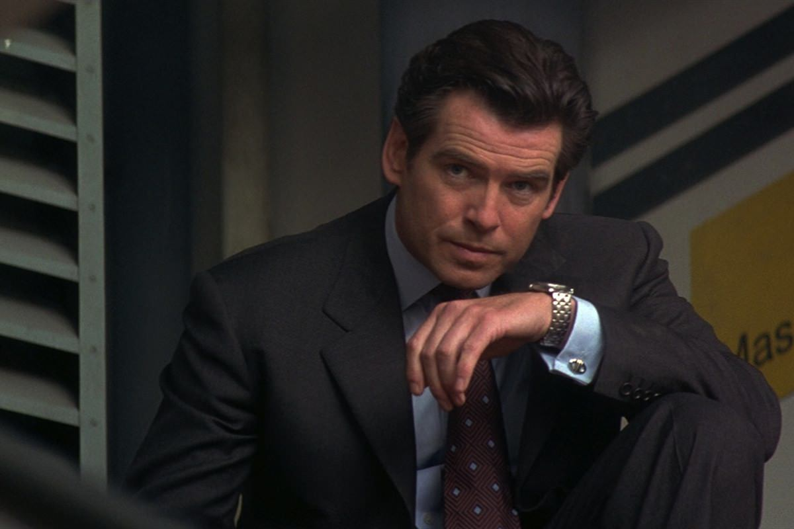

+++
type = "post"
titre = "<em>Demain ne meurt jamais</em>, Roger Spottiswoode"
title = "Demain ne meurt jamais, Roger Spottiswoode"
url = "/demain-ne-meurt-jamais-spottiswoode"
date = "2012-12-02T08:09:19"
Lastmod = "2013-05-11T09:58:36"
cover = "jonathan-pryce-demain-ne-meurt-jamais.jpg"
categorie = [ "À voir" ]
tag = [ "Action", "Blockbuster", "Espionnage", "James Bond", "Vite oublié" ]
createur = [ "Roger Spottiswoode" ]
acteur = [ "Jonathan Pryce", "Judi Dench", "Michelle Yeoh", "Pierce Brosnan" ]
annee = [ "1997" ]
weight = 1997
saga = [ "James Bond" ]
pays = [ "États-Unis" ]
original = "Tomorrow Never Dies"

+++

Avec <a href="http://voiretmanger.fr/2012/11/25/goldeneye-campbell/" title="GoldenEye, Martin Campbell - À voir et à manger"><em>GoldenEye</em></a>, la saga James Bond repart sur les chapeaux de roue. Le succès public et commercial étant à nouveau au rendez-vous, les producteurs de la saga veulent donner rapidement une suite au film et <em>Demain ne meurt jamais</em> sort à la fin de l’année 1997, deux ans seulement après son prédécesseur. Pierce Brosnan ayant convaincu dans le rôle titre, il reste l’agent 007, mais Martin Campbell n’a pas voulu réaliser un deuxième long-métrage. Son remplaçant, Roger Spottiswoode, n’est pas resté dans les mémoires malgré la vingtaine de films à son actif, et pour cause. <em>Demain ne meurt jamais</em> ne brille pas par une place à part dans la saga et le dix-huitième <em>James Bond</em> est assez convenu, pas toujours très fin, mais il est aussi efficace et s’inscrit très bien dans la saga. Ce n’est pas l’épisode le plus intéressant, certes, mais il reste un bon divertissement. 

Comme pour <em>GoldenEye</em>, <em>Demain ne meurt jamais</em> bénéficie d’un scénario original qui n’est pas directement adapté du travail de Ian Flemming. Le scénariste de cet opus est le même que le précédent et il part sur une histoire beaucoup plus moderne et assez bien vue. La Guerre froide est de l’histoire ancienne et le monde est dominé par les médias de masse : le méchant est logiquement un homme qui maîtrise ces médias. Elliott Carver est en l’occurrence le patron du plus grand réseau de médias au monde, il possède des dizaines de chaînes de télévision, de radios et de journaux. Suivre et rapporter les évènements ne lui suffit plus, il veut maintenant créer l’information et met pour cela en place un plan machiavélique complexe qui doit déclencher une guerre sino-britannique. La saga <em>James Bond</em> a rarement brillé par le réalisme de ses situations, sauf dans son histoire récente, mais <em>Demain ne meurt jamais</em> fait assez fort dans ce domaine. À dire vrai, on peine un peu à croire en ce plan qui paraît un peu trop énorme et Roger Spottiswoode en rajoute un peu trop avec son méchant assez caricatural — on a vu Jonathan Pryce plus inspiré ailleurs. L’idée de départ reste malgré tout intéressante et c’est peut-être, à sa sortie, l’épisode le plus moderne de la saga. On peut noter au passage la critique, déjà, de l’agent 007 et même plus largement de l’espionnage à l’ancienne ; c’est une thématique alors assez nouvelle et plutôt gonflée.

Roger Spottiswoode semble vouloir assurer ses arrières en incluant dans son film tous les attributs typiques d’un bon <em>James Bond</em>. La scène d’ouverture de <em>Demain ne meurt jamais</em> en met plein la vue avec succès — c’est peut-être le meilleur moment du film, d’ailleurs — et la suite enchaîne les passages obligés. On retrouve les filles, deux ici dont une — Michelle Yeoh — qui assiste 007, les scènes d’action et les gadgets, aussi exploités dans ce long-métrage qu’ils étaient absents du précédent. Q, toujours interprété par le vieillissant, mais fidèle Desmond Llewelyn, présente longuement les gadgets de cet épisode et en premier lieu la voiture. <em>Demain ne meurt jamais</em> offre aux amateurs de quoi se réjouir avec, cette fois, une berline luxueuse de BMW transformée en arme surpuissance et dirigée depuis le téléphone portable de James Bond. Le scénario l’exploite cette fois véritablement, avec une scène de course-poursuite dans un parking public qui en impose. L’agent secret à nouveau interprété par un Pierce Brosnan qui semble plus assuré — il est sûrement rassuré par le succès de sa première prestation — canarde toujours autant, au-delà du raisonnable. <em>Demain ne meurt jamais</em> ne le met jamais vraiment en danger, l’agent semble invincible. Il est en tout cas toujours aussi classe et l’humour est bien présent, même s’il se fait assez discret, un peu écrasé par la place accordée au méchant et à sa machination infernale.

<em>Demain ne meurt jamais</em> appartient sans conteste à la saga <em>James Bond</em>, avec ses multiples gadgets, des cascades impressionnantes au moins à l’époque, des filles aussi et ce qu’il faut d’humour. Tous les ingrédients sont réunis pour un blockbuster de qualité et le spectacle est globalement au rendez-vous. Qu’importent alors les incohérences du scénario ou la mise en scène assez banale de Roger Spottiswoode, qu’importe le côté un peu caricatural et mineur du film. <em>Demain ne meurt jamais</em> retrouve malgré ses limites le plaisir simple de regarder l’agent 007, ses filles et ses gadgets. C’est un film typique de la saga et ce plaisir simple est peut-être l’essentiel, finalement. Un épisode à (re)voir et puis à oublier…

<strong>James Bond reviendra dans… <a href="http://voiretmanger.fr/2012/12/09/monde-suffit-pas-apted/" title="Le monde ne suffit pas, Michael Apted"><em>Le monde ne suffit pas</em></a></strong>

<h3>Vous voulez m’aider ?<a href="#footnote_0_7881" id="identifier_0_7881" class="footnote-link footnote-identifier-link" title="&Agrave; propos de la publicit&eacute;&hellip;">1</a></h3>
<ul>
<li><a href="http://www.amazon.fr/gp/product/B000I2IY7G/ref=as_li_ss_tl?ie=UTF8&#038;tag=leblogdenic07-21&#038;linkCode=as2&#038;camp=1642&#038;creative=19458&#038;creativeASIN=B000I2IY7G">Acheter le film en DVD sur Amazon</a></li>
<li><a href="https://itunes.apple.com/fr/movie/demain-ne-meurt-jamais-tomorrow/id562152394">Acheter ou louer le film sur l’iTunes Store</a></li>
</ul>
<ul>
<li><a href="http://www.amazon.fr/gp/product/B006VCDMQU/ref=as_li_ss_tl?ie=UTF8&#038;tag=leblogdenic07-21&#038;linkCode=as2&#038;camp=1642&#038;creative=19458&#038;creativeASIN=B006VCDMQU">Acheter le coffret <em>James Bond</em> en Blu-Ray sur Amazon</a></li>
<li><a href="http://www.amazon.fr/gp/product/B006VCDMD8/ref=as_li_ss_tl?ie=UTF8&#038;tag=leblogdenic07-21&#038;linkCode=as2&#038;camp=1642&#038;creative=19458&#038;creativeASIN=B006VCDMD8">Acheter le coffret <em>James Bond</em> en DVD sur Amazon</a></li>
</ul>

<ol class="footnotes"><li id="footnote_0_7881" class="footnote"><a href="http://voiretmanger.fr/soutien/">À propos de la publicité…</a> [<a href="#identifier_0_7881" class="footnote-link footnote-back-link">&#8617;</a>]</li></ol>
