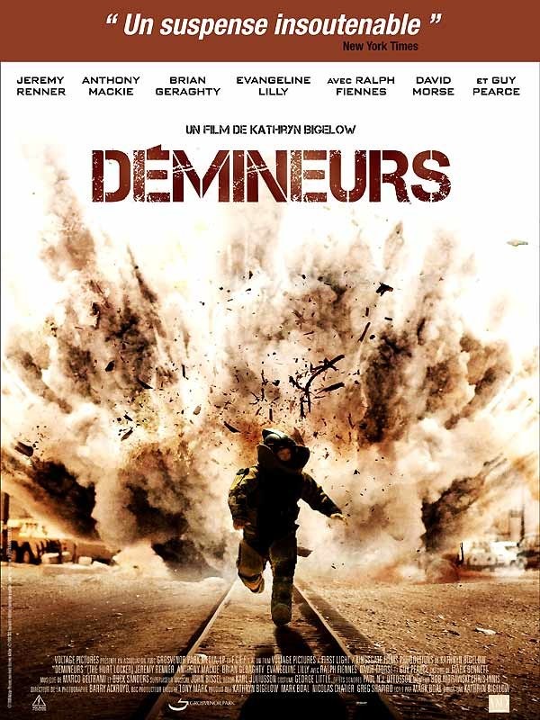
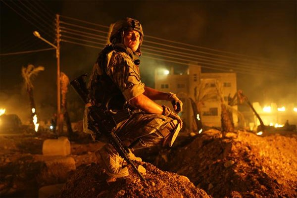

+++
titre = "Démineurs, Kathryn Bigelow"
title = "Démineurs, Kathryn Bigelow"
url = "/demineurs-kathryn-bigelow"
date = "2009-10-07T00:51:33"
Lastmod = "2013-01-26T22:07:56"
cover = "demineurs-couv.jpg"
categorie = [ "À voir" ]
tag = [ "Drogue", "Guerre", "Irak", "Suspense", "Violence" ]
createur = [ "Kathryn Bigelow" ]
acteur = [ "Guy Pearce", "Jeremy Renner" ]
annee = [ "2009" ]
weight = 2009
pays = [ "États-Unis" ]
original = "The Hurt Locker"

+++

<em>Démineurs</em> démontre une nouvelle fois l&rsquo;étonnante capacité des Américains à penser leur actualité récente comme un fait historique digne d&rsquo;être raconté. Ce film est en effet le énième qui évoque la guerre en Irak et s&rsquo;il n&rsquo;est pas très original, il n&rsquo;est pas non plus inintéressant.

Le titre du film, pas plus que son affiche, ne laisse place à aucun doute. <em>Démineurs</em> narre les aventures de démineurs en Irak, pendant la guerre qui, rappelons-le, continue encore aujourd&rsquo;hui. Le travail des démineurs est éprouvant puisque la moindre erreur vaudra à coup sûr leur mort, et sans doute celle de nombreux innocents avec. D&rsquo;ailleurs, le film attaque d&rsquo;entrée sur la mort d&rsquo;un démineur qui aurait pu être le héros du film si le scénario n&rsquo;en décidait pas autrement. Dans cette scène d&rsquo;ouverture, le ton du film est donné : la guerre n&rsquo;est pas une partie de plaisir, c&rsquo;est même un univers carrément stressant.

Le film réussit très bien de ce côté, il faut bien l&rsquo;avouer. Les spectateurs sont emportés par un suspense intense et ininterrompu pendant les deux heures que dure le film. C&rsquo;est bien simple, <em>Démineurs</em> ne laisse aucun répit et se révèle même assez étouffant, ce qui est un compliment bien sûr. La vie ou la mort ne tient ici littéralement qu&rsquo;à un fil, celui que l&rsquo;on ne coupe pas, ou au contraire celui que l&rsquo;on coupe et chaque déminage est stressant pour les personnages comme pour tous ceux qui sont dans la salle. C&rsquo;est sans doute l&rsquo;aspect le plus réussi du film.

Le film s&rsquo;ouvre sur une citation d&rsquo;où ressort que la guerre est une drogue. Je pointais initialement un manque d&rsquo;originalité et sans revenir dessus, je dois dire que c&rsquo;est assez rare de réduire la guerre à une simple drogue pour les soldats. On connaissait la folie (notamment dans le brillantissime <em><a href="http://voiretmanger.fr/2012/01/22/apocalypse-now-redux-coppola/" title="Apocalypse Now Redux, Francis Ford Coppola">Apocalypse Now</a></em>), mais l&rsquo;idée de la drogue est intéressante et bien illustrée à la fin, avec le retour sur le front. On sait que la guerre détruit les êtres qu&rsquo;elle utilise, au point que beaucoup ne supportent pas le retour au monde civil, ce qui est le plus souvent expliqué par les atrocités connues &laquo;&nbsp;là-bas&nbsp;&raquo;. La montée d&rsquo;adrénaline ressentie au combat est néanmoins une explication satisfaisante et le retour ne parvient jamais à combler le manque lié à l&rsquo;abstinence.

Si cette idée est aussi originale qu&rsquo;intéressante, la fin de <em>Démineurs</em> est sans doute son talon d&rsquo;Achille. Le film s&rsquo;étire alors en longueur, et la description du retour et de ses supermarchés vains est vraiment téléphonée. Quand le père explique à son fils qu&rsquo;il finira par ne plus aimer qu&rsquo;une seule chose, et qu&rsquo;en l&rsquo;occurrence c&rsquo;est la guerre, le film devient un peu ridicule. Pourtant, il y avait de quoi dire et montrer, et le rapprochement fulgurant entre les boites de céréales et le champ de bataille est une bonne idée.

La réalisatrice est beaucoup plus à l&rsquo;aide sur le champ de bataille. Étonnamment, ce dernier est globalement vide de soldats et d&rsquo;ennemis. Des Irakiens, on ne voit quasiment rien, mais ça n&rsquo;est pas tant lié à un point de vue partisan qu&rsquo;au fait que l&rsquo;ennemi, ici, est invisible (une bombe dans une voiture en feu, un civil avec un téléphone). Quand combat il y a, il est composé quasiment intégralement d&rsquo;attente fixe et sans action. Cette frugalité de moyens est très bien vue, tant elle permet au film de se concentrer sur le déminage et le stress qu&rsquo;il procure aux spectateurs comme au héros. <em>Démineurs</em> est un film très concret, simple pourrait-on dire, qui le rend sans doute peu agréable au premier abord.

En bref, <em>Démineurs</em> est un film intéressant sur la guerre, ses horreurs et son quotidien, et sur l&rsquo;impossibilité définitive et totale de s&rsquo;en remettre. C&rsquo;est un thème classique au cinéma ou dans la littérature, et c&rsquo;est un peu le problème ici : après de nombreux classiques, on a parfois le sentiment de redites. Pourtant, le film ne manque pas d&rsquo;intérêt par sa frugalité de moyens qui gagnerait d&rsquo;ailleurs à être encore renforcée (le film pourrait facilement perdre une demi-heure) et son sujet précis peu exploité exclusivement dans un film.

En outre, la reconstitution est tout à fait sérieuse (et même proche du documentaire), avec un mélange de scènes à la caméra sur l&rsquo;épaule et des plans plus posés et parfois très beau, comme cette scène du camion-citerne. Pour notre plus grand bonheur, le film évite toutes questions politico-morales, mais on aimerait en savoir plus sur les personnages&#8230;

Je ne regrette pas du tout d&rsquo;avoir vu <em>Démineurs</em>, ne serait-ce que pour voir ce que les Américains font d&rsquo;un événement aussi récent que gênant dans leur actualité et histoire (la comparaison avec la France, à cet égard, est toujours aussi valable). Kathryn Bigelow exploite ici une idée intéressante à travers une toute petite partie de la guerre, ce qui est plutôt bien vu.

À lire également, les critiques très complètes et intéressantes de <em><a href="http://www.critikat.com/Demineurs.html">Critikat</a></em>, les <em><a href="http://www.lesinrocks.com/cine/cinema-article/article/demineurs/">Inrockuptibles</a></em> ou <em><a href="http://www.telerama.fr/cinema/films/demineurs,390869,critique.php">Télérama</a></em>. Rob est <a href="http://www.toujoursraison.com/2009/09/demineurs.html">plus enthousiaste</a> que moi.

<h3>Vous voulez m&rsquo;aider ?<a href="#footnote_0_1898" id="identifier_0_1898" class="footnote-link footnote-identifier-link" title="&Agrave; propos de la publicit&eacute;&hellip;">1</a></h3>
<ul>
<li><a href="http://www.amazon.fr/gp/product/B0030CNQTM/ref=as_li_ss_tl?ie=UTF8&#038;tag=leblogdenic07-21&#038;linkCode=as2&#038;camp=1642&#038;creative=19458&#038;creativeASIN=B0030CNQTM">Acheter le film en Blu-Ray sur Amazon</a></li>
<li><a href="http://www.amazon.fr/gp/product/B0030CNQTW/ref=as_li_ss_tl?ie=UTF8&#038;tag=leblogdenic07-21&#038;linkCode=as2&#038;camp=1642&#038;creative=19458&#038;creativeASIN=B0030CNQTW">Acheter le film en DVD sur Amazon</a></li>
<li><a href="http://itunes.apple.com/fr/movie/demineurs-vost/id381891573">Acheter ou louer le film sur l&rsquo;iTunes Store</a></li>
</ul>

<ol class="footnotes"><li id="footnote_0_1898" class="footnote"><a href="http://voiretmanger.fr/a-propos/publicite/">À propos de la publicité…</a> [<a href="#identifier_0_1898" class="footnote-link footnote-back-link">&#8617;</a>]</li></ol>
