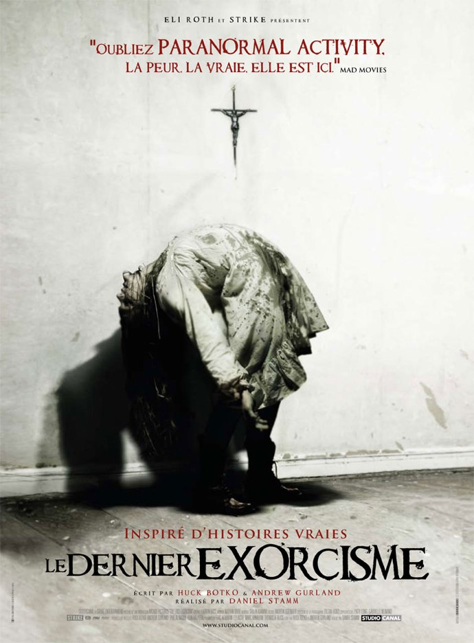
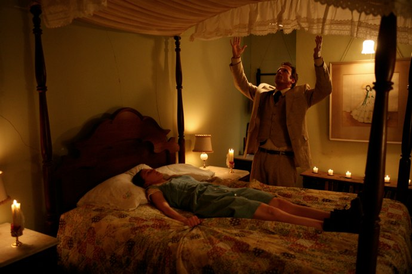
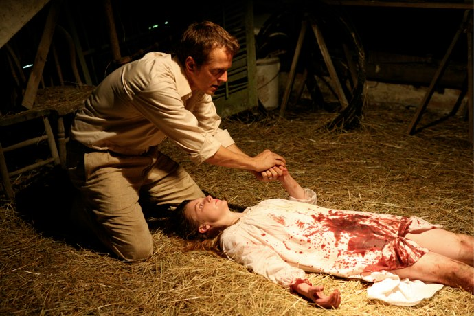

+++
type = "post"
titre = "Le Dernier Exorcisme, Daniel Stamm"
title = "Le Dernier Exorcisme, Daniel Stamm"
url = "/dernier-exorcisme-stamm"
date = "2010-08-20T00:12:21"
Lastmod = "2010-08-20T00:18:47"
cover = "le-dernier-exorcisme.jpg"
categorie = [ "À voir" ]
tag = [ "Docufiction", "Fantastique", "Horreur", "Religion" ]
createur = [ "Daniel Stamm" ]
annee = [ "2010" ]
weight = 2010
pays = [ "États-Unis" ]

+++

<strong>À lire : j’ai été invité par Way To Blue et Studio Canal à une avant-première pour voir <em>Le Dernier Exorcisme</em>. Je n’ai reçu aucun paiement pour cette critique, et je ne pense pas que mon jugement a été influencé par cette invitation. Si cela vous dérange, votre navigateur Internet dispose d’une fonction « Fermer la fenêtre ». Sinon, je vous remercie pour votre confiance et vous propose de continuer votre lecture.</strong>

<em>L&rsquo;Exorciste</em> est un classique parmi les classiques des films d&rsquo;horreur. Mainte fois copié depuis, jamais égalé, mais toujours ce statut à part dans le genre de l&rsquo;horreur fantastique. Autant dire que <em>Le Dernier Exorcisme</em> s&rsquo;affilie nettement à cet illustre héritage, même si le film ne se veut pas une suite, même pas un hommage. L&rsquo;affiche annonce aussi clairement que &laquo;&nbsp;<em>La Peur. La Vraie. Elle est ici.</em>&nbsp;&raquo; alors que le film sortira en salles avec une interdiction au moins de 16 ans. On attendait donc un film vraiment épouvantable, on n&rsquo;a eu qu&rsquo;un petit film reposant sur vraiment pas grand-chose, et qui n&rsquo;effraiera personne, à part peut-être les défenseurs de nos amies les bêtes. Décevant.

Le principe de départ de <em>Le Dernier Exorcisme</em> est plutôt bien trouvé. Soit un prêcheur fervent dans une congrégation quelconque aux États-Unis, le révérend Cotton Marcus. Entraîné par son père, lui-même prêcheur, au prêche, il fait des sermons extrêmement forts qui emportent littéralement son auditoire. Il y célèbre l&rsquo;amour immodéré pour Jesus et son père et il n&rsquo;hésite pas à mettre de sa personne, s&rsquo;impliquant comme seule la pratique religieuse américaine est capable de le faire. Comme il le dit d&rsquo;ailleurs lui-même et sans gêne, il est un acteur et il pourrait dire n&rsquo;importe quoi (la recette d&rsquo;un cake aux bananes par exemple) sans perdre pourtant l&rsquo;attention de son auditoire. Le principe du film est qu&rsquo;il s&rsquo;agit en fait d&rsquo;un documentaire sur ce pasteur : on voit ainsi au début Cotton filmé chez lui, avec sa femme et son fils, puis avec son père. Il nous raconte son enfance, son aisance pour le prêche, le plaisir aussi qu&rsquo;il y prend et puis ses doutes sur sa foi après la survie de son fils né prématurément. Cotton Marcus ne se contente pas de ses activités dans sa paroisse, il fait aussi des exorcismes, activité encore très courante nous apprend-il et fort lucrative. Très vite, il affirme qu&rsquo;il ne s&rsquo;agit que d&rsquo;arnaques visant à faire croire à la victime et ses proches que le démon était bien présent, puis a disparu. De quoi donner une aide psychologique qui règle effectivement les problèmes, à la manière d&rsquo;un placébo. Il a arrêté de faire des exorcismes depuis la naissance de son fils et ce documentaire doit lui permettre de dénoncer cette pratique qu&rsquo;il juge abusive. Mais, on s&rsquo;en doute, ce dernier exorcisme ne se passera pas comme prévu et le pauvre révérend va devoir affronter un vrai démon…

Difficile d&rsquo;aller plus loin sans trop en dire et supprimer tout l&rsquo;intérêt du film. À la manière de plusieurs films récents, dont le fameux <em>Paranormal Activity</em> que l&rsquo;affiche enjoint d&rsquo;oublier, <em>Le Dernier Exorcisme</em> repose entièrement sur un peu d&rsquo;astuce révélée tardivement. La dévoiler serait donc préjudiciable au film, mais disons quand même que l&rsquo;originalité n&rsquo;est pas de mise dans ce film. Après une longue introduction où le fantastique ou l&rsquo;horreur sont totalement absents, la musique inquiétante rappelle aux spectateurs distraits qu&rsquo;il va se passer quelque chose d&rsquo;anormal. Si besoin était, la caméra tremble plus que de raison. Pourtant, <em>Le Dernier Exorcisme</em> se révèle largement décevant dans l&rsquo;horreur, ou même simplement dans le fantastique. On est là dans le registre du très classique à base de vieux grimoires, de Lucifer, de 666 écrits sur les murs et de vomis. Rien de bien palpitant donc, la routine même. Il faut dire que le film n&rsquo;est pas aidé par un traitement assez désinvolte de l&rsquo;histoire, avec en particulier une scène finale qui arrive comme un cheveu sur la soupe et nuit encore un peu plus au bilan déjà pas glorieux du film. Difficile, en tout cas, de comprendre l&rsquo;interdiction aux moins de 16 ans, nonobstant l&rsquo;argument médiatique que cette interdiction a déjà fourni aux fournisseurs du film. <em>Le Dernier Exorcisme</em> est franchement loin d&rsquo;être impressionnant, mis à part pour un chat écorché ou quelques entrailles d&rsquo;une vache (ou un cheval), les deux étant vus très rapidement. Le film est parfois un peu stressant, notamment dans le noir, mais les amateurs de sensations fortes en seront pour leurs frais.

Le gros problème du film provient de son dispositif technique. L&rsquo;idée de faire un film comme s&rsquo;il était filmé avec une caméra unique, pour faire plus vrai, s&rsquo;est démultipliée depuis les premiers succès, du <em>Projet Blair Witch</em> à <em>Cloverfield</em> en passant par <em>Rec</em>. Mais l&rsquo;effet de surprise est désormais bien passé et il reste surtout les nombreuses failles de cette idée. C&rsquo;est flagrant avec <em>Le Dernier Exorcisme</em> qui n&rsquo;est jamais réaliste quand le fantastique entre en jeu. Comment imaginer un seul instant qu&rsquo;un cameraman continue de filmer quand une petite fille possédée par un démon veut le tuer ? Comment concevoir que cette jeune fille possédée prenne la caméra avec elle pour filmer son action, sans que personne ne s&rsquo;en rende compte ? Certaines se déroulent dans le noir, mais la caméra est censée être équipée d&rsquo;un flash qui éclaire plus que les phares d&rsquo;une voiture… Autant de détails (et encore, on ne parle pas de la batterie à la durée de vie manifestement révolutionnaire, ou de la solidité impressionnante de cette caméra, ou bien encore de sa qualité d&rsquo;images stupéfiante pour un si petit objet) qui nuisent totalement au réalisme du film. Si encore ce dernier gagnait quelque chose au passage, mais il faudra vraiment m&rsquo;expliquer l&rsquo;intérêt, si ce n&rsquo;est de justifier l&rsquo;usage de la caméra sur l&rsquo;épaule. Comme <em>Paranormal Activity</em> (que j&rsquo;ai soigneusement évité de voir), je crois que ce principe de la caméra unique supposé plus réaliste n&rsquo;est qu&rsquo;un moyen de masquer les vides du scénario. Dommage, quand on se rappelle l&rsquo;effort réalisé sur <em>Cloverfield</em> notamment, avec vraiment une mise en scène de l&rsquo;image et une volonté de réalisme bien plus poussée qu&rsquo;ici.

Finalement, la partie la plus intéressante dans <em>Le Dernier Exorcisme</em> est sa première partie, celle où il ne se passe rien de fantastique et où le pasteur dévoile les subterfuges de son métier. On sait que les Américains ont un rapport fort différent du nôtre avec la religion. Ils prennent les affaires religieuses très à cœur et peuvent vraiment être emportés par la religion, comme en transe. Les quelques images des offices témoignent bien de cet état extrême et de cette relation au premier degré avec la religion autant qu&rsquo;avec l&rsquo;Église. Mais ce qui est passionnant, c&rsquo;est que Cotton Marcus n&rsquo;est pas du tout dans cette relation au premier degré : il a totalement conscience de son pouvoir, autant que de ses effets rhétoriques. Comme il le dit très bien, il est souvent en pilotage automatique, très loin de la ferveur affichée. Le clou du spectacle reste néanmoins tous les trucs et astuces utilisés pour faire croire à l&rsquo;exorcisme. Tous les moyens sont bons, le crucifix qui éjecte de la fumée, les fils transparents reliés aux miroirs ou tableaux, les sons de démons enregistrés ou même les bagues qui envoient des décharges au patient pour le couvrir de spasmes. Ce n&rsquo;est pas un office religieux, c&rsquo;est un véritable show et ce n&rsquo;est pas un révérend, c&rsquo;est un prestidigitateur. Cet aspect-là du film m&rsquo;a le plus intéressé, ce qui pose quand même un problème pour un film censé faire peur…

<em>Le Dernier Exorcisme</em> est vraiment décevant. Ce n&rsquo;est clairement pas une version modernisée de <em>L&rsquo;Exorciste</em>, film qui prenait beaucoup plus au sérieux son sujet fantastique et qui parvenait à impressionner. Le choix du vrai faux documentaire avec caméra subjective n&rsquo;apporte rien et nuit grandement au réalisme. C&rsquo;est bien simple, on ne croit jamais à cette histoire et la peur annoncée n&rsquo;est plus qu&rsquo;un vague stress quand la lumière s&rsquo;éteint. Finalement, le plus intéressant dans <em>Le Dernier Exorcisme</em> est le début, quand le film de Daniel Stamm n&rsquo;est pas encore un film d&rsquo;horreur. Un peu dommage quand le film est censé en être un…

<em>Sortie le 15 septembre</em>

