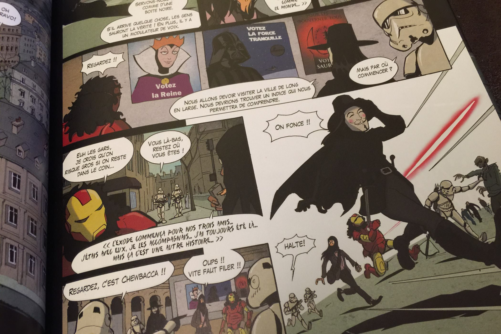
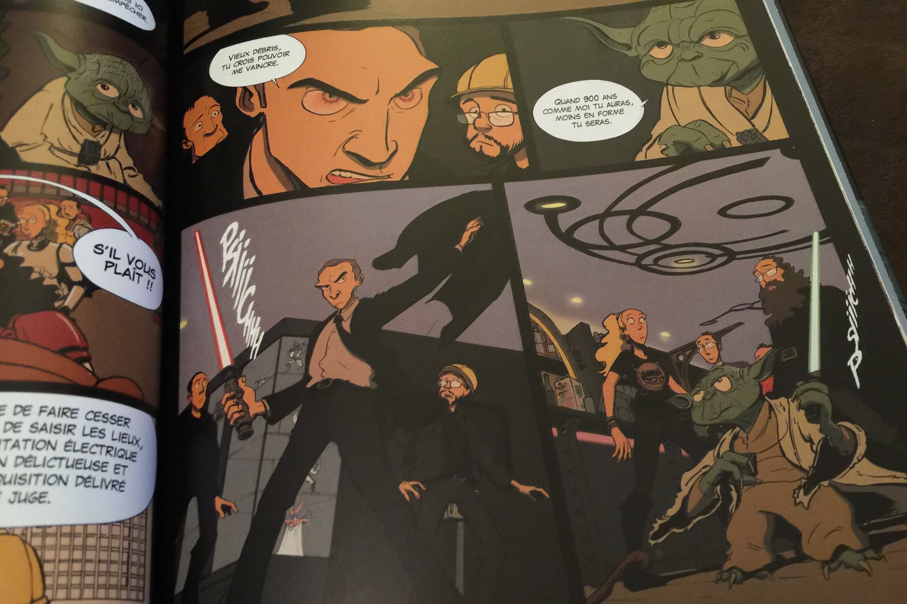

+++
type = "post"
titre = "<em>La Dernière BD avant la Fin du Monde</em>, Damien Maric et Yigaël"
title = "La Dernière BD avant la Fin du Monde, Damien Maric et Yigaël"
url = "/derniere-bd-fin-monde-maric-yigael"
date = "2014-12-09T11:07:12"
Lastmod = "2014-12-09T11:07:25"
cover = "la-derniere-bd-avant-la-fin-du-monde-maric-yigael.jpg"
categorie = [ "À lire" ]
tag = [ "Apocalypse", "Bande dessinée", "Geek", "Heroïc-Fantasy", "Humour", "Science-Fiction", "Voyage temporel" ]
createur = [ "Damien Maric", "Yigaël" ]
annee = [ "2014" ]
weight = 2014
pays = [ "France" ]

+++

À l&rsquo;origine, une mini série publiée sur internet nommée <a href="https://www.youtube.com/playlist?list=PLHYVKdTa8XHWHf6gwcsIdk6y9RtEF6OVq"><em>La Dernière série avant la Fin du Monde</em></a>. Sept épisodes d&rsquo;environ cinq minutes chacun où une bande de potes vraiment geeks s&rsquo;amusent à parodier les fins du monde que la science-fiction ou l&rsquo;heroïc-fantasy ont imaginé. Zombies et autres morts-vivants, le Cthulhu de Lovecraft, <em>Retour vers le futur</em>, monstres immenses et jeux de rôle… tout y passe dans cette série loufoque et assez drôle. La série ayant connu un peu de succès, ses créateurs ont décidé de la prolonger, mais avec une bande-dessinée. <em>La Dernière BD avant la Fin du Monde</em> était née. Malheureusement, le changement de média ne s&rsquo;est pas fait sans difficulté : alors que les vidéos étaient courtes et incisives, la BD souffre d&rsquo;un trop plein. Il y a trop de références, beaucoup plus encore que dans la série originale, si bien que l&rsquo;ensemble manque de cohérence et devient un peu étouffant. Au total, on sourit parfois, mais on ne rigole pas vraiment, dommage…

L&rsquo;histoire de <em>La Dernière BD avant la Fin du Monde</em> reprend deux ans après la fin de la série. Décembre 2014 donc, l&rsquo;apocalypse a eu lieu et les héros se sont enfermés dans le bar pendant tout ce temps. Ils se décident enfin à sortir et se mettent en tête de revenir dans le passé pour modifier le présent. Dès la première page de cette bande-dessinée, Damien Maric et Yigaël jouent sur le principal moteur de l&rsquo;ensemble : le clin d&rsquo;œil. On a ainsi une carte de France entièrement aux mains des envahisseurs, à l&rsquo;exception d&rsquo;un lieux qui résiste encore et toujours : ce bar parisien où l&rsquo;action de la série se déroulait. L&rsquo;idée est amusante et on a hâte de découvrir la suite, mais les références s&rsquo;accumulent et on a vite le sentiment que la BD n&rsquo;a, comme seule raison d&rsquo;être, leur multiplication. Plus encore que dans les épisodes de série, les cases sont pleines de clins d&rsquo;œil, qui à <em>Star Wars</em>, qui au <em>Guide du voyageur galactique</em> de Douglas Adams, aux comics, à <em>Jurassic Park</em> ou bien encore à <em>Robocop</em>. Il y en a trop pour qu&rsquo;on les cite toutes, mais si vous aimez dénicher des références, vous serez aux anges avec cette bande-dessinée. Malheureusement, passée la réjouissance de la découverte, il ne reste pas grand-chose dans <em>La Dernière BD avant la Fin du Monde</em> et c&rsquo;est bien le problème. À trop multiplier les ouvertures vers d&rsquo;autres œuvres, ses créateurs en ont oublié d&rsquo;imaginer une histoire originale, ou au moins des gags un petit peu drôles. On s&rsquo;ennuie un peu et c&rsquo;est à peine si on trouve de quoi sourire. L&rsquo;humour absurde à l&rsquo;anglaise fonctionnait beaucoup mieux dans la série, peut-être parce qu&rsquo;il y avait des acteurs et des mimiques. La bande-dessinée nécessiterait des textes mieux écrits pour que ce soit aussi drôle et, hélas, le compte n&rsquo;y est pas.

<em>La Dernière BD avant la Fin du Monde</em> était une bonne idée, d&rsquo;autant que la série qui la précède fonctionnait plutôt bien. Damien Maric et Yigaël poursuivent l&rsquo;histoire mise en place dans les sept épisodes et ils se sont manifestement dits qu&rsquo;en allant encore plus loin dans les références et les clins d&rsquo;œil, ils auraient quelque chose d&rsquo;encore plus drôle. Le résultat prouve bien qu&rsquo;il n&rsquo;en est rien et que, bien au contraire, cette bande-dessinée souffre d&rsquo;un trop plein. Dommage…

<h3>Vous voulez <a href="http://voiretmanger.fr/soutien/">m&rsquo;aider</a> ?</h3>
<ul>
<li><a href="http://www.amazon.fr/gp/product/B00MA4JT10/ref=as_li_ss_tl?ie=UTF8&amp;tag=leblogdenic07-21&amp;linkCode=as2&amp;camp=1642&amp;creative=19458&amp;creativeASIN=B00MA4JT10">Acheter la bande-dessinée sur Amazon</a></li>
</ul>

