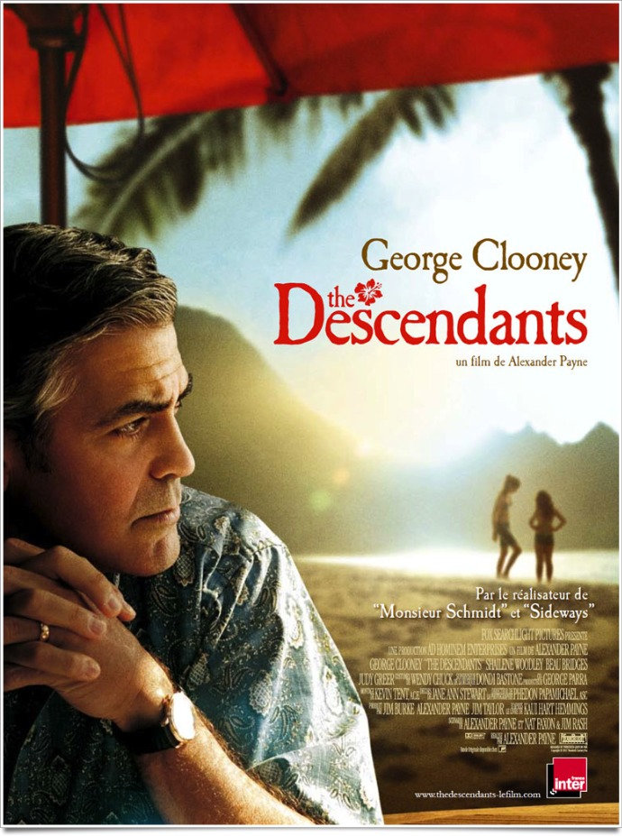
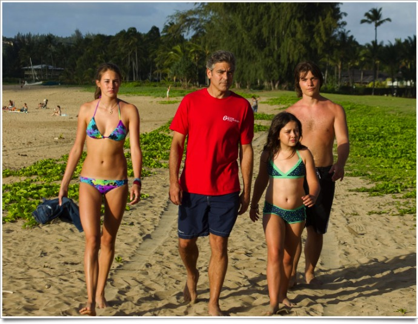
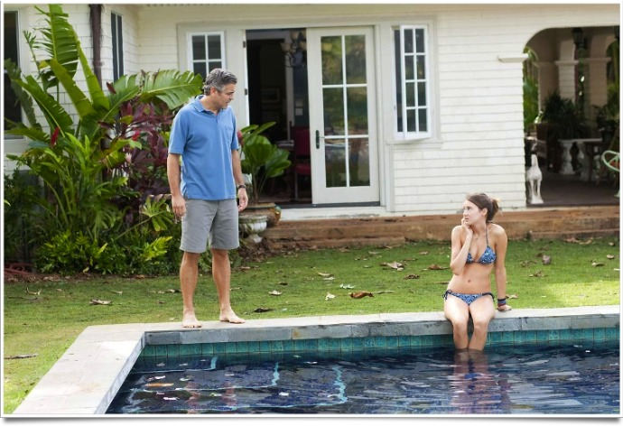

+++
type = "post"
titre = "The Descendants, Alexander Payne"
title = "The Descendants, Alexander Payne"
url = "/descendants-payne"
date = "2012-01-29T07:54:19"
Lastmod = "2012-05-31T16:31:21"
cover = "payne-the-descendants.jpg"
categorie = [ "À voir" ]
tag = [ "Adolescence", "Drame", "Famille", "Humour", "Mort", "Société" ]
createur = [ "Alexander Payne" ]
acteur = [ "George Clooney" ]
annee = [ "2012" ]
weight = 2012
pays = [ "États-Unis" ]

+++

Hawaï, ses plages de sable fin, ses palmiers, ses surfeurs, son soleil… Derrière ces images paradisiaques, <em>The Descendants</em> montre une réalité plus grise, mais plus crédible. L&rsquo;histoire d&rsquo;une famille qui explose après l&rsquo;accident de la mère, avec à la clé un drame sobre et vrai. Alexander Payne compose un film comme le cinéma américain indépendant en raffole, mais avec justesse et efficacité. Un très beau film, à voir.

Matt King est né à Hawaï, il y a toujours vécu et il descend même d&rsquo;une famille très importante dans l&rsquo;archipel. Cet avocat a hérité d&rsquo;une fortune sous la forme d&rsquo;un immense espace encore vierge de toute occupation humaine, un espace paradisiaque qui attire tous les investisseurs. Contrairement au reste de sa famille, Matt a choisi de ne pas reposer sur cette fortune pour vivre et il travaille ainsi très dur pour nourrir sa femme et ses deux filles. Sa vie bascule avec un terrible accident qui plonge son épouse dans le coma. Il devient brutalement le seul responsable de ses filles et lui qui a toujours été très absent a du mal à s&rsquo;y faire. Scottie, la plus jeune, a dix ans, mais elle est déjà très mûre pour son âge et elle mène la vie dure à son père. Alexandra, dix-sept ans, correspond à l&rsquo;archétype de l&rsquo;adolescente rebelle qui n&rsquo;hésite pas à se jeter dans l&rsquo;alcool et les bras de garçons bien plus âgés. Le coma ne suffisait pas : Matt apprend que sa femme le trompait et voulait même le quitter. Avec ses deux filles et un ami d&rsquo;Alexandra, il part en quête de celui qui a fait de lui un mari cocu…

<em>The Descendants</em> est d&rsquo;abord un portrait tout en finesse et très juste sur une famille qui tient tant bien que mal. Matt a toujours été très absent et il porte ainsi une grande part de responsabilité quant au délitement de sa famille. Sa femme désormais absente, il doit prendre en charge les affaires du quotidien et essayer de comprendre et contrôler ses deux filles. Ces dernières ne lui facilitent pas la tâche et l&rsquo;explosion complète de la cellule familiale n&rsquo;est pas loin. Alexander Payne évite toutefois de tomber dans le cliché misérabiliste : la situation n&rsquo;est, certes, pas rose pour les King, mais tous vont tenter d&rsquo;améliorer les choses. Alexandra en particulier comprend vite que son père a besoin d&rsquo;elle et son attitude évolue alors rapidement. Matt quant à lui est un père paumé, mais qui veut indéniablement bien faire. Dans une très belle scène, il demande à Syd, le jeune ami de sa fille, ce qu&rsquo;il doit faire pour reprendre les choses en main. La quête de l&rsquo;amant offre finalement à cette famille une raison d&rsquo;être : quand il apparaît enfin à l&rsquo;écran, il a droit au regard dédaigneux de Matt et de sa fille, unis. <em>The Descendants</em> commence ainsi comme un drame social, mais il tend à la comédie dramatique et s&rsquo;avère même souvent assez drôle.

Le dernier film d&rsquo;Alexander Payne offre aussi un aperçu que l&rsquo;on imagine encore très juste sur la société hawaïenne, du moins sur sa frange aisée. <em>The Descendants</em> en livre un portrait contrasté. La vie que mènent Matt et ses filles est effectivement plutôt apaisée et l&rsquo;archipel offre effectivement de splendides paysages et de belles plages de sable. Les clichés ne sont pas totalement faux, mais ils ne montrent qu&rsquo;un aspect de Hawaï. Comme le personnage principal le dit bien en entrée, la vie et son lot de problèmes ont aussi cours dans cet État américain. Matt n&rsquo;a pas touché à un surf depuis une quinzaine d&rsquo;années, il délaisse sa famille pour son travail, sa fille est placée en pension pour tenter de la contrôler et sa piscine est très sale. Les problèmes sont les mêmes sur ces îles par ailleurs paradisiaques et <em>The Descendants</em> le montre plutôt bien. Le film évoque aussi le sujet de la spéculation immobilière sur l&rsquo;île et celui, lié au précédent, des énormes complexes touristiques et bétonnés. Le personnage principal doit décider de vendre, ou non, une énorme parcelle encore vierge et les projets sont tous identiques. Sa famille le pousse à accepter une offre qui leur permettra de devenir tous millionnaires et même si ce n&rsquo;est clairement pas le sujet principal, cet aspect de <em>The Descendants</em> ne manque pas d&rsquo;intérêt.

<em>The Descendants</em> appartient à la mouvance Sundance, ce cinéma américain indépendant qui a parfois tendance à se caricaturer. Le film d&rsquo;Alexander Payne évoque <em>Little Miss Sunshine</em>, ne serait-ce que pour son personnage de petite fille si proche d&rsquo;Olive, mais aussi pour son ambiance particulière et son regard tendre et cruel à la fois sur une famille. Dans le genre, <em>The Descendants</em> est très efficace et plutôt réussi et son ambiance hawaïenne ajoute une touche originale bienvenue. Elle passe notamment par la musique que l&rsquo;on suppose locale et qui donne une atmosphère mélancolique au long-métrage, bien qu&rsquo;elle soit un peu répétitive. George Clooney est certainement un argument-choc en faveur de <em>The Descendants</em> et l&rsquo;acteur propose de fait une prestation à la hauteur de sa réputation. Jouer la tristesse ou la colère avec justesse n&rsquo;est pas simple et il s&rsquo;en sort à merveille. Autour de lui, les deux jeunes actrices qui interprètent ses filles sont très bien, mention spéciale à la plus jeune, de même que celui qui interprète Syd. Pas de fausses notes en somme dans ce très beau casting qui incarne avec toute la précision nécessaire cette famille en difficulté.

Difficile de montrer une famille après une mort sans tomber dans la caricature. Alexander Payne s&rsquo;en sort parfaitement bien avec <em>The Descendants</em> qui n&rsquo;a rien du chef-d&rsquo;œuvre que certains semblent y voir, mais qui est un petit film très agréable. Émouvant et plaisant à la fois, il offre un regard contrasté sur l&rsquo;archipel de Hawaï. À la clé, une séance très plaisante et un film qui reste agréablement en mémoire.

<h3>Vous voulez m&rsquo;aider ?<a href="#footnote_0_5591" id="identifier_0_5591" class="footnote-link footnote-identifier-link" title="&Agrave; propos de la publicit&eacute;&hellip;">1</a></h3>
<ul>
<li><a href="http://www.amazon.fr/gp/product/B007BK0TVM/ref=as_li_ss_tl?ie=UTF8&tag=leblogdenic07-21&linkCode=as2&camp=1642&creative=19458&creativeASIN=B007BK0TVM">Acheter le film en Blu-Ray et DVD sur Amazon</a></li>
<li><a href="http://www.amazon.fr/gp/product/B007BK0TSU/ref=as_li_ss_tl?ie=UTF8&tag=leblogdenic07-21&linkCode=as2&camp=1642&creative=19458&creativeASIN=B007BK0TSU">Acheter le film en DVD sur Amazon</a></li>
<li><a href="http://itunes.apple.com/fr/movie/the-descendants/id511149243">Acheter ou louer le film sur l&rsquo;iTunes Store</a></li>
</ul>

<ol class="footnotes"><li id="footnote_0_5591" class="footnote"><a href="/soutien/">À propos de la publicité…</a> [<a href="#identifier_0_5591" class="footnote-link footnote-back-link">&#8617;</a>]</li></ol>
