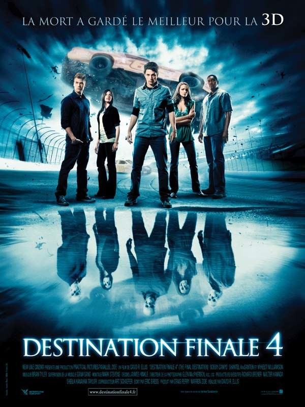
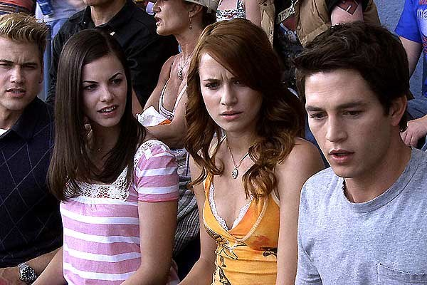

+++
type = "post"
titre = "Destination finale 4, David R. Ellis"
title = "Destination finale 4, David R. Ellis"
url = "/destination-finale-4"
date = "2009-09-03T00:34:10"
Lastmod = "2012-02-04T17:33:45"
cover = "2009_final_destination_4_003.jpg"
categorie = [ "À voir" ]
tag = [ "3D", "Blockbuster", "Horreur", "Vite oublié" ]
createur = [ "David R. Ellis" ]
annee = [ "2009" ]
weight = 2009
pays = [ "États-Unis" ]

+++

Après deux films sérieux, il devenait urgent de faire une pause débile. Ça tombait bien, le dernier <em>Destination Finale</em> était sorti ! Certes, la série s&rsquo;épuise un peu, on a un peu le sentiment d&rsquo;avoir déjà tout vu en mieux avant (forcément, parce que c&rsquo;est toujours mieux avant). mais le film reste très fun, la 3D est pour une fois exploitée et si le film est oublié sitôt sorti de la salle, on passe un très bon moment.

On regarde d&rsquo;abord un film de la série <em>Destination Finale</em> pour le plaisir totalement stupide et un peu régressif tout de même de voir des gens mourir. Le principe est immuable : le héros sauve quelques personnes de la mort, par la prémonition d&rsquo;un accident. La mort se venge alors en tuant un à un, et dans l&rsquo;ordre précis dans lequel ils auraient dû mourir, les survivants. Mais attention, il ne s&rsquo;agit jamais de morts banales, façon mort dans son sommeil. Non, la mort est taquine et met en œuvre des plans toujours plus complexes pour tuer ses victimes.

Le postulat de base est bien connu, puisqu&rsquo;il s&rsquo;agit de l&rsquo;effet papillon. Un petit événement anodin entraîne, par une succession de conséquences aussi dramatiques qu&rsquo;inattendues, la mort d&rsquo;une ou plusieurs personnes. Ainsi, une paire de lunettes grossissantes posées sur une table vont enflammer un tas de sciure quand le rideau cachant le soleil s&rsquo;écarte, allumant au passage un ventilateur qui pousse un chariot de pots d&rsquo;essence ou peinture qui s&rsquo;enflamment à leur tour, avant de mettre le feu à des un liquide inflammable.

Tout le plaisir tient dans le suspense. Non pas &laquo;&nbsp;untel va-t-il mourir ?&nbsp;&raquo; puisqu&rsquo;il est d&rsquo;emblée entendu que personne ne survivra. Non, la vraie question est plutôt : comment untel va mourir ? Le film prend un malin plaisir à tromper ses spectateurs par de nombreuses fausses pistes. Non ce n&rsquo;est pas le ventilateur qui va tuer, mais une pierre que tout le monde avait oublié et qui arrive sans prévenir. Parfois au contraire, la mort est brusque, totalement inattendue.

<em>Ooh, des étudiants bien blancs, bien propres sur eux comme il faut !</em>

Le souci de <em>Destination Finale 4</em> est&#8230; eh bien qu&rsquo;il s&rsquo;agit du quatrième film basé sur cette idée et cela se sent. Plusieurs morts ont un air de déjà-vu, à l&rsquo;exception de celle de la piscine, originale et bien trouvée. Le reste fonctionne assez bien, soyons francs, parce que l&rsquo;on a affaire à des professionnels du blockbuster qui connaissent leur sujet. Mais il est vrai que le film manque globalement d&rsquo;originalité pour qui a vu les trois précédents.

Sur le plan technique, je dois dire un mot de la 3D. Je ne retire rien de ce que <a href="/tag/3D">j&rsquo;ai déjà eu l&rsquo;occasion de dire ici</a> sur la mauvaise qualité de celle-ci, le film est toujours sombre et flou une bonne partie du temps. Néanmoins, les réalisateurs ont fait un réel effort pour exploiter la technologie, et je dois dire que j&rsquo;ai sursauté plus d&rsquo;une fois en me prenant un clou, une roue ou un bout de boyaux humains dans la figure. Dans ces conditions, je veux bien accepter les désagréments liés aux aléas de la technologie&#8230;

Nul besoin de s(étendre sur ce film aussi agréable à voir que vite oublié. C&rsquo;est un spectacle à l&rsquo;américaine, avec une idée très bête, mais très efficace et assez&#8230; ben oui assez fun. Mieux vaut ne pas être trop sensible à la chair humaine et au pieux pour le voir (à propos, le film n&rsquo;est pas interdit au moins de 12 ans pour rien, et j&rsquo;aurai même tendance à dire que ça peut être limite pour le voir à 12 ans&#8230;). C&rsquo;est vrai que cela a beau être fun, on sort en regardant autour de soi attentivement, pour voir si un poteau ne va pas s&rsquo;effondrer sur vous, ou vérifier qu&rsquo;il n&rsquo;y pas un clou par terre. Comme quoi, le film est efficace&#8230;

