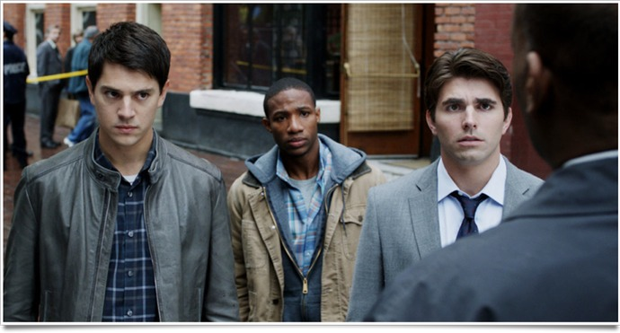
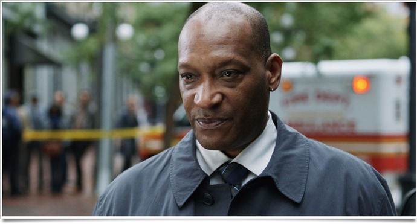

+++
titre = "Destination Finale 5, Steven Quale"
title = "Destination Finale 5, Steven Quale"
url = "/destination-finale-5-quale"
date = "2011-09-03T01:54:48"
Lastmod = "2012-02-04T17:32:53"
cover = "final-destination-5-nicholas-d-agosto.jpg"
categorie = [ "À voir" ]
tag = [ "Blockbuster", "Drame", "Mort", "Thriller" ]
createur = [ "Steven Quale" ]
annee = [ "2011" ]
weight = 2011
pays = [ "États-Unis" ]

+++

La série des <em>Destination Finale</em> suit toujours le même schéma, immuable : un groupe composé essentiellement de jeunes échappe à un accident mortel. La mort veut ensuite se venger en tuant un à un ces rescapés dans l&rsquo;ordre précis où ils auraient dû mourir. Un principe très simple qui ne donne lieu à aucun suspense, ni surprise, si ce n&rsquo;est dans les morts : ces dernières sont toujours spectaculaires, alambiquées, inattendues. Elles sont le clou du spectacle, même si la série s&rsquo;est un peu répétée avec le temps, comme en témoigne bien <em><a href="http://voiretmanger.fr/2009/09/03/destination-finale-4/">Destination Finale 4</a></em> sorti il y a trois ans : un film assez fun, mais sans intérêt. <em>Destination Finale 5</em> est censé clore la saga tout en la rafraîchissant un peu. Pari réussi : ce film est une très bonne surprise, il est à la fois très fun et pas si stupide que prévu… Parfait pour clore la période des blockbusters estivaux.

Un pont suspendu qui s&rsquo;écroule, des dizaines et des dizaines de morts dans ce tragique accident causé par une série de malencontreuses coïncidences. Sam voit cet accident avant qu&rsquo;il ne se produise, dans une sorte de cauchemar extrêmement réaliste. Quand il se réveille en sueur, tous les éléments de son cauchemar sont aussi dans la réalité : la même chanson à la radio, la même coupure au doigt… Paniqué, il sort du bus dans lequel il se trouve et entraîne avec lui une poignée de personnes, surprises devant la panique de Sam. Quand ces personnes sortent du pont, elles ne peuvent que regarder, impuissantes, l&rsquo;accident survenir effectivement. Un miracle, certes, mais bientôt les miraculés tombent comme des mouches dans des accidents tout aussi étranges. Une succession d&rsquo;éléments anodins pris séparément, mais qui combinés finissent par être mortels. Plus étrange encore, ces morts surviennent précisément dans le même ordre sur le pont, comme si la mort rattrapait ce qu&rsquo;elle avait échoué à faire sur le pont…

<em>Destination Finale 5</em> ne change pas les bonnes habitudes de la saga. Le début commence avec la présentation des personnages, puis l&rsquo;accident rêvé par le médium de l&rsquo;épisode, en l&rsquo;occurrence Sam. Ce dernier parvient ensuite à sauver quelques personnages et la vengeance implacable de la mort peut commencer. Point de suspense ici, tout est connu à l&rsquo;avance et le film avance comme sur des rails, même si cette fois l&rsquo;épisode est connecté des précédents. C&rsquo;est plus fort encore : les personnages ne savent pas qu&rsquo;ils vont mourir les uns après les autres, il leur faut attendre un bon moment avant de le comprendre et les morts s&rsquo;enchaînent à un bon rythme. Avantage de cette piste : Sam n&rsquo;est pas vraiment le leader incontestable comme l&rsquo;étaient les précédents médiums, il est tout aussi paumé que les autres et ne devient pas vraiment actif avant la fin. Comme l&rsquo;affiche le dit explicitement, <em>Destination Finale 5</em> introduit de nouvelles règles, même si on reste dans le domaine du connu. La <a href="http://www.youtube.com/watch?v=C1gde41GG1s">bande-annonce</a> vend la mèche, alors on peut dire que les personnages apprennent qu&rsquo;ils peuvent tuer un autre en échange de leur vie. Sans atteindre vraiment le thriller, <em>Destination Finale 5</em> ajoute une touche de suspense bienvenue dans ce mécanisme bien huilé. Sans compter que, sans rien en dévoiler, la fin s&rsquo;avère particulièrement bien pensée et astucieuse…

Comme à chaque fois, tout l&rsquo;intérêt de <em>Destination Finale 5</em> vient de ses morts. Les épisodes 3 et 4 avaient tendance à complexifier les morts, brouillant toujours plus les pistes, constituant à chaque fois des scènes complexes et assez longues. Ce nouvel opus est l&rsquo;occasion d&rsquo;un retour aux sources et aux morts plus rapides et plus sales de <em>Destination Finale 2</em>, notamment. Les scénaristes s&rsquo;en sont néanmoins donnés à cœur joie : si les mises à mort ne sont pas aussi inventives qu&rsquo;elles l&rsquo;ont été, elles sont toutes originales, souvent inattendues et très souvent explosives, voire gores. Steven Quale aime manifestement le sang et les organes internes réduits en charpie et il le fait savoir. Dès le premier mort, sur le pont, le ton est donné : une femme se fait empaler sur le mat d&rsquo;un bateau et les boyaux qui sortent sont bien visibles… Attention aux âmes sensibles, l&rsquo;interdiction aux moins de 12 ans n&rsquo;est pas de trop dans <em>Destination Finale 5</em>, un épisode particulièrement sanglant. L&rsquo;accident inaugural est sans doute le plus impressionnant de toute la saga : la chute de ce pont suspendu donne lieu à une scène vraiment bluffante qui justifie à elle seule le déplacement dans une salle obscure.

Si les morts de <em>Destination Finale 5</em> sont réussies, c&rsquo;est aussi parce que Steven Quale a su les mettre en valeur. Ce cinéaste américain est quasiment inconnu du grand public, mais il a pourtant collaboré avec James Cameron sur <em><a href="http://voiretmanger.fr/2009/12/18/avatar-james-cameron/">Avatar</a></em> en tant que superviseur des effets visuels. Autant que les effets ne lui sont pas inconnus et il le prouve avec ce film. <em>Destination Finale 5</em> n&rsquo;est pas un grand film d&rsquo;auteur, bien évidemment, mais il n&rsquo;en a pas la moindre ambition. C&rsquo;est plutôt un honnête blockbuster estival qui a la bonne idée de ne pas trop durer (1h30, c&rsquo;est parfait pour ce genre de film) et qui exploite le plus possible la 3D. Comme pour <em>Destination Finale 4</em> d&rsquo;ailleurs, la 3D est cette fois bien utilisée. Elle reste un gadget, certes, mais un gadget efficace qui permet d&rsquo;envoyer sur les spectateurs divers objets pointus ou tranchants, mais aussi un peu d&rsquo;hémoglobine et de chair fraiche. Pour une fois, on recommandera la version 3D qui participe de l&rsquo;expérience ludique au cinéma.

<em>Destination Finale 5</em> offre à la saga une conclusion d&rsquo;un niveau assez inespéré. Alors que la série allait de mal en pis, cet ultime épisode redresse la barre en proposant la même idée, mais renouvelée. C&rsquo;est suffisant pour susciter à nouveau l&rsquo;intérêt et <em>Destination Finale 5</em> s&rsquo;avère vraiment fun à condition d&rsquo;accepter le principe et un peu d&rsquo;hémoglobine. Espérons en tout cas que les producteurs laisseront maintenant à la saga <em>Destination Finale</em> la paix qu&rsquo;elle mérite…

