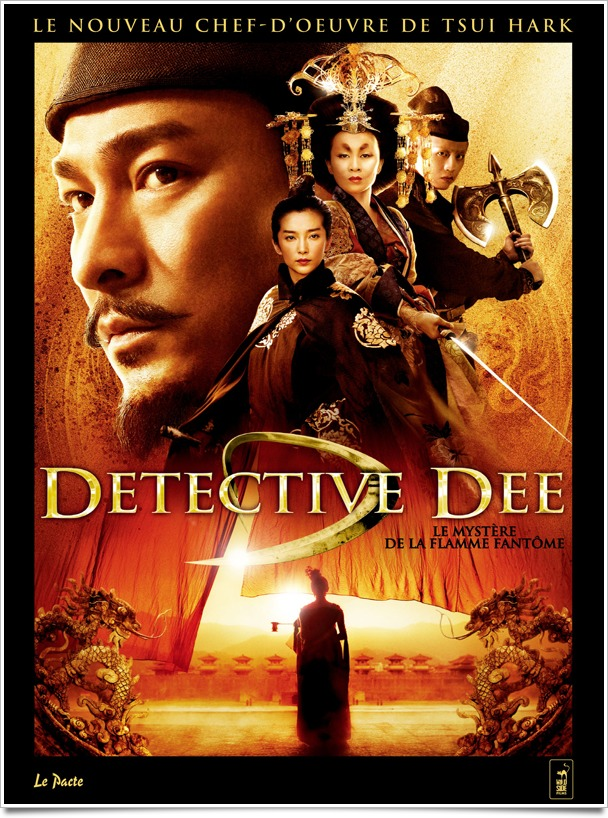
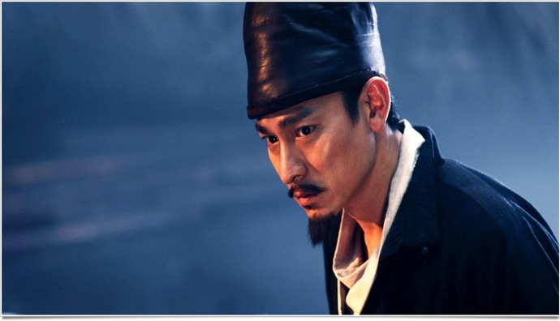
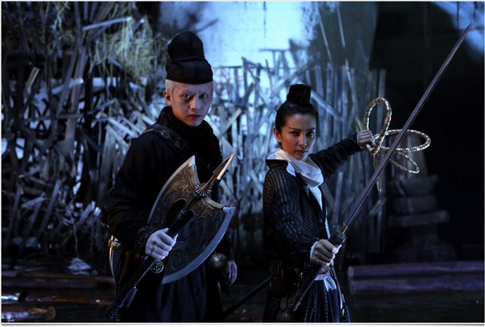

+++
titre = "Detective Dee : Le mystère de la flamme fantôme, Tsui Hark"
title = "Detective Dee : Le mystère de la flamme fantôme, Tsui Hark"
url = "/detective-dee-hark"
date = "2011-04-23T20:54:31"
Lastmod = "2013-02-09T15:40:07"
cover = "tsui-hark-detective-dee.jpg"
categorie = [ "À voir" ]
tag = [ "Action", "Aventure", "Blockbuster", "Société", "Vite oublié" ]
createur = [ "Tsui Hark" ]
acteur = [ "Andy Lau", "Carina Lau", "Li Binbing", "Tony Leung Ka Fai" ]
annee = [ "2011" ]
weight = 2011
pays = [ "Chine" ]
original = "Di renjie zhi tongtian diguo"

+++

Son nom ne vous dira peut-être rien, mais <a href="http://fr.wikipedia.org/wiki/Tsui_Hark">Tsui Hark</a> est l&rsquo;auteur d&rsquo;un nombre incalculable de films chinois. Peu ont passé les frontières, mais c&rsquo;est le cas de son dernier film. <em>Detective Dee : Le mystère de la flamme fantôme</em> est ce que l&rsquo;on nomme dans les milieux bien renseignés un &laquo;&nbsp;<em><a href="http://fr.wikipedia.org/wiki/Wu_Xia_Pian">wu xia pian</a></em>&nbsp;&raquo; (film de sabre), l&rsquo;équivalent du film de cape et d&rsquo;épée occidental. Le genre avait disparu après son heure de gloire dans les années 1960, avant de renaître avec le succès de <em>Tigre et Dragon</em>. Les amateurs du genre apprécieront ce nouveau film, les autres risquent bien d&rsquo;avoir du mal avec ce film qui semble vite kitsch et prévisible.

Le film se déroule dans la Chine du VIIe siècle. Wu Zetian, veuve du dernier empereur, s&rsquo;apprête à monter sur le trône, ce qui ferait d&rsquo;elle la première femme à accéder à ce statut. Les conspirations se multiplient contre la régente, à tel point qu&rsquo;elle n&rsquo;a plus le choix. Quand deux crimes extrêmement mystérieux sont perpétués, elle doit sortir de prison un opposant politique pour résoudre ces crimes et déjouer la conspiration. Le détective Dee s&rsquo;est peut-être opposé par le passé à Wu Zetian, mais c&rsquo;est aussi un détective hors pair, capable de résoudre les enquêtes les plus complexes. Accompagné de deux compagnons, notre homme va donc partir en quête de la vérité. Une quête, on s&rsquo;en doute, pleine de dangers et de péripéties et une enquête pleine de rebondissements.

À l&rsquo;image des films de cape et d&rsquo;épée, le film de Tsui Hark répond à des règles bien précises, avec comme résultat un film assez codé. Les combats ponctuent régulièrement le film, dans un esprit de chorégraphie et de voltiges que l&rsquo;on connaît bien. Le résultat est d&rsquo;ailleurs assez efficace et spectaculaire et devrait satisfaire les amateurs de genre : un des décors est une statue géante de bouddha avec à l&rsquo;intérieur des tas de passerelles, d&rsquo;escaliers et de câbles, terrain de jeu idéal pour des combats endiablés. Règles aussi dans l&rsquo;enquête effectuée par le héros : on sait d&rsquo;emblée que le coupable sera le suspect écarté d&rsquo;entrée de jeu. Cela ne manque pas : sans en dévoiler la fin, on peut tout de même dire que le méchant de <em>Detective Dee : Le mystère de la flamme fantôme</em> est inattendu. Comme on le sait dès le début du film, le suspense inhérent à l&rsquo;enquête est pour ainsi dire réduit. Tsui Hark a fait le pari d&rsquo;un film d&rsquo;aventures à l&rsquo;ancienne où l&rsquo;enjeu n&rsquo;est pas vraiment l&rsquo;intrigue elle-même que la manière de la faire évoluer. On pourrait d&rsquo;ailleurs connaître d&rsquo;emblée le nom du méchant, cela ne changerait pas fondamentalement l&rsquo;intérêt du film. L&rsquo;enjeu est plutôt de savoir comment Dee va résoudre l&rsquo;énigme et se tirer des mauvais pas où son enquête le mène.

<em>Detective Dee : Le mystère de la flamme fantôme</em> est difficile à critique. Comme tous les films de genre, son degré d&rsquo;appréciation dépend en grande partie de l&rsquo;appréciation que l&rsquo;on a du genre lui-même. Autant le dire, je ne suis pas un grand amateur des films de cape et d&rsquo;épée, fussent-ils de sabres chinois. Je partais avec des <em>a priori</em> très positifs, mais j&rsquo;ai vite déchanté devant un film beaucoup trop prévisible et kitsch pour pouvoir me plaire. Tsui Hark fait une confiance absolue au cinéma à l&rsquo;ancienne, celui qui n&rsquo;a pas besoin d&rsquo;effets réalistes pour que le spectateur y croie, celui aussi qui croit aux grandes histoires pleines de personnages très typés, bref un cinéma du grand spectacle pur. C&rsquo;est une idée convaincante sur le papier, mais sur le papier seulement. À l&rsquo;écran, on s&rsquo;ennuie en fait un peu devant cette enquête bien peu passionnante, ces combats, certes assez bien réalisés, mais qui paraissent un peu peu sage par rapport à ce que l&rsquo;on a pu voir ailleurs (<em>Tigre et Dragon</em> fait encore office de référence ici). Que reste-t-il à <em>Detective Dee : Le mystère de la flamme fantôme</em> ? Une intrigue politique que l&rsquo;on aimerait pouvoir qualifier de passionnante, mais qui est maltraitée par le film (la première – et dernière… – femme impératrice, voilà un sujet qui aurait pu être intéressant, mais il reste anecdotique ici). Une astuce assez intéressante avec ces cloportes de feu qui font brûler de l&rsquo;intérieur leurs victimes, donnant lieu à des effets assez impressionnants…

La mort par les flammes est peut-être le seul effet de <em>Detective Dee : Le mystère de la flamme fantôme</em> à peu près correct. Tout le reste est d&rsquo;un niveau incroyablement bas pour un film sorti au XXIe siècle. On aimerait soutenir que c&rsquo;est voulu, que Tsui Hark propose ici un regard parodique sur les films à l&rsquo;ancienne, mais on manque pour cela de confirmations. Non, il semble que l&rsquo;extrême laideur d&rsquo;une grande partie des décors soit beaucoup plus simplement… un manque de moyens. Les décors numériques sont en tout cas extrêmement visibles et nuisent au réalisme de l&rsquo;ensemble : on ne croit jamais à cette ville qui évoque surtout un vieux jeu de gestion. La beauté esthétique de certains films de sabre est ici totalement absente, l&rsquo;ensemble est plutôt extrêmement kitsch et n&rsquo;aide pas à s&rsquo;intéresser outre mesure au film. Sans parler de la musique, caricaturale au possible, qui semble assener son message avec une conviction inébranlable.

Aussi étrange que cela puisse paraître, ce film m&rsquo;a fait penser à un Bollywood. Non pas qu&rsquo;il s&rsquo;approche du genre indien, non, mais il a le même côté réglé ainsi que la même esthétique un peu kitsch. Je conçois que l&rsquo;on puisse apprécier, mais il me manquait beaucoup de trop de choses pour que je puisse ressentir autre chose qu&rsquo;un vague ennui. <em>Detective Dee : Le mystère de la flamme fantôme</em> n&rsquo;a pas la beauté visuelle de films comme <em>Tigre et Dragon</em>, <em>Le secret des poignards volants</em> ou encore <em>Hero</em> et cela m&rsquo;a manqué. Son intrigue politico-policière ne m&rsquo;a pas intéressé vraiment et si le film se regarde avec un certain plaisir, il s&rsquo;oublie sitôt le pas de la porte de la salle passé. Dommage, j&rsquo;aurais adoré aimer ce film…

Pour nuancer cet avis plutôt négatif, lisez l&rsquo;avis enthousiaste de <a href="http://www.filmosphere.com/2011/04/critique-detective-dee-2010/">Nicolas</a>, expert ès cinéma asiatique et manifestement grand connaisseur de Tsui Hark et des <em>wu xia pian</em>… À lire aussi, l&rsquo;avis également positif d&rsquo;<a href="http://www.plan-c.fr/article-critique-detective-dee-de-tsui-hark-71230559.html">Alexandre</a> ou l&rsquo;avis plus contrasté (et dans lequel je me retrouve plus) de <a href="http://www.critikat.com/Detective-Dee-and-the-Mystery-of.html">Critikat</a>.

<h3>Vous voulez m&rsquo;aider ?<a href="#footnote_0_4760" id="identifier_0_4760" class="footnote-link footnote-identifier-link" title="&Agrave; propos de la publicit&eacute;&hellip;">1</a></h3>
<ul>
<li><a href="http://www.amazon.fr/gp/product/B0069RWLDM/ref=as_li_ss_tl?ie=UTF8&#038;tag=leblogdenic07-21&#038;linkCode=as2&#038;camp=1642&#038;creative=19458&#038;creativeASIN=B0069RWLDM">Acheter le film en Blu-Ray sur Amazon</a></li>
<li><a href="http://www.amazon.fr/gp/product/B005XLR4FA/ref=as_li_ss_tl?ie=UTF8&#038;tag=leblogdenic07-21&#038;linkCode=as2&#038;camp=1642&#038;creative=19458&#038;creativeASIN=B005XLR4FA">Acheter le film en DVD sur Amazon</a></li>
<li><a href="https://itunes.apple.com/fr/movie/detective-dee-vost/id453643497">Acheter ou louer le film sur l&rsquo;iTunes Store</a></li>
</ul>

<ol class="footnotes"><li id="footnote_0_4760" class="footnote"><a href="http://voiretmanger.fr/soutien/">À propos de la publicité…</a> [<a href="#identifier_0_4760" class="footnote-link footnote-back-link">&#8617;</a>]</li></ol>
