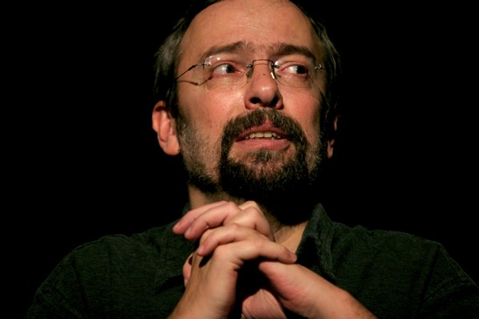

+++
type = "post"
titre = "Didier Porte au Café de la Gare"
title = "Didier Porte au Café de la Gare"
url = "/didier-porte-cafe-de-la-gare"
date = "2009-04-14T00:35:41"
Lastmod = "2010-03-08T15:44:12"
cover = "didier-porte1.jpg"
categorie = [ "À voir… en live" ]
tag = [ "Comique", "Humour", "Politique" ]
createur = [ "Didier Porte" ]
annee = [ "2009" ]
weight = 2009
pays = [ "France" ]

+++

Après l&rsquo;<a href="/2009/03/22/sauvons-les-humoristes/">excellent Régis Mailhot</a>, je suis allé voir ce soir le maître actuel de l&rsquo;humour français tendance politique, corrosif et noir, j&rsquo;ai nommé bien sûr Didier Porte. Le dangereux chroniqueur gauchiste de France Inter (tous les jours chez Stéphane Bern, vers 12h15 et le jeudi chez Demorand, vers 7h50) est aussi comique à ses heures et produit un spectacle — &laquo;&nbsp;Didier Porte aime les gens&nbsp;&raquo; — en <a href="http://www.didierporte.eu/actu.php">tournée permanente</a> dans toute la France et les seconds lundis de chaque mois (ah ben faut suivre hein) au <a href="http://www.cdlg.org/w/">Café de la Gare</a>, rue du Temple à Paris, en plein cœur du Marais. Nonobstant la qualité des &laquo;&nbsp;sièges&nbsp;&raquo; (mais je crois que c&rsquo;est une constante dans le coin), ce spectacle est tout à fait recommandable, enfin, à condition d&rsquo;accepter de rire de tout.

En effet, l&rsquo;humour de Didier Porte est loin de l&rsquo;humour ambiant, à base de cassoulet et de saucisses. Restons dans la métaphore culinaire : Didier Porte met les pieds dans tous les plats et n&rsquo;hésite pas à évoquer les sujets qui fâchent, et à les évoquer crûment. Son humour en choquera sans doute plus d&rsquo;un, car tout y passe, même le viol par exemple (ainsi, il suggère Émile Louis pour le ministère de la Famille d&rsquo;un futur remaniement ministériel). Quand il a reconnu en Raffarin le meilleur ministre de la République française pour sa capacité à remplir les urnes de ses électeurs (en faisant référence à la canicule de 2003), on a bien senti comme une gêne dans une salle composée, en grande partie, de personnes relativement âgées.

Soyez donc prévenus si vous allez le voir sur scène, il s&rsquo;autorise tout, peut-être même plus encore qu&rsquo;à la radio. Il n&rsquo;a aucun interdit, n&rsquo;hésite pas à taper sur le physique, sur toutes les religions, sur les politiques bien sûr&#8230; On aime où on n&rsquo;aime pas, pour ma part je pense que c&rsquo;est aux humoristes de déranger et je suis ravi qu&rsquo;il en reste encore quelques-uns.

Si l&rsquo;actualité politique reste essentielle dans ce spectacle, Didier Porte s&rsquo;en éloigne plus que par exemple Régis Mailhot. Ce spectacle est plus écrit et plus fixe que celui de Mailhot, l&rsquo;avantage étant bien sûr que l&rsquo;on n&rsquo;a pas l&rsquo;effet de redite que je soulignais à propos de ce dernier. En contrepartie, on reparle encore d&rsquo;éléments déjà anciens, comme la bêtise de Bush par exemple. Avec Porte, on s&rsquo;éloigne des <em>stand-ups</em> pour revenir aux plus classiques sketches, avec notamment des sketchs à répétition où l&rsquo;on voit le comique prier Dieu pour l&rsquo;aider à être connu. Si vous voulez mon avis, ça n&rsquo;est pas si mal : le spectacle est plus joué, on est surpris par les thèmes (comme cet excellent envoyé spécial du JT de TF1 ou le &laquo;&nbsp;prolethon&nbsp;&raquo; — téléthon en honneur de la classe ouvrière — laborieusement expliqué à Nonce Paolini), bref c&rsquo;est plus un vrai spectacle de comique.

 
<em>Un gauchiste en prière, c&rsquo;est forcément louche&#8230;</em>

Ce spectacle confirme, à mes yeux, ce que je ressentais déjà en écoutant ses chroniques radiophoniques. Didier Porte est le descendant direct de Desprogres et à mon sens, on ne pourrait pas lui faire un meilleur compliment. Pas un descendant idéologique, certes, les deux hommes étant même diamétralement opposés sur l&rsquo;échiquier politique. Mais un descendant humoristique, sans aucun doute, et cela tient, je pense, essentiellement à l&rsquo;écriture. Comme Desproges, Porte est capable de lancer de longues phrases très bien écrites, telles des diatribes enflammées, avant de les terminer de manière abrupte par une énormité qui crée un effet de surprise très drôle. Les deux jouent de manière très fine sur les mots (cf l&rsquo;exemple des urnes), tous deux n&rsquo;ont absolument aucun tabou humoristique (rappelons-nous le fameux &laquo;&nbsp;On peut rire de tout, mais pas avec tout le monde&nbsp;&raquo;), les deux cultivent le sarcasme et l&rsquo;ironie, la base de l&rsquo;humour noir qu&rsquo;ils empruntent également.

Desproges était encore plus littéraire, si j&rsquo;ose dire, que Didier Porte, je veux dire que son humour reposait entièrement sur les mots (ses spectacles étaient très sobres) là où le second use de quelques artifices théâtraux et utilise plus son corps. Néanmoins, on sent bien qu&rsquo;il n&rsquo;est pas un acteur : il se revendique journaliste d&rsquo;avant-garde, et cela se voit. Ça n&rsquo;est pas une critique, il faut de tout, de vrais acteurs capables de se métamorphoser dans chaque rôle, mais qui lisent des textes écrits par d&rsquo;autres, et des humoristes pas forcément très doués en jeu, mais qui écrivent leurs propres textes.

Une note, pour finir, sur l&rsquo;homme. Les photos que l&rsquo;on trouve sur <a href="http://www.didierporte.eu/">son site officiel</a> et qui ont servi à illustrer cet article semblent l&rsquo;indiquer, le spectacle l&rsquo;a confirmé, Didier Porte est quelqu&rsquo;un de très généreux. Il est heureux sur scène et son bonheur est très communicatif : on sent que c&rsquo;est un plaisir pour lui d&rsquo;être sur scène et de faire rire un public conquis d&rsquo;avance, il est vrai (il y avait quantité de fonctionnaires et autres anarcho-syndicalistes potentiellement dangereux&#8230;). Vraiment, cela fait plaisir rien que de le voir sur scène, il a en permanence le sourire (d&rsquo;aucuns diront carnassier) aux lèvres et c&rsquo;est très agréable (toujours nonobstant le siège) de passer une heure et demie (en gros) en compagnie de Didier Porte (avec, en <em>guest-star</em>, Guy Bedos !).

Les moins de 26 ans n&rsquo;auront aucune excuse : la place est à dix euros à condition de <a href="http://www.cdlg.org/w/tarifs/">réserver par téléphone</a> à l&rsquo;avance. Bon évidemment, il fallait que j&rsquo;y aille un lundi férié où ce tarif ne s&rsquo;appliquait pas&#8230;

Enfin, évoquons à nouveau, comme l&rsquo;humoriste l&rsquo;a fait en fin de spectacle, la situation tendue à France Inter à propos de Stéphane Guillon, mais surtout de Didier Porte, le premier étant surmédiatisé et risque donc moins gros. Si vous voulez qu&rsquo;un certain humour irrespectueux envers tout, et surtout contre le politiquement correct ambiant, résiste, écoutez les humoristes qui l&rsquo;incarnent, téléchargez-les en podcasts, allez les voir sur scène, bref, manifestez votre soutien. Et soyons attentifs en septembre, lors de la présentation de la nouvelle grille horaire de France Inter, à ce que les noms &laquo;&nbsp;Porte&nbsp;&raquo; et &laquo;&nbsp;Guillon&nbsp;&raquo; y figurent bien.

