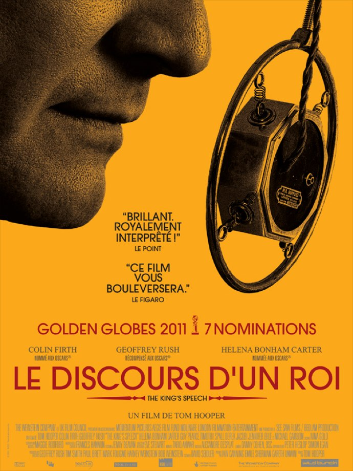
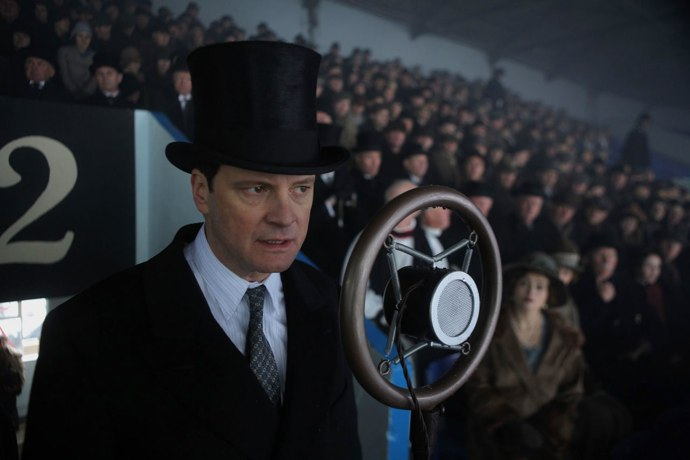
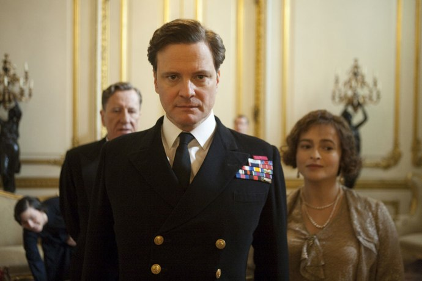

+++
titre = "<em>Le Discours d&rsquo;un Roi</em>, Tom Hooper"
title = "Le Discours d'un Roi, Tom Hooper"
url = "/discours-roi-hooper"
date = "2011-01-26T00:19:13"
Lastmod = "2014-02-27T20:39:39"
cover = "tom-hooper-discours-roi.jpg"
categorie = [ "À voir" ]
tag = [ "Biopic", "Blockbuster", "Drame", "Famille", "Histoire" ]
createur = [ "Tom Hooper" ]
acteur = [ "Colin Firth", "Geoffrey Rush", "Helena Bonham Carter" ]
annee = [ "2011" ]
weight = 2011
pays = [ "États-Unis" ]
original = "The King's Speech"

+++

Plus que l&rsquo;histoire d&rsquo;un homme, plus que l&rsquo;histoire d&rsquo;un pays, <em>Le Discours d&rsquo;un Roi</em> est l&rsquo;histoire d&rsquo;un discours. Mais pas n&rsquo;importe quel discours : celui que prononça George VI roi d&rsquo;Angleterre en 1939 suite à la déclaration de guerre de son pays contre l&rsquo;Allemagne nazie. Un discours important donc, et un défi terrible pour un homme bègue et incapable d&rsquo;aligner plus de deux mots devant un micro. Tom Hooper a la bonne idée de choisir un bref instant de la vie du roi et de s&rsquo;y limiter. Ainsi, il évite les travers du biopic et compose un film riche et passionnant.

George VI n&rsquo;avait rien pour devenir roi du plus grand empire au monde. Son accession au trône fin 1936 a été inattendue, pour lui comme pour le pays tout entier et il ne la doit qu&rsquo;à son frère qui fut un Édouard VIII éphémère, préférant renoncer au trône et effectuer un mariage d&rsquo;amour. Propulsé à la tête de l&rsquo;État, George VI doit faire face à l&rsquo;adversité d&rsquo;un métier difficile, et surtout à sa plus terrible crainte depuis sa plus tendre enfance : le bégaiement. Dans son cas, les symptômes sont tels qu&rsquo;il se révèle incapable d&rsquo;aligner plus de deux mots en public, ce qui est pour le moins gênant quand on doit assurer des fonctions royales. Sa vie durant, il fit tout pour combattre ce mal, consultant les plus grands spécialistes du pays, en vain. <em>Le Discours d&rsquo;un Roi</em> raconte sa rencontre avec Lionel Logue, un Australien réputé pour ses succès, mais aussi pour ses méthodes peu orthodoxes en matière d&rsquo;orthophonie. Sans diplôme, mais avec la satisfaction d&rsquo;avoir sauvé un grand nombre d&rsquo;hommes et de femmes incapables de s&rsquo;exprimer correctement, il ne se laisse pas impressionner par l&rsquo;aspect royal de son nouveau patient qu&rsquo;il prénomme d&rsquo;ailleurs rapidement &laquo;&nbsp;Bertie&nbsp;&raquo;. Entre ces deux hommes que tout sépare va émerger une reconnaissance mutuelle alors que les progrès se font sentir, puis même une amitié. Le point d&rsquo;orgue étant, on s&rsquo;en doute, le fameux discours d&rsquo;entrée en guerre.

<em>Le Discours d&rsquo;un Roi</em> a tous les attributs du biopic à Oscars. Le film raconte d&rsquo;abord l&rsquo;histoire d&rsquo;un homme devenu roi d&rsquo;Angleterre malgré lui et qui a dû affronter les évènements terribles de la Seconde Guerre mondiale. À travers l&rsquo;homme se dessine alors l&rsquo;histoire d&rsquo;un pays qui voit monter la menace nazie, entend longtemps l&rsquo;éviter et doit finalement l&rsquo;affronter. La petite histoire qui rejoint la grande, on connaît la chanson et on doit avouer que le film de Tom Hooper s&rsquo;acquitte très bien de cette volonté. La rencontre étonnante entre le distingué Duke of Yorke et le plus populaire Lionel fonctionne à plein, tandis que l&rsquo;objectif du discours annoncé par le titre relie en permanence le film au contexte historique qu&rsquo;il décrit. Comme tout biopic digne de ce nom, les grands évènements sont relatés par le scénario : on verra ainsi les dernières heures de George V, le père et le règne chaotique d&rsquo;Édouard VIII avec ses relations sulfureuses. Comme l&rsquo;histoire s&rsquo;en rappelle, il préfère finalement quitter le trône et épouser la femme qu&rsquo;il aime, contraignant ainsi son jeune frère à prendre sa place sur le trône anglais. <em>Le Discours d&rsquo;un Roi</em> nous fera ainsi partager le quotidien de grands hommes restés dans l&rsquo;histoire, comme Winston Churchill, ministre qui est resté gravé dans les mémoires collectives comme le plus fervent combattant contre l&rsquo;Allemagne (et seul soutien de notre Général…). Les acteurs deviennent vraiment leurs personnages, le film tend à coller au plus près de la réalité historique… au moins sur le papier. Comme dans beaucoup de biopic, la complexité folle de la réalité est ici simplifiée à l&rsquo;extrême, quitte à faire des erreurs. Mais ces erreurs sont peut-être aussi la force du film.

En effet, <em>Le Discours d&rsquo;un Roi</em> a beau ressembler à un biopic classique et ennuyeux, il n&rsquo;en est pas un. Intuition du réalisateur ou pas, le film se concentre intelligemment sur l&rsquo;intime et évite tous les poncifs du genre. Sa grande force est de prendre le temps de décrire un homme bien plus complexe que sa fonction royale le laisse deviner, un homme rongé depuis l&rsquo;enfance par un complexe d&rsquo;infériorité vis-à-vis de son père, sévère et autoritaire, autant que de son frère qui a toujours fait preuve d&rsquo;assurance. Son bégaiement, c&rsquo;est la thèse défendue par Tom Hooper, est lié à ce sentiment d&rsquo;infériorité, mais aussi par sa conscience aigüe de ses responsabilités. L&rsquo;autre personnage central du film est l&rsquo;homme de l&rsquo;ombre, Lionel Logue, cet orthophoniste australien sans diplôme qui parvient à redonner confiance à Berty. Ses méthodes sont inattendues puisqu&rsquo;il fait plus office de psychologue que d&rsquo;orthophoniste et son absence totale de respect vis-à-vis de la couronne rend sa relation avec le futur roi complexe et passionnante. Ce dernier n&rsquo;apprécie guère dans un premier temps qu&rsquo;on le traite comme un vague roturier, mais plus le temps passe et plus il apprécie le docteur qui n&rsquo;en est pas un. Les séances sont l&rsquo;occasion de séquences tantôt drôles, tantôt émouvantes, mais qui font du film une réussite. Réussite aussi liée au fait que le vrai héros du film reste le discours : faire tout un film sur un discours et parvenir à créer un suspense réel autour de quelques mots prononcés devant un micro, il fallait le faire.

Tom Hooper s&rsquo;en sort ainsi plutôt bien grâce à un scénario malin, qui reste en permanence centré sur le discours et évite notamment ce qui précède ou ce qui suit. <em>Le Discours d&rsquo;un Roi</em> est totalement épargné par les flashbacks, et c&rsquo;est un très bon point pour le film : ils auraient pu être multipliés pour évoquer l&rsquo;enfance difficile du personnage, mais si on les voit venir, le réalisateur a la présence d&rsquo;esprit de ne pas céder à cette facilité et de faire confiance aux dialogues. Autre bonne idée, évier au maximum les reconstitutions historiques, privilégiant quelques images d&rsquo;archives et se limitant au strict nécessaire. Les ors de la Couronne britannique sont bien là, les costumes aussi… mais le film se déroule en grande partie dans l&rsquo;appartement très simple du docteur et la reconstitution se limite aux appareils de radio, aux voitures ou encore à un avion. Une manière aussi de rappeler que le sujet du film n&rsquo;est pas l&rsquo;histoire du pays, mais celle d&rsquo;un homme et même plus précisément le combat d&rsquo;un homme contre un bégaiement. <em>Le Discours d&rsquo;un Roi</em> est techniquement extrêmement classique, mais efficace et le film doit beaucoup aux performances de ses acteurs principaux. Colin Firth est très juste dans ce rôle de monarque tandis que Geoffrey Rush excelle dans son rôle d&rsquo;orthophoniste. La seule véritable fausse note sera pour Churchill que l&rsquo;on connaît trop bien en vrai pour laisser une seule chance à Timothy Spall qui a en outre la malchance d&rsquo;avoir marqué dans <em>Harry Potter</em>…

Bonne surprise que ce <em>Discours d&rsquo;un Roi</em>. On attendait un biopic classique et un peu ennuyeux, on a un film très juste et fort sur la lutte d&rsquo;un homme pour réussir à parler en public et ainsi assurer ses fonctions royales. Le contexte historique n&rsquo;est qu&rsquo;un prétexte offert à Tom Hooper pour mettre en scène la relation touchante de deux hommes que tout séparait. Le résultat est ainsi bien plus intéressant qu&rsquo;un biopic, et peu importe alors si la précision historique n&rsquo;est pas toujours au rendez-vous, ou si la réalisation gagnerait à être un peu plus inventive.

<h3>Vous voulez m&rsquo;aider ?<a href="#footnote_0_4580" id="identifier_0_4580" class="footnote-link footnote-identifier-link" title="&Agrave; propos de la publicit&eacute;&hellip;">1</a></h3>
<ul>
<li><a href="http://www.amazon.fr/gp/product/B0069RWKM4/ref=as_li_ss_tl?ie=UTF8&#038;tag=leblogdenic07-21&#038;linkCode=as2&#038;camp=1642&#038;creative=19458&#038;creativeASIN=B0069RWKM4">Acheter le film en Blu-Ray sur Amazon</a></li>
<li><a href="http://www.amazon.fr/gp/product/B006LNA8TI/ref=as_li_ss_tl?ie=UTF8&#038;tag=leblogdenic07-21&#038;linkCode=as2&#038;camp=1642&#038;creative=19458&#038;creativeASIN=B006LNA8TI">Acheter le film en DVD sur Amazon</a></li>
<li><a href="https://itunes.apple.com/fr/movie/le-discours-dun-roi-vost/id437905301">Acheter ou louer le film sur l&rsquo;iTunes Store</a></li>
</ul>

<ol class="footnotes"><li id="footnote_0_4580" class="footnote"><a href="http://voiretmanger.fr/soutien/">À propos de la publicité…</a> [<a href="#identifier_0_4580" class="footnote-link footnote-back-link">&#8617;</a>]</li></ol>
