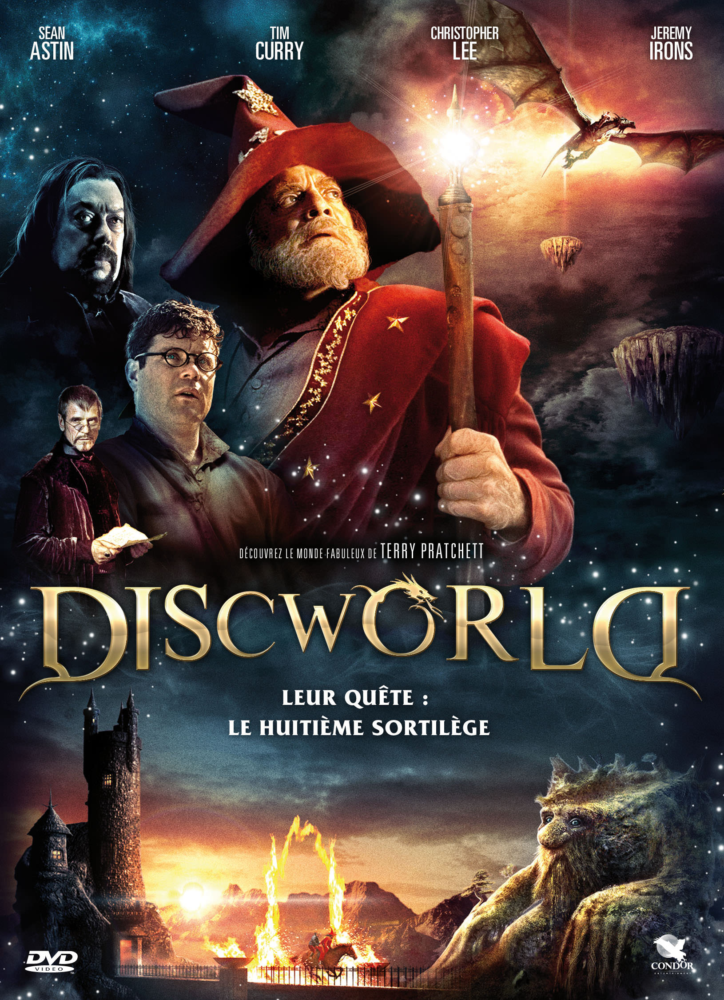
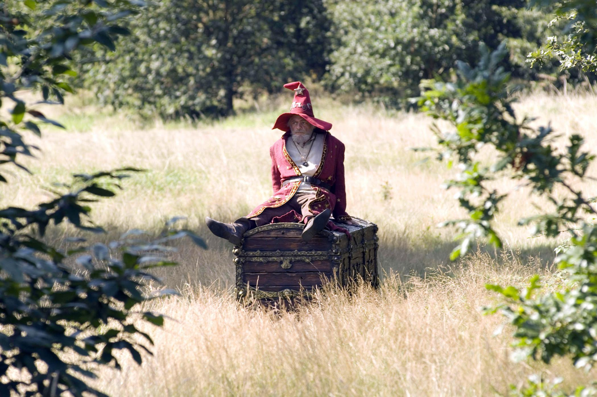
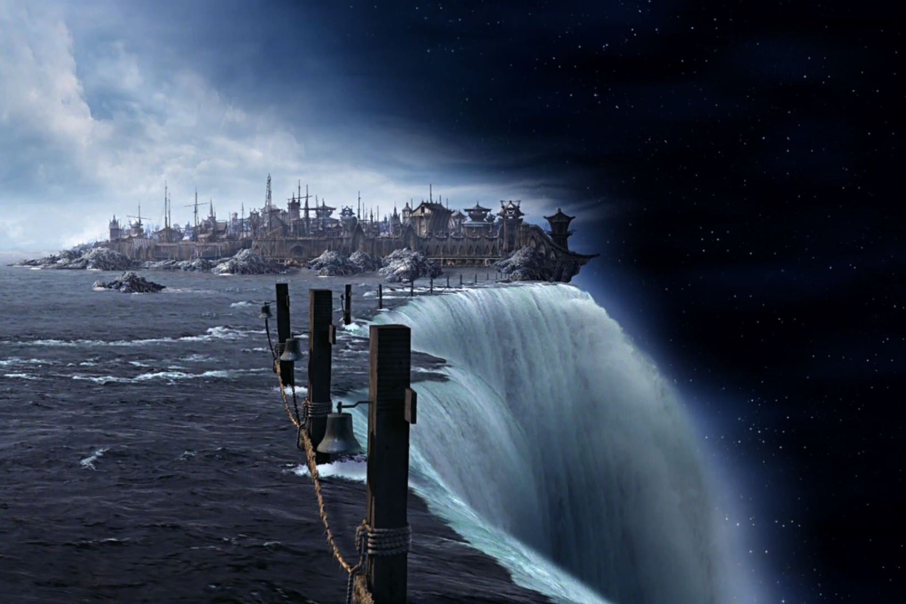

+++
type = "post"
titre = "<em>Discworld</em>, Vadim Jean"
title = "Discworld, Vadim Jean"
url = "/discworld-jean"
date = "2015-03-18T23:17:23"
Lastmod = "2015-03-18T23:22:03"
cover = "discworld-mort-jean.jpg"
categorie = [ "À voir" ]
tag = [ "Absurde", "Adaptation littéraire", "Aventure", "Heroïc-Fantasy", "Humour", "Magie", "Parodie", "Téléfilm" ]
createur = [ "Vadim Jean" ]
acteur = [ "Christopher Lee", "David Bradley", "David Jason", "Jeremy Irons", "Sean Astin", "Tim Curry" ]
annee = [ "2008" ]
weight = 2008
saga = [ "Les Annales du Disque-Monde" ]
pays = [ "Grande-Bretagne" ]
original = "The Colour of Magic"

+++

Avec <em>Les Annales du Disque-Monde</em>, Terry Pratchett a été l&rsquo;un des rares écrivains à créer de toute pièce un monde imaginaire, mais parfaitement crédible et logique, pour y déployer son œuvre. Un univers logique, certes, mais qui répond à une logique qui n&rsquo;est pas la nôtre, c&rsquo;est d&rsquo;ailleurs là tout son intérêt. Adoptant avec beaucoup de bonheur un humour très anglais, entre absurde et pince-sans-rire, le romancier a signé des dizaines de romans vraiment très drôles… mais qui ont du mal à s&rsquo;adapter à tout autre format. La preuve en est avec les téléfilms réalisés par la chaîne britannique Sky1 : après une version littérale et complètement ratée du <em>Père Porcher</em><a href="#fn-13338-1" rel="footnote">1</a>, ce sont les deux premiers volets écrits par Terry Pratchett qui ont eu l&rsquo;honneur d&rsquo;une adaptation. Toujours réalisée par Vadim Jean, <em>Discworld</em> (oui, c&rsquo;est le titre français…) est une meilleure adaptation, ce qui ne va pas dire que c&rsquo;est un bon film pour autant. À voir par curiosité, mais surtout pour se donner envie de relire encore une fois l&rsquo;excellente œuvre du romancier ! Ou, mieux encore, de la découvrir pour la première fois…

Diffusé à l&rsquo;origine en deux parties d&rsquo;une heure et demi, <em>Discworld</em> est un téléfilm long, trop long, mais il faut dire qu&rsquo;il a de la matière. Vadim Jean a choisi d&rsquo;adapter non pas un, mais deux romans de Terry Pratchett et on a ainsi non seulement <a href="http://www.amazon.fr/gp/product/2266254219/ref=as_li_ss_tl?ie=UTF8&amp;tag=leblogdenic07-21&amp;linkCode=as2&amp;camp=1642&amp;creative=19458&amp;creativeASIN=2266254219"><em>La Huitième Couleur</em></a>, mais aussi <a href="http://www.amazon.fr/gp/product/226621182X/ref=as_li_ss_tl?ie=UTF8&amp;tag=leblogdenic07-21&amp;linkCode=as2&amp;camp=1642&amp;creative=19458&amp;creativeASIN=226621182X"><em>Le Huitième Sortilège</em></a>. Le choix est cohérent, puisque ces deux romans fonctionnent ensemble, là où les autres tomes des <em>Annales du Disque-Monde</em> sont en général indépendants, quoi que liés par l&rsquo;univers et quelques personnages clés. Ainsi donc, le film commence comme le roman avec l&rsquo;arrivée à Ankh-Morpok, capitale du Disque-Monde — qui est, rappelons-le, posé sur quatre éléphants, eux-mêmes portés par la Grande A&rsquo;Tuin, une tortue<a href="#fn-13338-2" rel="footnote">2</a> — de Deuxfleurs, le premier touriste de l&rsquo;histoire de cet univers. Le concept même de tourisme est d&rsquo;ailleurs totalement étranger aux autochtones qui voient surtout une manière de s&rsquo;enrichir avec ce nouvel arrivant et son coffre à pattes rempli d&rsquo;or. Un peu par hasard, Rincevent tombe sur ce touriste : la quarantaine bien tassée, cet étudiant à l&rsquo;université de l&rsquo;Invisible n&rsquo;a jamais réussi à devenir un vrai mage et il a été expulsé. Par un mystérieux concours de circonstance, il doit accompagner Deuxfleurs, tout en étant au cœur d&rsquo;un véritable drame planétaire : le Disque-Monde se dirige droit vers une étoile rouge et lui seul peut le sauver. Vadim Jean avait beaucoup de travail pour passer de ces romans loufoques qui partent dans tous les sens — il suffit de lister quelques personnages importants, à commencer par la Mort elle-même<a href="#fn-13338-3" rel="footnote">3</a>, le mythique (mais vieillissant) Cohen le Barbare<a href="#fn-13338-4" rel="footnote">4</a>, le mage Trymon qui veut absolument la place majeure dans l&rsquo;université, et des dizaines d&rsquo;autres encore… — et une histoire qui ne tient pas debout. Il fallait retirer des éléments, et c&rsquo;est ce que le scénariste a fait, avec plus ou moins de succès.

Il serait injuste de ne pas reconnaître que le scénariste s&rsquo;est plutôt bien débrouillé, étant donnée la complexité des romans originaux. La majorité des tomes qui composent <em>Les Annales du Disque-Monde</em> sont probablement impossibles à transcrire au cinéma, même si les projets ne manquent pas, et Vadim Jean s&rsquo;en sort plutôt bien, dans l&rsquo;ensemble. Sur plus de trois heures, on déplore malgré tout quelques baisses de régime, tandis que des pans entiers des romans ont été sacrifiés, parfois au détriment de la compréhension générale de l&rsquo;intrigue. Qu&rsquo;importe, <em>Discworld</em> tient la route et même si ceux qui ont lu Terry Pratchett en tireront plus, tout le monde devrait s&rsquo;y retrouver. Ce n&rsquo;est pas le plus gros problème de ce téléfilm, contrairement au budget qui est manifestement <em>le</em> point faible de l&rsquo;adaptation. Tourné en 2007, le long-métrage semble bien plus vieux à cause de ses effets spéciaux tous extrêmement pauvres. Déjà à sa sortie, le film devait sembler pauvre et vieillot et certaines séquences devaient déjà paraître hideuses. C&rsquo;est typiquement le cas dès que les mages utilisent la magie, mais c&rsquo;est aussi vrai pour toutes les scènes dans l&rsquo;espace, ou celles réalisées au bord du Disque. On voit bien que Vadim Jean n&rsquo;a pas eu un budget hollywoodien et c&rsquo;est dommage, quoiqu&rsquo;en un sens, cette pauvreté technique renforce le côté parodique du récit. D&rsquo;ailleurs, les scènes les plus ratées sont systématiquement celles qui sont techniquement les plus soignées, comme si <em>Discworld</em> avait besoin d&rsquo;un côté carton-pate peu crédible pour fonctionner. Malgré tout, Vadim Jean n&rsquo;est pas un grand cinéaste et on sent vite les limites de sa réalisation. Les acteurs, pourtant parfois très connus — on compte Sean Astin, Christopher Lee ou encore Jeremy Irons au casting — ne semblent pas vraiment croire en leur texte et ils ont parfois du mal à être dans leur personnage. Ce n&rsquo;est pas aussi catastrophique que dans la première adaptation réalisée par la chaîne et on supporte très bien ce film-là, mais on sent aussi qu&rsquo;il est techniquement bien léger.

Au-delà des acteurs, au-delà des effets spéciaux, cette adaptation de Terry Pratchett prouve sans doute d&rsquo;abord que l&rsquo;univers du romancier ne s&rsquo;adapte pas très bien à un autre médium. Là où les deux romans utilisés pour <em>Discworld</em> sont réellement drôles à éclater de rire, le film de Vadim Jean fait surtout sourire. On rit peut-être une fois ou deux, mais la majorité des vannes qui fonctionnaient si bien sur papier, ont perdu toute leur force avec l&rsquo;image. Ce n&rsquo;est sans doute pas une fatalité, Terry Pratchett peut faire rire au cinéma, mais il faudra sans doute pour cela s&rsquo;éloigner du matériau original et se concentrer sur l&rsquo;esprit des <em>Annales du Disque-Monde</em>, plus que sur leur contenu <a href="#fn-13338-5" rel="footnote">5</a>. Il ne reste plus qu&rsquo;à espérer qu&rsquo;un scénariste talentueux se penche sur le sujet… tout espoir n&rsquo;est pas perdu ! D&rsquo;ici là, <em>Discworld</em> est une adaptation qui se laisse regarder, mais qui vous plaira surtout si vous avez lu les deux romans et que vous vous les rappelez à travers le film.

<h3>Vous voulez <a href="/soutien/">m&rsquo;aider</a> ?</h3>
<ul>
<li><a href="http://www.amazon.fr/gp/product/B005FGMBZQ/ref=as_li_ss_tl?ie=UTF8&amp;tag=leblogdenic07-21&amp;linkCode=as2&amp;camp=1642&amp;creative=19458&amp;creativeASIN=B005FGMBZQ">Acheter le film en Blu-ray sur Amazon</a></li>
<li><a href="http://www.amazon.fr/gp/product/B005FGMBYC/ref=as_li_ss_tl?ie=UTF8&amp;tag=leblogdenic07-21&amp;linkCode=as2&amp;camp=1642&amp;creative=19458&amp;creativeASIN=B005FGMBYC">Acheter le film en DVD sur Amazon</a></li>
<li><a href="https://itunes.apple.com/fr/movie/disc-world-vost/id475465700">Acheter ou louer le film sur l&rsquo;iTunes Store</a></li>
</ul>

<ol>
<li id="fn-13338-1">
Relecture déjantée très drôle du mythe du Père Noël, <a href="http://www.amazon.fr/gp/product/2266162144/ref=as_li_ss_tl?ie=UTF8&amp;tag=leblogdenic07-21&amp;linkCode=as2&amp;camp=1642&amp;creative=19458&amp;creativeASIN=2266162144"><em>Le Père Porcher</em></a> est le vingtième tome des annales et il est vraiment à recommander, mais uniquement sur papier. L&rsquo;adaptation, trop premier degré et fauchée, est quasiment impossible à regarder d&rsquo;un bout à l&rsquo;autre, d&rsquo;autant qu&rsquo;elle dure plus de trois heures.&#160;<a href="#fnref-13338-1" rev="footnote">&#8617;</a>
</li>
<li id="fn-13338-2">
Vous découvrez Terry Pratchett et vous vous sentez un peu perdu ? C&rsquo;est normal… la <a href="https://fr.wikipedia.org/wiki/Disque-monde">fiche Wikipedia</a> consacrée au Disque-Monde sera un bon début.&#160;<a href="#fnref-13338-2" rev="footnote">&#8617;</a>
</li>
<li id="fn-13338-3">
Mais attention, la Mort, chez Pratchett, est un personnage essentiel. Et c&rsquo;est un homme.&#160;<a href="#fnref-13338-3" rev="footnote">&#8617;</a>
</li>
<li id="fn-13338-4">
Version parodiée et vieillie de Conan le Barbare, certainement. Les dents en moins.&#160;<a href="#fnref-13338-4" rev="footnote">&#8617;</a>
</li>
<li id="fn-13338-5">
C&rsquo;est d&rsquo;ailleurs ce qu&rsquo;avait fait le <a href="http://www.abandonware-france.org/ltf_abandon/ltf_jeu.php?id=691">jeu <em>Discworld</em></a>, sorti en 1995. Plus qu&rsquo;une histoire, ce jeu d&rsquo;aventures s&rsquo;inspirait de la saga pour reprendre quelques personnages, les grandes lignes de son histoire et surtout son humour si particulier. C&rsquo;était une réussite…&#160;<a href="#fnref-13338-5" rev="footnote">&#8617;</a>
</li>
</ol>

