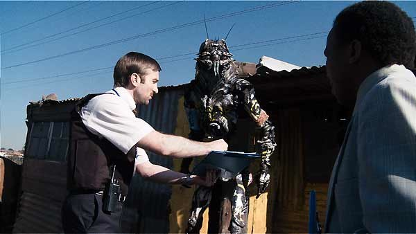
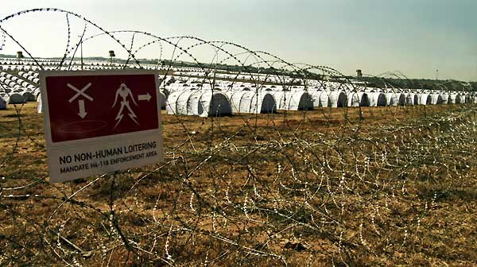

+++
type = "post"
titre = "District 9, Neill Blomkamp"
title = "District 9, Neill Blomkamp"
url = "/district-9-neill-blomkamp"
date = "2009-09-20T01:28:15"
Lastmod = "2014-01-01T15:19:47"
cover = "district-91.jpg"
categorie = [ "À voir" ]
tag = [ "Apartheid", "Science-Fiction", "Société" ]
createur = [ "Neill Blomkamp" ]
acteur = [ "David James", "Sharlto Copley" ]
annee = [ "2009" ]
weight = 2009
pays = [ "Afrique du Sud" ]

+++

Un film de science-fiction réalisé par un inconnu, mais chapeauté et promu par Peter Jackson, cela ne pouvait que faire du bruit. Le buzz fut en effet à la hauteur du vaisseau de l&rsquo;affiche : <em>District 9</em>, premier long métrage du Sud-Africain Neill Blomkamp était ainsi présenté comme un film à mi-chemin entre le blockbuster hollywoodien et le documentaire. À l&rsquo;écran, on a un film terriblement réaliste et qui dit énormément de choses sur notre société.

<em>District 9</em> présentant des aliens, il a été classé dans la catégorie science-fiction. Ça n&rsquo;est pas faux, mais l&rsquo;action est directement contemporaine (enfin, à un an près je crois) et les faits importants se déroulent tous à la fin des années 1980. En ce sens, plus que de science-fiction, on pourrait parler d&rsquo;uchronie.

L&rsquo;action se déroule en Afrique du Sud. Alors que l&rsquo;Apartheid touche à sa fin, un énorme vaisseau se positionne au-dessus de Johannesburg et reste immobile, comme mort. Une expédition permet de découvrir qu&rsquo;un million d&rsquo;aliens sont en fait dans le vaisseau, et le gouvernement sud-africain décide alors d&rsquo;exploiter les anciens townships pour les héberger. Une vingtaine d&rsquo;années après, soit aujourd&rsquo;hui, la situation est devenue incontrôlable. Les aliens, surnommés crevettes par les locaux en raison de leur morphologie particulière, ne s&rsquo;intègrent pas à la société, se gavent de pâtés pour chat, pillent les commerces et brulent des voitures, mais pas les pneus qu&rsquo;ils dévorent. Les humains en ont assez, ces crevettes ne sont plus les bienvenues et on décide alors de les déplacer à 200 km de la ville.

Le film commence comme un documentaire et suit la journée de Wikus, le responsable du déplacement des aliens sous la direction du MNU, l&rsquo;organisme qui les gère. On découvre au départ un gars brouillon pour ne pas dire énervé , très excité à l&rsquo;idée de virer les crevettes, s&rsquo;amusant de cette mission comme un gamin. On comprend vite qu&rsquo;il doit ce poste à son beau-père, dirigeant du MNU. Très vite, on voit bien qu&rsquo;il n&rsquo;est pas calé pour le job, les incidents se multiplient et l&rsquo;évacuation se passe très mal. Lors d&rsquo;une fouille, il tombe sur un mystérieux tube et se fait asperger d&rsquo;un liquide qui fait tout dérailler puisque l&rsquo;on comprend peu à peu qu&rsquo;il se transforme lui-même en crevette alien.

Après une première partie documentaire, <em>District 9</em> s&rsquo;oriente largement vers l&rsquo;action, sans grande originalité à dire vrai puisqu&rsquo;il s&rsquo;agit d&rsquo;une course-poursuite entre les soldats du MNU et le héros malgré lui devenu fugitif. Le début dans le style documentaire est beaucoup plus intéressant, même s&rsquo;il n&rsquo;est pas totalement novateur, Hollywood semblant adorer le style CNN. On retrouve en tout cas le principe de films comme <em>Cloverfield</em>, avec une petite caméra au cœur de l&rsquo;action ; sauf que là, la source n&rsquo;est pas unique, mais multiplie les angles. On a des extraits de la journée du déplacement, d&rsquo;autres rappellent les faits historiques, d&rsquo;autres enfin se passent temporellement dans la seconde partie du film et évoquent la réaction de la société face aux évènements. C&rsquo;est ce patchwork qui est vraiment intéressant.

<em>District 9</em> est un film très fort par son réalisme. Il est, certes, un peu étonnant de parler de réalisme à propos d&rsquo;un film qui présente des êtres qui n&rsquo;existent pas et qui construisent à partir de vieux PC des calculateurs  surpuissants. Néanmoins, ce film n&rsquo;est pas Star Wars et la majeure partie de l&rsquo;action se déroule en terrain connu — les bidonvilles d&rsquo;Afrique du Sud —, à une époque connue, et sans créatures étranges. Sur la majeure partie des plans, seule la présence du vaisseau au-dessus de la ville, comme menace permanente, renvoie à la Science-Fiction, au moins dans la première partie.

Résultat, on adhère totalement à l&rsquo;univers du film, et ses messages passent d&rsquo;autant mieux. La science-fiction n&rsquo;a jamais été qu&rsquo;un moyen détourné de dire quelque chose sur une époque, une société, mais avec <em>District 9</em>, c&rsquo;est explicite. Le choix de Johannesburg n&rsquo;est évidemment pas anodin, pas plus que celui de faire arriver les aliens à la fin de l&rsquo;Apartheid. Le film montre explicitement une société qui semble condamnée à voir en permanence cohabiter des populations radicalement différentes, comme si les crevettes remplaçaient les noirs. Ce qui est très intéressant, c&rsquo;est que l&rsquo;on observe que rassembler une population d&rsquo;individus, quels qu&rsquo;ils soient, en un même lieu désorganisé conduit toujours à la formation de bidonvilles et au rejet des populations environnantes.

Le réalisme du film tient aussi dans certains choix visuels qui sont autant de messages politiques ou de société forts. Ainsi, le nouveau camp des crevettes rappelle à s&rsquo;y méprendre un camp de concentration. Autre exemple, les véhicules blancs du MNU sont des copies parfaites de ceux de l&rsquo;ONU, et ça n&rsquo;est pas le siège de l&rsquo;entreprise ou son drapeau qui changent cette troublante proximité.

<em>District 9</em> est aussi réaliste sur le fond, il dit des choses universelles et assez pessimistes sur l&rsquo;homme. Ainsi, le MNU déplace les aliens sous couvert de désirs humanitaires, mais la vraie raison explicite est sa volonté d&rsquo;utiliser les armes des étrangers. Ces armes sont bien évidemment surpuissantes, mais malheureusement elles ne fonctionnent qu&rsquo;avec de l&rsquo;ADN alien. L&rsquo;idée est donc d&rsquo;ajouter à l&rsquo;ADN humain ce qu&rsquo;il faut des crevettes pour permettre l&rsquo;utilisation d&rsquo;armes. D&rsquo;où d&rsquo;horribles expérimentations menées sur les crevettes, et surtout d&rsquo;où l&rsquo;intérêt pour l&rsquo;homme qui se transforme en alien. L&rsquo;humanité est ici décrite dans ses aspects les plus noirs et on peut d&rsquo;ailleurs noter que les aliens ont pour une fois le beau rôle, ils ne cherchent qu&rsquo;à quitter cette planète où ils se sont trouvés bloqués, mais ils n&rsquo;ont aucune envie de nous massacrer. Ce sont plutôt les humains qui sont sanguinaires et violents, même si les crevettes ont des armes et sont capables de tuer les humains si cela les arrange (on n&rsquo;est plus dans la SF hippie&#8230;).Cette idée me semble assez bien vue, et plutôt originale.

Le réalisme enfin tient dans la réalisation complètement fauchée (30 millions pour un film, c&rsquo;est vraiment des clopinettes aujourd&rsquo;hui ; rappelons que le déjà fameux <em>Avatar</em> a dépassé la modique somme de 300 millions de dollars&#8230;), mais très efficace. Les effets spéciaux ici sont relativement peu nombreux, mais toujours très efficaces et les déguisements d&rsquo;aliens sont particulièrement bien réussis. <em>District 9</em> devrait être une belle leçon face à la tendance générale à Hollywood de dépenser des millions et des millions dans des effets spéciaux totalement inutiles, voire ridicules. Un mot quand même, à propos de réalisation : on n&rsquo;a pas lésiné, pendant le tournage, sur la chair fraiche et l&rsquo;hémoglobine&#8230; avis aux personnes sensibles.

Il y aurait encore de quoi dire sur le film, par exemple sur les transformations du corps qui sont aussi profondes qu&rsquo;impressionnantes, comment aussi le film commence du point de vue des humains et se termine entièrement du côté des crevettes (à tel point que les hommes ne deviennent plus que des cibles), mais je vais plutôt m&rsquo;arrêter là, en vous conseillant une nouvelle fois d&rsquo;aller voir <em>District 9</em>. Cela faisait longtemps que l&rsquo;on n&rsquo;avait pas vu au cinéma de Science-Fiction aussi réaliste, et cela fait plaisir&#8230;

Si le sujet vous intéresse, les <em>Inrockuptibles</em> ont fait <a href="http://www.lesinrocks.com/cine/cinema-article/article/district-9/">un long article</a> sur le film et surtout sur son jeune réalisateur, qui effectivement promet (le prochain film devrait être tourné en 2010). Avis différent chez <a href="http://www.critikat.com/District-9.html">Critikat</a>.

<h3>Vous voulez m&rsquo;aider ?<a href="#footnote_0_1852" id="identifier_0_1852" class="footnote-link footnote-identifier-link" title="&Agrave; propos de la publicit&eacute;&hellip;">1</a></h3>
<ul>
<li><a href="http://www.amazon.fr/gp/product/B002R0DQH0/ref=as_li_ss_tl?ie=UTF8&tag=leblogdenic07-21&linkCode=as2&camp=1642&creative=19458&creativeASIN=B002R0DQH0">Acheter le film en Blu-Ray sur Amazon</a></li>
<li><a href="http://www.amazon.fr/gp/product/B002R0DQGQ/ref=as_li_ss_tl?ie=UTF8&tag=leblogdenic07-21&linkCode=as2&camp=1642&creative=19458&creativeASIN=B002R0DQGQ">Acheter le film en DVD sur Amazon</a></li>
<li><a href="https://itunes.apple.com/fr/movie/district-9/id464599931">Acheter ou louer le film sur l&rsquo;iTunes Store</a></li>
</ul>

<ol class="footnotes"><li id="footnote_0_1852" class="footnote"><a href="/soutien/">À propos de la publicité…</a> [<a href="#identifier_0_1852" class="footnote-link footnote-back-link">&#8617;</a>]</li></ol>
