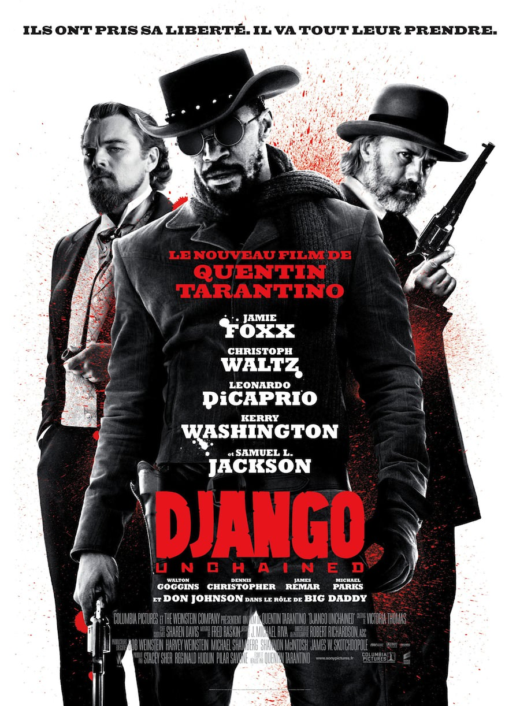
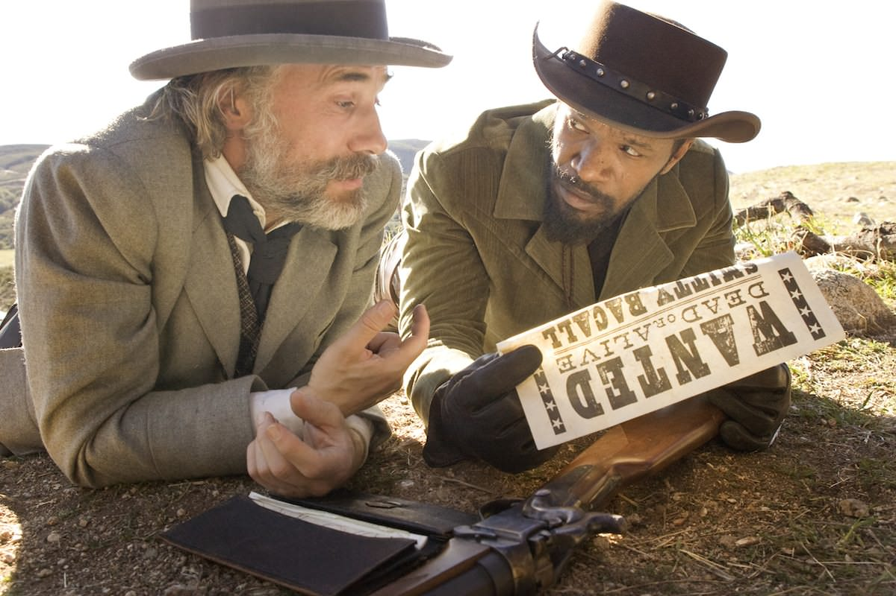
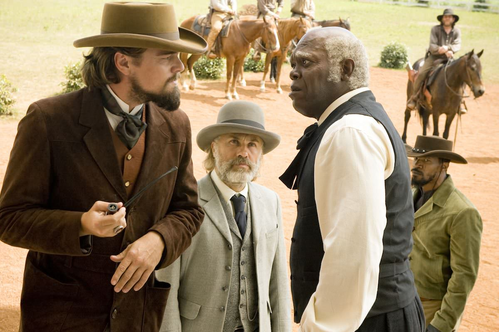

+++
type = "post"
titre = "<em>Django Unchained</em>, Quentin Tarantino"
title = "Django Unchained, Quentin Tarantino"
url = "/django-unchained-tarantino"
date = "2013-01-17T00:02:48"
Lastmod = "2014-01-01T12:05:35"
cover = "django-unchained-quentin-tarantino.jpg"
categorie = [ "À voir" ]
tag = [ "Amour", "Blockbuster", "Esclavage", "Histoire", "Humour", "Vengeance", "Violence", "Western" ]
createur = [ "Quentin Tarantino" ]
acteur = [ "Christoph Waltz", "Jamie Foxx", "Kerry Washington", "Samuel L Jackson" ]
annee = [ "2013" ]
weight = 2013
pays = [ "États-Unis" ]

+++

Dans la filmographie si caractéristique de Quentin Tarantino, <a href="/2009/08/22/inglourious-basterds-tarantino/" title="Inglourious Basterds, Quentin Tarantino - À voir et à manger"><em>Inglourious Basterds</em></a> intégrait une nouveauté : pour la première fois, l’histoire entrait dans l’un de ses films. Un détour historique et européen qui semble marquer une nouvelle tendance dans son œuvre : si <em>Django Unchained</em> quitte l’Europe pour retrouver les États-Unis si chers au cinéaste, on reste dans un contexte historique, puisque l’action s’y déroule au milieu du XIXe siècle. Ce nouveau film est aussi l’occasion de découvrir un nouveau genre qui passionne incontestablement son auteur depuis toujours, mais qui n’avait encore jamais été exploré par Quentin Tarantino : le western. L’humour et la violence si caractéristiques de l’œuvre du cinéaste sont toujours au rendez-vous, mais quelque chose a changé. <em>Django Unchained</em> est un film plus sérieux, plus sincère peut-être, c’est en tout cas un très grand moment de cinéma que tout amateur du Septième art ne devrait rater sous aucun prétexte…

Quelque part au Texas, hiver 1858. Les États-Unis sont encore un pays esclavagiste et même si la Guerre de Sécession, deux ans plus tard, mettra un terme à des années d’esclavages, les noirs n’ont toujours aucun droit, surtout pas dans ces régions sudistes. Django est ainsi, logiquement, un esclave et il vient justement d’être vendu à un nouveau propriétaire quand <em>Django Unchained</em> commence. Vite libéré par le Dr. King Schultz, un chasseur de primes qui a besoin de savoir à quoi ressemblent ses cibles qu’a connues l’ancien esclave, il détonne dans un univers où un noir ne peut même pas monter à cheval. Quentin Tarantino ne manque pas d’occasions de montrer le rejet de cette société profondément raciste et qui est persuadée que les blancs et les noirs sont deux races complètement différentes. Pendant la scène la plus impressionnante du film, Calvin Candie, le riche propriétaire d’une immense propriété où des milliers d’esclaves cultivent du coton, découpe le crâne d’un ancien esclave pour montrer à ses hôtes qu’une différence physiologique explique la servilité naturelle des noirs. Dans ce contexte, qu’un homme noir soit libre est déjà quelque chose d’incompréhensible, mais qu’en plus il vit en tuant des blancs pour obtenir une prime, c’est tout simplement un scandale qu’il convient de mater à tout prix. À l’inverse, Django cherche à se venger contre ses anciens tortionnaires, comme l’affiche l’exprime bien : « <em>Ils ont pris sa liberté. Il va tout leur prendre.</em> »

À cette histoire autour de l’esclavage, Quentin Tarantino greffe une histoire d’amour entre Django et sa femme, une autre esclave dont il a été séparé par leur ancien maître. Le chasseur de primes qui achète l’esclave promet de le libérer s’il le conduit à ses cibles, mais le Dr. Shultz se prend vite d’amitié pour son esclave. <em>Django Unchained</em> ne fait pas dans le sentimental et il est évident que le tueur a besoin de l’esclave pour des raisons purement pratiques et ce n’est que parce qu’il hait personnellement l’esclavage qu’il propose à Django de lui rendre sa liberté en échange de ses bons services. S’ils continuent de travailler ensemble, c’est aussi uniquement parce que l’ancien esclave s’avère être un excellent tireur, rapide et précis à la fois. Reste que <em>Django Unchained</em> s’intéresse, tout comme son personnage, à l’histoire d’amour de Django. Il faut dire que le Dr. Schultz est, comme son nom l’indique bien, d’origine allemande et il retrouve dans cette histoire d’amour la légende de Siegfried. La belle de Django se nomme en effet Broomhilda, déformation de la Brünhilde de la légende, et le parallèle avec ces personnages est évident. <em>Django Unchained</em> hérite en tout cas d’un ton rarement vu chez Quentin Tarantino : loin de son mordant ironique habituel, il se fait ici touchant, presque émouvant par moment, que ce soit dans l’amitié entre les deux hommes ou dans l’amour entre Django et Broomhilda. 

<em>Django Unchained</em> est un film violent, il est inutile de le nier. Judicieusement interdit aux moins de 12 ans, il étale une violence sanguinolente à plusieurs reprises, mais tout particulièrement à l’occasion d’une impressionnante scène de massacre qui n’a pas à rougir — sans mauvais jeu de mots — face à la fameuse scène meurtrière de <a href="/2012/05/12/kill-bill-tarantino/" title="Kill Bill, Quentin Tarantino - À voir et à manger"><em>Kill Bill</em></a>. Le cinéaste ne nous épargne pas la chair sanguinolente qui fait toujours forte impression, même si on ne peut parler de film gore pour autant. La violence est bien au rendez-vous, et avant d’être physique, elle s’inscrit au cœur de la société. Les Américains du milieu du XIXe siècle sont des êtres armés qui n’hésitent jamais à tirer et qui font la loi par eux-mêmes. Les deux personnages principaux de <em>Django Unchained</em> vivent quand même en tuant des hors-la-loi pour l’État, ils font ainsi le rôle de la police, tandis que l’autorité reste très locale et semble n’avoir pas beaucoup de pouvoir. La violence est aussi liée à l’esclavage et le dernier film de Quentin Tarantino semble d’ailleurs beaucoup moins enclin à la montrer de face. Alors que l’on peut voir des fusillades particulièrement sanglantes, la mise à mort d’un esclave bouffé par des chiens est filmée de manière détournée et on ne la voit que par bribes. De même, la caméra se détourne à la fin d’un combat entre deux esclaves organisé par Calvin Candie, si bien que <em>Django Unchained</em> n’est pas aussi violent que prévu. 

Ces caméras détournées sont symptomatiques d’un nouveau changement dans le cinéma de Quentin Tarantino. Le réalisateur a toujours été un peu démonstratif jusque-là, conscient certainement de sa faculté à composer des films ambitieux et ultra-référencés. Avec <em>Django Unchained</em>, il a assagi cet aspect de sa filmographie et le cinéaste fait moins le malin qu’avant et reste plus proche de son sujet. Ainsi, même si le film a ses moments humoristiques, surtout au début, il devient beaucoup plus sérieux, comme si son sujet ne prêtait plus à rire, du moins plus autant qu’avant. Ce n’est pas une critique, ce sérieux convient même plutôt très bien au cinéaste, sans oublier toutes les piques de second degré qui subsistent. Quentin Tarantino se permet encore de jouer avec les codes du cinéma qu’il affectionne : les références et clins d’œil sont toujours aussi nombreux dans <em>Django Unchained</em> et on a droit, entre autres choses, à des jeux avec les textes et les polices qui sont récurrents dans son œuvre. Autre élément qui n’a pas changé chez le cinéaste, la place de la musique : de Verdi à 2Pac en passant par Ennio Morricone, il compose une <a href="http://www.amazon.fr/gp/product/B00AIDTZ82/ref=as_li_ss_tl?ie=UTF8&tag=leblogdenic07-21&linkCode=as2&camp=1642&creative=19458&creativeASIN=B00AIDTZ82">bande (très) originale</a> qui intègre aussi, c’est la tradition, les voix des acteurs. Quentin Tarantino a réuni une impressionnante bande d’acteurs, avec quelques rôles qui sortent, comme toujours, du lot. Samuel L. Jackson, un habitué, compose un vieux serviteur et il est méconnaissable. Dans le rôle titre, Jamie Foxx donne de sa personne — <em>toute</em> sa personne même pour une scène dénudée — et il impose son personnage avec tout le sérieux nécessaire. Déjà parfait dans <em>Inglorious Basterds</em>, Christoph Waltz est tout aussi bon ici dans ce rôle de chasseur de primes pince-sans-rire. Face à lui, Leonardo DiCaprio parvient à lui tenir tête, ce qui est déjà une belle performance…

Quentin Tarantino a exprimé récemment son désir d’arrêter sa carrière à moyen terme. <em>Django Unchained</em> montre en tout cas qu’il est encore loin d’avoir atteint sa période des pires films. Bien au contraire, ce dernier long-métrage est peut-être le plus ambitieux, voire le plus réussi de sa carrière. Loin des jeux parodiques de certains de ses prédécesseurs, <em>Django Unchained</em> s’avère parfaitement équilibré et extrêmement prenant. C’est peut-être le plus dense long-métrage de Quentin Tarantino, c’est en tout cas, et à nouveau, une vraie déclaration d’amour au cinéma et un vrai plaisir pour tous les cinéphiles. Un film à ne surtout pas rater…

<h3>Vous voulez m&rsquo;aider ?<a href="#footnote_0_8362" id="identifier_0_8362" class="footnote-link footnote-identifier-link" title="&Agrave; propos de la publicit&eacute;&hellip;">1</a></h3>
<ul>
<li><a href="http://www.amazon.fr/gp/product/B00B7N0ER8/ref=as_li_ss_tl?ie=UTF8&tag=leblogdenic07-21&linkCode=as2&camp=1642&creative=19458&creativeASIN=B00B7N0ER8">Acheter le film en Blu-Ray sur Amazon</a></li>
<li><a href="http://www.amazon.fr/gp/product/B00B7N0EDC/ref=as_li_ss_tl?ie=UTF8&tag=leblogdenic07-21&linkCode=as2&camp=1642&creative=19458&creativeASIN=B00B7N0EDC">Acheter le film en DVD sur Amazon</a></li>
<li><a href="https://itunes.apple.com/fr/movie/django-unchained/id635306205">Acheter ou louer le film sur l&rsquo;iTunes Store</a></li>
</ul>

<ol class="footnotes"><li id="footnote_0_8362" class="footnote"><a href="/soutien/">À propos de la publicité…</a> [<a href="#identifier_0_8362" class="footnote-link footnote-back-link">&#8617;</a>]</li></ol>
