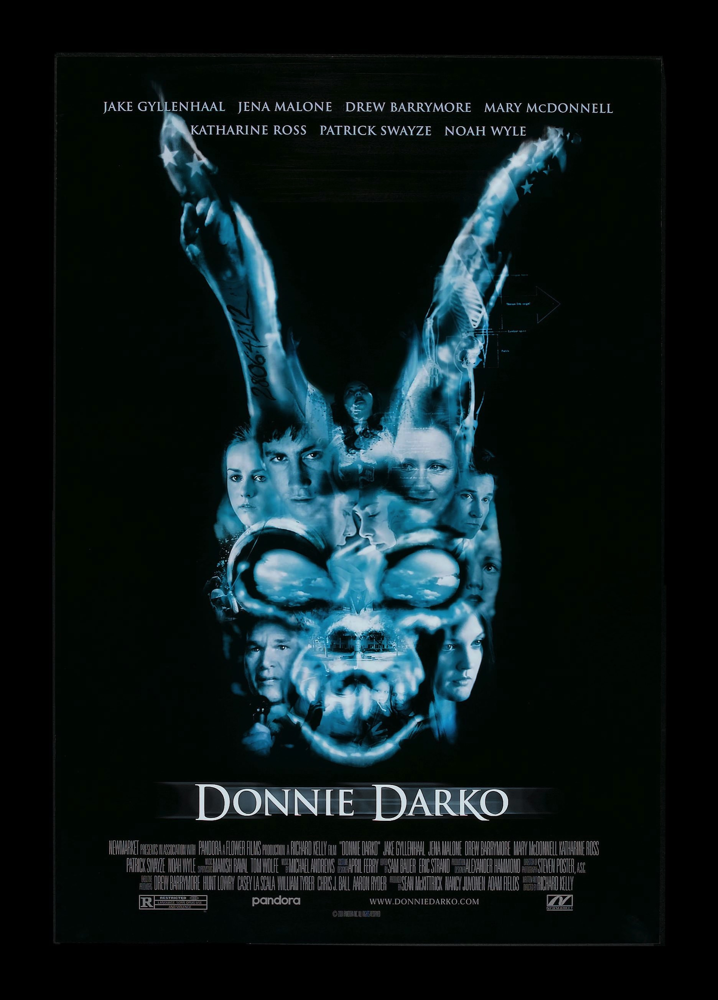
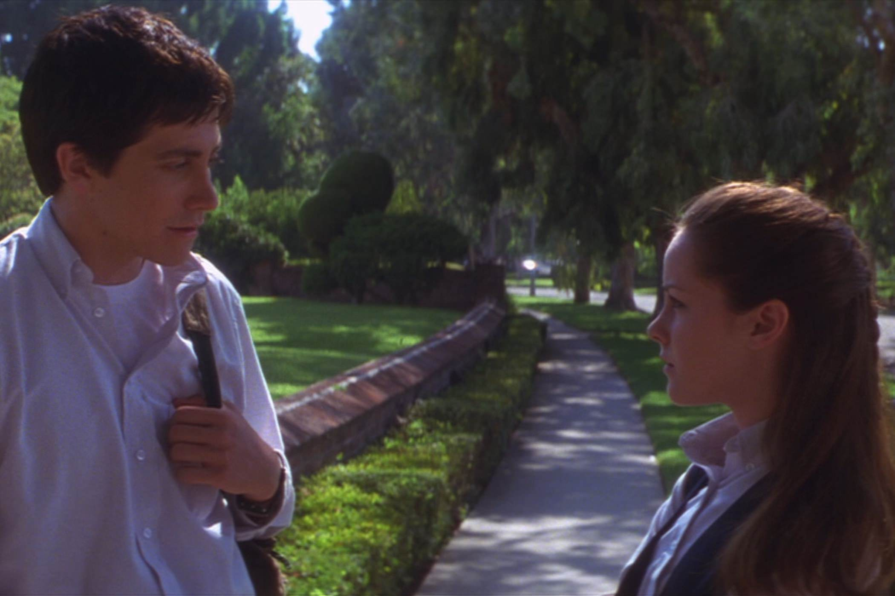
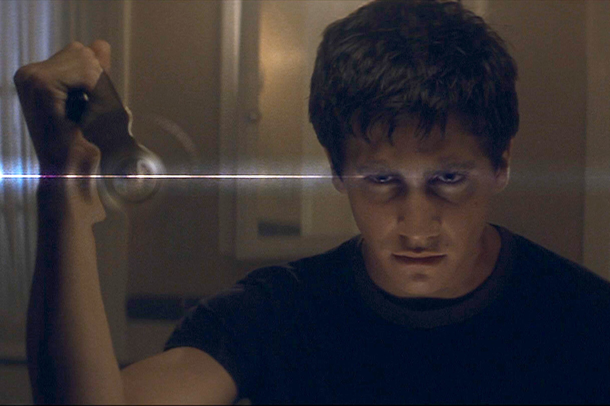

+++
titre = "<em>Donnie Darko</em>, Richard Kelly"
title = "Donnie Darko, Richard Kelly"
url = "/donnie-darko-kelly"
date = "2015-05-23T00:33:34"
Lastmod = "2015-05-23T00:36:49"
cover = "donnie-darko-richard-kelly.jpg"
categorie = [ "À voir" ]
tag = [ "Adolescence", "Drame", "Famille", "Fantastique", "Folie", "Mort", "Psychologie", "Rêve", "Voyage temporel" ]
createur = [ "Richard Kelly" ]
acteur = [ "Drew Barrymore", "Jake Gyllenhaal", "Jena Malone", "Maggie Gyllenhaal", "Mary McDonnell", "Noah Wyle" ]
annee = [ "2002" ]
weight = 2002
pays = [ "États-Unis" ]

+++

Accueilli avec une indifférence quasiment générale à sa sortie, <em>Donnie Darko</em> fait partie de ces films qui sont très vite devenus cultes par la suite. Le lapin horrifique qui le symbolise est presque devenu un lieu commun tellement on a pu le voir, et Richard Kelly a réussi, pour son premier long-métrage, à signer une œuvre mystérieuse qui reste toujours aussi passionnante, même bien des années après. <em>Donnie Darko</em> brille par son scénario parfaitement construit, plein de mystères à mi-chemin entre psychologie et voyage temporel. Une vraie réussite, très intense, à (re)voir avec plaisir ! Mais si vous ne l&rsquo;avez jamais vu, arrêtez votre lecture ici-même, car le scénario mérite d&rsquo;être suivi sans aucun <em>a priori</em> pour ne pas gâcher la surprise.

<em>Donnie Darko</em> ne crée pas un mystère inutile avec son personnage principal : Donald, dit Donnie, est un adolescent psychologiquement dérangé. On découvre au fil du scénario qu&rsquo;il a déjà eu des problèmes avec la justice pour son comportement violent, on sait qu&rsquo;il est suivi par un psychologue et la scène d&rsquo;ouverture, un repas à table, montre très bien qu&rsquo;il a du mal à maîtriser sa colère. Richard Kelly n&rsquo;y va pas par quatre chemins et ce n&rsquo;est pas vraiment l&rsquo;objet de son film, même si la situation psychologique du personnage compte énormément dans l&rsquo;intrigue. Celle-ci se met en place quand, la nuit venue, Donnie est attiré à l&rsquo;extérieur par un lapin géant, avec une tête squelettique assez grotesque. Cet étrange personnage prévient l&rsquo;adolescent qu&rsquo;il ne lui reste que quelques jours à vivre et le héros s&rsquo;endort alors loin de chez lui. Quand il se réveille le lendemain, il découvre qu&rsquo;un réacteur est tombé au milieu de sa chambre. Voilà le point de départ de <em>Donnie Darko</em> et on peut difficilement parler du reste du film, sans parler de la fin (si vous ne l&rsquo;avez jamais vu, il est encore temps d&rsquo;arrêter la lecture). Le long-métrage se termine par un retour en arrière, comme si Richard Kelly rembobinait tout ce qui venait de se passer. Et à la fin, Donnie meurt écrasé par le réacteur, le sourire aux lèvres, comme s&rsquo;il s&rsquo;avait ce qui allait se passer. On peut esquisser plusieurs hypothèses pour expliquer ce qui s&rsquo;est déroulé dans l&rsquo;intervalle, le réalisateur a <a href="https://fr.wikipedia.org/wiki/Donnie_Darko#Explication_et_interpr.C3.A9tations_de_l.27intrigue">sa propre explication</a>, mais le film reste au fond assez ouvert. On peut le voir comme de la science-fiction, avec une réalité parallèle ouverte lors de la première rencontre avec le lapin, mais qui se referme à la fin. On peut aussi considérer que l&rsquo;ensemble n&rsquo;est qu&rsquo;un rêve, ou une hallucination de Donnie, qui est psychologiquement instable et qui souffre même, nous dit-on de schizophrénie.

Au fond, l&rsquo;explication importe peu, ce n&rsquo;est pas le principal intérêt du film. La version <em>Director&rsquo;s Cut</em> en fait d&rsquo;ailleurs sans doute trop en ajoutant des explications, alors qu&rsquo;elles n&rsquo;étaient pas nécessaires. L&rsquo;important n&rsquo;est pas de comprendre précisément ce qui se passe, mais de suivre une histoire, sans forcément tout déchiffrer. <em>Donnie Darko</em> est d&rsquo;abord un bel objet cinématographique, réalisé avec très peu de moyens, mais qui sait faire preuve d&rsquo;une belle efficacité pour les utiliser au mieux. Le scénario, œuvre également de Richard Kelly, est parfaitement construit et le suivre pour la première fois est un plaisir indéniable, tandis que l&rsquo;on en verra encore plus les fois suivantes. Et puis dans cet étrange long-métrage, tout tourne autour d&rsquo;un personnage qui est probablement le plus important dans ce projet. Le cinéaste a vu juste en faisant appel au jeune Jake Gyllenhaal : même si cet acteur, baigné dans le cinéma depuis son enfance grâce à sa famille, n&rsquo;en est pas à son premier tournage, il fait preuve d&rsquo;une maturité stupéfiante dans son jeu. Il n&rsquo;a qu&rsquo;une vingtaine d&rsquo;années pour le tournage du film, et pourtant il n&rsquo;interprète pas un adolescent psychologiquement dérangé, il <em>est</em> cet adolescent. On imagine sans peine la difficulté de certaines scènes, mais il est parfait d&rsquo;un bout à l&rsquo;autre et si <em>Donnie Darko</em> a autant marqué, c&rsquo;est en grande partie grâce à lui. La bande-originale, très importante ici, a aussi joué un grand rôle, à commencer bien sûr par le dernier morceau, déchirant, une <a href="https://www.youtube.com/watch?v=DHtcliIvnHI">reprise méconnaissable</a> du <em>Mad World</em> des Tears for Tears par Gary Jules.

Richard Kelly n&rsquo;a pas eu, à ce jour, de carrière phénoménale au cinéma et pourtant le réalisateur a commencé directement avec un excellent film. <em>Donnie Darko</em> est une œuvre étrange, quelque part entre l&rsquo;horreur, la science-fiction et le thriller psychologique. Inutile d&rsquo;essayer de le ranger dans une case, sa réussite s&rsquo;explique probablement par son côté inclassable. Jake Gyllenhaal est exceptionnel dans le rôle titre, la musique est excellente et <em>Donnie Darko</em> reste toujours aussi hypnotique et émouvant à la fois. Une belle réussite, pour sûr…

<h3>Vous voulez <a href="http://voiretmanger.fr/soutien/">m&rsquo;aider</a> ?</h3>
<ul>
<li><a href="http://www.amazon.fr/gp/product/B005FGMBTM/ref=as_li_ss_tl?ie=UTF8&amp;tag=leblogdenic07-21&amp;linkCode=as2&amp;camp=1642&amp;creative=19458&amp;creativeASIN=B005FGMBTM">Acheter le film en Blu-ray sur Amazon</a></li>
<li><a href="http://www.amazon.fr/gp/product/B000IB0K74/ref=as_li_ss_tl?ie=UTF8&amp;tag=leblogdenic07-21&amp;linkCode=as2&amp;camp=1642&amp;creative=19458&amp;creativeASIN=B000IB0K74">Acheter le film en DVD sur Amazon</a></li>
<li><a href="https://itunes.apple.com/fr/movie/donnie-darko-vost/id445984555">Acheter ou louer le film sur l&rsquo;iTunes Store</a></li>
</ul>

