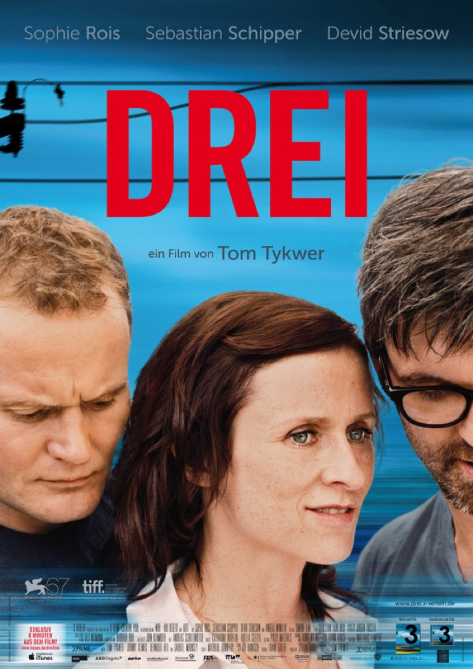
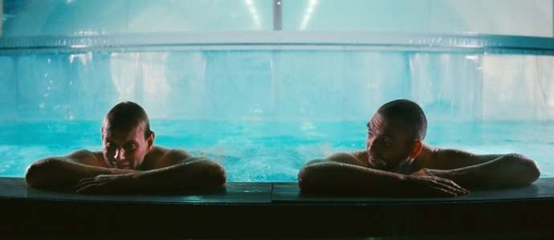

+++
type = "post"
titre = "Drei, Tom Tykwer"
title = "Drei, Tom Tykwer"
url = "/drei-tykwer"
date = "2010-12-15T00:05:47"
Lastmod = "2012-11-16T14:57:44"
cover = "drei-tom-tykwer.jpg"
categorie = [ "À voir" ]
tag = [ "Amour", "Arcs 2010", "Drame", "Festival", "Triangle amoureux", "Vite oublié" ]
createur = [ "Tom Tykwer" ]
acteur = [ "Devid Striesow", "Sebastian Schipper", "Sophie Rois" ]
annee = [ "2011" ]
weight = 2011

+++

Tom Tykwer n&rsquo;est pas le genre de réalisateur à tourner le même film indéfiniment. Après plusieurs gros films hollywoodiens, dont le médiocre <em>Parfum</em> et <em>L&rsquo;enquête</em>, le réalisateur allemand revient dans son pays natal avec <em>Drei</em>, un drame à base de triangle amoureux. Mais <em>Drei</em> est un film plutôt malin qui raconte non pas le triangle, mais la formation du triangle amoureux, le film se terminant par sa concrétisation. Doté en outre d&rsquo;une forme riche et intéressante, <em>Drei</em> séduit, malgré quelques défauts.

Hanna et Simon vivent ensemble depuis une vingtaine d&rsquo;années à Berlin. Ils ne sont pas mariés, mais constituent néanmoins un véritable couple, avec ses bonheurs et problèmes du quotidien. La lassitude les gagne néanmoins tous deux et même si leur amour reste entier, ils ressentent le besoin d&rsquo;aller voir ailleurs. Alors que Simon perd sa mère et doit subir une opération chirurgicale lourde, Hanna le délaisse pour les beaux yeux d&rsquo;un autre homme, Adam. Ils se sont rencontrés par le travail, mais très vite l&rsquo;un comme l&rsquo;autre se retrouve dans différents contextes, théâtre ou match de foot, avant de se retrouver dans le lit d&rsquo;Adam. Simon aussi va voir ailleurs, mais sans le préméditer. Un jour à la piscine, il fraternise avec un homme qui, bizarrement, le trouble, lui qui se croyait 100 % hétérosexuel. Les deux hommes finissent également amants. Le couple aurait pu continuer ainsi, chacun allant voir ailleurs, mais en se retrouvant après, si ce n&rsquo;est que l&rsquo;homme qu&rsquo;ils aiment tous deux est une seule et même personne. Adam est ainsi l&rsquo;amant du couple sans le savoir, et sans que Simon ou Hanna ne soient au courant de l&rsquo;affaire de l&rsquo;autre. Évidemment, la rencontre entre les trois devait nécessairement arriver…

Le <a href="http://voiretmanger.fr/tag/triangle-amoureux/">triangle amoureux</a> est un genre à part entière, d&rsquo;abord littéraire, avant de toucher le Septième art. <em>Drei</em> montre la mise en place du triangle, quand deux personnes aiment une même personne, et quand cette personne aime également les deux premières. Une relation complexe qui fait souvent l&rsquo;objet de fantasmes, mais qui est ici traitée sur un mode assez réaliste. Les trois héros du film ne sont pas de jeunes adolescents, comme ceux filmés par Xavier Dolan dans <em><a href="http://voiretmanger.fr/2010/10/03/amours-imaginaires-dolan/">Les amours imaginaires</a></em>, mais des adultes (la quarantaine approchante sans doute) qui ne découvrent ainsi pas l&rsquo;amour ou la vie. En outre, le triangle ne se met en place que de manière fortuite, sans que les personnages le recherchent : c&rsquo;est le hasard complet qui explique que Simon rencontre Adam alors que ce dernier est déjà amant de sa femme. Mais le sexe ne fait pas le triangle : c&rsquo;est l&rsquo;amour qui nait entre les trois qui construit la relation. Amour pour le moins inattendu, puisqu&rsquo;il s&rsquo;agissait à l&rsquo;origine pour Adam uniquement de plans sexe : comme on l&rsquo;apprend au détour d&rsquo;un dialogue, il n&rsquo;était jamais tombé amoureux et on le voit coucher avec un jeune collègue de travail avant de le mettre à la porte au réveil. Il couche, mais n&rsquo;aime pas… sauf pour Hanna et Simon qu&rsquo;il se surprend à aimer les deux également.

<em>Drei</em> n&rsquo;est pas une comédie romantique à l&rsquo;américaine, c&rsquo;est au contraire un film assez cru sur les relations amoureuses. Sans même parler de la scène d&rsquo;opération avec sortie d&rsquo;un testicule en live (oui, c&rsquo;est assez gore), le film ne s&rsquo;entoure pas de mièvrerie et évoque sans détour les relations entre ses trois personnages. Le ton est ainsi très éloigné du roman à l&rsquo;eau de rose… au moins jusqu&rsquo;à la découverte de la relation mutuelle avec Adam. Le film aurait d&rsquo;ailleurs mieux fait s&rsquo;arrêter sur cette image de Simon qui court sous la pluie pour rattraper Hanna. La suite est sans intérêt (on pouvait tout deviner) et surtout tourne au romantisme et à l&rsquo;eau de rose, un ton surprenant dans le film et qui n&rsquo;est franchement pas bienvenu. Dommage de conclure ainsi le film sur une note moins positive, mais cette faute de goût ne vient pas gâcher le film de Tom Tykwer pour autant. C&rsquo;est en tout cas bien le signe que <em>Drei</em> n&rsquo;est pas tellement un film de triangle amoureux, ou plutôt que le triangle une fois formé n&rsquo;est pas vraiment le sujet du film. Son intérêt réside plutôt dans la découverte de l&rsquo;autre et la naissance de l&rsquo;amour entre ces trois êtres. Et sur ce point, <em>Drei</em> est réussi.

Tom Tykwer fait aussi preuve, avec <em>Drei</em>, d&rsquo;une liberté formelle inattendue si l&rsquo;on en juge à ses dernières réalisations, beaucoup plus convenues. Dès la séquence d&rsquo;ouverture (une caméra posée à la fenêtre d&rsquo;un train, la voix de Simon, de la musique), cette liberté de la forme est flagrante et elle se manifestera ensuite à plusieurs reprises, tranchant avec un film par ailleurs assez réaliste. On aura ainsi une très belle séquence de danse sur un fond blanc immaculé, des passages de vieux films (avec une séquence hilarante dans un champ de chou) ou encore un essai d&rsquo;animation plutôt réussi. De manière générale, <em>Drei</em> est un film très rythmé où l&rsquo;ellipse et les ruptures dans le récit abondent. À plusieurs reprises, le film passe d&rsquo;une séquence à l&rsquo;autre de manière brutale, sans même une transition, ce qui donne ce sentiment de ne pas s&rsquo;attarder sur une séquence. Conséquence, les deux heures du film passent très vite et on ne s&rsquo;ennuie vraiment pas. Le rythme du film est aussi lié de sa musique, composée pour les parties originales par Tom Tykwer. Sans faire preuve d&rsquo;une originalité folle, elle est très efficace et plaisante et rappelle un peu la bande originale de <em><a href="http://voiretmanger.fr/2010/10/12/social-network-fincher/">The Social Network</a></em>, pour une musique électronique assez classe. La musique dans <em>Drei</em> est vraiment comme un quatrième personnage, on sent que son réalisateur est aussi compositeur de musique. Et puis il fait le choix d&rsquo;utiliser &laquo;&nbsp;Space Oddity&nbsp;&raquo; de David Bowie et un film qui utilise David Bowie ne saurait être mauvais…

Dans <em>Drei</em>, le triangle amoureux n&rsquo;est qu&rsquo;un point de départ pour un film riche sur trois Berlinois proches de la quarantaine. Le film évite les clichés du genre, au moins jusqu&rsquo;à la découverte du triangle qui ouvre une dernière partie dont on se serait bien passé. Tom Tykwer parvient néanmoins à proposer un film très plaisant, avec à la fois une histoire assez convenue et une forme originale qui vient relever le niveau. Si <em>Drei</em> ne restera pas dans les annales de l&rsquo;histoire du cinéma, c&rsquo;est un film agréable que l&rsquo;on pourra regarder avec plaisir et intérêt.

<em>Sortie en salles à une date inconnue</em>

<h3>Vous voulez m&rsquo;aider ?<a href="#footnote_0_4344" id="identifier_0_4344" class="footnote-link footnote-identifier-link" title="&Agrave; propos de la publicit&eacute;&hellip;">1</a></h3>
<ul>
<li><a href="http://www.amazon.fr/gp/product/B004RE41BE/ref=as_li_ss_tl?ie=UTF8&#038;tag=leblogdenic07-21&#038;linkCode=as2&#038;camp=1642&#038;creative=19458&#038;creativeASIN=B004RE41BE">Acheter le film en Blu-Ray sur Amazon</a></li>
<li><a href="http://www.amazon.fr/gp/product/B004NRS7S8/ref=as_li_ss_tl?ie=UTF8&#038;tag=leblogdenic07-21&#038;linkCode=as2&#038;camp=1642&#038;creative=19458&#038;creativeASIN=B004NRS7S8">Acheter le film en DVD sur Amazon</a></li>
</ul>

<ol class="footnotes"><li id="footnote_0_4344" class="footnote"><a href="http://voiretmanger.fr/soutien/">À propos de la publicité…</a> [<a href="#identifier_0_4344" class="footnote-link footnote-back-link">&#8617;</a>]</li></ol>
