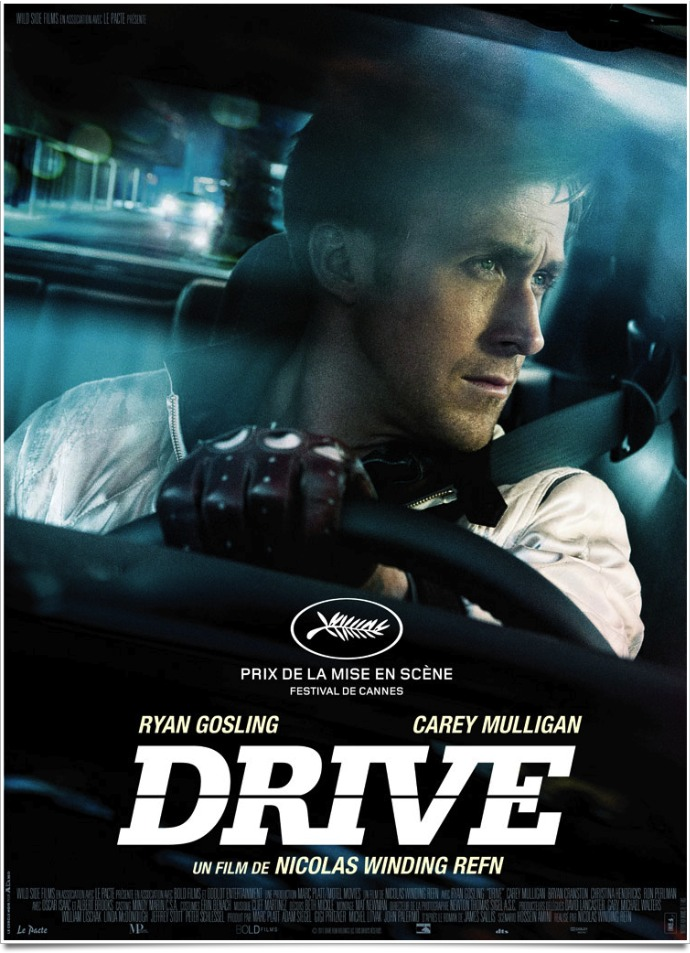
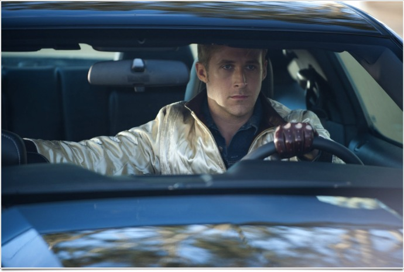
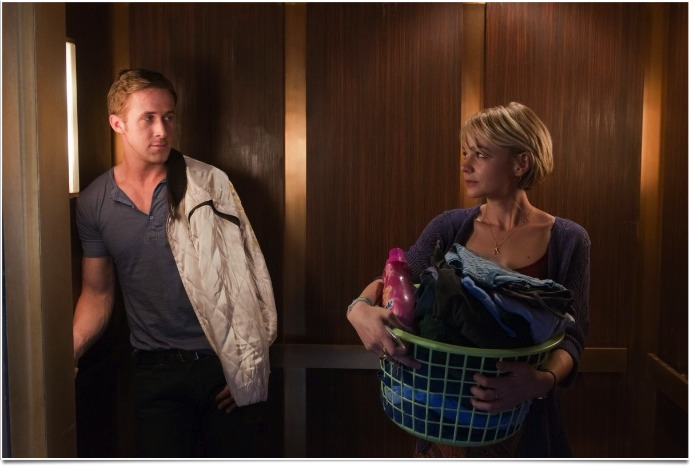

+++
type = "post"
titre = "<em>Drive</em>, Nicolas Winding Refn"
title = "Drive, Nicolas Winding Refn"
url = "/drive-winding-refn"
date = "2011-10-04T00:04:05"
Lastmod = "2013-11-29T16:50:44"
cover = "drive-2011.jpg"
categorie = [ "À voir" ]
tag = [ "Amour", "Course", "Famille", "Mafia", "Thriller", "Violence" ]
createur = [ "Nicolas Winding Refn" ]
acteur = [ "Carrey Mulligan", "Ryan Gosling" ]
annee = [ "2011" ]
weight = 2011
pays = [ "États-Unis" ]

+++

Nicolas Winding Refn n&rsquo;a pas volé son prix de la mise en scène obtenu cette année à Cannes. Le cinéaste danois controversé, <em>Valhalla Rising</em>, son dernier film, l&rsquo;était en tout cas, propose avec <em>Drive</em> un film surprenant. Thriller sur fond de mafia et de course automobile en apparence, <em>Drive</em> se révèle au fil de son heure quarante beaucoup plus complexe et passionnant. Un film âpre qui sait faire preuve de douceur, un film sanglant et émouvant à la fois : un film à voir absolument.

Un jeune homme, le film ne le nommera que &laquo;&nbsp;Driver&nbsp;&raquo;, conduit extrêmement bien et met à profit son talent de plusieurs manières. Tantôt garagiste, tantôt cascadeur le jour, il aide des types pas net la nuit en servant d&rsquo;escorte après un casse. Il ne touche jamais à l&rsquo;argent, ne participe jamais au vol, il se contente de conduire et il le fait remarquablement bien. <em>Drive</em> ouvre d&rsquo;ailleurs sur une de ces nuits de conduite, on le voit manœuvrer sa voiture avec une aisance remarquable, profiter de la nuit en éteignant ses phares et du paysage urbain en se cachant sous un pont. Sa maîtrise est totale et il parvient sans difficulté à perdre toutes les voitures de police à ses trousses et même l&rsquo;hélicoptère au-dessus de lui lui échappe. C&rsquo;est le responsable de son garage qui arrange ces rendez-vous nocturnes et il lui propose un jour de rencontrer un membre de la mafia locale pour participer à une course de NASCAR. Cette rencontre va transformer sa vie, alors que le chauffeur tombe sur une ravissante voisine. Alors que le jeune homme essaie d&rsquo;aider son mari qui sort tout juste de prison, il se fait piéger par la mafia. Commence alors une plongée en enfer sanglante…

Dès les premières images, <em>Drive</em> impose son style noir et poisseux. Film d&rsquo;ambiance et film de genre, il offre au spectateur une plongée dans un Los Angeles nocturne plein de dangers. À première vue au moins, <em>Drive</em> est un thriller tendance mafia, comme on en a vu tant. Un homme pris au piège dans le système mafieux, il possède un million de dollars et surtout beaucoup trop d&rsquo;informations pour rester hors de danger. La mafia réagit promptement en envoyant des hommes le descendre et il doit réagir. Le héros parle peu, il est du genre impassible, efficace et discret. Quand on le voit effectuer sa première mission, il ne dit pas un mot, mais l&rsquo;accomplit avec une économie de gestes et une précision qui forcent le respect. Le driver paraît assez calme et il reste ainsi la plupart du temps… jusqu&rsquo;à l&rsquo;explosion de violence. À la manière de <em>A history of violence</em> de Cronenberg, la violence se fait ici discrète, mais explose brutalement et s&rsquo;impose alors avec d&rsquo;autant plus de force qu&rsquo;elle est soudaine. L&rsquo;interdiction aux moins de 12 ans n&rsquo;est pas de trop : <em>Drive</em> offre ses quelques scènes sanglantes où la violence n&rsquo;est pas masquée derrière un voile pudique.

Film de mafia violent et classique en apparence, <em>Drive</em> est pourtant bien plus que cela. Contre toute attente, Nicolas Winding Refn signe là aussi, et peut-être d&rsquo;abord, une belle histoire d&rsquo;amour entre le chauffeur et sa fragile voisine. Les deux êtres se rencontrent sur le pallier et une sorte de coup de foudre se produit immédiatement, même si l&rsquo;amour n&rsquo;est pas immédiat. Il ne sera de toute manière jamais concrétisé : nonobstant un baiser certes langoureux dans l&rsquo;ascenseur, l&rsquo;amour reste ici totalement platonique. Il n&rsquo;en est pas moins réel et sensible : l&rsquo;émotion est indéniablement présente dans <em>Drive</em> et si l&rsquo;on attendait plutôt le cinéaste et son film sur la violence et les courses nocturnes, le film emmène ses spectateurs sur d&rsquo;autres terrains plus surprenants. Le héros est une parfaite incarnation de cette dualité. Personnage muet capable de la plus extrême violence et d&rsquo;une colère si froide qu&rsquo;elle glace le sang de tous ceux qui en sont témoin, le chauffeur est aussi capable de s&rsquo;attendrir face à cette mère et son enfant qui attendent le retour d&rsquo;un homme en prison. Il faut le voir au supermarché, son visage d&rsquo;habitude si dur s&rsquo;adoucit, ses traits se détendent, un sourire apparaît discrètement. Loin de la brute épaisse que l&rsquo;on pouvait deviner en premier lieu, c&rsquo;est un homme doux et sensible qui nous apparaît. À l&rsquo;image de <em>Drive</em> : ce film de bagnoles accorde finalement peu de temps aux voitures proprement dites. On a droit à une seule course-poursuite un tant soit peu spectaculaire, ce qui est tout de même bien peu, alors que le film s&rsquo;attarde sur la relation amoureuse. Mieux, <em>Drive</em> motive les agissements de son héros en fonction d&rsquo;un seul but : protéger sa voisine et son enfant, quitte à se sacrifier lui-même. On est loin du cliché de film de mafia ou d&rsquo;un film de courses façon <em><a href="http://voiretmanger.fr/2011/05/06/fast-and-furious-5-lin/">Fast and Furious</a></em>…

<em>Drive</em> impose un rythme très particulier qui trahit encore cette différence entre les attentes générés par ce type de film et le résultat concret. Nicolas Winding Refn parvient dès les toutes premières images à instaurer un climat enivrant dans cette ville si typiquement américaine qu&rsquo;est Los Angeles. On pense un peu au Miami de Michael Mann, mais l&rsquo;ambiance est ici différente, comme en témoigne bien le choix de cette police de caractères rose un peu folle pour le générique. Tout le film est baigné par cette ambiance et ce rythme assez lent, en contradiction avec les thèmes supposés de <em>Drive</em>. Le récit est bercé par une sorte de nonchalance, alors que le réalisateur multiplie les ralentis et confronte à ses images sombres une musique pop souvent plus lumineuse. <em>Drive</em> est affaire de contrastes et la réalisation accompagne admirablement le récit : voilà en tout cas un prix bien mérité à Cannes pour Nicolas Winding Refn. Le tableau serait incomplet sans ses deux interprètes principaux : aussi bien Ryan Gosling qui joue un conducteur pas si monolithique qu&rsquo;il en a l&rsquo;air, que Carrey Mulligan qui joue une épouse et mère pas si fragile qu&rsquo;au premier abord sont excellents dans leurs rôles.

Nicolas Winding Refn réalise un grand film avec <em>Drive</em>. Dès les premières images, le spectateur est envouté par ses personnages et son récit, par son ambiance et son rythme également. La réalisation sert ici parfaitement le scénario et l&rsquo;ensemble est réjouissant. Incontestablement dans le haut du panier des films présentés à Cannes, <em>Drive</em> est un film à ne rater sous aucun prétexte.

<h3>Vous voulez m&rsquo;aider ?<a href="#footnote_0_5176" id="identifier_0_5176" class="footnote-link footnote-identifier-link" title="&Agrave; propos de la publicit&eacute;&hellip;">1</a></h3>
<ul>
<li><a href="http://www.amazon.fr/gp/product/B0069RWL5U/ref=as_li_ss_tl?ie=UTF8&tag=leblogdenic07-21&linkCode=as2&camp=1642&creative=19458&creativeASIN=B0069RWL5U">Acheter le film en Blu-Ray et DVD sur Amazon</a></li>
<li><a href="http://www.amazon.fr/gp/product/B0062YFWKG/ref=as_li_ss_tl?ie=UTF8&tag=leblogdenic07-21&linkCode=as2&camp=1642&creative=19458&creativeASIN=B0062YFWKG">Acheter le film en DVD sur Amazon</a></li>
<li><a href="https://itunes.apple.com/fr/movie/drive-vost/id492851255">Acheter le film sur l&rsquo;iTunes Store</a></li>
<li><a href="http://www.amazon.fr/gp/product/B0067ZIZR2/ref=as_li_ss_tl?ie=UTF8&tag=leblogdenic07-21&linkCode=as2&camp=1642&creative=19458&creativeASIN=B0067ZIZR2">Acheter l&rsquo;excellente bande-originale en CD sur Amazon</a> (<a href="http://www.amazon.fr/gp/product/B005N7YD6C/ref=as_li_ss_tl?ie=UTF8&tag=leblogdenic07-21&linkCode=as2&camp=1642&creative=19458&creativeASIN=B005N7YD6C">version MP3</a>)</li>
</ul>

<ol class="footnotes"><li id="footnote_0_5176" class="footnote"><a href="http://voiretmanger.fr/a-propos/publicite/">À propos de la publicité…</a> [<a href="#identifier_0_5176" class="footnote-link footnote-back-link">&#8617;</a>]</li></ol>
