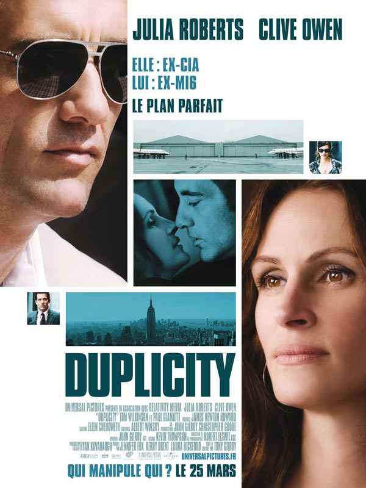

+++
type = "post"
titre = "Duplicity, Tony Gilroy"
title = "Duplicity, Tony Gilroy"
url = "/duplicity-tony-gilroy"
date = "2009-04-04T22:46:07"
Lastmod = "2012-09-19T00:26:47"
cover = "duplicity-tony-gilroy.jpg"
categorie = [ "À voir" ]
tag = [ "Blockbuster", "Thriller", "Vite oublié" ]
createur = [ "Tony Gilroy" ]
annee = [ "2009" ]
weight = 2009
pays = [ "États-Unis" ]

+++

Argh, la RATP, il y a des jours on aurait envie de&#8230; Bon, calmons-nous, après tout ça n&rsquo;est pas grand-chose : un tramway en retard, une salle pleine, un plan B à improviser&#8230; Je devais, en effet, voir <em>Les trois royaumes</em>, film du chinois John Woo que je tiens absolument à voir. J&rsquo;avais même, samedi soir oblige, réservé ma place, mais il faut être là au moins 10 minutes avant, et j&rsquo;ai dû arriver 9 minutes avant la séance.

Le plan B improvisé me laissait peu de choix du point de vue des horaires et des films non vus<a href="#footnote_0_1435" id="identifier_0_1435" class="footnote-link footnote-identifier-link" title="C&rsquo;est vrai, je l&rsquo;avoue, j&rsquo;aurais pu aussi voir Coco voire Dragon Ball Evolution. Mais je parlais de cin&eacute;ma l&agrave;&hellip;">1</a>, donc ce fut <em>Duplicity</em> de Tony Gilroy, avec Clive Owen et Julia Roberts dans son grand retour au cinéma. Le bilan est, ma foi, plutôt positif : j&rsquo;ai passé un bon moment, je me suis même bien amusé. Mais bon, quand même, ça ne vaut certainement pas le plan A&#8230;

Tony Gilroy a réalisé, il y a deux ans, <em>Michael Clayton</em> avec le grand George, un film pas si bête que ça sur l&rsquo;industrie pharmaceutique, et un film que j&rsquo;avais beaucoup aimé, quand je l&rsquo;avais vu au cinéma. Celui qui est aussi scénariste de la fameuse trilogie <em>Jayson Bourne</em>, confirme ici son goût pour les intrigues alambiquées où tout le monde manipule tout le monde. Comme le met bien en avant l&rsquo;affiche, c&rsquo;est bien le cas dans <em>Duplicity</em> avec des espions, des espions doubles, et même des triples espions. Je ne veux rien dévoiler de la fin, car le film perdrait alors grandement de son intérêt, mais je peux dire que j&rsquo;ai totalement fonctionné avec le scénario puisque je n&rsquo;avais rien vu venir. Je suis assez bon avec les espions, je m&rsquo;en sors avec les doubles, mais alors dès les triples je perds le fil. Néanmoins, le réalisateur a su garder jusqu&rsquo;au bout une pirouette finale fort amusante.

Amusante en effet, et il ne faudrait surtout pas penser que l&rsquo;on a affaire à un film sérieux. Le couple, composé de deux excellents acteurs, nul besoin de le rappeler, fonctionne sur le principe bien connu du mensonge et de la méfiance, à l&rsquo;image de cette géniale du string. Ces deux espions professionnels ne savent que mentir, et ils sont très bons dans ce domaine, allant jusqu&rsquo;à répéter des rôles (où l&rsquo;on pourrait, d&rsquo;ailleurs, voir une métaréflexion sur l&rsquo;acteur&#8230; enfin, on n&rsquo;est pas obligé non plus) pour une scène répétée constamment dans le film, comme un fil rouge absurde. En bref, on sourit, on rit dans ce film qui commence d&rsquo;ailleurs par un générique de début hilarant où deux PDG de multinationales en viennent aux mains entre leurs deux jets privés et sous la pluie battante, le tout étant filmé en ralenti.

<em>Duplicity</em> déconstruit le temps interne puisque l&rsquo;on navigue sans arrêt entre le présent et l&rsquo;histoire du couple qui offre quelques explications, par bribe. Je suis un grand fan de ce principe vieux comme le cinéma (le flash-back) à condition qu&rsquo;il soit bien utilisé<a href="#footnote_1_1435" id="identifier_1_1435" class="footnote-link footnote-identifier-link" title="Pas comme dans Slumdog millionnaire, typiquement&hellip;">2</a> ce qui est le cas ici, je trouve. Tony Gilroy livre suffisamment d&rsquo;informations pour que l&rsquo;on suive, mais jamais trop et c&rsquo;est tant mieux.

Je ne vais pas m&rsquo;étendre sur ce film, qui est loin du chef-d&rsquo;œuvre, certes, mais qui est un bon divertissement. Le scénario est suffisamment tordu pour que l&rsquo;on s&rsquo;y intéresse, les acteurs suffisamment bons pour que l&rsquo;on ait envie de les regarder, et ce film suffisamment hollywoodien pour assumer ce qu&rsquo;il est, ni plus ni moins qu&rsquo;un petit film à regarder en famille. C&rsquo;est déjà pas mal, mais bon, ça n&rsquo;est que partie remise pour le plan A.

<strong>À lire également</strong>, des critiques divisés sur le film, entre un <em><a href="http://www.telerama.fr/cinema/films/duplicity,373134,critique.php">Télérama</a></em> plutôt positif, un <a href="http://www.critikat.com/Duplicity.html">Critikat</a> plus critique, et des <a href="http://www.lesinrocks.com/cine/cinema-article/article/duplicity/"><em>Inrockuptibles</em></a> qui ne se sont pas foulés en dézinguant le film en quelques lignes. Oh et <strong>Rob Gordon</strong> <a href="http://www.toujoursraison.com/2009/04/duplicity.html">s&rsquo;enthousiasme</a> littéralement pour le film et pour le coup, il a bien raison. En plus, c&rsquo;est bien, il évoque plein de choses que j&rsquo;avais oubliées comme la finesse des dialogues (à ne voir qu&rsquo;en VO d&rsquo;ailleurs !) ou encore le message final sur les multinationales et la <em>toute-puissance</em> des actionnaires, un message qui prend tout son sens avec l&rsquo;actualité évidemment.

<h3>Vous voulez m&rsquo;aider ?<a href="#footnote_2_1435" id="identifier_2_1435" class="footnote-link footnote-identifier-link" title="&Agrave; propos de la publicit&eacute;&hellip;">3</a></h3>
<ul>
<li><a href="http://www.amazon.fr/gp/product/B002CXG7JQ/ref=as_li_ss_tl?ie=UTF8&#038;tag=leblogdenic07-21&#038;linkCode=as2&#038;camp=1642&#038;creative=19458&#038;creativeASIN=B002CXG7JQ">Acheter le film en Blu-Ray sur Amazon</a></li>
<li><a href="http://www.amazon.fr/gp/product/B002CXG7JG/ref=as_li_ss_tl?ie=UTF8&#038;tag=leblogdenic07-21&#038;linkCode=as2&#038;camp=1642&#038;creative=19458&#038;creativeASIN=B002CXG7JG">Acheter le film en DVD sur Amazon</a></li>
<li><a href="http://itunes.apple.com/fr/movie/duplicity/id515794462">Acheter ou louer le film sur l&rsquo;iTunes Store</a></li>
</ul>

<ol class="footnotes"><li id="footnote_0_1435" class="footnote">C&rsquo;est vrai, je l&rsquo;avoue, j&rsquo;aurais pu aussi voir <em>Coco</em> voire <em>Dragon Ball Evolution</em>. Mais je parlais de cinéma là&#8230; [<a href="#identifier_0_1435" class="footnote-link footnote-back-link">&#8617;</a>]</li><li id="footnote_1_1435" class="footnote">Pas comme dans <em><a href="http://voiretmanger.fr/?p=1235">Slumdog millionnaire</a></em>, typiquement&#8230; [<a href="#identifier_1_1435" class="footnote-link footnote-back-link">&#8617;</a>]</li><li id="footnote_2_1435" class="footnote"><a href="http://nicolinux.fr/soutien/">À propos de la publicité…</a> [<a href="#identifier_2_1435" class="footnote-link footnote-back-link">&#8617;</a>]</li></ol>
